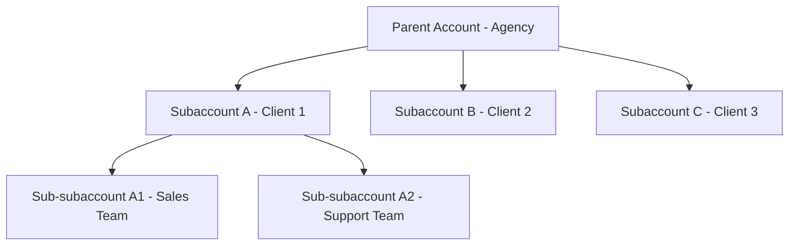

## Overview

itellicoAI uses a hierarchical account system that allows you to organize your teams, manage access control, and scale your voice AI operations. Whether you're a single team or an enterprise with multiple departments, the accounts system provides flexibility and security.

## Account Types

### Main Accounts

Main accounts (also called "root accounts" or "parent accounts") are top-level organizations with:

- Independent billing and subscriptions
- Full administrative control
- Ability to create subaccounts (subscription dependent)
- Separate API keys and integrations

**Use cases:**
- Individual companies
- Agencies managing multiple clients
- Enterprises with distinct business units

### Subaccounts

Subaccounts are nested under parent accounts and provide:

- Isolated workspace for teams or clients
- Separate agents, contacts, and conversations
- Independent team members and permissions
- Shared billing with parent account

**Key characteristics:**
- Subaccounts can have their own subaccounts (keep nesting simple for easier management)
- Parent accounts can access child data
- Subaccounts **cannot** access parent or sibling data
- Each subaccount has its own owner and team

**Use cases:**
- Agency client workspaces
- Department separation within enterprises
- Regional or product-line divisions
- Reseller customer accounts

## Account Hierarchy

The system follows a parent-child hierarchy with strict access control:



### Access Rules

- **Downward access**: Parents can access all child subaccounts
- **No upward access**: Children cannot access parent data
- **No sibling access**: Subaccounts cannot access each other
- **Context switching**: Users with multiple memberships can switch between accounts

## Common Use Cases

<AccordionGroup>
  <Accordion title="Agency Managing Multiple Clients" icon="building">
    ```mermaid
    graph TD
        A[Agency - Parent Account]
        A --> B[Client A Subaccount]
        A --> C[Client B Subaccount]
        B --> D[Client A staff has full access]
        C --> E[Client B staff has full access]
    ```

    **Benefits:**
    - Clients can't see each other's data
    - Agency admins can manage all accounts
    - Separate billing tracking per client
    - Easy onboarding and offboarding
  </Accordion>

  <Accordion title="Enterprise with Regional Teams" icon="globe">
    ```mermaid
    graph TD
        A[Company HQ - Parent Account]
        A --> B[North America Region]
        A --> C[Europe Region]
        A --> D[APAC Region]
        B --> E[Sales Team]
        B --> F[Support Team]
        C --> G[Sales Team]
        C --> H[Support Team]
    ```

    **Benefits:**
    - Regional autonomy with central oversight
    - Department-level access control
    - Consolidated billing and reporting
    - Flexible team structures
  </Accordion>

  <Accordion title="Reseller or White-Label Provider" icon="store">
    ```mermaid
    graph TD
        A[Reseller - Parent Account]
        A --> B[Customer 1 Subaccount]
        A --> C[Customer 2 Subaccount]
        A --> D[Customer 3 Subaccount]
    ```

    **Benefits:**
    - Customer isolation and privacy
    - Centralized billing to reseller
    - Custom branding per customer
    - Scalable customer onboarding
  </Accordion>
</AccordionGroup>

## What You Can Do

<CardGroup cols={2}>
  <Card title="Create Accounts" icon="plus" href="/accounts/creating-accounts">
    Learn how to create main accounts and subaccounts
  </Card>
  <Card title="Manage Team Members" icon="users" href="/accounts/team-management">
    Invite and manage team members
  </Card>
  <Card title="API Keys" icon="key" href="/accounts/api-keys">
    Create and manage programmatic access
  </Card>
  <Card title="Account Settings" icon="gear" href="/accounts/account-settings">
    Customize branding and manage account details
  </Card>
</CardGroup>

## Security Best Practices

<AccordionGroup>
  <Accordion title="Manage team access carefully" icon="shield-halved">
    - Only invite trusted team members
    - Review team members regularly
    - Remove access when team members leave
  </Accordion>

  <Accordion title="Organize with subaccounts" icon="sitemap">
    - Create separate subaccounts for clients
    - Use subaccounts to isolate departments
    - Leverage hierarchy for access control
  </Accordion>

  <Accordion title="Manage API keys carefully" icon="key">
    - Create separate keys per environment
    - Revoke unused or compromised keys immediately
    - Set expiration dates for temporary access
    - Monitor last used timestamps
  </Accordion>

  <Accordion title="Audit team members regularly" icon="clipboard-list">
    - Review team members quarterly
    - Remove departing employees immediately
    - Update access when responsibilities change
  </Accordion>
</AccordionGroup>

## FAQs

<AccordionGroup>
  <Accordion title="How many subaccounts can I create?">
    The number of subaccounts depends on your subscription plan. Contact [support@itellico.ai](mailto:support@itellico.ai) to discuss your needs.
  </Accordion>

  <Accordion title="Can I transfer a subaccount to another parent?">
    Contact support to transfer subaccounts between parents or convert subaccounts to main accounts.
  </Accordion>

  <Accordion title="Who gets billed for subaccount usage?">
    The parent account is responsible for all subaccount billing. Usage is tracked separately for reporting.
  </Accordion>

  <Accordion title="Can subaccounts have their own API keys?">
    Yes! Each subaccount can create independent API keys. Keys are scoped to their account context.
  </Accordion>

  <Accordion title="What happens to data when I deactivate an account?">
    Accounts are soft-deleted (marked inactive). Data is preserved and can be reactivated by contacting support.
  </Accordion>

  <Accordion title="Can one user be a member of multiple accounts?">
    Yes! Users can be invited to multiple accounts and switch between them using the account switcher.
  </Accordion>

  <Accordion title="How do I transfer ownership of an account?">
    Contact support to transfer ownership. This cannot be done through the UI for security reasons.
  </Accordion>
</AccordionGroup>

## Need Help?

Contact [support@itellico.ai](mailto:support@itellico.ai) for assistance with account management, billing questions, or ownership transfers.
