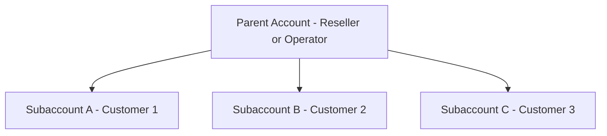

**Access:** Use the sidebar under **Settings → Account** for account-level pages, and use the account switcher in the top left to switch between accounts.

## Who Uses This Area

The **Account** area is mainly for admins, operations leads, platform operators, resellers, agencies, and anyone responsible for team access, client account structure, or billing ownership.

Use it when you need to:

- decide who can log in and what they can do
- separate customers, clients, regions, or departments into their own accounts
- update account-level branding and settings
- control billing access and integration credentials at the account level

<Tip>
If you are deciding between one account, team members, subaccounts, or agency access, start with the [Account Operating Model](/accounts/operating-model).
</Tip>

## Account Structure

itellicoAI uses account boundaries to organize teams, manage access, and scale voice AI operations. Whether you are a single internal team, a reseller with many customers, or an agency managing client-owned accounts, the accounts system separates data boundaries, billing ownership, and management access.

## Account Types

### Main Accounts

Main accounts (also called parent accounts) are top-level accounts with:

- Independent billing and subscriptions
- Full administrative control
- Ability to create subaccounts for centralized parent billing or isolated customer operations
- Separate [API keys](/accounts/api-keys), [secrets](/accounts/secrets), [webhooks](/accounts/webhooks), and [integrations](/accounts/integrations)

### Subaccounts

Subaccounts sit under parent accounts and provide:

- Isolated accounts for customers, clients, teams, or business units
- Separate agents, contacts, and [conversations](/manage/conversations/overview)
- Independent team membership and permissions
- Parent-managed governance, visibility, billing, and API-driven operations where permitted

**Key characteristics:**
- Subaccounts can be nested when needed, but most setups should stay one parent-child layer
- Parent accounts can access child accounts
- Child accounts cannot access parent or sibling data
- Users in multiple accounts can switch between accounts with the account switcher

## Typical Account Structure

```mermaid
graph TD
    A[Parent Account - Reseller or Operator]
    A --> B[Subaccount A - Customer 1]
    A --> C[Subaccount B - Customer 2]
    A --> D[Subaccount C - Customer 3]
```

Use deeper nesting only when there is a clear governance reason. For most teams, separate customer, client, brand, or department subaccounts under one parent are easier to manage.

### Access Rules

- **Downward access**: Parents can access child subaccounts
- **No upward access**: Children cannot access parent data
- **No sibling access**: Subaccounts cannot access each other directly
- **Account switching**: Users with multiple memberships can switch accounts

## Security Best Practices

<AccordionGroup>
  <Accordion title="Use least privilege" icon="shield-halved">
    Keep high-privilege roles limited to users who actually need account-wide control.
  </Accordion>

  <Accordion title="Review membership regularly" icon="clipboard-list">
    Audit team members and roles on a regular cadence, then remove stale access promptly.
  </Accordion>

  <Accordion title="Segment with subaccounts" icon="sitemap">
    Use subaccounts to isolate customers, clients, departments, or regions so data boundaries stay clear.
  </Accordion>

  <Accordion title="Manage API keys carefully" icon="key">
    Use separate keys per environment, rotate them regularly, and revoke compromised keys immediately.
  </Accordion>
</AccordionGroup>

## FAQs

<AccordionGroup>
  <Accordion title="How many subaccounts can I create?">
    Subaccount capacity depends on your plan and account limits. See [Plans](/billing/plans) for details.
  </Accordion>

  <Accordion title="Can one user be a member of multiple accounts?">
    Yes. A user can belong to multiple accounts and switch context with the account switcher.
  </Accordion>

  <Accordion title="Can subaccounts have their own API keys?">
    Yes. API keys are created per account, including subaccounts.
  </Accordion>

  <Accordion title="Can account ownership or account hierarchy be changed?">
    For ownership transfers or complex hierarchy changes, contact [support@itellico.ai](mailto:support@itellico.ai).
  </Accordion>
</AccordionGroup>

## Next Steps

<CardGroup cols={2}>
  <Card title="Creating Accounts" icon="plus" href="/accounts/creating-accounts">
    Create new main accounts and subaccounts
  </Card>
  <Card title="Team Management" icon="users-gear" href="/accounts/team-management">
    Invite members, assign roles, and manage access
  </Card>
  <Card title="Client Service Models" icon="briefcase" href="/accounts/agency-playbook">
    Choose parent billing, agency access, or a hybrid setup
  </Card>
  <Card title="Security" icon="shield-halved" href="/accounts/security">
    Configure authentication and session controls
  </Card>
  <Card title="API Keys" icon="key" href="/accounts/api-keys">
    Generate and manage API keys
  </Card>
</CardGroup>
