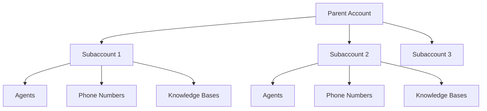

## Overview

Subaccounts let you create and manage separate accounts for your clients while maintaining central control over billing, resources, and settings. Perfect for agencies, resellers, and enterprises managing multiple brands.

<Note>
Subaccounts are available on Pro plans and above. The number of subaccounts varies by plan.
</Note>

---

## How Subaccounts Work

**Parent account** (you):
- Creates and manages subaccounts
- Controls resource allocation
- Handles all billing
- Sets permissions and limits

**Subaccounts** (your clients):
- Have their own agents, numbers, and knowledge bases
- Can have their own team members
- Operate independently within allocated limits
- Billing flows through parent account

---

## Creating a Subaccount

<Steps>
  <Step title="Navigate to subaccounts">
    Go to **Settings > Organization > Subaccounts**
  </Step>
  <Step title="Click Create Subaccount">
    Enter the subaccount name and details
  </Step>
  <Step title="Allocate resources">
    Set limits for minutes, agents, concurrent calls, etc.
  </Step>
  <Step title="Invite users">
    Add team members to the subaccount
  </Step>
</Steps>

---

## Resource Allocation

### Inherited vs Allocated Features

Features work differently based on their type:

| Type | Behavior | Example |
|------|----------|---------|
| **Inherited** | Subaccount gets full plan access | Voice library, API access |
| **Allocated** | Parent distributes from their pool | Minutes, concurrent calls |

### Setting Limits

For allocated features, you distribute from your parent account's pool:

**Example:** Your Business plan includes 6,000 minutes and 40 concurrent calls.

| Account | Minutes | Concurrent Calls |
|---------|---------|------------------|
| Parent (you) | 2,000 | 15 |
| Subaccount A | 2,000 | 15 |
| Subaccount B | 1,500 | 8 |
| Subaccount C | 500 | 2 |
| **Total** | 6,000 | 40 |

<Warning>
You cannot allocate more than your plan includes. If a subaccount needs more resources, increase their allocation or upgrade your plan.
</Warning>

---

## Managing Subaccounts

### Accessing Subaccounts

As a parent account admin, you can:

1. **Switch to subaccount view** — See the dashboard as the subaccount sees it
2. **Manage resources** — Adjust allocations at any time
3. **View usage** — Monitor each subaccount's consumption
4. **Manage team** — Add or remove subaccount users

### Permissions

| Role | Can Access |
|------|------------|
| **Parent Admin** | All subaccounts, full control |
| **Parent Member** | View subaccounts (no edit) |
| **Subaccount Admin** | Their subaccount only |
| **Subaccount Member** | Their subaccount only |

---

## White-Label Options

Business and Agency plans include white-label capabilities for subaccounts:

### Branding

| Feature | Business | Agency |
|---------|----------|--------|
| Custom logo | ✓ | ✓ |
| Custom colors | ✓ | ✓ |
| Custom domain | — | ✓ |
| Remove itellicoAI branding | — | ✓ |
| Custom email templates | — | ✓ |

### Setting Up White-Label

1. Go to **Settings > Organization > White-Label**
2. Upload your logo and set brand colors
3. (Agency) Configure custom domain
4. Apply settings to all subaccounts or individually

---

## Billing for Subaccounts

### How Billing Works

- **All charges go to parent account** — Subaccounts don't have separate billing
- **Usage pooled** — Total usage across all subaccounts counts toward your plan
- **Overages shared** — If total usage exceeds included minutes, parent pays overage

### Tracking Subaccount Costs

View per-subaccount usage in **Settings > Billing > Usage by Subaccount**:

| Subaccount | Minutes Used | % of Allocation | Cost |
|------------|--------------|-----------------|------|
| Subaccount A | 1,850 | 92.5% | €0 (within allocation) |
| Subaccount B | 1,650 | 110% | €18 overage |
| Subaccount C | 420 | 84% | €0 (within allocation) |

### Rebilling Clients

itellicoAI doesn't handle rebilling to your clients. You're responsible for:
- Setting your own pricing for clients
- Invoicing clients directly
- Managing client payment collection

<Tip>
Export usage reports from **Settings > Billing > Export** to help with client invoicing.
</Tip>

---

## Use Cases

<CardGroup cols={2}>
  <Card title="Marketing Agency" icon="bullhorn">
    Manage voice AI for multiple client brands, each with their own agents and numbers
  </Card>
  <Card title="Software Reseller" icon="store">
    Resell itellicoAI as part of your solution with white-label branding
  </Card>
  <Card title="Enterprise" icon="building">
    Separate departments or business units with independent budgets
  </Card>
  <Card title="Franchise" icon="store-alt">
    Provide voice AI to franchise locations with centralized control
  </Card>
</CardGroup>

---

## Best Practices

<AccordionGroup>
  <Accordion title="Start with conservative allocations" icon="gauge-low">
    Begin with lower resource allocations and increase as needed. It's easier to add resources than to take them away.
  </Accordion>

  <Accordion title="Set usage alerts" icon="bell">
    Configure alerts when subaccounts approach their limits. This prevents service interruptions and surprises.
  </Accordion>

  <Accordion title="Document your pricing" icon="file-contract">
    Create clear agreements with clients about what's included, overage rates, and billing terms.
  </Accordion>

  <Accordion title="Regular usage reviews" icon="chart-line">
    Review subaccount usage monthly. Reallocate unused resources to accounts that need them.
  </Accordion>

  <Accordion title="Use white-label fully" icon="palette">
    If available, use white-label features to strengthen your brand. Clients should see your brand, not itellicoAI.
  </Accordion>
</AccordionGroup>

---

## Subaccount Limits by Plan

| Plan | Subaccounts | White-Label |
|------|-------------|-------------|
| Free | — | — |
| Starter | — | — |
| Pro | 5 | — |
| Business | 15 | Basic |
| Agency | Unlimited | Full |
| Enterprise | Unlimited | Full + Custom |

---

## Deleting a Subaccount

<Warning>
Deleting a subaccount permanently removes all its data including agents, knowledge bases, call history, and recordings. This action cannot be undone.
</Warning>

To delete a subaccount:

1. Go to **Settings > Organization > Subaccounts**
2. Select the subaccount
3. Click **Delete Subaccount**
4. Type the subaccount name to confirm
5. Click **Permanently Delete**

Released resources return to your parent account pool.

---

## Next Steps

<CardGroup cols={2}>
  <Card title="Team Management" icon="users" href="/accounts/team-management">
    Add team members to subaccounts
  </Card>
  <Card title="Plans" icon="layer-group" href="/billing/plans">
    Compare subaccount limits by plan
  </Card>
  <Card title="API Keys" icon="key" href="/accounts/api-keys">
    Generate API keys for subaccounts
  </Card>
  <Card title="Usage Pricing" icon="calculator" href="/billing/usage-pricing">
    Understand per-minute costs
  </Card>
</CardGroup>
