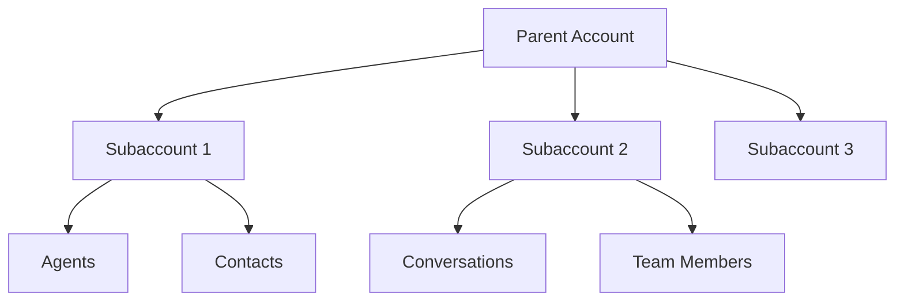

import { Screenshot } from "/snippets/screenshot.mdx";

## How Subaccounts Work

Subaccounts let a parent account create isolated customer, client, team, or business-unit accounts while keeping parent-level control.

In the parent/subaccount model, itellicoAI bills the parent account centrally. The parent can then package, resell, or rebill its own customers separately. This is different from agency access, where the client owns and pays for its own itellicoAI account while granting a service provider elevated access.

They are useful for:

- Resellers and platform operators organizing customer accounts
- API integrators provisioning one isolated account context per customer
- Service providers that want one parent invoice from itellicoAI and their own downstream billing model
- Enterprises separating regions, brands, or departments
- Agencies that prefer to own the parent account relationship and rebill clients directly

## Architecture

```mermaid
graph TD
    A[Parent Account] --> B[Subaccount 1]
    A --> C[Subaccount 2]
    A --> D[Subaccount 3]
    B --> E[Agents]
    B --> F[Contacts]
    C --> G[Conversations]
    C --> H[Team Members]
```

### Parent account responsibilities

- Create and manage subaccounts
- Assign and review subaccount access categories
- Switch between accounts for oversight
- Monitor usage across subaccounts
- Manage the commercial relationship with itellicoAI when subaccounts use parent billing

### Subaccount characteristics

- Own team membership and roles
- Own agents, contacts, and conversation data
- Isolated account

Nested subaccounts are supported up to 5 levels, but most teams should keep one parent-child layer unless they have a clear governance reason for deeper nesting.

## Creating a Subaccount

See [Creating Accounts](/accounts/creating-accounts) for step-by-step instructions.

<Screenshot
  lightSrc="/images/accounts__subaccounts-light.png"
  darkSrc="/images/accounts__subaccounts-dark.png"
  alt="Subaccounts page showing nested list with members and agents counts"
/>

## Managing Subaccounts

The Subaccounts table shows:

- **Name**
- **Billing plan** (shows billing type, for example **Parent Billing**)
- **Members** count
- **Agents** count
- **Minutes** used
- **Switch to** action

From this page, you can:

- Switch directly into a subaccount
- Open permission management for a subaccount
- Expand nested hierarchies in place

## Subaccount Detail

Click a subaccount row to open its detail view. The detail view has these tabs:

| Tab | Purpose |
|-----|---------|
| **Overview** | Members, agents, subaccounts count, created date, inherited billing plan |
| **Members** | Team members within this subaccount |
| **Permissions** | Granular access controls by category |
| **Limits** | Resource limits for this subaccount |
| **Billing** | Billing mode and transfer controls |
| **Import Products** | Import agents and configuration from parent |

---

## Billing Modes

New subaccounts use **Parent Billing** by default: the parent account pays for all subaccount usage, usage is consolidated on the parent's invoice, and the subaccount has no independent billing or payment method. The **Billing plan** column shows **Parent Billing** in the subaccounts table.

The parent can handle its own downstream customer billing, packaging, or resale outside itellicoAI.

**Best for:** resellers, API integrators, telephony providers, platform operators, enterprises, and agencies that want the parent account to control billing centrally.

To move billing responsibility to the subaccount, use the **Billing Transfer** flow described below. After a completed transfer, the account becomes fully independent and leaves the parent hierarchy.

---

## Billing Transfer

Billing transfer is the guided process for moving a parent-billed customer account into an independent direct-billed account.

**Access:** Open a subaccount detail → **Billing** tab.

### How It Works

<Steps>
  <Step title="Start transfer">
    In the subaccount's **Billing** tab, click **Transfer billing**.
  </Step>

  <Step title="Configure transfer">
    Choose a **grace period** (24, 48, or 72 hours) during which the parent continues paying. Optionally toggle **Keep agency access** to stay connected as agency members after the transfer completes. Add an optional note for the customer account owner.
  </Step>

  <Step title="Child account completes setup">
    The child account sees a billing setup flow. They must add a payment method and choose a plan before the grace period expires.
  </Step>

  <Step title="Transfer completes">
    Once billing is set up, the account automatically becomes independent. If the grace period expires without setup, the parent can cancel the transfer.
  </Step>
</Steps>

### Transfer States

| State | Badge | What happens |
|-------|-------|-------------|
| Parent-billed | **Paid by parent account** | Parent pays, transfer button available |
| Transfer in progress | **Billing transfer in progress** | Grace period active, child setting up billing |
| Independent | **Independent account** | Transfer complete — account manages its own billing and is no longer part of the parent hierarchy |

### Agency Access After Transfer

When transferring a subaccount to independence, you can choose whether to keep agency access:

- **Enabled** (default): former parent owners and admins are invited as agency members on the new independent account
- **Disabled**: no agency members are invited automatically

This is useful when a service provider wants to continue setup, maintenance, or monitoring after the customer becomes an independent direct-billed account.

---

## Subaccount Permissions

Permissions are configured per subaccount in the **Permissions** tab of the subaccount detail. Each permission supports **None**, **Read**, or **Full** access levels (some use **None**, **Limited**, **Full** instead).

### Overview

| Permission | Description | Levels |
|-----------|-------------|--------|
| **Conversations** | Access to conversations, call history, and live actions | None, Read |
| **Tasks** | Create, edit, and manage tasks | None, Read, Full |

### Agents

| Permission | Description | Levels |
|-----------|-------------|--------|
| **General Agent Rights** | Full agent access (controls per-tab rights below) | None, Read, Full |
| **General** | Edit agent identity and AI stack | None, Read, Full |
| **Prompt** | Edit agent prompts | None, Read, Full |
| **Knowledge** | Manage agent knowledge sources | None, Read, Full |
| **Tools** | Configure agent tools and actions | None, Read, Full |
| **Call Flow** | Configure call flow and routing | None, Read, Full |
| **Analytics** | Manage analytics settings, goals, and post-call analyses | None, Read, Full |
| **Notifications** | Configure agent notifications | None, Read, Full |
| **Knowledge Bases** | Create, edit, and delete knowledge bases | None, Read, Full |

### Deploy

| Permission | Description | Levels |
|-----------|-------------|--------|
| **Telephony** | Full telephony access (controls sub-options below) | None, Read, Full |
| **Phone Numbers** | Buy, configure, and release phone numbers | None, Read, Full |
| **SIP Trunks** | Manage SIP trunks | None, Read, Full |
| **Compliance Profiles** | Manage compliance profiles | None, Read, Full |
| **Campaigns & Contacts** | View campaigns and contacts (sub-options controlled below) | None, Read, Full |

### Account & Settings

| Permission | Description | Levels |
|-----------|-------------|--------|
| **Account** | View account (controls sub-options below) | None, Limited, Full |
| **Settings** | Manage account settings | None, Read, Full |
| **Members** | Invite and manage team members | None, Read, Full |
| **Subaccounts** | Create and manage subaccounts | None, Read, Full |
| **Trust Center** | Manage retention and privacy policies | None, Read, Full |
| **Schedules** | Create and manage business hours schedules | None, Read, Full |
| **Developers** | View developer tools (controls sub-options below) | None, Read, Full |
| **Integrations** | Connect and manage integrations | None, Read, Full |
| **API Keys** | Create and manage API keys | None, Read, Full |
| **Webhooks** | Create, test, and manage webhooks | None, Read, Full |
| **Billing** | Full billing access (sub-options below) | None, Full |
| **Usage** | View and export usage data | None, Full |

## Best Practices

<AccordionGroup>
  <Accordion title="Keep hierarchy simple" icon="sitemap">
    Start with one parent + clear child boundaries. Add deeper nesting only for clear governance reasons.
  </Accordion>

  <Accordion title="Use permission categories intentionally" icon="shield-halved">
    Block categories by default for new subaccounts, then open only what each subaccount needs.
  </Accordion>

  <Accordion title="Name subaccounts consistently" icon="tag">
    Use naming conventions that make account switching safe and obvious.
  </Accordion>

  <Accordion title="Review membership and permissions regularly" icon="clipboard-list">
    Periodically audit both member roles and blocked/allowed categories to prevent drift.
  </Accordion>
</AccordionGroup>

## FAQs

<AccordionGroup>
  <Accordion title="How deep can subaccounts be nested?">
    Subaccounts can be nested up to 5 levels, but use deeper nesting sparingly. Most customer, client, brand, or department setups are easier to manage with one parent-child layer.
  </Accordion>

  <Accordion title="Can I switch into any subaccount from this page?">
    You can switch into subaccounts you have access to.
  </Accordion>

  <Accordion title="Can I configure detailed permission rules per subaccount?">
    Yes. Open the subaccount detail and use the **Permissions** tab to set granular access controls per category.
  </Accordion>

  <Accordion title="How do I transfer billing to a subaccount?">
    Open the subaccount detail → **Billing** tab → click **Transfer billing**. Choose a grace period and start the transfer. The child account sets up their own payment method and plan during the grace window.
  </Accordion>

  <Accordion title="Can a subaccount become fully independent?">
    Yes. During a billing transfer, the target mode is set to **independent**. After the child account completes billing setup, the account automatically leaves the parent hierarchy.
  </Accordion>

  <Accordion title="What happens if the child account does not set up billing during the grace period?">
    The parent can cancel the transfer, returning the subaccount to parent billing. The parent continues to sponsor access during the grace period.
  </Accordion>

  <Accordion title="If I restricted certain permissions for a subaccount, will those restrictions stay active during a billing transfer?">
    Yes. Any permissions you have configured for the subaccount remain in effect throughout the billing transfer process. Once the transfer completes and you become an agency member on the now-independent account, those permissions continue to apply until you or the account owner changes them.
  </Accordion>

  <Accordion title="What if I need advanced ownership or hierarchy changes?">
    For complex account restructuring, contact [support@itellico.ai](mailto:support@itellico.ai).
  </Accordion>
</AccordionGroup>

## Next Steps

<CardGroup cols={2}>
  <Card title="Billing Overview" icon="credit-card" href="/billing/overview">
    Understand plans, usage, and extra charges
  </Card>
  <Card title="Team Management" icon="users" href="/accounts/team-management">
    Invite and manage members across accounts
  </Card>
  <Card title="Creating Accounts" icon="plus" href="/accounts/creating-accounts">
    Create additional parent accounts or subaccounts
  </Card>
  <Card title="Plans" icon="layer-group" href="/billing/plans">
    Review plan limits and account capabilities
  </Card>
</CardGroup>
