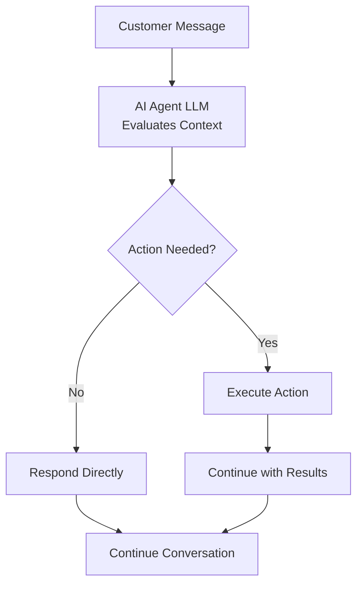

## Overview

Actions transform your AI agents from conversation-only assistants into powerful business automation tools. Beyond answering questions, your agents can schedule appointments, transfer calls, update systems, and integrate with your existing business workflows - all while maintaining natural conversation flow.

Think of actions as your agent's toolkit. Just as a human employee uses different tools to complete tasks, your AI agent performs actions to execute real work during customer interactions.

<Note>
Actions execute automatically based on conversation context and the instructions you provide in your agent's prompt. You define when and how actions should be used through [prompt engineering](/build/conversation/prompt-engineering-guide).
</Note>

---

## What Are Actions?

Actions are pre-configured tools that your agent can invoke during conversations to accomplish specific tasks. When a customer requests something that requires action - like booking an appointment or speaking to a specialist - your agent can execute the appropriate action seamlessly.

### How Actions Work

During conversations, your agent autonomously decides whether to respond directly or execute an action:



The agent uses **action names and descriptions** to understand what each action does. These are crucial for helping the LLM select the right tool.

**Best practices:**
- Give actions clear, descriptive names (e.g., "book_appointment" not "action1")
- Write detailed descriptions explaining what the action does
- Add explicit instructions in your [agent instructions (system prompt)](/build/conversation/prompt-engineering-guide) about **when** to use each action

<Note>
While action names and descriptions tell the agent **what** an action does, your agent instructions (system prompt) should specify **when** to use it. For example: "When a customer asks to speak to a human, use the transfer_to_support action."
</Note>

---

## Action Categories

Actions are organized into two categories in the dashboard:

### Call Control

<CardGroup cols={2}>
  <Card title="Transfer Call" icon="phone" href="/build/actions/transfer-details">
    Transfer to another AI agent, phone number, or SIP address
  </Card>
  <Card title="End Conversation" icon="phone-slash" href="/build/actions/call-control">
    Have the agent end the conversation with a custom message
  </Card>
</CardGroup>

### Integration

<CardGroup cols={2}>
  <Card title="Custom Action" icon="code" href="/build/actions/custom-api-actions">
    Create a custom API or webhook action
  </Card>
  <Card title="Calendar Booking" icon="calendar" href="/build/actions/booking-calendar">
    Schedule appointments using Cal.com integration
  </Card>
</CardGroup>

---

## When Actions Execute

Actions execute **during the conversation** when triggered by your agent based on its instructions. Unlike traditional IVR systems that follow rigid scripts, AI agents use contextual understanding to determine when actions are appropriate.

### Trigger Mechanisms

**Instruction-Based Triggers:**
```text wrap
When the customer asks to speak to a human, use the 'Transfer to Support' action.

After successfully booking an appointment, use the 'End Call Politely' action.

If the customer says they need time to check something, use the 'Pause Inactivity Timer' action.
```

**Conditional Triggers:**
```jinja
If the customer reports a billing issue:
1. Use the 'Lookup Account' action to retrieve their information
2. If balance is overdue, transfer to billing department
3. If balance is current, troubleshoot the issue


Always offer to transfer VIP customers to dedicated support immediately.

```

**Multi-Step Workflows:**
```text wrap
Appointment Booking Flow:
1. Gather required information (name, email, preferred date)
2. Use 'Check Availability' action to query Cal.com
3. Present options to customer
4. Use 'Book Appointment' action to confirm
5. Use 'Send SMS Confirmation' action if customer provided phone
6. Use 'End Call Politely' action to conclude
```

<Warning>
Actions execute in real-time during the call. Ensure your endpoints are reliable and respond quickly to avoid awkward pauses in conversation.
</Warning>

---

## Configuring Actions

All action configuration happens in the agent editor under the **Abilities → Actions** tab.

<Steps>
  <Step title="Navigate to Actions">
    Open your agent in the editor and click **Abilities** → **Actions** tab
  </Step>
  <Step title="Choose Action Type">
    Browse the **Call Control** and **Integration** categories and click **Add** on the action you want to configure
  </Step>
  <Step title="Configure Action">
    Fill in the action-specific configuration form:
    - **Name**: Give your action a clear, descriptive name
    - **Description**: Explain what this action does
    - **Action-specific settings**: Configure parameters based on the action type
  </Step>
  <Step title="Save">
    Save the action to add it to your agent's toolkit
  </Step>
</Steps>

---

## Action Status Indicators

After adding actions, you'll see them listed in your agent's Actions tab with status indicators:

<CardGroup cols={3}>
  <Card title="Configured" icon="circle-check">
    Action is properly configured and ready to use
  </Card>
  <Card title="Incomplete" icon="circle-exclamation">
    Missing required configuration or credentials
  </Card>
  <Card title="Error" icon="circle-xmark">
    Configuration error or authentication failure
  </Card>
</CardGroup>

---

## Referencing Actions in Instructions

To use actions, reference them **by exact name** in your agent's instructions:

### Direct Reference
```text wrap
When a customer asks to speak to someone about billing,
use the 'Transfer to Billing Department' action.
```

### With Conditions
```text wrap
If the customer's issue cannot be resolved:
1. Apologize for the inconvenience
2. Explain you're connecting them to a specialist
3. Use the 'Transfer to Support' action
```

### With Parameters
```text wrap
After gathering the customer's email and preferred date,
use the 'Book Consultation' action to schedule the meeting.
```

<Note>
Action names are case-sensitive and must match exactly as configured. If you rename an action, update all references in your instructions.
</Note>

---

## Configuration Best Practices

<AccordionGroup>
  <Accordion title="Start Simple" icon="seedling">
    Begin with basic actions before adding complex integrations. Add one action at a time, test thoroughly, then add the next.

    **Example progression:**
    1. Add End Conversation action
    2. Add Transfer to Support action
    3. Add Booking action
    4. Add Custom API actions
  </Accordion>

  <Accordion title="Use Clear, Descriptive Names" icon="tag">
    Action names are critical - the LLM uses them to understand what each tool does. Use descriptive, action-oriented names that clearly convey the function's purpose.

    **Why this matters:** The model relies on function names and descriptions to detect when a function needs to be called and choose the right tool for the task.

    **Good names:**
    - "Get Customer Account" - Clear action verb + specific target
    - "Transfer to Billing Department" - Specific destination included
    - "Book 30-Minute Consultation" - Includes relevant details

    **Poor names:**
    - "Action 1" - No context about what it does
    - "Transfer" - Too generic, unclear where
    - "API Call" - Doesn't describe the action
  </Accordion>

  <Accordion title="Write Detailed Descriptions" icon="file-lines">
    Action descriptions help the LLM understand **what** the action does. The description should explain the action's purpose, what it returns, and what parameters it uses.

    **Best practices from [OpenAI function calling](https://platform.openai.com/docs/guides/function-calling):**
    - Clearly describe what the action does and what it returns
    - Explain what parameters or data it uses
    - Use precise language that guides the model's understanding
    - Keep it concise yet comprehensive

    **Example:**
    ```
    Name: Get Customer Account
    Description: Retrieves customer account data from Salesforce CRM using
    their phone number. Returns account status, balance, and recent orders.
    ```

    **Note:** Describe **what** the action does in the description. Specify **when** to use it in your [agent instructions (system prompt)](/build/conversation/prompt-engineering-guide).
  </Accordion>

  <Accordion title="Test Thoroughly" icon="vial">
    Test each action in the agent test interface before going live:
    - Verify action executes correctly
    - Test success scenarios
    - Test failure scenarios
    - Verify error handling
    - Check conversation flow
  </Accordion>

  <Accordion title="Handle Failures Gracefully" icon="shield-check">
    Configure fallback behaviors for when actions fail. Instruct your agent what to do when actions don't work.

    ```
    If the 'Book Appointment' action fails:
    1. Apologize sincerely
    2. Offer to have someone call back to schedule
    3. Collect their preferred callback number
    4. Use the 'End Call Politely' action
    ```
  </Accordion>

  <Accordion title="Collect Information First" icon="clipboard-check">
    Ensure agents gather required data before executing actions. Don't attempt to book appointments without email addresses or transfer calls without explaining why.

    ```
    Before using the 'Book Consultation' action:
    1. Confirm the customer wants to schedule
    2. Ask for their email address if not in contact record
    3. Discuss their preferred dates and times
    4. Explain what the consultation will cover
    5. Only then execute the booking action
    ```
  </Accordion>

  <Accordion title="Secure Credentials" icon="lock">
    Use appropriate authentication for all custom actions. Never expose API keys or credentials in URLs or unencrypted fields.

    - Use Bearer tokens for API authentication
    - Use Basic auth over HTTPS only
    - Store sensitive credentials securely
    - Rotate credentials regularly
  </Accordion>
</AccordionGroup>

---

## Testing Actions

Before deploying agents with actions, thoroughly test in the dashboard test interface:

<Steps>
  <Step title="Open Test Interface">
    Click **Test Call** in the agent editor's top-right corner
  </Step>
  <Step title="Start Web Call">
    Click **Start Web Call** to begin a test conversation
  </Step>
  <Step title="Trigger Each Action">
    Run through scenarios that trigger each configured action
  </Step>
  <Step title="Verify Execution">
    Check that actions execute correctly and handle responses appropriately
  </Step>
  <Step title="Test Failure Cases">
    Simulate failures to verify error handling works as expected
  </Step>
  <Step title="Review Transcript">
    Examine the conversation transcript to ensure flow is natural and actions integrate smoothly
  </Step>
</Steps>

### What to Test

**For Transfer Actions:**
- Transfer executes to correct destination
- Hold music plays if configured
- Transfer message is appropriate
- Cold vs warm transfer modes work correctly

**For Booking Actions:**
- Availability is retrieved correctly
- Booking confirms successfully
- Email/SMS notifications send properly
- Timezone handling is accurate

**For Custom Actions:**
- API calls succeed
- Authentication works
- Response data is available to agent
- Error responses are handled gracefully

**For All Actions:**
- Agent references action by correct name
- Agent gathers required information first
- Conversation flow remains natural
- Failures don't break the conversation

<Warning>
Test calls use real integrations. If you're testing a booking action, it will create real appointments in your Cal.com account. Clean up test data afterward.
</Warning>

---

## Common Use Cases

### Customer Support Workflow

```text wrap
Agent Configuration:
- Transfer to Support (for complex issues)
- Lookup Customer Account (custom API)
- Create Support Ticket (custom API)
- End Call Politely

Instructions:
When a customer calls:
1. Greet them warmly
2. Use 'Lookup Customer Account' to retrieve their information
3. Ask about their issue
4. If you can resolve it, do so using knowledge base
5. If it's complex, use 'Create Support Ticket' and provide ticket number
6. If customer requests human, use 'Transfer to Support'
7. When resolved, use 'End Call Politely'
```

### Appointment Booking Workflow

```text wrap
Agent Configuration:
- Book Consultation (Cal.com booking)
- Send SMS Confirmation (optional)
- Transfer to Scheduling (fallback)
- End Call Politely

Instructions:
When a customer wants to book:
1. Ask what type of appointment they need
2. Collect email address if not in contact record
3. Discuss their preferred dates
4. Use 'Book Consultation' to show availability and confirm
5. If booking succeeds, confirm details verbally
6. If booking fails, use 'Transfer to Scheduling'
7. Use 'End Call Politely' to finish
```

### Sales Qualification Workflow

```text wrap
Agent Configuration:
- Lookup Company Data (custom API)
- Update CRM Lead (custom API)
- Transfer to Sales (for qualified leads)
- End Call Politely

Instructions:
For outbound sales calls:
1. Introduce yourself and purpose
2. Use 'Lookup Company Data' to retrieve firmographics
3. Ask qualifying questions (budget, timeline, authority)
4. Use 'Update CRM Lead' with qualification status
5. If qualified, use 'Transfer to Sales' with context
6. If not qualified, thank them and use 'End Call Politely'
```

---

## Troubleshooting Common Issues

<AccordionGroup>
  <Accordion title="Action Not Triggering" icon="circle-exclamation">
    **Problem:** Agent doesn't use the action even though it should.

    **Solutions:**
    - Verify action name in instructions matches exactly (case-sensitive)
    - Check action status is "Configured" not "Incomplete" or "Error"
    - Make instructions more explicit about when to use action
    - Test in isolation by explicitly asking agent to use the action
    - Review conversation transcript to see agent's reasoning
  </Accordion>

  <Accordion title="Agent Says Action Will Execute But Doesn't" icon="comments">
    **Problem:** Agent verbally confirms it's executing an action (e.g., "I'm transferring you now") but the action doesn't execute until the next conversation turn.

    **Why this happens:** The agent generates a response and executes the action in the same turn, but only one can happen per turn.

    **Solution:** Prompt the agent to ask for user confirmation before executing actions:

    ```jinja
    Before using the 'Transfer to Support' action:
    1. Explain why you're transferring them
    2. Ask "Would you like me to transfer you now?"
    3. Wait for confirmation
    4. Once confirmed, execute the 'Transfer to Support' action
    ```

    This ensures the agent executes the action immediately after receiving confirmation, not in the same turn as announcing it.
  </Accordion>

  <Accordion title="Authentication Failures" icon="key">
    **Problem:** Custom actions fail with 401/403 errors.

    **Solutions:**
    - Verify credentials are correct and not expired
    - Check authentication type matches API requirements
    - Ensure Bearer tokens include "Bearer" prefix if needed
    - Test endpoint independently with Postman or curl
    - Review API documentation for authentication format
  </Accordion>

  <Accordion title="Booking Action Fails" icon="calendar-xmark">
    **Problem:** Cal.com booking action returns errors.

    **Solutions:**
    - Verify Cal.com integration is connected
    - Check event type exists and is active
    - Ensure meeting platform is configured in Cal.com
    - Verify scheduling windows allow requested dates
    - Check timezone configuration
    - Test booking manually in Cal.com to verify availability
  </Accordion>

  <Accordion title="Transfer Not Connecting" icon="phone-slash">
    **Problem:** Transfer action executes but doesn't connect.

    **Solutions:**
    - Verify destination is in correct E.164 format (e.g., +15551234567)
    - Ensure phone number is reachable (for phone transfers)
    - Verify SIP address is correct (for SIP transfers)
    - Test destination independently
  </Accordion>

</AccordionGroup>

---

## Next Steps

<CardGroup cols={2}>
  <Card title="Call Control Actions" icon="phone" href="/build/actions/call-control">
    Configure Transfer, End Conversation, and Inactivity Management actions
  </Card>
  <Card title="Transfer Details" icon="right-left" href="/build/actions/transfer-details">
    Master transfer destinations, modes, and advanced settings
  </Card>
  <Card title="Booking Integration" icon="calendar" href="/build/actions/booking-calendar">
    Set up Cal.com appointment scheduling with email and SMS notifications
  </Card>
  <Card title="Custom API Actions" icon="code" href="/build/actions/custom-api-actions">
    Connect your agents to external systems and APIs
  </Card>
  <Card title="Instructions Guide" icon="pen" href="/build/conversation/instructions">
    Learn how to write effective agent instructions
  </Card>
  <Card title="Prompt Engineering" icon="book" href="/build/conversation/prompt-engineering-guide">
    Master advanced prompting techniques for reliable agent behavior
  </Card>
</CardGroup>
