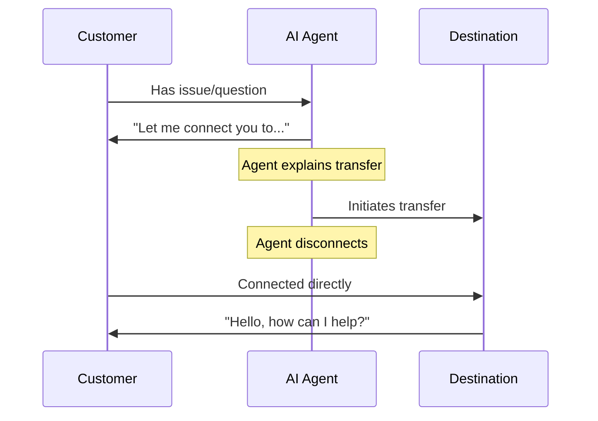

## Overview

The Transfer action is one of the most powerful call control tools, enabling your AI agents to seamlessly route conversations to the right destination when specialized help is needed. Whether transferring to human specialists, other AI agents, or external phone systems, proper transfer configuration ensures smooth handoffs that maintain customer satisfaction.

This comprehensive guide covers everything you need to know about transfer destinations, transfer modes, advanced settings, and best practices for reliable call routing.

<Note>
Transfers happen in real-time during active calls. The customer stays on the line while being connected to the new destination - they don't get hung up on or need to call back.
</Note>

---

## Transfer Destinations

itellicoAI supports three types of transfer destinations. Choose the one that fits your workflow:

<Frame>
  <div className="block dark:hidden">
    
  </div>
  <div className="hidden dark:block">
    
  </div>
</Frame>

<AccordionGroup>
  <Accordion title="Agent Transfer" icon="users" defaultOpen>
    Transfer calls to other AI agents in your itellicoAI account.

    ### Use Cases

    <CardGroup cols={2}>
      <Card title="Specialized Agents" icon="user-gear">
        Route to agents with specific knowledge (billing, technical, sales)
      </Card>
      <Card title="Language Routing" icon="language">
        Transfer to agents configured for different languages
      </Card>
      <Card title="Department Routing" icon="sitemap">
        Direct to agents designed for specific departments
      </Card>
      <Card title="Skill-Based Routing" icon="certificate">
        Connect to agents with specialized capabilities
      </Card>
    </CardGroup>

    ### Configuration

    <Steps>
      <Step title="Select transfer type">
        Choose **AGENT** as the transfer type
      </Step>
      <Step title="Choose destination agent">
        Select the target agent from the dropdown menu
      </Step>
      <Step title="Optional: Add hold music">
        Upload audio to play while connecting (optional)
      </Step>
      <Step title="Optional: Add ring tone">
        Add a ring sound during transfer (optional)
      </Step>
    </Steps>

    ### Audio Settings

    Agent transfers support customizable hold music and ring tones:

    **Hold Music:**
    - Play music while the customer waits for the transfer to connect
    - Duration: 1-30 seconds (default: 6 seconds)
    - Use for: Professional experience during connection delays
    - Not recommended for: Instant transfers when immediate connection is preferred

    **Ring Duration:**
    - Play ringing sound while waiting for the destination agent to answer
    - Duration: 1-30 seconds (default: 4 seconds)
    - Enabled by default
    - Simulates normal calling experience

    **Combined Settings:**
    You can enable both for a complete transfer experience:
    1. Music plays (e.g., 6 seconds) - Professional hold experience
    2. Ringing plays (e.g., 4 seconds) - Connection in progress
    3. Agent answers - Transfer completes

    **Total delay:** Music duration + Ring duration (e.g., 10 seconds)

    <Info>
    For instant agent-to-agent transfers, disable both music and ringing for immediate connection.
    </Info>

    ### Benefits

    - Conversation history transfers with the call
    - No additional telephony costs
    - Instant connection (no dialing delay)
    - Full context preservation
    - Customizable hold music and ring tone

    ### Example Instructions

    ```
    When a customer reports a technical issue that requires troubleshooting:
    1. Gather basic information about the problem
    2. Explain you're connecting them to a technical specialist
    3. Use the 'Transfer to Technical Agent' action
    ```
  </Accordion>

  <Accordion title="Phone Number Transfer" icon="phone">
    Transfer calls to external phone numbers - mobile phones, landlines, or business numbers.

    ### Use Cases

    <CardGroup cols={2}>
      <Card title="Human Specialists" icon="user-headset">
        Connect to live support agents
      </Card>
      <Card title="On-Call Teams" icon="mobile">
        Route to mobile phones for urgent issues
      </Card>
      <Card title="External Departments" icon="building">
        Transfer to teams outside your account
      </Card>
      <Card title="Emergency Contacts" icon="triangle-exclamation">
        Escalate critical situations
      </Card>
    </CardGroup>

    ### Configuration

    <Steps>
      <Step title="Select transfer type">
        Choose **PHONE** as the transfer type
      </Step>
      <Step title="Enter phone number">
        Enter destination in E.164 format: `+1-555-123-4567`

        **Format requirements:**
        - Must include country code (+1 for US/Canada)
        - No spaces, dashes, or parentheses
        - Examples: `+14155551234`, `+442071234567`, `+61398765432`
      </Step>
    </Steps>

    ### Costs & Limitations

    <Warning>
    **Important:**
    - Phone transfers incur outbound calling costs (rates vary by destination)
    - **Only work during active phone calls** (not web calls or widget conversations)
    - Verify phone numbers to avoid charges or failed transfers
    </Warning>

    ### Example Instructions

    ```
    For urgent issues outside business hours:
    1. Verify the issue is truly urgent
    2. Collect key details (customer name, issue summary)
    3. Explain you're connecting to the on-call manager
    4. Use the 'Transfer to On-Call Manager' action
    ```
  </Accordion>

  <Accordion title="SIP Address Transfer" icon="network-wired">
    Transfer calls to SIP addresses (Session Initiation Protocol URIs) for integration with PBX systems and contact centers.

    ### Use Cases

    <CardGroup cols={2}>
      <Card title="PBX Integration" icon="phone-office">
        Route to internal extensions
      </Card>
      <Card title="Contact Centers" icon="users-viewfinder">
        Transfer to ACD queue systems
      </Card>
      <Card title="Enterprise Telephony" icon="building-columns">
        Connect to corporate phone systems
      </Card>
      <Card title="VoIP Platforms" icon="cloud">
        Integrate with voice infrastructure
      </Card>
    </CardGroup>

    ### Configuration

    <Steps>
      <Step title="Prerequisites">
        Before configuring SIP transfers:
        - SIP trunk configured in itellicoAI
        - Destination SIP endpoint reachable
        - Proper authentication configured
        - Network routing in place
      </Step>
      <Step title="Select transfer type">
        Choose **SIP** as the transfer type
      </Step>
      <Step title="Enter SIP address">
        Enter destination SIP URI: `sip:1001@yourpbx.example.com`

        **Format requirements:**
        - Must be valid SIP URI
        - Include username and domain
        - Examples: `sip:support@pbx.company.com`, `sip:1234@10.0.1.50`
      </Step>
    </Steps>

    <Tip>
    SIP transfers are ideal for enterprises with existing phone systems. They provide seamless integration between AI agents and traditional telephony infrastructure.
    </Tip>

    <Warning>
    **SIP transfers only work during active phone calls.** They cannot be used during web calls or widget conversations.
    </Warning>

    ### Example Instructions

    ```
    For general support requests:
    1. Collect caller information
    2. Explain estimated wait time
    3. Use 'Transfer to Support Queue' action
    ```
  </Accordion>
</AccordionGroup>

---

## Transfer Modes

### Cold Transfer (Default)

The agent transfers the call immediately and disconnects. The customer connects directly to the destination without the agent introducing them.

#### How It Works



#### Example Flow

```
Customer: "I have a billing question"
Agent: "I'd be happy to help. Let me connect you with our billing
        department who can access your account details."
[Cold transfer to billing → Agent disconnects]
Billing Agent: "Hello, how can I help you?"
Customer: "I have a question about my bill..."
```

#### Silent Transfer Option

<Accordion title="Enable Silent Transfer (Optional)" icon="phone-slash">
  You can enable **Silent Transfer** mode where the agent transfers without saying anything - the call is immediately routed to the destination.

  **How it works:**
  1. Agent logic triggers transfer need
  2. Transfer executes without announcement
  3. Customer routed to destination silently

  **When to use:**
  - Pure routing, no conversation yet (IVR replacement)
  - Menu-based routing
  - Language detection and auto-routing

  **Configuration:**
  - Check the **Silent Transfer** checkbox
  - Any transfer message is ignored when silent mode is enabled

  **Example:**
  ```
  Agent: Language Router (silent routing agent)

  Instructions:
  Based on the language the customer speaks:
  - If Spanish detected, use 'Transfer to Spanish Agent' (silent)
  - If French detected, use 'Transfer to French Agent' (silent)
  - If English, continue conversation
  ```

  <Warning>
  Silent transfers can feel abrupt to customers. Use sparingly and only when appropriate for the use case.
  </Warning>
</Accordion>

### Warm Transfer

<Card title="Coming Soon" icon="clock">
  **Warm transfers** use a three-way call approach: the customer hears hold music while the AI initiates a new call to the destination in the background. Once the destination answers, the AI provides context (via whisper message, summary, or three-way introduction) before connecting the customer. This ensures the receiving agent is briefed and prepared before speaking with the customer.

  **How it works:**

  1. Customer placed on hold (hears hold music)
  2. AI initiates new call to destination in background
  3. Destination answers, AI provides briefing
  4. Customer connected to briefed destination agent

  **Key difference from cold transfer:** AI maintains both call legs and briefs the destination before connecting the customer, rather than disconnecting immediately.

  This feature is currently in development and will be available in a future release.
</Card>

---

## Multi-Destination Support

Create multiple transfer actions for different destinations to handle various routing scenarios:

<AccordionGroup>
  <Accordion title="Complete Routing Configuration" icon="sitemap">
    Configure multiple transfer destinations for comprehensive routing:

    ```text wrap
    Agent: Customer Service Router

    Transfer Actions Configured:
    1. Transfer to Billing Department (+1-555-100-0001)
    2. Transfer to Technical Support (+1-555-100-0002)
    3. Transfer to Sales Team (+1-555-100-0003)
    4. Transfer to Returns Department (+1-555-100-0004)
    5. Transfer to Manager (sip:manager@pbx.company.com)
    6. Transfer to Spanish Agent (Agent ID: ag_spanish_01)

    Instructions:
    Route customers to appropriate department:

    Billing questions → 'Transfer to Billing Department'
    Technical issues → 'Transfer to Technical Support'
    Sales inquiries → 'Transfer to Sales Team'
    Return requests → 'Transfer to Returns Department'
    Escalations → 'Transfer to Manager'
    Spanish speakers → 'Transfer to Spanish Agent'

    Always explain who you're connecting them to before transferring.
    ```
  </Accordion>

  <Accordion title="Fallback Chains" icon="arrow-turn-down-right">
    Configure multiple transfer options with fallback logic:

    ```text wrap
    Primary escalation path:
    1. Attempt 'Transfer to Technical Support'
    2. If fails, attempt 'Transfer to General Support'
    3. If that fails, attempt 'Transfer to Manager'
    4. If all fail, apologize and schedule callback

    Instructions:
    If the primary transfer fails, the agent should try the backup,
    and handle complete failure gracefully by collecting callback info.
    ```
  </Accordion>

  <Accordion title="Conditional Routing" icon="code-branch">
    Use different transfers based on customer data or conversation context:

    ```jinja
    
    Route enterprise customers to 'Transfer to Enterprise Support'
    
    Route premium customers to 'Transfer to Premium Support'
    
    Route standard customers to 'Transfer to General Support'
    
    ```
  </Accordion>
</AccordionGroup>

---

## Best Practices

<AccordionGroup>
  <Accordion title="Always Explain the Transfer" icon="comment">
    Never transfer calls without context. Explain who you're connecting them to and why.

    **Good:**
    ```
    "I understand you need help with your bill. Let me connect you
    with our billing department who can access your account and
    make any necessary adjustments. This should just take a moment."
    ```

    **Poor:**
    ```
    "Hold please." [immediate transfer]
    ```
  </Accordion>

  <Accordion title="Set Customer Expectations" icon="clock">
    Tell customers what to expect during and after the transfer.

    **Good:**
    ```
    "I'm going to connect you with our technical team. You'll hear
    a brief hold message, then they'll pick up within 30 seconds.
    They'll have your information ready."
    ```

    **Poor:**
    ```
    "Transferring now." [customer doesn't know what's happening]
    ```
  </Accordion>

  <Accordion title="Gather Information First" icon="clipboard">
    Collect basic details before transferring so the recipient has context and the customer doesn't need to repeat themselves.

    ```
    Before transferring:
    1. Get customer name
    2. Understand basic issue
    3. Collect account/order number if relevant
    4. Ask about urgency
    5. Then transfer with context
    ```
  </Accordion>

  <Accordion title="Use Descriptive Names" icon="tag">
    Name each transfer action clearly based on destination.

    **Good:**
    - "Transfer to Billing Department"
    - "Escalate to Technical Support"
    - "Route to Spanish-Speaking Agent"
    - "Connect to On-Call Manager"

    **Poor:**
    - "Transfer 1"
    - "Phone Transfer"
    - "Escalate"
  </Accordion>

  <Accordion title="Handle Transfer Failures" icon="triangle-exclamation">
    Always have a plan for when transfers fail (busy, no answer, etc.).

    ```
    If 'Transfer to Support' action fails:
    1. Apologize: "I apologize, I'm having trouble connecting right now"
    2. Offer callback: "I can have our support team call you back
       within the next hour"
    3. Collect callback number and best time
    4. Confirm: "Great, expect a call from us at [number] within the hour"
    5. Use 'End Call Politely' action
    ```
  </Accordion>

  <Accordion title="Use E.164 Format for Phone Numbers" icon="phone">
    Always format phone numbers correctly to avoid transfer failures.

    **Correct E.164 format:**
    - Include country code: `+1` for US/Canada
    - No spaces, dashes, or punctheses
    - Examples: `+14155551234`, `+442071234567`

    **Incorrect formats:**
    - ❌ `(415) 555-1234`
    - ❌ `415-555-1234`
    - ❌ `14155551234` (missing +)
    - ❌ `+1 415 555 1234` (spaces)
  </Accordion>

  <Accordion title="Consider Costs for Phone Transfers" icon="dollar-sign">
    Be mindful of telephony costs, especially for international transfers.

    **Cost optimization:**
    - Use agent transfers when possible (free)
    - Use SIP transfers for internal routing (typically free or low-cost)
    - Limit phone transfers to necessary escalations
    - Monitor transfer frequency and costs
    - Set up alerts for unusual transfer volumes
  </Accordion>

</AccordionGroup>

---

## Testing Transfer Actions

Test all transfer destinations before going live to ensure reliable operation:

**Essential tests:**
- Transfer executes and destination receives call
- Audio quality is good in both directions
- Agent explains transfer appropriately in instructions
- Failure scenarios handled gracefully (no answer, busy signal, invalid destination)
- Test from different call sources (phone, web)

<Info>
For phone/SIP transfers, confirm proper E.164 formatting and destination reachability.
</Info>

---

## Troubleshooting

<AccordionGroup>
  <Accordion title="Transfer Connects But Drops Immediately" icon="phone-slash">
    **Symptoms:** Transfer appears to connect, but call ends right away

    **Possible causes:**
    - Destination not configured to accept transfers
    - SIP endpoint configuration issue
    - Agent not active (for agent transfers)
    - Network/firewall blocking

    **Solutions:**
    - Verify destination agent is active and published
    - Test destination phone number independently
    - Check SIP trunk configuration and authentication
    - Review firewall rules for SIP traffic
    - Check for "Do Not Disturb" or call blocking on destination
  </Accordion>

  <Accordion title="No Audio After Transfer" icon="volume-xmark">
    **Symptoms:** Transfer connects but no audio in one or both directions

    **Possible causes:**
    - RTP (media) ports blocked
    - NAT traversal issues
    - Codec mismatch
    - SIP endpoint audio settings

    **Solutions:**
    - Verify RTP ports are open (typically 10000-20000)
    - Check NAT configuration on SIP endpoints
    - Ensure compatible codecs configured (G.711, Opus)
    - Test audio with simple test call first
    - Review SIP trunk audio settings
  </Accordion>

  <Accordion title="Phone Transfers Fail With Error" icon="circle-exclamation">
    **Symptoms:** Transfer action returns error, call not connected

    **Possible causes:**
    - Invalid phone number format
    - Insufficient account balance
    - Number not reachable
    - Carrier restrictions

    **Solutions:**
    - Verify E.164 format: +14155551234 (not (415) 555-1234)
    - Check account balance and telephony credits
    - Test with different phone number
    - Verify destination country is supported
    - Check for carrier blocking or spam filters
  </Accordion>

  <Accordion title="Agent Transfers Don't Preserve Context" icon="message-slash">
    **Symptoms:** Context/history not available to receiving agent

    **Possible causes:**
    - Configuration issue
    - Agents in different accounts
    - Transfer mode setting

    **Solutions:**
    - Verify both agents in same itellicoAI account
    - Check transfer is configured as agent transfer, not phone
    - Review agent transfer settings
    - Test with simple agent-to-agent transfer
    - Contact support if issue persists
  </Accordion>

  <Accordion title="Hold Music Not Playing" icon="music-slash">
    **Symptoms:** Transfer happens but no hold music

    **Possible causes:**
    - Hold music disabled in settings
    - Duration set to 0
    - Agent transfer (music only for phone/SIP)

    **Solutions:**
    - Enable "Play Music" checkbox in transfer settings
    - Set music duration (4-8 seconds recommended)
    - Verify transfer type supports music (not all agent transfers use music)
    - Test with phone transfer to confirm music works
  </Accordion>

  <Accordion title="Ring Tone Not Playing" icon="bell-slash">
    **Symptoms:** No ringing sound during transfer

    **Possible causes:**
    - Ring disabled in settings
    - Ring duration set to 0
    - Transfer completes before ring starts

    **Solutions:**
    - Enable "Should Ring" checkbox
    - Set ring duration (4-6 seconds typical)
    - Adjust music duration if ring should play after
    - Verify destination actually supports ringing
  </Accordion>

  <Accordion title="SIP Transfers Fail to Connect" icon="network-wired">
    **Symptoms:** SIP transfers return errors or don't connect

    **Possible causes:**
    - Invalid SIP URI format
    - SIP trunk not configured
    - Authentication failure
    - Network routing issue

    **Solutions:**
    - Verify SIP URI format: sip:user@domain.com
    - Check SIP trunk is configured in itellicoAI
    - Verify SIP credentials are correct
    - Test SIP endpoint with SIP client
    - Check DNS resolution for SIP domain
    - Review firewall rules for SIP traffic (port 5060/5061)
  </Accordion>

  <Accordion title="Caller ID Shows Wrong Number" icon="id-card">
    **Symptoms:** Transferred call displays incorrect caller ID

    **Possible causes:**
    - SIP trunk caller ID passthrough not configured
    - PBX settings blocking caller ID
    - Carrier blocking or modifying caller ID

    **Solutions:**
    - Verify your SIP trunk is configured to pass caller ID correctly
    - Check your PBX caller ID settings
    - Some carriers block caller ID passthrough - check with your carrier
    - You may need to configure allowed caller IDs on your SIP trunk
  </Accordion>
</AccordionGroup>

---

## Real-World Examples

<AccordionGroup>
  <Accordion title="Multi-Tier Support Routing" icon="layer-group">
    Route support issues by complexity tier:

    ```text wrap
    Agent: Customer Support Router

    Transfer Actions:
    - Transfer to L1 Support (sip:support-l1@queue.company.com)
    - Transfer to L2 Support (sip:support-l2@queue.company.com)
    - Transfer to Engineering (+1-555-100-9999)

    Instructions:
    Route support issues by complexity:

    Simple questions (password reset, account questions):
    - Answer directly using knowledge base
    - Don't transfer unless customer requests

    Medium complexity (feature questions, minor bugs):
    - Attempt to help using knowledge base
    - If unable to resolve, use 'Transfer to L1 Support'

    High complexity (system outages, critical bugs):
    - Gather detailed information
    - Use 'Transfer to L2 Support'

    Critical emergencies (data loss, security incidents):
    - Collect all details immediately
    - Use 'Transfer to Engineering' without delay
    ```
  </Accordion>

  <Accordion title="Sales Qualification with Transfer" icon="chart-line">
    Qualify leads and route to appropriate sales team:

    ```text wrap
    Agent: Sales Qualification Agent

    Transfer Actions:
    - Transfer to Inside Sales (+1-555-200-1000)
    - Transfer to Enterprise Sales (+1-555-200-2000)
    - Transfer to Customer Success (sip:cs-team@company.com)

    Instructions:
    For inbound sales inquiries:

    1. Greet and understand their interest
    2. Ask qualifying questions:
       - Company size
       - Budget range
       - Timeline
       - Decision authority

    Based on responses:

    Small business (<50 employees, <$10k budget):
    - Provide self-service resources
    - Offer to schedule demo via booking action
    - Don't transfer unless they request

    Mid-market (50-500 employees, $10k-$100k budget):
    - Use 'Transfer to Inside Sales'
    - Explain: "I'm connecting you with an account executive
      who can discuss our mid-market packages"

    Enterprise (500+ employees, $100k+ budget):
    - Use 'Transfer to Enterprise Sales'
    - Explain: "I'm connecting you with our enterprise team
      who specializes in large deployments"

    Existing customer wanting expansion:
    - Use 'Transfer to Customer Success'
    ```
  </Accordion>

  <Accordion title="After-Hours Routing" icon="moon">
    Handle calls outside business hours:

    <Tip>
    **Best practice:** If you have a PBX system, handle after-hours routing at the PBX level for superior reliability and control.
    </Tip>

    ```text wrap
    Agent: After-Hours Support

    Transfer Actions:
    - Transfer to On-Call Engineer (+1-555-emergency)
    - Transfer to Voicemail (sip:vm@pbx.company.com)

    Instructions:
    Outside normal business hours (Mon-Fri 9am-5pm):

    1. Greet: "Thank you for calling. Our offices are currently closed."

    2. Ask about urgency:
       "Is this an urgent issue affecting your business operations?"

    If urgent/emergency:
    - Gather details: name, company, issue description, impact
    - Explain: "I'm connecting you to our on-call engineer who can
      help immediately"
    - Use 'Transfer to On-Call Engineer'

    If not urgent:
    - Explain business hours
    - Offer options:
      a) Leave voicemail (Use 'Transfer to Voicemail')
      b) Schedule callback for next business day (Use booking action)
      c) Visit self-service knowledge base
    ```
  </Accordion>
</AccordionGroup>

---

## Advanced Configurations

<AccordionGroup>
  <Accordion title="Dynamic Destination Routing" icon="globe">
    Use variables to dynamically determine transfer destinations:

    ```jinja
    
    Transfer destination: +1-555-WEST-001
    
    Transfer destination: +1-555-EAST-001
    
    Transfer destination: +1-555-MAIN-001
    

    When transferring, use the appropriate regional number.
    ```
  </Accordion>

  <Accordion title="Time-Based Routing" icon="clock">
    Route transfers based on time of day:

    ```jinja
    

    
    Business hours: Use 'Transfer to Support Team'
    
    After hours: Use 'Transfer to On-Call Support'
    
    ```

    <Info>
    The `current_datetime` variable must be passed to your agent via [Dynamic Context](/build/advanced/dynamic-context). Configure a context endpoint that returns this data in your agent's operational settings.
    </Info>
  </Accordion>

  <Accordion title="Skill-Based Routing" icon="user-gear">
    Route based on required expertise:

    ```text wrap
    Determine required skill:
    - Billing question → 'Transfer to Billing Specialist'
    - Technical issue → 'Transfer to Technical Support'
    - Product question → 'Transfer to Product Expert'
    - Account management → 'Transfer to Account Manager'

    Use customer's account type to influence routing:
    - VIP accounts always get priority queue transfers
    - Enterprise accounts route to dedicated support
    - Standard accounts route to general support queue
    ```
  </Accordion>
</AccordionGroup>

---

## Next Steps

<CardGroup cols={2}>
  <Card title="Call Control Actions" icon="phone" href="/build/actions/call-control">
    Learn about End Conversation and Inactivity Management actions
  </Card>
  <Card title="Actions Overview" icon="bolt" href="/build/actions/overview">
    Understand all action types and when to use them
  </Card>
  <Card title="Booking Actions" icon="calendar" href="/build/actions/booking-calendar">
    Set up appointment scheduling with Cal.com
  </Card>
  <Card title="Custom API Actions" icon="code" href="/build/actions/custom-api-actions">
    Connect to external systems and APIs
  </Card>
  <Card title="Instructions Guide" icon="pen" href="/build/conversation/instructions">
    Write effective instructions for reliable transfers
  </Card>
  <Card title="Test Your Agent" icon="vial" href="/test/web-simulator">
    Comprehensive testing guide for agents with transfers
  </Card>
</CardGroup>
