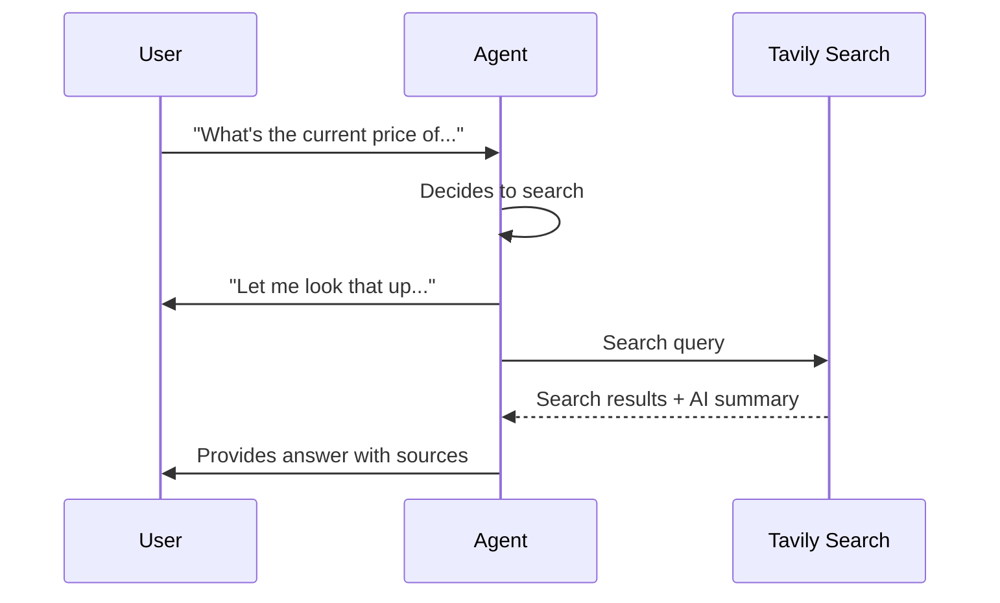

## Overview

The Web Search action enables your agent to search the internet for real-time information during conversations. Powered by Tavily, this tool provides up-to-date answers for questions beyond your agent's training data or knowledge base.

<Note>
Web Search is powered by Tavily AI, providing fast, accurate search results optimized for AI agents.
</Note>

---

## Use Cases

<CardGroup cols={2}>
  <Card title="Current Events" icon="newspaper">
    Answer questions about recent news, updates, or time-sensitive information
  </Card>
  <Card title="Competitor Research" icon="chart-bar">
    Look up current pricing, features, or offerings during sales calls
  </Card>
  <Card title="Product Information" icon="box">
    Find specifications, availability, or reviews not in your knowledge base
  </Card>
  <Card title="Location Data" icon="location-dot">
    Search for addresses, hours, directions, or local information
  </Card>
</CardGroup>

---

## Configuration

Navigate to **Actions** in your agent configuration and add a new Web Search action.

### Basic Settings

| Setting | Description | Default |
|---------|-------------|---------|
| **Filler Phrase** | What the agent says while searching | "Let me look that up for you..." |
| **Max Results** | Maximum search results to return (1-10) | 3 |
| **Search Depth** | Basic (faster) or Advanced (more comprehensive) | Basic |
| **Include AI Answer** | Include Tavily's AI-generated summary | Enabled |

### Filler Phrase

Customize the phrase your agent says while performing the search. The search typically takes 2-5 seconds.

**Examples:**
- "Let me search for that..."
- "One moment while I look this up..."
- "I'll find the latest information on that..."

### Search Depth

<Tabs>
  <Tab title="Basic">
    **Faster results, less comprehensive**

    - Response time: 1-2 seconds
    - Best for: Simple factual queries
    - Cost: Lower per search

    **Use when:**
    - Quick answers are more important than depth
    - Simple factual questions
    - High call volume where speed matters
  </Tab>

  <Tab title="Advanced">
    **More comprehensive, slightly slower**

    - Response time: 2-4 seconds
    - Best for: Complex queries requiring thorough research
    - Cost: Higher per search

    **Use when:**
    - Detailed information is required
    - Complex multi-part questions
    - Research-heavy conversations
  </Tab>
</Tabs>

### Domain Restrictions

Optionally restrict searches to specific domains:

```json
["example.com", "docs.example.com", "help.example.com"]
```

**Use cases for domain restrictions:**
- Limit to your own documentation sites
- Restrict to trusted sources only
- Focus on specific industry publications

Leave empty to search the entire web.

---

## How It Works



1. User asks a question requiring current information
2. Agent determines web search is needed
3. Agent speaks the filler phrase
4. Tavily performs the search
5. Agent synthesizes results into a natural response

---

## Best Practices

**Write clear trigger instructions:** In your agent's instructions, specify when to use web search:

```text
Use web search when:
- Asked about current events, news, or recent developments
- Questions about competitor pricing or features
- Information not in your knowledge base
- Time-sensitive data (stocks, weather, schedules)

Do NOT use web search when:
- Information is in the knowledge base
- General knowledge questions
- Company-specific information you already have
```

**Keep filler phrases natural:** Match the phrase to your agent's personality and the situation.

**Use domain restrictions wisely:** Only restrict if you have a specific reason. Open search provides more comprehensive results.

**Consider search depth:** Start with Basic for speed, switch to Advanced if results are insufficient.

---

## Limitations

- **Internet access required:** Requires network connectivity
- **Search takes time:** 2-5 seconds per search
- **Results vary:** Search quality depends on query clarity
- **Cost per search:** Each search consumes API credits

---

## Combining with Knowledge Base

Web Search and Knowledge Base work together:

| Source | Best for |
|--------|----------|
| Knowledge Base | Company-specific, curated, controlled information |
| Web Search | Current events, external data, real-time information |

**Recommendation:** Use your knowledge base for stable company information and web search for dynamic external data.

---

## Next Steps

<CardGroup cols={2}>
  <Card title="Actions Overview" icon="bolt" href="/build/actions/overview">
    Explore all available actions
  </Card>
  <Card title="Custom API Actions" icon="code" href="/build/actions/custom-api-actions">
    Build custom integrations
  </Card>
  <Card title="Knowledge Base" icon="book" href="/build/knowledge/architecture">
    Add curated information sources
  </Card>
  <Card title="Test Your Agent" icon="vial" href="/test/web-simulator">
    Test web search in conversations
  </Card>
</CardGroup>
