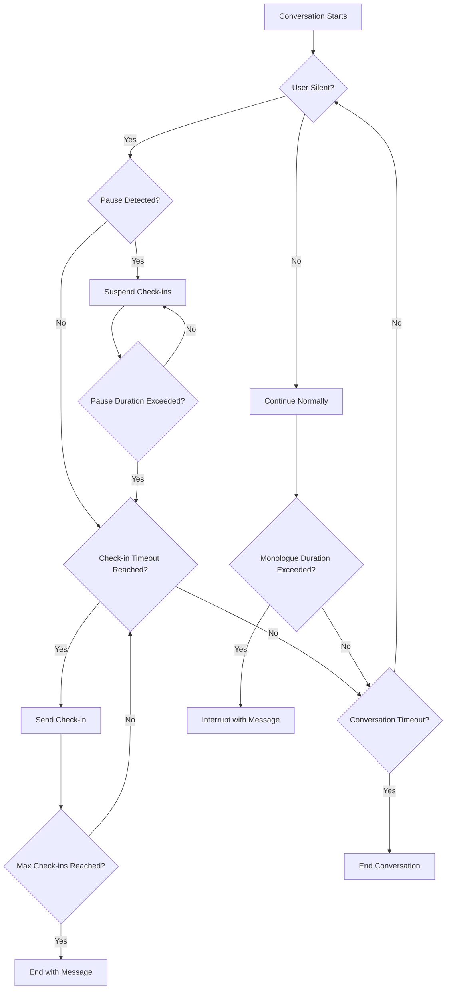

## Overview

Inactivity and timeout settings enable your AI agents to gracefully handle periods of silence, prevent endless monologues, manage natural conversation pauses, and enforce maximum conversation durations. These controls are essential for creating professional, time-aware conversations that respect both user needs and operational constraints.

These settings work together to create natural conversation flow while preventing common issues like abandoned calls, excessive wait times, and runaway conversations.

<Note>
**Universal Application:** Inactivity and timeout settings apply to all conversation types, including phone calls (SIP/PSTN) and web-based conversations.

Configuration is available in **Agent Settings → Operations → Inactivity & Timeout**. Settings include check-in reminders, pause detection, monologue prevention, and overall conversation timeouts.
</Note>

---

## Feature Overview

### Four Key Components

<CardGroup cols={2}>
  <Card title="Check-ins & Reminders" icon="bell">
    Periodic prompts during silence to ensure the user is still engaged
  </Card>
  <Card title="Pause Detection" icon="pause">
    Smart recognition of natural pauses when users need time
  </Card>
  <Card title="Monologue Prevention" icon="volume-high">
    Limits on continuous agent speech to maintain engagement
  </Card>
  <Card title="Conversation Timeout" icon="clock">
    Maximum duration for the entire conversation
  </Card>
</CardGroup>

---

## Check-ins & Reminders

### Detecting User Inactivity

Check-ins help ensure users haven't dropped off, are still paying attention, or need assistance. When enabled, the agent will periodically check in with / remind the user during periods of silence.

<Tabs>
  <Tab title="Configuration">
    ### Core Settings

    <AccordionGroup>
      <Accordion title="Inactivity Detection" icon="toggle-on">
        **Master switch for check-in functionality**

        When enabled, the agent will monitor for periods of user silence and send check-in messages. When disabled, no check-ins will occur (though conversation timeout and monologue prevention still apply).

        **Default:** Enabled
      </Accordion>

      <Accordion title="Check-in Timeout" icon="timer">
        **Seconds before sending a check-in message (5-300 seconds)**

        How long the agent waits in silence before sending a reminder to the user.

        - **Typical recommendation (5-15s):** Good for most conversations, maintains engagement
        - **Extended timeout (20-45s):** For scenarios where users may need time to think
        - **Long timeout (60-300s):** When users need to look up information or complete actions

        **Default:** 10 seconds

        <Tip>
        For scenarios where users need to look up information (account numbers, addresses, etc.), use extended or long timeout values to avoid interrupting them.
        </Tip>
      </Accordion>

      <Accordion title="Max Check-ins" icon="repeat">
        **Maximum number of check-ins before ending call (0-10)**

        How many times the agent will attempt to re-engage before gracefully ending the conversation.

        - **0 check-ins:** Disabled (conversation continues indefinitely until timeout)
        - **1-3 check-ins:** Quick exit for likely abandoned calls
        - **4-7 check-ins:** Balanced persistence
        - **8-10 check-ins:** Very patient, multiple re-engagement attempts

        **Default:** 3 check-ins

        <Warning>
        Setting this to 0 disables reminder functionality but does NOT disable the conversation timeout. The conversation will still end when the overall timeout is reached.
        </Warning>
      </Accordion>
    </AccordionGroup>

    ### How It Works

    ```mermaid
    sequenceDiagram
        participant User
        participant Agent
        User->>Agent: Hello, I need help
        Agent->>User: How can I help you?
        Note over User,Agent: User stops responding
        Note over Agent: Wait 10 seconds (check-in timeout)
        Agent->>User: "Are you still there?" (Check-in #1)
        Note over User,Agent: Still no response
        Note over Agent: Wait another 10 seconds
        Agent->>User: "Hello? Can you hear me?" (Check-in #2)
        Note over User,Agent: Still no response
        Note over Agent: Wait another 10 seconds
        Agent->>User: "I'll end the call now" (Check-in #3)
        Agent->>User: Ends conversation gracefully
    ```
  </Tab>
  <Tab title="Messages">
    ### Check-in Messages

    Customize what the agent says during check-ins. Messages can be rotated to sound more natural across multiple check-ins.

    <Tabs>
      <Tab title="Default Messages">
        **System-provided multilingual messages**

        The platform provides default check-in messages in multiple languages that match your agent's configured language. These messages are automatically selected based on your agent's voice and transcriber language settings.

        **Example default messages (English):**
        1. "Are you still there?"
        2. "Hello? Can you hear me?"
        3. "I haven't heard from you. Are you still there?"

        **Benefits:**
        - No setup required
        - Multilingual support
        - Professionally crafted
        - Variety to sound natural
      </Tab>
      <Tab title="Custom Messages">
        **Create your own check-in messages**

        Switch to custom messages to create brand-specific or context-aware check-ins.

        **Features:**
        - Add multiple messages (rotated automatically)
        - Drag to reorder priority
        - Language-specific variants
        - Unlimited customization

        **Example custom messages:**
        1. "Hey, I didn't catch that. Are you still with me?"
        2. "Just checking - did you need more time?"
        3. "I'm here when you're ready. Should I continue?"

        <Tip>
        Add 3-5 varied messages to make repeated check-ins sound more natural and less robotic.
        </Tip>
      </Tab>
    </Tabs>

    ### End Message

    The final message spoken before ending the conversation after max check-ins are reached.

    **Default:** "I'll end the call now. Feel free to call back anytime!"

    **Custom examples:**
    - "Since I haven't heard from you, I'll disconnect now. Have a great day!"
    - "I'll let you go now. Thanks for calling, and please reach out again if you need anything."
    - "It seems we got disconnected. I'm ending the call, but feel free to call back."
  </Tab>
  <Tab title="Use Cases">
    ### Common Scenarios

    <AccordionGroup>
      <Accordion title="Customer Support Hold Times" icon="headset">
        **Scenario:** User is placed on hold or transferred

        **Configuration:**
        - Check-in timeout: 45-60 seconds
        - Max check-ins: 5-7
        - Messages: "I'm still here. Let me know when you're ready to continue."

        **Why:** Users may need time to check information with colleagues or complete actions
      </Accordion>

      <Accordion title="Information Gathering" icon="clipboard-list">
        **Scenario:** Agent asks for account numbers, addresses, or other data

        **Configuration:**
        - Check-in timeout: 30-45 seconds
        - Max check-ins: 3-4
        - Messages: "Take your time. I'm ready when you have that information."

        **Why:** Users need time to locate documents or information
      </Accordion>

      <Accordion title="Automated Surveys" icon="clipboard-question">
        **Scenario:** Voice survey or feedback collection

        **Configuration:**
        - Check-in timeout: 15-20 seconds
        - Max check-ins: 2-3
        - Messages: "I didn't hear a response. Would you like to continue?"

        **Why:** Quick pace maintains engagement, fewer retries prevent long waits
      </Accordion>

      <Accordion title="Appointment Booking" icon="calendar">
        **Scenario:** User is checking their calendar

        **Configuration:**
        - Check-in timeout: 60-90 seconds
        - Max check-ins: 4-5
        - Messages: "I'll wait while you check your calendar. Let me know when you're ready."

        **Why:** Users genuinely need extended time to consult schedules
      </Accordion>
    </AccordionGroup>
  </Tab>
</Tabs>

---

## Pause Detection

### Natural Conversation Pauses

Pause detection allows the agent to intelligently recognize when users need time for specific activities - without bombarding them with check-in messages. This creates a more natural conversation flow.

<Tabs>
  <Tab title="Overview">
    ### How Pause Detection Works

    The agent uses AI to detect when a user explicitly requests time to complete an action, then temporarily suspends inactivity check-ins.

    **Common pause triggers:**
    - "Let me check my calendar"
    - "Hold on, I need to find that document"
    - "Can you give me a minute to ask my colleague?"
    - "I'm looking that up now"
    - "Let me grab my credit card"

    **During a pause:**
    - ✅ Inactivity check-ins are suspended
    - ✅ Maximum pause duration is enforced
    - ✅ Monologue prevention still applies
    - ✅ Overall conversation timeout still applies

    ```mermaid
    sequenceDiagram
        participant User
        participant Agent
        User->>Agent: I need to schedule an appointment
        Agent->>User: Sure! When works for you?
        User->>Agent: Let me check my calendar
        Note over Agent: Detects pause request
        Note over Agent: Suspends check-ins for up to 5 minutes
        Note over User: User checks calendar (2 minutes)
        User->>Agent: How about Tuesday at 2pm?
        Note over Agent: Resumes normal operation
        Agent->>User: Tuesday at 2pm works great!
    ```
  </Tab>
  <Tab title="Configuration">
    ### Default Pause Settings

    <AccordionGroup>
      <Accordion title="Enable Default Pause" icon="toggle-on">
        **Master switch for automatic pause detection**

        When enabled, the agent automatically detects common pause scenarios and suspends check-ins temporarily.

        **Default:** Enabled

        <Note>
        Pause detection requires inactivity detection to be enabled. If inactivity detection is disabled, pause detection will also be disabled.
        </Note>
      </Accordion>

      <Accordion title="Maximum Pause Duration" icon="clock">
        **Maximum time before resuming checks (1-3600 seconds)**

        How long the agent will wait during a detected pause before resuming normal check-in behavior.

        - **Short duration (60-120s):** Quick actions only
        - **Medium duration (180-300s):** Standard pause scenarios
        - **Long duration (600-3600s):** Extended activities

        **Default:** 300 seconds (5 minutes)

        <Tip>
        Set this based on the typical activities your users perform. For example, checking a calendar might need 120s, while gathering documents might need 300s.
        </Tip>
      </Accordion>
    </AccordionGroup>

    ### Automatic Detection

    The agent automatically detects pause scenarios based on natural language understanding. Common patterns include:

    - **Temporal requests:** "give me a second", "wait a minute", "hold on"
    - **Action statements:** "let me check", "I'm looking", "I need to find"
    - **Consulting others:** "let me ask", "I'll need to check with"
    - **Information gathering:** "finding that now", "pulling up", "looking for"

    No explicit configuration needed - the AI handles detection automatically.
  </Tab>
  <Tab title="Custom Overrides">
    ### Advanced Pause Scenarios

    For specialized use cases, create custom pause override rules with specific conditions and durations.

    **Override Components:**

    <AccordionGroup>
      <Accordion title="Override Name" icon="tag">
        Descriptive name for the pause scenario (e.g., "Payment Processing Pause", "Calendar Check Pause")
      </Accordion>

      <Accordion title="Max Duration" icon="timer">
        Custom maximum duration for this specific scenario (overrides default pause duration)
      </Accordion>

      <Accordion title="Pause Condition" icon="play">
        **Optional:** Specific phrase or condition that triggers this pause

        Example: "user mentions payment", "user says checking availability"
      </Accordion>

      <Accordion title="Resume Condition" icon="stop">
        **Optional:** Specific phrase or condition that ends the pause early

        Example: "user provides card number", "user confirms date"
      </Accordion>
    </AccordionGroup>

    ### Example Override

    **Name:** Extended Calendar Check
    **Max Duration:** 600 seconds (10 minutes)
    **Pause Condition:** User mentions checking calendar or schedule
    **Resume Condition:** User provides a specific date or time

    **Use case:** Business users scheduling across multiple calendars or coordinating with teams
  </Tab>
</Tabs>

---

## Monologue Prevention

### Limiting Agent Speech Duration

Monologue prevention ensures the agent doesn't speak continuously for too long, maintaining user engagement and preventing information overload.

<Card title="Why Monologue Prevention Matters" icon="info-circle">
  Long, uninterrupted agent responses can:
  - Overwhelm users with information
  - Reduce engagement and retention
  - Sound robotic or scripted
  - Prevent users from asking clarifying questions
  - Waste time if users have already found their answer
</Card>

### Configuration

<AccordionGroup>
  <Accordion title="Maximum Monologue Duration" icon="clock">
    **Maximum seconds of continuous agent speech (0-unlimited)**

    How long the agent can speak continuously before being interrupted.

    - **Short duration (20-40s):** Keeps responses brief, highly interactive
    - **Medium duration (45-75s):** Balanced for most use cases
    - **Long duration (90-180s):** Allows detailed explanations
    - **Unlimited (0):** No limit on agent speech (not recommended)

    **Default:** 60 seconds

    <Warning>
    Setting this too low (under 30s) may cut off important information. Setting it too high (over 120s) risks losing user engagement.
    </Warning>
  </Accordion>

  <Accordion title="Monologue End Message" icon="message">
    **Message spoken when monologue limit is reached**

    The agent speaks this message before ending the conversation due to excessive speech.

    **Default:** "I've been talking for quite a while. Let me pause here - do you have any questions?"

    **Custom examples:**
    - "I realize I'm providing a lot of information. Would you like me to continue or focus on something specific?"
    - "Let me pause here to make sure this is helpful. Any questions so far?"
    - "I should check in - is this the information you were looking for?"

    <Tip>
    Frame monologue end messages as helpful check-ins rather than abrupt stops. This maintains a positive user experience.
    </Tip>
  </Accordion>
</AccordionGroup>

### Behavior

- **Always enabled:** Monologue prevention runs independently of check-in settings
- **Not affected by pauses:** Pauses don't reset the monologue timer
- **Conversation continues:** Unless configured to end, conversation continues after the end message
- **Resets on user input:** Timer resets when the user speaks

---

## Conversation Timeout

### Overall Maximum Duration

Conversation timeout sets an absolute maximum duration for the entire conversation, regardless of activity level or engagement.

<Card title="Why Conversation Timeouts Matter" icon="shield-check">
  Conversation timeouts:
  - Prevent runaway costs from endless conversations
  - Enforce operational policies and SLAs
  - Protect against abuse or system issues
  - Enable predictable resource planning
  - Ensure fair access in high-volume environments
</Card>

### Configuration

<AccordionGroup>
  <Accordion title="Maximum Conversation Duration" icon="clock">
    **Maximum total conversation length in seconds (0-unlimited)**

    The absolute maximum time for the entire conversation from start to finish.

    - **Short timeout (120-300s):** Quick interactions, transactional use cases
    - **Medium timeout (300-900s):** Standard customer service calls
    - **Long timeout (900-3600s):** Complex support, detailed consultations
    - **Very long timeout (3600+s):** Extended sessions, specialized scenarios

    **Default:** 300 seconds (5 minutes)

    <Note>
    This is a hard limit that cannot be extended. Plan conservatively based on your typical conversation length plus buffer time.
    </Note>
  </Accordion>

  <Accordion title="Timeout End Message" icon="message">
    **Message spoken when conversation timeout is reached**

    The agent speaks this message before ending the conversation due to reaching maximum duration.

    **Default:** "We've reached our maximum call time. Thank you for your time, and please feel free to call back if you need more help!"

    **Custom examples:**
    - "We're at our time limit for this call. I can schedule a follow-up if you'd like to continue this conversation."
    - "Our session is ending due to time constraints. Please call back and we can pick up where we left off."
    - "We've reached the maximum call duration. Would you like me to send you a summary via email before we disconnect?"
  </Accordion>
</AccordionGroup>

### Behavior

- **Always enabled:** Timeout runs independently of all other settings
- **Absolute limit:** Cannot be paused or extended by any mechanism
- **Includes all time:** Counts total elapsed time including pauses and silence
- **Graceful ending:** Agent speaks the end message and terminates politely

---

## Configuration Best Practices

### Recommended Settings by Use Case

<Tabs>
  <Tab title="Customer Support">
    **Scenario:** General customer service and help desk

    | Setting | Value | Reasoning |
    |---------|-------|-----------|
    | Check-in Timeout | 10-15s | Maintain engagement while allowing pauses |
    | Max Check-ins | 3-4 | Balance patience with efficiency |
    | Enable Pause | Yes | Users often need to gather info |
    | Default Pause Duration | 240s (4min) | Sufficient for finding account details |
    | Monologue Duration | 60s | Keep responses focused and engaging |
    | Conversation Timeout | 600s (10min) | Allow complex issue resolution |
  </Tab>
  <Tab title="Appointment Booking">
    **Scenario:** Scheduling appointments and reservations

    | Setting | Value | Reasoning |
    |---------|-------|-----------|
    | Check-in Timeout | 30-45s | Allow time before pause detection kicks in |
    | Max Check-ins | 4-5 | Be patient while they schedule |
    | Enable Pause | Yes | Essential for calendar checking |
    | Default Pause Duration | 300s (5min) | Extended time for complex schedules |
    | Monologue Duration | 45s | Quick options presentation |
    | Conversation Timeout | 480s (8min) | Allow scheduling discussions |
  </Tab>
  <Tab title="Information Hotline">
    **Scenario:** Quick information lookup or directory

    | Setting | Value | Reasoning |
    |---------|-------|-----------|
    | Check-in Timeout | 8-12s | Fast-paced, keep momentum |
    | Max Check-ins | 2-3 | Quick exit for disengaged users |
    | Enable Pause | No | Minimal pause needs |
    | Default Pause Duration | N/A | Not applicable |
    | Monologue Duration | 75s | Allow complete information delivery |
    | Conversation Timeout | 240s (4min) | Quick information exchange |
  </Tab>
  <Tab title="Voice Survey">
    **Scenario:** Feedback collection and surveys

    | Setting | Value | Reasoning |
    |---------|-------|-----------|
    | Check-in Timeout | 10-15s | Keep momentum in survey flow |
    | Max Check-ins | 2 | Avoid extending abandoned surveys |
    | Enable Pause | No | Linear survey flow |
    | Default Pause Duration | N/A | Not applicable |
    | Monologue Duration | 30s | Brief question delivery |
    | Conversation Timeout | 300s (5min) | Standard survey length |
  </Tab>
  <Tab title="Sales/Qualification">
    **Scenario:** Lead qualification and sales calls

    | Setting | Value | Reasoning |
    |---------|-------|-----------|
    | Check-in Timeout | 20-30s | Allow thoughtful responses |
    | Max Check-ins | 5-7 | Persistent but not pushy |
    | Enable Pause | Yes | Users consult decision makers |
    | Default Pause Duration | 600s (10min) | Extended consultation time |
    | Monologue Duration | 90s | Detailed product explanations |
    | Conversation Timeout | 1200s (20min) | In-depth sales conversations |
  </Tab>
</Tabs>

---

## Troubleshooting

### Common Issues and Solutions

<AccordionGroup>
  <Accordion title="Agent checks in too frequently" icon="bell-ring">
    **Symptoms:** Check-ins interrupt users who are still engaged

    **Solutions:**
    - Increase check-in timeout (try 20-30s instead of 10s)
    - Enable pause detection if not already active
    - Review if users are naturally pausing (thinking time)
    - Consider if voice activity detection settings are cutting users off
  </Accordion>

  <Accordion title="Agent doesn't wait long enough during pauses" icon="hourglass-end">
    **Symptoms:** Check-ins trigger while users are gathering information

    **Solutions:**
    - Increase default pause duration (try 300-600s)
    - Create custom pause overrides for specific scenarios
    - Verify pause detection is enabled
    - Check if pause triggers are being recognized correctly
  </Accordion>

  <Accordion title="Conversations end too quickly" icon="clock-rotate-left">
    **Symptoms:** Legitimate conversations are terminated prematurely

    **Solutions:**
    - Increase conversation timeout to match typical call lengths
    - Review max check-ins setting (may be too low)
    - Analyze actual conversation duration in logs
    - Consider if check-in timeout is too aggressive
  </Accordion>

  <Accordion title="Agent speaks too long without pausing" icon="volume-high">
    **Symptoms:** Agent delivers lengthy monologues

    **Solutions:**
    - Reduce monologue duration (try 45-60s instead of 90s)
    - Review agent instructions to encourage briefer responses
    - Add prompt guidance like "Keep responses under 30 seconds"
    - Consider if the AI model tends toward verbose responses
  </Accordion>

  <Accordion title="Users abandon calls due to wait times" icon="phone-xmark">
    **Symptoms:** High abandonment rate during check-ins

    **Solutions:**
    - Reduce check-in timeout (try 5-8s instead of 15s)
    - Reduce max check-ins (try 2-3 instead of 5+)
    - Review check-in messages for clarity
    - Ensure pause detection is working properly
  </Accordion>

  <Accordion title="Conversations run too long and cost too much" icon="coins">
    **Symptoms:** Excessive conversation durations impacting costs

    **Solutions:**
    - Reduce conversation timeout to enforce limits
    - Reduce monologue duration to keep agent responses brief
    - Lower max check-ins to exit inactive calls faster
    - Review agent instructions to encourage conciseness
  </Accordion>
</AccordionGroup>

---

## Message Customization

### Language Support

Messages are automatically selected based on your agent's configured language (from voice, transcriber, or agent language settings).

**Supported default languages:**
- English (en, en-US, en-GB, etc.)
- Spanish (es, es-ES, es-MX, etc.)
- German (de, de-DE, de-AT, etc.)
- French (fr, fr-FR, fr-CA, etc.)
- And many more...

**Language matching priority:**
1. Exact match (e.g., en-US)
2. Base language match (e.g., en)
3. Fallback to English

### Custom Message Guidelines

When creating custom messages, follow these best practices:

<CardGroup cols={2}>
  <Card title="Be Conversational" icon="comments">
    Use natural language that matches your brand voice

    ✅ "Hey, I didn't catch that. Are you still there?"
    ❌ "Inactivity detected. Please respond."
  </Card>
  <Card title="Be Clear" icon="lightbulb">
    Make the intent obvious and actionable

    ✅ "Should I continue, or would you like to end the call?"
    ❌ "What would you like to do?"
  </Card>
  <Card title="Be Empathetic" icon="heart">
    Acknowledge the user's situation

    ✅ "I know you're busy. Take your time!"
    ❌ "You have been silent for 30 seconds."
  </Card>
  <Card title="Vary Your Messages" icon="shuffle">
    Create multiple variations to avoid repetition

    ✅ 3-5 different check-in messages
    ❌ Single repeated message
  </Card>
</CardGroup>

---

## How Settings Interact

### Priority and Precedence

Understanding how different timeout and inactivity settings interact:



### Configuration Hierarchy

1. **Conversation Timeout** (highest priority)
   - Always enforced regardless of other settings
   - Cannot be paused or extended

2. **Monologue Prevention**
   - Runs independently of check-ins
   - Not affected by pause detection

3. **Pause Detection**
   - Suspends check-ins temporarily
   - Respects pause duration limits

4. **Check-ins/Reminders** (lowest priority)
   - Only active when no pause is detected
   - Respects max check-in limits

---

## API Configuration

### Programmatic Settings

Configure inactivity and timeout settings via the API when creating or updating agents:

<CodeGroup>
```python Python
from itellico import Itellico

client = Itellico(api_key="your_api_key")

# Update agent with inactivity settings
agent = client.agents.update(
    uuid="agent_uuid",
    inactivity_settings={
        "is_enabled": True,
        "check_in_timeout": 10,  # seconds (typical: 5-15s)
        "max_inactivity_checks": 3,
        "max_monologue_duration": 60,  # seconds
        "conversation_timeout": 300,  # seconds
        "enable_default_pause": True,
        "default_pause_max_duration": 300,  # seconds
        "use_default_messages": True,  # or False for custom
        "messages": [  # only if use_default_messages=False
            {
                "message_type": "check_in",
                "message": "Are you still there?",
                "sort_order": 0,
                "language": {"base": "en", "region": None}
            },
            {
                "message_type": "inactivity_end",
                "message": "I'll end the call now. Goodbye!",
                "sort_order": 0,
                "language": {"base": "en", "region": None}
            }
        ]
    }
)
```

```javascript TypeScript
import { Itellico } from '@itellico/node';

const client = new Itellico({
  apiKey: 'your_api_key'
});

// Update agent with inactivity settings
const agent = await client.agents.update('agent_uuid', {
  inactivitySettings: {
    isEnabled: true,
    checkInTimeout: 10,  // seconds (typical: 5-15s)
    maxInactivityChecks: 3,
    maxMonologueDuration: 60,  // seconds
    conversationTimeout: 300,  // seconds
    enableDefaultPause: true,
    defaultPauseMaxDuration: 300,  // seconds
    useDefaultMessages: true,  // or false for custom
    messages: [  // only if useDefaultMessages=false
      {
        messageType: 'check_in',
        message: 'Are you still there?',
        sortOrder: 0,
        language: { base: 'en', region: null }
      },
      {
        messageType: 'inactivity_end',
        message: "I'll end the call now. Goodbye!",
        sortOrder: 0,
        language: { base: 'en', region: null }
      }
    ]
  }
});
```
</CodeGroup>

### Message Types

When using custom messages via API, include these message types:

| Message Type | Purpose | Required |
|-------------|---------|----------|
| `check_in` | Check-in reminders during silence | Yes (if using custom) |
| `inactivity_end` | Final message after max check-ins | Optional |
| `monologue_end` | Message when monologue limit reached | Optional |
| `conversation_timeout_end` | Message when conversation timeout reached | Optional |

---

## Related Features

<CardGroup cols={2}>
  <Card title="VAD & Turn Detection" icon="microphone-lines" href="/build/advanced/vad-turn-detection">
    Configure voice activity detection and turn-taking behavior
  </Card>
  <Card title="Call Control Actions" icon="phone-hangup" href="/build/actions/call-control">
    Programmatic call control including end call actions
  </Card>
  <Card title="Greeting Messages" icon="hand-wave" href="/build/conversation/greeting-messages">
    Configure how conversations begin
  </Card>
  <Card title="Conversation Goals" icon="bullseye-arrow" href="/build/analytics/conversation-goals">
    Track conversation success and completion
  </Card>
</CardGroup>
