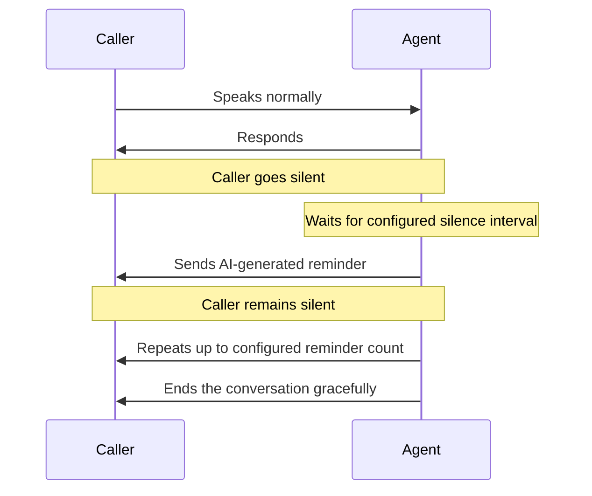

import { Screenshot } from "/snippets/screenshot.mdx";

**Access:** Open an agent and go to **Call Flow**, then scroll to **Inactivity & Timeout**.

## How Inactivity Settings Work

Inactivity settings help your agent handle silence and keep calls within a safe maximum duration. They work with [VAD and turn detection](/build/advanced/vad-turn-detection): VAD decides when the caller has stopped speaking, while inactivity settings decide what to do if the conversation stays quiet.

<Screenshot
  lightSrc="/images/inactivity__inactivity-light.png"
  darkSrc="/images/inactivity__inactivity-dark.png"
  alt="Call Flow tab showing Response Timing, Max Call Duration, Silence Reminders, Allow AI to hang up, and Keypad Input settings"
/>

<Note>
These settings apply to voice conversations, including phone calls and web calls. The current dashboard exposes maximum call duration, silence reminders, and Expert-mode timing. Reminder wording is generated automatically by the runtime.
</Note>

## Visible Controls

<AccordionGroup>
  <Accordion title="Max Call Duration" icon="hourglass">
    Set the maximum length of the call from start to finish.

    The dashboard range is **1-120 minutes**. The backend stores the value in seconds, and the runtime can shorten the effective limit if usage metadata sets a lower maximum duration for the session.
  </Accordion>

  <Accordion title="Silence Reminders" icon="bell">
    Turn on follow-up behavior when the caller goes silent.

    When enabled, the runtime monitors silence and asks the caller if they are still there before ending an apparently abandoned conversation.
  </Accordion>

  <Accordion title="Timing" icon="clock">
    Expert mode exposes the reminder cadence:

    - **After:** seconds of silence before the first reminder, from **5-120 seconds**
    - **Up to:** number of reminders before ending, from **1-10**

    These controls appear only when **Silence Reminders** is enabled.
  </Accordion>
</AccordionGroup>

## Runtime Behavior

```mermaid
sequenceDiagram
    participant Caller
    participant Agent
    Caller->>Agent: Speaks normally
    Agent->>Caller: Responds
    Note over Caller,Agent: Caller goes silent
    Note over Agent: Waits for configured silence interval
    Agent->>Caller: Sends AI-generated reminder
    Note over Caller,Agent: Caller remains silent
    Agent->>Caller: Repeats up to configured reminder count
    Agent->>Caller: Ends the conversation gracefully
```

## Recommended Starting Points

| Scenario | Max Call Duration | Silence Reminder Timing |
| --- | --- | --- |
| Customer support | 30-60 minutes | After 10-20 seconds, up to 3 reminders |
| Appointment booking | 30-60 minutes | After 15-30 seconds, up to 4 reminders |
| Short outbound qualification | 10-20 minutes | After 8-15 seconds, up to 2 reminders |
| Complex consultative calls | 60-120 minutes | After 20-45 seconds, up to 4 reminders |

<Tip>
Use longer reminder timing when callers often need to look up account numbers, calendars, or documents. Use shorter timing for quick outbound calls where silence usually means the call has been abandoned.
</Tip>

## What Is Not Configurable In The Dashboard

The runtime generates reminder copy automatically. The current dashboard does not expose:

- custom reminder message rotation
- custom timeout end messages

If you need a specific spoken phrase, put that guidance in your agent [prompt](/build/conversation/prompt). For example: "When a caller goes silent after you ask for an account number, politely say you can wait while they find it."

## Troubleshooting

<AccordionGroup>
  <Accordion title="The agent sends reminders too frequently" icon="bell-ring">
    Increase the Expert-mode **After** value and review whether VAD is ending caller turns too aggressively.
  </Accordion>

  <Accordion title="The agent waits too long before sending a reminder" icon="hourglass-end">
    Reduce the **After** value or lower the number of reminders for quick flows where silence usually means the caller left.
  </Accordion>

  <Accordion title="Calls end too quickly" icon="clock-rotate-left">
    Increase **Max Call Duration** and the reminder count. Also check whether a usage-level max duration is shortening the runtime limit.
  </Accordion>

  <Accordion title="Calls run too long" icon="coins">
    Reduce **Max Call Duration**, lower the reminder count, and update your prompt to keep responses concise.
  </Accordion>
</AccordionGroup>

## Related Features

<CardGroup cols={2}>
  <Card title="VAD & Turn Detection" icon="microphone-lines" href="/build/advanced/vad-turn-detection">
    Configure turn-taking and interruption behavior
  </Card>
  <Card title="Transfer Tools" icon="phone-arrow-right" href="/build/tools/transfer-tools">
    Configure transfers and call end behavior
  </Card>
  <Card title="Greeting Messages" icon="hand-wave" href="/build/conversation/greeting-messages">
    Configure how conversations begin
  </Card>
  <Card title="Conversation Goals" icon="bullseye-arrow" href="/build/analytics/conversation-goals">
    Track conversation success and completion
  </Card>
</CardGroup>
