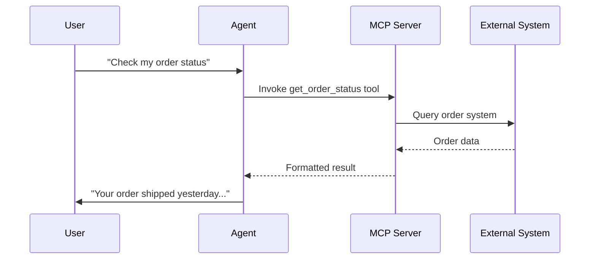

## Overview

Model Context Protocol (MCP) servers allow you to extend your AI agents with external tools and data sources. MCP provides a standardized way to connect AI models to external systems, databases, APIs, and services.

<Note>
MCP is an open standard developed to enable AI systems to securely access external context and capabilities. Learn more at [modelcontextprotocol.io](https://modelcontextprotocol.io).
</Note>

---

## How It Works

MCP servers expose **tools** that your AI agent can invoke during conversations:



1. User asks a question requiring external data
2. Agent determines which MCP tool to invoke
3. MCP server connects to the external system
4. Results return to the agent
5. Agent formulates a natural response

---

## Server Types

### Supported Servers

Choose from our curated catalog of pre-configured MCP servers:

| Server | Description | Tools Provided |
|--------|-------------|----------------|
| **CRM Integrations** | Connect to Salesforce, HubSpot, etc. | Contact lookup, deal updates |
| **Calendar** | Access scheduling systems | Availability check, booking |
| **Database** | Query your databases | Data retrieval, updates |
| **File Systems** | Access documents | File search, content retrieval |
| **Custom APIs** | Your own systems | Whatever you expose |

### Custom MCP Servers

Connect your own MCP server for full flexibility:

<Steps>
  <Step title="Deploy your MCP server">
    Host your MCP server at a publicly accessible URL
  </Step>
  <Step title="Configure the connection">
    Add the server URL and authentication to itellicoAI
  </Step>
  <Step title="Discover tools">
    itellicoAI automatically discovers available tools
  </Step>
  <Step title="Enable tools">
    Select which tools your agent can use
  </Step>
</Steps>

---

## Configuration

Navigate to **Actions > MCP Servers** in your agent configuration.

### Adding a Supported Server

1. Click **Add MCP Server**
2. Browse the server catalog
3. Select a server type
4. Configure required parameters (API keys, etc.)
5. Save and test the connection

### Adding a Custom Server

1. Click **Add MCP Server**
2. Select **Custom Server**
3. Enter the server URL
4. Configure authentication:

| Setting | Description |
|---------|-------------|
| **Server URL** | HTTPS endpoint of your MCP server |
| **Custom Headers** | Authentication headers (API keys, tokens) |
| **Query Parameters** | Optional URL parameters |
| **Timeout** | Request timeout in seconds (default: 30) |

4. Click **Discover Tools** to fetch available tools
5. Select which tools to enable
6. Save the configuration

### Tool Management

After connecting a server, manage individual tools:

- **Enable/Disable:** Control which tools the agent can access
- **View Schema:** See tool parameters and return types
- **Test:** Execute tools manually to verify they work

---

## Authentication

### Headers-Based Auth

Most common for API keys and bearer tokens:

```json
{
  "Authorization": "Bearer your-api-key",
  "X-API-Key": "your-key"
}
```

### Query Parameter Auth

For servers requiring URL-based authentication:

```json
{
  "api_key": "your-key",
  "client_id": "your-client-id"
}
```

<Warning>
Store credentials securely. Never expose API keys in client-side code or public repositories.
</Warning>

---

## Use Cases

<CardGroup cols={2}>
  <Card title="CRM Integration" icon="users">
    Look up customer records, update contacts, log activities
  </Card>
  <Card title="Order Management" icon="box">
    Check order status, process returns, update shipping
  </Card>
  <Card title="Inventory Lookup" icon="warehouse">
    Check stock levels, find alternatives, reserve items
  </Card>
  <Card title="Appointment Scheduling" icon="calendar">
    Check availability, book meetings, send confirmations
  </Card>
  <Card title="Knowledge Systems" icon="book">
    Search documentation, retrieve articles, find answers
  </Card>
  <Card title="Custom Business Logic" icon="code">
    Any system you can expose via MCP
  </Card>
</CardGroup>

---

## Building Custom Servers

### MCP Server Requirements

Your MCP server must:

1. **Expose an HTTPS endpoint:** Secure connections required
2. **Implement MCP protocol:** Standard tool discovery and invocation
3. **Return structured responses:** JSON-formatted tool results
4. **Handle errors gracefully:** Return meaningful error messages

### Example Server Structure

```python
# Simplified MCP server example
from mcp import Server

server = Server("my-custom-server")

@server.tool("get_customer")
async def get_customer(customer_id: str) -> dict:
    """Look up customer information by ID"""
    customer = await database.get_customer(customer_id)
    return {
        "name": customer.name,
        "email": customer.email,
        "status": customer.status
    }

@server.tool("update_status")
async def update_status(customer_id: str, status: str) -> dict:
    """Update customer status"""
    await database.update_customer(customer_id, status=status)
    return {"success": True, "new_status": status}
```

<Note>
For detailed MCP server development guidance, see the [MCP documentation](https://modelcontextprotocol.io).
</Note>

---

## Best Practices

**Start with supported servers:** Use pre-built integrations before building custom servers.

**Limit tool scope:** Only enable tools your agent actually needs. Fewer tools = better tool selection by the AI.

**Write clear descriptions:** Tool descriptions help the AI decide when to use each tool.

**Handle failures gracefully:** MCP tools should return helpful error messages the agent can communicate to users.

**Monitor usage:** Track which tools are being called and their success rates.

**Test thoroughly:** Verify tools work correctly before deploying to production.

---

## Troubleshooting

<AccordionGroup>
  <Accordion title="Connection failed" icon="plug">
    - Verify the server URL is correct and accessible
    - Check that HTTPS is properly configured
    - Ensure authentication credentials are valid
    - Test the endpoint directly with curl or Postman
  </Accordion>

  <Accordion title="Tool discovery empty" icon="magnifying-glass">
    - Confirm your server implements MCP tool discovery
    - Check server logs for errors
    - Verify the server is responding to requests
  </Accordion>

  <Accordion title="Tools not being called" icon="phone-slash">
    - Review tool descriptions—are they clear?
    - Check agent instructions—does it know when to use tools?
    - Test manually to ensure tools are enabled
  </Accordion>

  <Accordion title="Slow tool responses" icon="clock">
    - Increase timeout settings if needed
    - Optimize your MCP server performance
    - Consider caching frequently accessed data
  </Accordion>
</AccordionGroup>

---

## Security Considerations

<Warning>
MCP servers have access to external systems. Follow security best practices:

- Use least-privilege access for API credentials
- Regularly rotate authentication keys
- Monitor for unusual activity patterns
- Audit tool usage logs
</Warning>

**Network Security:**
- All connections must use HTTPS
- Consider IP allowlisting for your MCP servers
- Use strong authentication methods

**Data Security:**
- Only expose data the agent needs
- Implement proper access controls
- Log all tool invocations for audit

---

## Next Steps

<CardGroup cols={2}>
  <Card title="Custom API Actions" icon="code" href="/build/actions/custom-api-actions">
    Simpler HTTP integrations without MCP
  </Card>
  <Card title="Actions Overview" icon="bolt" href="/build/actions/overview">
    Explore all action types
  </Card>
  <Card title="Web Search" icon="magnifying-glass" href="/build/actions/web-search">
    Built-in web search action
  </Card>
  <Card title="Test Your Agent" icon="vial" href="/test/web-simulator">
    Test MCP tools in conversations
  </Card>
</CardGroup>
