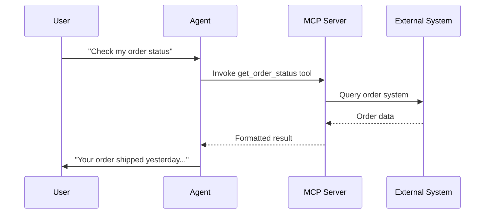

import { Screenshot } from "/snippets/screenshot.mdx";

## What MCP Servers Do

<Badge>Expert Mode</Badge>

Model Context Protocol (MCP) servers let you extend your AI agents with external tools and data sources using an open standard. Add MCP servers from the agent editor, configure authentication, and manage which discovered tools the agent can use from the **Tools** tab in **Expert Mode**.

<Note>
MCP is an open standard for connecting AI models to external systems. Learn more at [modelcontextprotocol.io](https://modelcontextprotocol.io).
</Note>

## How It Works

MCP servers expose **tools** that your AI agent can invoke during conversations:

1. You connect an MCP server by URL
2. itellicoAI automatically discovers the tools the server provides
3. You enable the tools you want your agent to use
4. During conversations, the agent calls tools as needed to answer questions or perform actions


```mermaid
sequenceDiagram
    participant User
    participant Agent
    participant MCP as MCP Server
    participant External as External System

    User->>Agent: "Check my order status"
    Agent->>MCP: Invoke get_order_status tool
    MCP->>External: Query order system
    External-->>MCP: Order data
    MCP-->>Agent: Formatted result
    Agent->>User: "Your order shipped yesterday..."
```

---

## Add an MCP Server

You add MCP servers directly from the **Tools** tab.

To add a server:

<Steps>
  <Step title="Switch to Expert Mode">
    If you are in Simple mode, switch to **Expert** mode first.
  </Step>
  <Step title="Open the MCP Server flow">
    Go to **Tools** in your agent editor, click **Add**, then choose **MCP Server**.
  </Step>
  <Step title="Configure the server">
    Add a **Name** and either a direct **URL** or a URL credential from **Secrets**.
  </Step>
  <Step title="Add credentials if needed">
    Use optional **Headers** and **Query Parameters** for authentication or server-specific options.
  </Step>
  <Step title="Save the server">
    Save the connection to attach it to the current agent.
  </Step>
</Steps>

---

## Manage Tools from the Server

Saving a server connection does not automatically expose every discovered tool to the agent. You choose which tools the agent can access.

<Screenshot
  lightSrc="/images/advanced__mcp-config-light.png"
  darkSrc="/images/advanced__mcp-config-dark.png"
  alt="MCP server configuration panel showing URL field, secret-backed credentials, headers, query parameters, and discovered tool selection"
/>

<Steps>
  <Step title="Open Manage tools">
    From the MCP server row in **Tools**, open **Manage tools**.
  </Step>
  <Step title="Refresh discovery if needed">
    Tools are discovered automatically. Use **Refresh** to rerun discovery after server changes.
  </Step>
  <Step title="Select tools">
    Choose one or more discovered tools, or use **Select all** when the server is intentionally narrow.
  </Step>
  <Step title="Save access">
    Save to update the explicit allow list for the current agent.
  </Step>
</Steps>

<Note>
Existing MCP server rows are visible in Simple mode, but adding or editing requires Expert mode.
</Note>

---

## Configuring Custom Headers and Query Parameters

### Custom Headers

Use headers for API key or bearer token authentication:

```json
{
  "Authorization": "Bearer your-api-key",
  "X-API-Key": "your-key"
}
```

Add headers as key-value pairs in the configuration panel.

### Query Parameters

For servers requiring URL-based authentication:

```json
{
  "api_key": "your-key",
  "client_id": "your-client-id"
}
```

<Warning>
Store credentials securely. Never expose API keys in client-side code or public repositories.
</Warning>

---

## Automatic Tool Discovery

When you open **Manage tools** for an MCP server, itellicoAI queries the server and retrieves:

- **Tool names** - Identifier used to invoke the tool
- **Descriptions** - What the tool does (shown to the AI for decision-making)
- **Parameter schemas** - Input parameters with types and descriptions
- **Return types** - Expected response format

Tool discovery runs automatically when you open the tool settings and can be re-run with **Refresh** to pick up newly added tools.

---

## Enabling and Disabling Individual Tools

After discovery, you decide which individual server tools to enable for the current agent. This keeps tool access narrow and easier for the model to use well.

**Best practices for tool management:**

- **Enable only what you need.** Fewer tools means the AI makes better tool selection decisions.
- **Write clear descriptions.** If a tool description from the server is unclear, the AI may not know when to use it.
- **Disable destructive tools** (delete, update) unless your use case specifically requires them.
- **Re-run discovery** periodically if the server adds new tools.

---

## Latency Expectations

The current MCP flow does not expose timeout controls in the UI. Treat low-latency responses as part of MCP server design.

**Best practices:**
- Keep tool responses fast enough for live conversations
- Cache expensive lookups where possible
- Avoid long-running workflows in synchronous MCP tools
- Test from realistic network conditions before going live

---

## Testing MCP Servers

Before deploying to production, test your MCP server connection and tools.

<Steps>
  <Step title="Verify connection">
    After adding the server, confirm that **Manage tools** shows discovered tools for the server.
  </Step>
  <Step title="Test in conversation">
    Start **Test Agent** and run a **Web call**, **Phone call**, or **Chat** session that should trigger the MCP tool.
  </Step>
  <Step title="Test error scenarios">
    Verify the agent handles tool failures gracefully -- for example, when the MCP server is unreachable or returns an error.
  </Step>
</Steps>

---

## Building Custom MCP Servers

Your MCP server must:

1. **Expose an HTTPS endpoint** - Secure connections are required
2. **Implement MCP protocol** - Standard tool discovery and invocation
3. **Return structured responses** - JSON-formatted tool results
4. **Handle errors gracefully** - Return meaningful error messages

### Example Server

```python
from mcp import Server

server = Server("my-custom-server")

@server.tool("get_customer")
async def get_customer(customer_id: str) -> dict:
    """Look up customer information by ID"""
    customer = await database.get_customer(customer_id)
    return {
        "name": customer.name,
        "email": customer.email,
        "status": customer.status
    }
```

<Note>
For detailed MCP server development guidance, see the [MCP documentation](https://modelcontextprotocol.io).
</Note>

---

## Troubleshooting

<AccordionGroup>
  <Accordion title="Connection failed" icon="plug">
    - Verify the server URL is correct and accessible
    - Check that HTTPS is properly configured
    - Ensure authentication credentials are valid
    - Test the endpoint directly with cURL or Postman
  </Accordion>

  <Accordion title="Tool discovery returns no tools" icon="magnifying-glass">
    - Confirm your server implements MCP tool discovery
    - Check server logs for errors
    - Verify the server is responding to requests
    - Re-run discovery after fixing server issues
  </Accordion>

  <Accordion title="Tools not being called by agent" icon="phone-slash">
    - Review tool descriptions -- are they clear enough for the AI?
    - Check agent [prompt](/build/conversation/prompt) -- does the agent know when to use tools?
    - Verify tools are enabled (not disabled)
    - Reduce the total number of enabled tools if the AI is selecting poorly
  </Accordion>

  <Accordion title="Slow tool responses" icon="clock">
    - Optimize your MCP server performance
    - Consider caching frequently accessed data
    - Check network latency between itellicoAI and your server
  </Accordion>
</AccordionGroup>

---

## Security Considerations

<Warning>
MCP servers have access to external systems. Follow security best practices:

- Use least-privilege access for API credentials
- Regularly rotate authentication keys
- Monitor tool invocation logs for unusual activity
- Audit which tools are enabled on each agent
</Warning>

**Network Security:**
- All connections must use HTTPS
- Consider IP allowlisting for your MCP servers
- Use strong authentication methods

**Data Security:**
- Only expose data the agent needs
- Implement proper access controls on the server side
- Log all tool invocations for audit purposes

---

## Next Steps

<CardGroup cols={2}>
  <Card title="Custom Action" icon="code" href="/build/tools/custom-api-actions">
    Use simpler HTTP integrations without MCP
  </Card>
  <Card title="Tools Overview" icon="bolt" href="/build/tools/overview">
    Explore all tool types
  </Card>
  <Card title="Web Search" icon="magnifying-glass" href="/build/tools/web-search">
    Use the built-in web search tool
  </Card>
  <Card title="Test Your Agent" icon="vial" href="/test/web-simulator">
    Test MCP tools in conversations
  </Card>
</CardGroup>
