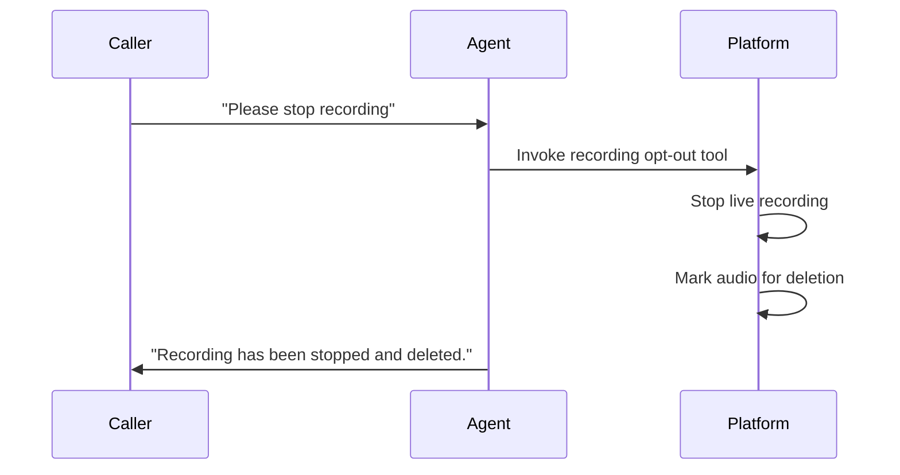

## How Recording Opt-Out Works

Recording Opt-Out enables callers to request that their call recording be stopped and deleted during the conversation. This Alpha feature helps with General Data Protection Regulation (GDPR) compliance and demonstrates respect for caller privacy.

<Note>
When enabled, this feature adds a tool your AI agent can invoke when a caller expresses they don't want to be recorded.
</Note>

---

## How It Works

When a caller says something like "I don't want to be recorded" or "Please stop recording":



1. **Agent recognizes the request:** The AI understands the opt-out request
2. **Tool invoked:** The agent triggers the recording opt-out action
3. **Recording stops:** Live recording stops immediately
4. **Data deleted:** The platform deletes any recorded audio for this call
5. **Caller confirmed:** Agent confirms the action to the caller

---

## Configuration

Navigate to your agent editor → **Privacy** tab → **Caller Rights** section.

### Enable Recording Opt-Out

Toggle the feature on or off:

- **Enabled:** Callers can request to stop and delete recording
- **Disabled:** Opt-out requests are not available (default)

---

## Caller Triggers

The agent will recognize opt-out requests phrased in various ways:

**English:**
- "Stop recording this call"
- "I don't want to be recorded"
- "Please don't record me"
- "Turn off the recording"
- "Delete this recording"

**German:**
- "Bitte nicht aufnehmen"
- "Aufnahme stoppen"
- "Ich möchte nicht aufgenommen werden"

The agent uses natural language understanding to recognize intent, not just exact phrases.

---

## Use Cases

<CardGroup cols={2}>
  <Card title="GDPR Compliance" icon="shield-check">
    Meet European data protection requirements for consent withdrawal
  </Card>
  <Card title="Sensitive Conversations" icon="lock">
    Allow callers to discuss sensitive topics without recording
  </Card>
  <Card title="Customer Trust" icon="handshake">
    Demonstrate commitment to caller privacy and data rights
  </Card>
  <Card title="Legal Requirements" icon="scale-balanced">
    Comply with two-party consent laws in certain jurisdictions
  </Card>
</CardGroup>

---

## What Happens When Opt-Out is Triggered

| Component | Action |
|-----------|--------|
| Live recording | Stopped immediately |
| Recorded audio | Marked for deletion and not persisted when the recording upload completes |
| Transcript | Controlled separately by Data Retention settings |
| Call metadata | Retained (call happened, duration, etc.) |
| Analytics | Basic call stats retained |

<Warning>
Once the platform deletes the recording, it cannot be recovered. Ensure your team understands this is a permanent action.
</Warning>

---

## Best Practices

**Combine with announcements:** If you record calls, inform callers at the start with a Privacy Announcement. Mention the opt-out option:

```text
This call may be recorded for quality purposes. If you prefer not to be
recorded, please let me know at any time.
```

**Train your agent:** Add guidance to your prompt to acknowledge opt-out requests professionally:

```text
When a caller requests to stop recording:
- Acknowledge the request immediately
- Confirm the recording has been stopped and deleted
- Reassure them the conversation can continue
- Do not pressure them to continue recording
```

**Document your policy:** Have a clear internal policy about what happens when callers opt out and how this affects quality assurance processes.

---

## GDPR Considerations

Under GDPR, individuals have the right to:

<Steps>
  <Step title="Be informed">
    Know that recording is taking place (use announcements)
  </Step>
  <Step title="Give consent">
    Agree to being recorded before it happens
  </Step>
  <Step title="Withdraw consent">
    Change their mind and request recording to stop
  </Step>
  <Step title="Request deletion">
    Have recorded data removed (right to erasure)
  </Step>
</Steps>

Recording Opt-Out addresses the last two rights—allowing callers to withdraw consent and request deletion during the call.

<Warning>
This is general guidance, not legal advice. Consult with a legal professional to ensure your recording practices meet your specific regulatory requirements.
</Warning>

---

## Limitations

- **Only affects current call:** Cannot delete recordings from previous calls
- **Immediate effect:** Once triggered, recording deletion cannot be undone during the same call
- **Metadata retained:** Basic call information (that a call occurred) is retained
- **Audio-focused:** Transcript and analytics storage follow your Data Retention settings

---

## Next Steps

<CardGroup cols={2}>
  <Card title="Privacy Announcements" icon="shield-check" href="/build/advanced/announcements">
    Inform callers about recording at the start
  </Card>
  <Card title="Production Checklist" icon="rocket" href="/launch/production-checklist">
    Deploy with proper compliance measures
  </Card>
  <Card title="Trust Center" icon="building-shield" href="/manage/trust-center/overview">
    Show your privacy practices publicly
  </Card>
  <Card title="Test Your Agent" icon="vial" href="/test/web-simulator">
    Test opt-out in the simulator
  </Card>
</CardGroup>
