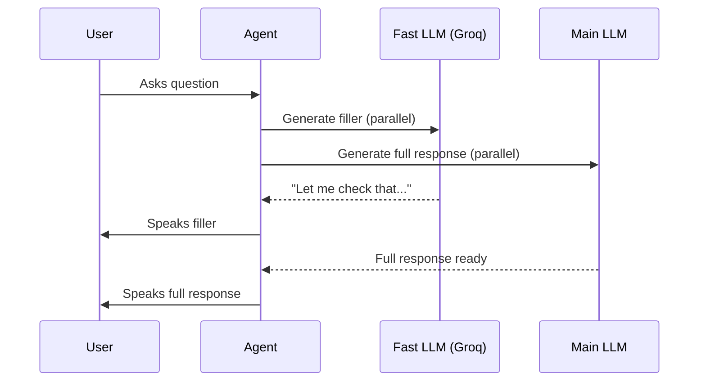

## Overview

Smart Filler reduces perceived latency by generating contextual filler responses while your main AI model processes the full answer. Instead of silence during processing, your agent says something like "Let me check that for you..." before delivering the complete response.

<Note>
Smart Filler uses a fast model (Groq) to generate contextual fillers in parallel with your main LLM, reducing perceived latency by approximately 500ms.
</Note>

---

## How It Works



1. User asks a question
2. Smart Filler immediately generates a contextual filler phrase using a fast model
3. The filler plays while your main LLM processes the full response
4. The complete response follows seamlessly

---

## Configuration

Navigate to your agent's **Advanced Settings** section to configure Smart Filler.

### Enable Smart Filler

Toggle Smart Filler on or off. When disabled, the agent waits silently until the full response is ready.

### Custom Filler Prompt

Customize how your agent generates filler responses with a custom prompt.

**Default behavior:** The agent generates appropriate acknowledgments like:
- "Let me check that for you..."
- "One moment while I look into that..."
- "Good question, let me find out..."

**Custom prompt examples:**

<AccordionGroup>
  <Accordion title="Austrian German style" icon="flag">
    ```text
    Use Austrian German expressions like "Passt" or "Jo eh"
    for casual acknowledgments.
    ```
  </Accordion>

  <Accordion title="Formal business style" icon="briefcase">
    ```text
    Use formal business language. Never use casual phrases.
    Example: "I'll look into that right away" not "Let me check".
    ```
  </Accordion>

  <Accordion title="Friendly customer service" icon="face-smile">
    ```text
    Be warm and friendly. Use phrases like "Great question!"
    and "I'd be happy to help with that!"
    ```
  </Accordion>

  <Accordion title="Multilingual" icon="language">
    ```text
    Match the language the customer is speaking. If they speak
    German, respond in German. If Spanish, respond in Spanish.
    ```
  </Accordion>
</AccordionGroup>

<Warning>
Custom filler prompts are limited to 2000 characters. Keep instructions concise and focused.
</Warning>

---

## Use Cases

<CardGroup cols={2}>
  <Card title="High-latency responses" icon="clock">
    When using advanced models like GPT-4 that have longer response times
  </Card>
  <Card title="Complex queries" icon="brain">
    Questions requiring tool calls, database lookups, or multi-step reasoning
  </Card>
  <Card title="Knowledge base searches" icon="magnifying-glass">
    When RAG retrieval adds processing time
  </Card>
  <Card title="API integrations" icon="plug">
    External API calls that add latency to responses
  </Card>
</CardGroup>

---

## Best Practices

**Match your brand voice:** Use the custom prompt to ensure fillers match your agent's personality and brand guidelines.

**Keep it natural:** The best fillers sound like natural human acknowledgments, not robotic placeholders.

**Consider context:** Different situations call for different filler styles. Sales calls might use energetic fillers while support calls might use reassuring ones.

**Test extensively:** Make test calls to ensure fillers feel natural in real conversations and don't create awkward pauses or repetition.

---

## Performance Impact

| Metric | Without Smart Filler | With Smart Filler |
|--------|---------------------|-------------------|
| Perceived latency | Full LLM processing time | ~500ms |
| User experience | Silent waiting | Natural conversation flow |
| Actual response time | Unchanged | Unchanged |

<Tip>
Smart Filler doesn't speed up your actual response time—it makes the wait feel shorter by providing immediate acknowledgment.
</Tip>

---

## Limitations

- **Additional cost:** Uses Groq API calls for filler generation
- **Not always appropriate:** Some contexts (legal disclaimers, critical information) may require silence rather than fillers
- **Language matching:** Works best when filler prompt matches conversation language

---

## Next Steps

<CardGroup cols={2}>
  <Card title="Thinking Sounds" icon="keyboard" href="/build/voice-speech/thinking-sounds">
    Add audio feedback while processing
  </Card>
  <Card title="Inactivity Settings" icon="hourglass" href="/build/advanced/inactivity-timeout-settings">
    Handle conversation pauses
  </Card>
  <Card title="Voice Settings" icon="sliders" href="/build/voice-speech/voice-settings">
    Fine-tune voice parameters
  </Card>
  <Card title="Test Your Agent" icon="vial" href="/test/web-simulator">
    Test Smart Filler in the simulator
  </Card>
</CardGroup>
