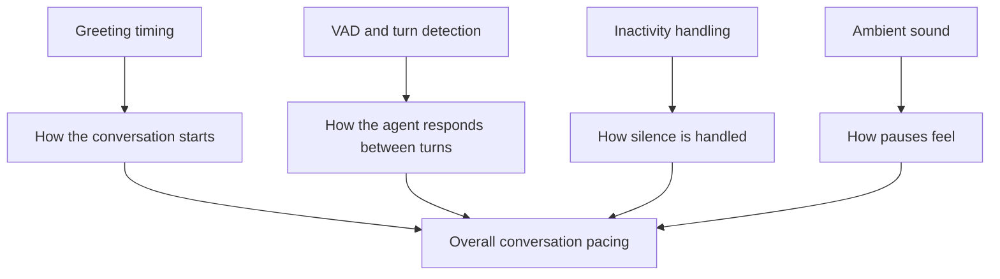

Natural voice experiences depend on timing.

If the agent speaks too quickly, customers feel interrupted. If it waits too long, the call feels uncertain or slow.

This page explains the main controls that shape timing and turn-taking.

<Tip>
Timing is only one layer of the caller experience. If the conversation still feels wrong after timing changes, step back and review the full [AI Pipeline Guide](/build/voice-speech/ai-pipeline-guide).
</Tip>

## The Four Controls

| Control | What it affects | Main doc |
| --- | --- | --- |
| **Greeting timing** | When the first message starts and whether callers can interrupt it | [Greeting Messages](/build/conversation/greeting-messages) |
| **VAD / turn detection** | When the platform decides the caller has finished speaking | [VAD & Turn Detection](/build/advanced/vad-turn-detection) |
| **Inactivity handling** | What happens when nobody speaks for a while | [Inactivity Timeout Settings](/build/advanced/inactivity-timeout-settings) |
| **Ambient sound** | How pauses feel between spoken turns | [Ambient Sound](/build/voice-speech/ambient-sound) |

## 1. Greeting Timing

The first few seconds set the tone for the whole call.

Use greeting timing to control:

- how long the agent waits before speaking
- whether the caller can interrupt the opening line
- whether inbound and outbound greetings behave differently

### Recommended starting point

- short initial delay
- non-interruptible greeting for most inbound use cases
- outbound-specific override only when proactive calls need a different opening

## 2. VAD And Turn Detection

VAD decides when the caller has stopped speaking and the agent should respond.

This strongly affects:

- perceived responsiveness
- interruption behavior
- whether the agent cuts people off
- whether the agent waits too long after short pauses

### When to tighten it

- the agent waits too long after obvious answers
- callers say the assistant feels slow

### When to loosen it

- the agent interrupts mid-thought
- callers pause naturally before finishing
- the call includes number sequences or careful explanations

## 3. Inactivity Handling

Inactivity settings control what happens when the call goes quiet.

Use them to define:

- how long the platform waits
- whether it should reprompt
- when it should end the conversation

This matters most for:

- outbound calls where the recipient does not answer clearly
- long pauses during support or booking flows
- calls where the customer may step away temporarily

## 4. Ambient Sound

Ambient sound does not change turn detection directly, but it changes how pauses feel.

Used carefully, it can make pauses feel:

- intentional
- less sterile
- more natural

Used badly, it can make the call feel:

- noisy
- distracting
- less professional

For regulated or clarity-critical use cases, less is usually better.

## How These Controls Work Together

## Symptoms And Likely Fixes

| Symptom | Most likely area to review |
| --- | --- |
| Agent starts talking too soon | Greeting delay or VAD sensitivity |
| Agent cuts callers off | VAD / turn detection |
| Agent feels slow after short answers | VAD / pause timing |
| Calls feel awkward during silence | Inactivity settings |
| Pauses feel sterile or abrupt | Ambient sound and overall pacing |

## How Model And Transcriber Choices Affect Timing

One settings panel does not control all timing.

Your experience also depends on:

- the speech model and voice choice
- transcriber behavior
- how much work the agent is doing during the turn
- whether tools or knowledge retrieval add extra latency

If a conversation feels slow, do not only change one timing slider. Also check:

- [Choose AI Model](/build/voice-speech/choose-ai-model)
- [Transcriber](/build/voice-speech/transcriber)
- [Knowledge issues](/troubleshooting/knowledge-issues)
- [Tool and integration issues](/troubleshooting/tools-integrations)

## A Practical Tuning Loop

1. Start with default timing.
2. Run a short [Web Simulator](/test/web-simulator) test.
3. Run at least one real [Phone Test](/test/phone-testing).
4. Listen for interruptions, long pauses, and awkward silence.
5. Change one timing variable at a time.
6. Test again with the same scenario.

## Common Mistakes

<AccordionGroup>
  <Accordion title="Changing too many timing settings at once" icon="sliders">
    If you change greeting delay, VAD, inactivity, and ambient sound together, it becomes hard to know what actually improved or broke the experience.
  </Accordion>

  <Accordion title="Using ambient sound to hide a latency problem" icon="music">
    Ambient sound can improve feel, but it does not fix slow tools, slow retrieval, or slow models.
  </Accordion>

  <Accordion title="Tuning only in browser tests" icon="laptop">
    Browser tests are useful, but phone calls expose timing issues more clearly, especially around greeting pace and interruption behavior.
  </Accordion>
</AccordionGroup>

## Next Steps

<CardGroup cols={2}>
  <Card title="Greeting Messages" icon="hand-wave" href="/build/conversation/greeting-messages">
    Configure the opening experience
  </Card>
  <Card title="VAD & Turn Detection" icon="ear-listen" href="/build/advanced/vad-turn-detection">
    Fine-tune how the platform detects completed speech
  </Card>
  <Card title="Inactivity Timeout Settings" icon="hourglass-half" href="/build/advanced/inactivity-timeout-settings">
    Decide what happens during silence
  </Card>
  <Card title="Ambient Sound" icon="volume" href="/build/voice-speech/ambient-sound">
    Adjust the feel of pauses and background atmosphere
  </Card>
</CardGroup>
