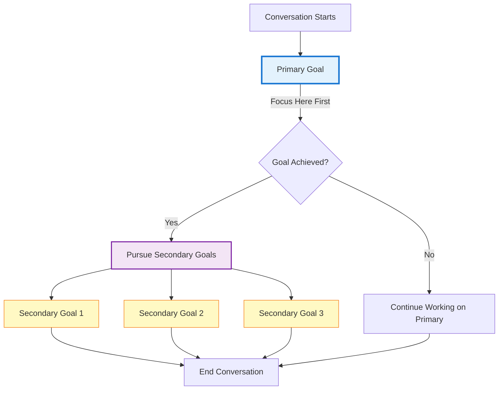

## Overview

Conversation goals define measurable objectives for your AI agent to achieve during calls. Track what your agent accomplishes, measure success rates, and optimize performance.

**Access:** Agent editor → **Analytics → Goals**

<CardGroup cols={3}>
  <Card title="Lead Qualification" icon="user-check">
    Identify qualified prospects
  </Card>
  <Card title="Appointment Booking" icon="calendar">
    Schedule meetings and demos
  </Card>
  <Card title="Information Collection" icon="clipboard-list">
    Gather customer data
  </Card>
  <Card title="Issue Resolution" icon="wrench">
    Solve customer problems
  </Card>
  <Card title="Sales Conversion" icon="hand-holding-dollar">
    Close deals and upsells
  </Card>
  <Card title="Callback Scheduling" icon="phone">
    Book follow-up calls
  </Card>
</CardGroup>

---

## Setup

<Steps>
  <Step title="Access Goals">
    Agent editor → **Analytics → Goals** → **Add Goal**
  </Step>

  <Step title="Choose goal type">
    **Primary Goal:** Your main objective (one required)
    - Choose the single most important outcome for this agent
    - Having one primary goal keeps conversations focused and prevents the agent from trying to accomplish too much
    - Example: "Book appointment"

    **Secondary Goals:** Optional objectives (multiple allowed)
    - Pursued opportunistically without compromising primary goal
    - Additional value captured when appropriate
    - Example: "Collect email address"
  </Step>

  <Step title="Configure goal">
    **Name:** Clear, concise label
    ```
    Example: "Schedule Follow-up Meeting"
    ```

    **Description:** What success looks like (AI uses this to evaluate)
    ```
    Example: "Successfully schedule a follow-up meeting by
    confirming date, time, and attendees"
    ```
  </Step>

  <Step title="Save">
    Goal is now tracked for all future conversations
  </Step>
</Steps>

---

## Primary vs Secondary Goals



<Tabs>
  <Tab title="Primary Goal">
    **One primary goal required.** Choose the single most important outcome.

    <Info>
    **Why only one?** Having one primary goal keeps the agent focused and prevents it from trying to accomplish too many things in one conversation. This leads to higher success rates and better customer experience.
    </Info>

    **Examples:**
    - 📅 Book appointment
    - ✅ Qualify lead
    - 🔧 Resolve issue
    - 💳 Collect payment information
    - 📞 Schedule callback

    **AI behavior:**
    - Focuses on achieving this goal first
    - Conversation success measured by primary goal achievement
    - Won't pursue conflicting objectives that could derail the main goal
  </Tab>

  <Tab title="Secondary Goals">
    **Optional. Multiple allowed.** Additional objectives pursued opportunistically.

    **Examples:**
    - 📧 Collect email address
    - ⭐ Gather feedback
    - 💰 Identify upsell opportunities
    - 📝 Update contact information
    - ✓ Confirm preferences

    **AI behavior:**
    - Pursues if primary goal achieved or customer willing
    - Doesn't compromise primary goal
    - Adds value without extending call unnecessarily
  </Tab>
</Tabs>

---

## Examples

<AccordionGroup>
  <Accordion title="Appointment Booking" icon="calendar">
    **Primary Goal:**
    - Name: "Book Appointment"
    - Description: "Schedule appointment by confirming date, time, service type, and contact information"

    **Secondary Goal:**
    - Name: "Collect Email"
    - Description: "Obtain customer email address for appointment reminders"
  </Accordion>

  <Accordion title="Lead Qualification" icon="user-check">
    **Primary Goal:**
    - Name: "Qualify Lead"
    - Description: "Determine if lead meets qualification criteria by gathering budget, timeline, decision-maker status, and pain points"

    **Secondary Goal:**
    - Name: "Schedule Demo"
    - Description: "Book product demo if lead is qualified"
  </Accordion>

  <Accordion title="Customer Support" icon="headset">
    **Primary Goal:**
    - Name: "Resolve Issue"
    - Description: "Address customer's problem and confirm resolution to their satisfaction"

    **Secondary Goal:**
    - Name: "Collect Feedback"
    - Description: "Ask for feedback rating and any suggestions for improvement"
  </Accordion>

  <Accordion title="Information Collection" icon="clipboard-list">
    **Primary Goal:**
    - Name: "Collect Requirements"
    - Description: "Gather complete project requirements including scope, budget, timeline, and decision process"

    **Secondary Goal:**
    - Name: "Identify Urgency"
    - Description: "Determine project urgency and ideal start date"
  </Accordion>
</AccordionGroup>

---

## Viewing Results

### Dashboard

View goal achievement across all conversations:

1. Go to **Analytics Dashboard**
2. See goal completion rates
3. Filter by date range, tags, or agent
4. Export data for reporting

[Learn more about Analytics Dashboard →](/optimize/analytics-dashboard)

### Individual Conversations

Check goal status for each call:

1. Go to **Conversations**
2. Click on a conversation
3. View **Goals** section
4. See which goals were achieved

---

## Best Practices

<AccordionGroup>
  <Accordion title="Write Clear Descriptions" icon="pencil">
    The AI uses your description to evaluate goal completion.

    ❌ Vague: "Get customer info"

    ✅ Clear: "Collect customer's full name, email address, phone number, and reason for inquiry"
  </Accordion>

  <Accordion title="Start with One Primary Goal" icon="target">
    Don't try to accomplish too much in one call.

    ✅ Focus: One clear primary objective

    ❌ Overload: Multiple competing primary goals
  </Accordion>

  <Accordion title="Use Secondary Goals Strategically" icon="list-check">
    Secondary goals should complement, not compete with, primary goal.

    ✅ Good pairing:
    - Primary: "Book appointment"
    - Secondary: "Collect email for reminders"

    ❌ Bad pairing:
    - Primary: "Resolve technical issue"
    - Secondary: "Sell premium support plan" (conflicts during troubleshooting)
  </Accordion>

  <Accordion title="Archive Outdated Goals" icon="archive">
    Don't delete old goals (preserves historical data). Archive them instead.

    **To archive:** Click archive icon next to goal
    **To restore:** Click "View Archived" → Restore
  </Accordion>
</AccordionGroup>

---

## Tips

- **Reference goals in instructions** - Mention goals in your agent instructions for better alignment
- **Review regularly** - Check goal achievement rates weekly to identify optimization opportunities
- **A/B test goals** - Try different goal definitions to see what works best
- **Combine with analysis** - Use [Post-Call Analysis](/build/analytics/post-call-analysis) for detailed quality scoring

---

## Troubleshooting

<AccordionGroup>
  <Accordion title="Goals not showing in conversations" icon="eye-slash">
    **Causes:**
    - Goals created after conversations took place
    - Goals archived or deleted

    **Solutions:**
    - Goals only apply to new conversations after creation
    - Check archived goals (click "View Archived")
  </Accordion>

  <Accordion title="Inaccurate goal evaluation" icon="triangle-exclamation">
    **Causes:**
    - Vague goal description
    - Description doesn't match actual success criteria

    **Solutions:**
    - Make description more specific and detailed
    - Provide clear success criteria
    - Test with a few calls and refine
  </Accordion>

  <Accordion title="Low achievement rates" icon="chart-line-down">
    **Causes:**
    - Goal too ambitious for conversation type
    - Agent instructions don't align with goal
    - Primary and secondary goals conflict

    **Solutions:**
    - Review if goal is realistic for your use case
    - Update agent instructions to focus on goal
    - Simplify or adjust goal definition
    - Consider making it a secondary goal instead
  </Accordion>
</AccordionGroup>

---

## Next Steps

<CardGroup cols={2}>
  <Card title="Post-Call Analysis" icon="magnifying-glass-chart" href="/build/analytics/post-call-analysis">
    Extract detailed insights
  </Card>
  <Card title="Post-Call Emails" icon="envelope-open-text" href="/build/analytics/post-call-automation">
    Trigger emails from goals
  </Card>
  <Card title="Analytics Dashboard" icon="chart-line" href="/optimize/analytics-dashboard">
    View performance metrics
  </Card>
  <Card title="Goal Tracking" icon="chart-mixed" href="/optimize/goal-tracking">
    Deep dive into goal data
  </Card>
</CardGroup>
