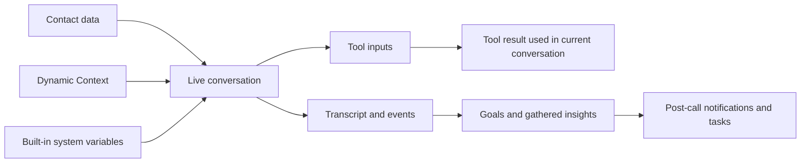

This page shows how values move through a conversation.

It answers three practical questions:

- What data is available before the call starts?
- What data can the agent collect or use during the call?
- What data only becomes available after the call ends?

## The Data Flow

## Stage 1: Data Available Before The Call

This data can be used in the greeting and prompt immediately.

### Contact data

If the caller matches a known contact, these values are available before the call starts.

Examples:

- `{{contact.first_name}}`
- `{{contact.email}}`
- `{{contact.phone_number}}`

### Dynamic Context

[Dynamic Context](/build/advanced/dynamic-context) lets you fetch JSON from your own systems before the conversation begins.

Examples:

- `{{account_tier}}`
- `{{open_tickets}}`
- `{{last_order_status}}`

### Built-in system values

These exist in every conversation.

Examples:

- `{{agent_uuid}}`
- `{{current_datetime}}`
- `{{direction}}`
- `{{timezone}}`

## Stage 2: Data Collected During The Call

During the conversation, the agent can gather details that were not known at the start.

Typical examples:

- order number
- preferred appointment date
- department choice
- issue description

This collected information is usually used in one of two ways:

- to continue the conversation more accurately
- to supply the inputs required by a tool

## Stage 3: Tool Inputs And Tool Results

Tools use the live conversation state.

That means the agent can combine:

- contact fields
- pre-call context
- built-in variables
- values collected from the caller

### What tools can do with that data

| Tool type | Typical input source | Typical outcome |
| --- | --- | --- |
| **Transfer** | Caller intent, department, urgency | Routes the conversation to another destination |
| **Booking** | Date, time, contact details | Creates or updates an appointment |
| **Custom Action** | Collected values plus context variables | Calls your external API and uses the response in the live conversation |
| **Web Search** | Current question | Returns external information for the current answer |

### Important limitation

Custom action results are part of the current conversation flow. They help the agent answer the caller or decide the next step.

Do **not** treat them as a general post-call variable store. For reusable values after the conversation ends, use [Gather Insights](/build/analytics/gather-insights) and [Post-Call Automation](/build/analytics/post-call-automation).

## Stage 4: Data Created After The Call

After the conversation ends, the platform can analyze the transcript and events.

This stage creates:

- goal results
- gathered insights
- `{{dyn_*}}` variables used in post-call notifications
- follow-up tasks and downstream automations

Examples:

- `{{dyn_issue_summary}}`
- `{{dyn_next_steps}}`
- `{{dyn_appointment_date}}`

These values are useful for:

- notification emails
- follow-up tasks
- reporting
- downstream systems connected through webhooks

They are **not** available to the agent during the finished call, because the analysis happens afterward.

## What Can Be Used Where

| Location | Contact data | Dynamic Context | Built-in system values | Live collected values | `{{dyn_*}}` post-call values |
| --- | --- | --- | --- | --- | --- |
| **Greeting** | Yes | Yes | Yes | No | No |
| **Prompt** | Yes | Yes | Yes | No direct template usage before collected | No |
| **Live tools** | Yes | Yes | Yes | Yes | No |
| **Notification templates** | Customer fields only | No | Conversation fields only | No direct live-call state | Yes |

<Note>
Notification templates do not reuse the live-call prompt context. Use post-call variables such as `{{customer_name}}`, `{{customer_email}}`, `{{customer_number}}`, `{{conversation_date}}`, `{{conversation_direction}}`, `{{conversation_url}}`, and `{{dyn_*}}`.
</Note>

## Recommended Pattern

Use the right data source for the right job:

- use **contacts** for stable customer profile data
- use **Dynamic Context** for fresh business-system context before the call
- use **tool inputs** for live actions during the call
- use **Gather Insights** for structured analysis after the call

That keeps your system predictable and easier to debug.

## Common Mistakes

<AccordionGroup>
  <Accordion title="Trying to do everything with one variable source" icon="triangle-exclamation">
    Use contact data, Dynamic Context, live tool inputs, and post-call insights for different jobs. They are not interchangeable.
  </Accordion>

  <Accordion title="Expecting Dynamic Context to refresh mid-call" icon="rotate-right">
    Dynamic Context runs before the conversation starts. If you need fresh information during the call, use a live tool such as a [Custom Action](/build/tools/custom-api-actions).
  </Accordion>

  <Accordion title="Using post-call variables in the live prompt" icon="hourglass-half">
    `{{dyn_*}}` values are created after the call ends. Use them in [Post-Call Automation](/build/analytics/post-call-automation), not in the greeting or prompt.
  </Accordion>
</AccordionGroup>

## Next Steps

<CardGroup cols={2}>
  <Card title="Variable Sources" icon="brackets-curly" href="/build/conversation/variable-sources">
    See each source individually
  </Card>
  <Card title="Dynamic Context" icon="database" href="/build/advanced/dynamic-context">
    Add pre-call context from your systems
  </Card>
  <Card title="Custom API Tools" icon="code" href="/build/tools/custom-api-actions">
    Use live data during the conversation
  </Card>
  <Card title="Post-Call Automation" icon="envelope-open-text" href="/build/analytics/post-call-automation">
    Turn post-call values into follow-up actions
  </Card>
</CardGroup>
