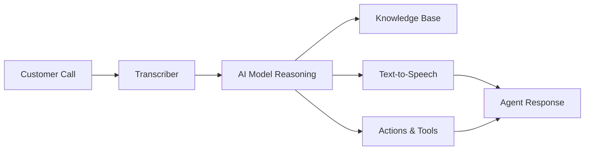

## What is an AI Voice Agent?

An AI voice agent is an intelligent virtual assistant that can handle voice conversations with your customers over phone and web. Unlike traditional IVR systems or chatbots, itellicoAI agents understand natural language, maintain context throughout conversations, and can take real actions like booking appointments, transferring calls, or updating your systems.

## Core Capabilities

Your itellicoAI agents can:

<CardGroup cols={2}>
  <Card title="Understand Natural Language" icon="brain">
    Comprehend customer intent, questions, and requests in natural conversation
  </Card>
  <Card title="Access Your Knowledge" icon="book">
    Reference your business information, policies, and documentation during calls
  </Card>
  <Card title="Take Actions" icon="bolt">
    Book appointments, transfer calls, update systems, and trigger workflows
  </Card>
  <Card title="Speak Naturally" icon="microphone">
    Respond with natural-sounding voices in multiple languages
  </Card>
</CardGroup>

## How AI Voice Agents Work

1. **Customer speaks** - Your customer asks a question or makes a request
2. **Transcriber** - The agent converts speech to text using advanced transcription
3. **AI reasoning** - The language model understands intent and formulates a response
4. **Knowledge retrieval** - Agent accesses your business knowledge when needed
5. **Action execution** - Agent can trigger bookings, transfers, or API calls
6. **Speech synthesis** - Response is converted to natural-sounding speech
7. **Agent responds** - Customer hears a helpful, contextual response

## Key Benefits

<CardGroup cols={2}>
  <Card title="24/7 Availability" icon="clock">
    Never sleep, always ready to help in any timezone
  </Card>

  <Card title="Consistent Quality" icon="star">
    Every interaction follows your guidelines and brand voice
  </Card>

  <Card title="Instant Scaling" icon="chart-line">
    Handle 1 call or 1,000 simultaneously without infrastructure changes
  </Card>

  <Card title="Cost Efficiency" icon="dollar-sign">
    Reduce costs while freeing human staff for complex issues
  </Card>

  <Card title="Rich Integration" icon="plug">
    Connect to CRMs, calendars, and business tools for real-time data access
  </Card>
</CardGroup>

## Common Use Cases

<AccordionGroup>
  <Accordion title="Customer Support" icon="headset">
    Answer FAQs, troubleshoot issues, and escalate complex cases to human agents
  </Accordion>

  <Accordion title="Appointment Booking" icon="calendar">
    Schedule, reschedule, and send automated confirmations and reminders
  </Accordion>

  <Accordion title="Lead Qualification" icon="user-plus">
    Engage prospects, gather information, and route qualified leads to sales
  </Accordion>

  <Accordion title="Order Status & Tracking" icon="box">
    Check order status and provide tracking updates
  </Accordion>

  <Accordion title="Payment & Billing" icon="credit-card">
    Answer billing questions, process payments, and send reminders
  </Accordion>

  <Accordion title="Feedback Collection" icon="comment">
    Conduct surveys and gather customer feedback at scale
  </Accordion>
</AccordionGroup>

## Next Steps

Ready to build your first agent? Continue with:

<CardGroup cols={2}>
  <Card title="Create Your First Agent" icon="plus" href="/build/getting-started/create-first-agent">
    Step-by-step guide to creating your first AI voice agent
  </Card>
  <Card title="Agent Types & Use Cases" icon="list" href="/build/getting-started/agent-use-cases">
    Understand different agent types and when to use each
  </Card>
</CardGroup>
