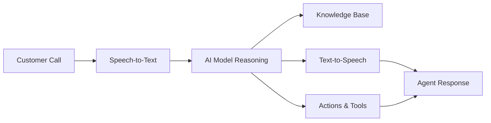

## What is an AI Voice Agent?

An AI voice agent is an intelligent virtual assistant that can handle voice conversations with your customers over phone and web. Unlike traditional IVR systems or chatbots, itellicoAI agents understand natural language, maintain context throughout conversations, and can take real actions like booking appointments, transferring calls, or updating your systems.

## Core Capabilities

Your itellicoAI agents can:

<CardGroup cols={2}>
  <Card title="Understand Natural Language" icon="brain">
    Comprehend customer intent, questions, and requests in natural conversation
  </Card>
  <Card title="Access Your Knowledge" icon="book">
    Reference your business information, policies, and documentation during calls
  </Card>
  <Card title="Take Actions" icon="bolt">
    Book appointments, transfer calls, update systems, and trigger workflows
  </Card>
  <Card title="Speak Naturally" icon="microphone">
    Respond with natural-sounding voices in multiple languages
  </Card>
</CardGroup>

## How AI Voice Agents Work

```mermaid
graph LR
    A[Customer Call] --> B[Speech-to-Text]
    B --> C[AI Model Reasoning]
    C --> D[Knowledge Base]
    C --> E[Actions & Tools]
    C --> F[Text-to-Speech]
    F --> G[Agent Response]
    E --> G
```

1. **Customer speaks** - Your customer asks a question or makes a request
2. **Speech-to-Text** - The agent converts speech to text using advanced transcription
3. **AI reasoning** - The language model understands intent and formulates a response
4. **Knowledge retrieval** - Agent accesses your business knowledge when needed
5. **Action execution** - Agent can trigger bookings, transfers, or API calls
6. **Speech synthesis** - Response is converted to natural-sounding speech
7. **Agent responds** - Customer hears a helpful, contextual response

## Key Benefits

### 24/7 Availability
Your agents never sleep, take breaks, or call in sick. They're ready to help customers at any time, in any timezone.

### Consistent Quality
Every interaction follows your guidelines and maintains your brand voice. No variation in quality between different representatives or shifts.

### Instant Scaling
Handle 1 call or 1,000 calls simultaneously. Your agents scale instantly without hiring, training, or infrastructure changes.

### Cost Efficiency
Reduce operational costs while improving customer experience. Agents handle routine inquiries, freeing human staff for complex issues.

### Rich Integration
Connect to your existing systems - CRMs, calendars, databases, and business tools. Agents access real-time data and update records automatically.

## Common Use Cases

<AccordionGroup>
  <Accordion title="Customer Support" icon="headset">
    Answer frequently asked questions, troubleshoot issues, provide account information, and escalate complex cases to human agents when needed.
  </Accordion>

  <Accordion title="Appointment Booking" icon="calendar">
    Schedule appointments, check availability, send confirmations, handle rescheduling, and send reminders automatically.
  </Accordion>

  <Accordion title="Lead Qualification" icon="user-plus">
    Engage prospects, ask qualifying questions, gather information, score leads, and route hot leads to sales teams.
  </Accordion>

  <Accordion title="Order Status & Tracking" icon="box">
    Check order status, provide tracking information, handle delivery questions, and update customers on shipment progress.
  </Accordion>

  <Accordion title="Payment & Billing" icon="credit-card">
    Answer billing questions, process payments, send payment reminders, and handle account inquiries.
  </Accordion>

  <Accordion title="Feedback Collection" icon="comment">
    Conduct surveys, gather customer feedback, measure satisfaction, and collect testimonials at scale.
  </Accordion>
</AccordionGroup>

## What Makes itellicoAI Different

### Advanced Prompt Engineering
Our platform gives you full control over agent behavior with sophisticated instruction systems and template variables.

### Flexible Knowledge Integration
Choose between Context mode (fast, direct injection) or RAG mode (retrieval-based) depending on your knowledge base size and needs.

### Professional Voice Options
Access premium voices from ElevenLabs, Azure, and other providers with full control over speed, tone, and pronunciation.

### Smart Call Handling
Advanced features like smart endpointing, voice activity detection, and interruption handling ensure natural conversations.

### Comprehensive Actions
Built-in integrations for transfers, bookings, and custom API calls let your agents take real business actions.

## Next Steps

Ready to build your first agent? Continue with:

<CardGroup cols={2}>
  <Card title="Create Your First Agent" icon="plus" href="/build/getting-started/create-first-agent">
    Step-by-step guide to creating your first AI voice agent
  </Card>
  <Card title="Agent Types & Use Cases" icon="list" href="/build/getting-started/agent-types">
    Understand different agent types and when to use each
  </Card>
</CardGroup>
