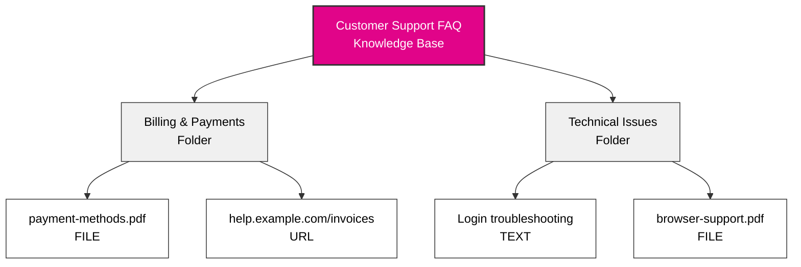
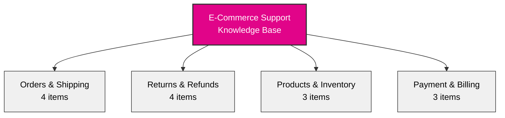

## Overview

Knowledge bases transform your AI agent from a generic assistant into a business expert. By organizing your company's information into a structured hierarchy, your agent can instantly access and reference policies, procedures, product details, and any other information your business relies on.

Think of knowledge bases as smart filing cabinets that your agent can search through in milliseconds during conversations.

## Knowledge Architecture

### The Three-Level Hierarchy

Knowledge in itellicoAI follows a simple, intuitive structure:

**Knowledge Base → Folders → Items**

Items can be **text**, **files** (PDF, Word, Markdown, CSV, JSON, YAML, XML, etc.), or **URLs** (single web page only - not entire websites).

This hierarchy makes it easy to organize large amounts of information while keeping it accessible and manageable.

---

## Dashboard Overview

### Main Knowledge Interface

Navigate to **Knowledge** in the left sidebar to access your knowledge management dashboard with an at-a-glance view of all your knowledge bases:

<CardGroup cols={1}>
  <Card title="Customer Support FAQ">
    - 127 items
    - Updated Today
  </Card>
  <Card title="Product Documentation">
    - 89 items
    - Updated Yesterday
  </Card>
  <Card title="Company Policies">
    - 45 items
    - Updated 3 days ago
  </Card>
</CardGroup>

Each knowledge base card shows:
- Total number of items across all folders
- Last updated timestamp
- Actions: Copy reference placeholder, Edit, Delete

---

## Understanding Each Level

### Knowledge Bases

<Card title="What is a Knowledge Base?" icon="database">
  A knowledge base is the top-level container that groups related information together. It represents a major category or domain of your business knowledge.
</Card>

**Think of knowledge bases as different filing cabinets in your office:**
- One cabinet for customer support materials
- Another for product documentation
- Another for company policies
- Another for sales resources

**Example knowledge bases:**
- **Customer Support FAQ** - All customer-facing support information
- **Product Documentation** - Technical docs, user guides, feature descriptions
- **Company Policies** - HR policies, compliance docs, internal procedures
- **Sales Resources** - Pricing sheets, competitor comparisons, pitch decks

### Folders

<Card title="What is a Folder?" icon="folder">
  Folders are organizational units within a knowledge base. They group related items together by topic, category, or purpose.
</Card>

**Think of folders within your filing cabinet:**
- They organize similar content together
- They make information easier to find and manage
- They allow you to assign specific topics to agents

**Example folders within a Customer Support knowledge base:**
- **Billing & Payments** - Invoice questions, payment methods, refunds
- **Technical Issues** - Troubleshooting guides, error messages, bug workarounds
- **Product Information** - Features, specifications, compatibility
- **Return Policies** - Return windows, conditions, process steps

<Tip>
Use clear, descriptive folder names. Your team and your AI will both benefit from intuitive organization.
</Tip>

### Knowledge Items

<Card title="What is a Knowledge Item?" icon="file">
  Knowledge items are the actual pieces of information - documents, FAQs, policies, procedures, or any content you want your agent to know.
</Card>

**Knowledge items can be:**
- **Text entries** - Directly written content
- **File uploads** - PDF, Word (.doc, .docx), Text (.txt, .log), Markdown (.md), CSV/TSV, JSON, YAML, XML (up to 10MB)
- **URL scrapes** - Content from a single web page (not entire websites)

**Example knowledge items:**
- "Refund Policy for Digital Products"
- "How to Reset Password - Step by Step"
- "Product Specifications - Model X200"
- "Shipping Times by Region"

Each knowledge item includes:
- **Title** - Descriptive name for the content
- **Content/Source** - The actual information (text, file, or URL)
- **Content Processing Status** - Extraction state (Pending, Processing, Completed, Failed)
- **Vector Indexing Status** - RAG preparation state (Pending, Indexing, Indexed, Failed)
- **Metadata** - Creation date, last update, content size, token count

---

## When to Use Knowledge Bases

<AccordionGroup>
  <Accordion title="Your agent needs to answer specific questions" icon="circle-question">
    If customers regularly ask about policies, procedures, or product details, add that information to a knowledge base. Your agent will reference it accurately every time.

    **Example:** Customer asks "What's your return policy?" Agent retrieves the exact policy from your knowledge base and explains it naturally.
  </Accordion>

  <Accordion title="You have detailed documentation" icon="book">
    If you have existing documentation - user manuals, FAQs, policy documents - you can upload them directly in various formats (PDF, DOC, DOCX, TXT). Your agent will be able to search and reference them in conversations.

    **Example:** Upload your 50-page product manual. When customers have technical questions, your agent finds and explains the relevant sections.
  </Accordion>

  <Accordion title="Information changes frequently" icon="arrows-rotate">
    Knowledge bases make it easy to update information without changing your agent's core instructions. Update a price sheet or policy document, and your agent instantly has the new information.

    **Example:** You update your pricing document once, and all agents using that knowledge base immediately reference the new prices.
  </Accordion>

  <Accordion title="Multiple agents need the same information" icon="users">
    Create one knowledge base and share it across multiple agents. Maintain information in one place, use it everywhere.

    **Example:** Your "Product Specifications" knowledge base can be used by your sales agent, support agent, and pre-sales qualification agent.
  </Accordion>

  <Accordion title="You want to separate concerns" icon="layer-group">
    Keep your agent's conversational instructions separate from factual information. Instructions define personality and behavior; knowledge bases provide facts and details.

    **Example:** Your agent instructions say "be friendly and professional." Your knowledge base contains the actual product specs, pricing, and policies.
  </Accordion>
</AccordionGroup>

---

## Organization Best Practices

### Start with Clear Categories

<CardGroup cols={2}>
  <Card title="By Department" icon="building">
    - Sales Knowledge
    - Support Knowledge
    - Billing Knowledge
    - Technical Documentation
  </Card>
  <Card title="By Topic" icon="tags">
    - Product Information
    - Policies & Procedures
    - Troubleshooting
    - FAQs
  </Card>
  <Card title="By Customer Journey" icon="map">
    - Pre-Sales Information
    - Onboarding Guides
    - Usage & Features
    - Support & Troubleshooting
  </Card>
  <Card title="By Audience" icon="user-group">
    - Customer-Facing Info
    - Internal Procedures
    - Partner Resources
    - Technical Specs
  </Card>
</CardGroup>

### Naming Conventions

Use clear, consistent names that make sense to your entire team:

**Good naming examples:**
- Knowledge Base: "Customer Support Resources"
- Folder: "Billing & Payments"
- Item: "Refund Policy - Digital Products"

**Poor naming examples:**
- Knowledge Base: "KB_001"
- Folder: "Misc Docs"
- Item: "Policy_v2_final_UPDATED"

<Tip>
Include version dates or numbers in item titles if you maintain multiple versions: "Pricing Sheet - 2025 Q1"
</Tip>

### Well-Structured Knowledge Base Example

Here's an example of a well-organized e-commerce knowledge base:

**Folder contents:**
- **Orders & Shipping:** Tracking, shipping times, international info, modifications
- **Returns & Refunds:** Policy, shipping process, processing times, exchanges
- **Products & Inventory:** Categories, stock availability, specifications
- **Payment & Billing:** Payment methods, invoices, payment plans

**What makes this structure good:**
- Clear, descriptive folder names that group related content
- Balanced distribution (3-4 items per folder)
- Easy to navigate and find information
- Scales well as you add more content

### Extract Only Relevant Content

<Warning>
**More knowledge ≠ Better performance**

Adding too much knowledge increases the chance your agent retrieves irrelevant information alongside what's actually needed.
</Warning>

**Best practice for large documents:**

Instead of uploading entire manuals or policy documents, extract only the pages/sections your agent needs.

<AccordionGroup>
  <Accordion title="❌ Avoid: Upload entire 200-page employee handbook" icon="xmark">
    **Problem:**
    - Agent finds and mixes in irrelevant sections with the right answer
    - More difficult for agent to determine what's actually relevant
    - Wastes conversation space on unrelated content

    **Example:**
    Customer asks: "What's your return policy?"

    Agent might pull in: HR vacation policies, internal procedures, employee benefits — and struggle to separate what the customer actually needs.
  </Accordion>

  <Accordion title="✅ Better: Extract specific sections" icon="check">
    **Approach:**
    - "Return Policy - Pages 45-48"
    - "Shipping Policy - Pages 52-55"
    - "Warranty Terms - Pages 89-92"

    **Benefit:**
    - Agent finds only customer-relevant content
    - Clearer, more accurate responses
    - More efficient use of conversation space

    **Example:**
    Customer asks: "What's your return policy?"

    Agent retrieves: Only the 4-page return policy section — exactly what's needed, nothing else.
  </Accordion>
</AccordionGroup>

**How to extract relevant sections:**
- Export specific pages from PDF as separate files
- Copy relevant sections into TEXT items
- Link to specific anchored URLs instead of entire documentation sites

### Regular Maintenance

<Steps>
  <Step title="Review quarterly">
    Schedule regular reviews of your knowledge bases to ensure information stays current.
  </Step>
  <Step title="Remove outdated content">
    Delete items that are no longer relevant or unlink them from agents. Outdated information can confuse your agent and provide incorrect answers.
  </Step>
  <Step title="Update based on feedback">
    If customers report incorrect information, check your knowledge base immediately.
  </Step>
</Steps>

---

## Real-World Examples

<AccordionGroup>
  <Accordion title="SaaS Support Agent" icon="headset">
    **Knowledge Base:** "SaaS Product Support"

    **Folders:**
    - **Account Management** (15 items)
      - Password reset process
      - Account upgrade instructions
      - Billing cycle information
      - Plan comparison chart
    - **Feature Documentation** (47 items)
      - Individual feature guides
      - Integration tutorials
      - API documentation
      - Best practices
    - **Troubleshooting** (23 items)
      - Common error messages
      - Connection issues
      - Browser compatibility
      - Performance optimization

    **Result:** Support agent can answer 80% of technical questions without human intervention.
  </Accordion>

  <Accordion title="Healthcare Appointment Agent" icon="calendar">
    **Knowledge Base:** "Patient Services"

    **Folders:**
    - **Appointment Policies** (8 items)
      - Scheduling guidelines
      - Cancellation policy
      - Insurance requirements
      - New patient process
    - **Office Information** (5 items)
      - Office locations and hours
      - Parking instructions
      - Accessibility information
      - Contact directory
    - **Insurance & Billing** (12 items)
      - Accepted insurance providers
      - Payment options
      - Billing questions
      - Financial assistance

    **Result:** Agent handles appointment booking and policy questions 24/7 with complete accuracy.
  </Accordion>

  <Accordion title="E-Commerce Sales Agent" icon="shopping-cart">
    **Knowledge Base:** "Product Catalog & Sales"

    **Folders:**
    - **Product Specifications** (89 items)
      - Detailed product descriptions
      - Technical specifications
      - Compatibility information
      - Size guides
    - **Pricing & Promotions** (15 items)
      - Current pricing
      - Active promotions
      - Volume discounts
      - Seasonal sales
    - **Shipping & Delivery** (7 items)
      - Shipping options
      - Delivery timeframes
      - International shipping
      - Tracking information

    **Result:** Sales agent provides accurate product information and pricing instantly during customer conversations.
  </Accordion>
</AccordionGroup>

---

## Next Steps

<CardGroup cols={2}>
  <Card title="Create Knowledge Bases" icon="plus" href="/build/knowledge/create-knowledge-bases">
    Step-by-step guide to creating and organizing your knowledge
  </Card>
  <Card title="Content Types" icon="file-lines" href="/build/knowledge/content-types">
    Learn about text, file, and URL knowledge items
  </Card>
  <Card title="Assign to Agents" icon="link" href="/build/knowledge/assign-knowledge">
    Connect knowledge bases to your agents
  </Card>
  <Card title="Context vs RAG" icon="brain" href="/build/knowledge/context-vs-rag">
    Choose the right access method for your use case
  </Card>
</CardGroup>
