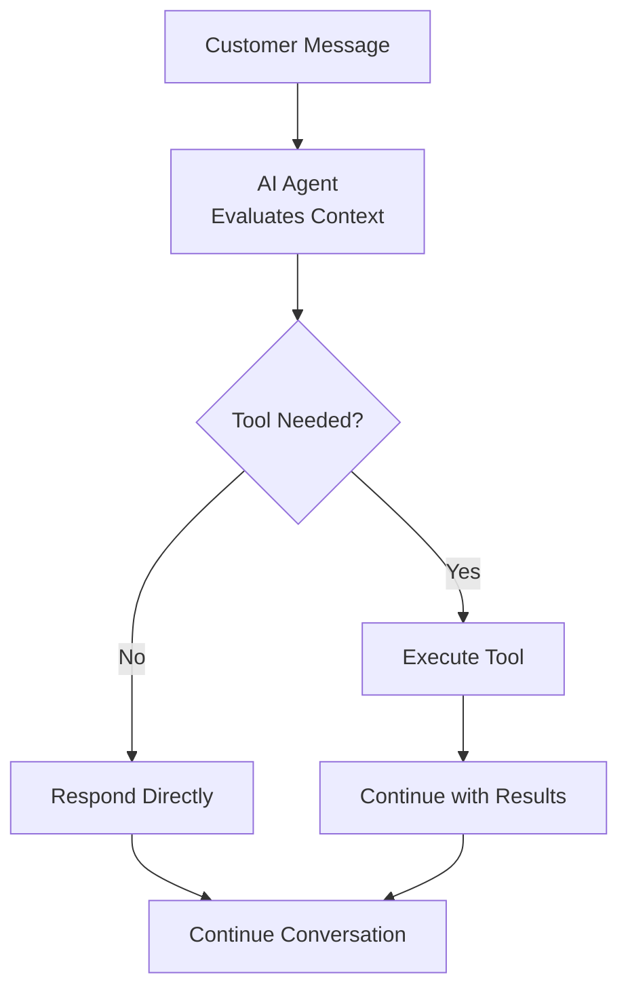

## Overview

Tools let your AI agents do more than answer questions. With tools configured, your agents can schedule appointments, transfer calls, update systems, and connect to your existing business workflows — all during a live conversation.

<Note>
Tools execute automatically based on conversation context and the prompt you provide to the agent. You define when and how tools should be used through [prompt engineering](/build/conversation/prompt-engineering-guide).
</Note>

## What Are Tools?

Tools are pre-configured capabilities that your agent can invoke during conversations to accomplish specific tasks. When a customer requests something like booking an appointment or speaking to a specialist, your agent executes the appropriate tool automatically.

### How Tools Work

During conversations, your agent decides whether to respond directly or execute a tool:



The agent uses **tool names and descriptions** to understand what each tool does. These details help the model select the right tool at the right moment.

**Best practices:**
- Give tools clear, descriptive names (e.g., "book_appointment" not "tool1")
- Write detailed descriptions explaining what the tool does
- Add explicit guidance in your [agent prompt](/build/conversation/prompt-engineering-guide) about **when** to use each tool

<Note>
While tool names and descriptions tell the agent **what** a tool does, your agent prompt should specify **when** to use it. For example: "When a customer asks to speak to a human, use the transfer_to_support tool."
</Note>

---

## Available Tool Types

In the agent editor, the **Tools** tab add menu includes:

- **Transfer Call**
- **Calendar Booking**
- **Custom Action**
- **Web Search** *(Alpha)*
- **Calculator** (Expert Mode)
- **MCP Server** (Expert Mode)

<Note>
Call ending is no longer a separate addable tool. Configure it in **Conversation** → **Call End** with **Allow AI to hang up**.
</Note>

For tool-specific setup, see [Transfer Tools](/build/tools/transfer-tools), [Calendar Booking](/build/tools/booking-calendar), [Custom Action](/build/tools/custom-api-actions), [Web Search](/build/tools/web-search), [Calculator](/build/tools/calculator), and [MCP Servers](/build/advanced/mcp-servers).

For live variable and result flow, read [Conversation Data Flow](/build/conversation/runtime-data-flow).

---

## When Tools Execute

Tools execute **during the conversation** when triggered by your agent based on its prompt. Unlike traditional IVR systems that follow rigid scripts, AI agents use contextual understanding to determine when tools are appropriate.

### Trigger Mechanisms

**Instruction-Based Triggers:**
```text wrap
When the customer asks to speak to a human, use the 'Transfer to Support' tool.

When the customer wants to schedule, use the 'Book Consultation' tool after you have the required details.

When the customer asks for up-to-date external information, use the 'Web Search' tool.
```

**Conditional Triggers:**
```jinja
If the customer reports a billing issue:
1. Use the 'Lookup Account' tool to retrieve their information
2. If balance is overdue, transfer to billing department
3. If balance is current, troubleshoot the issue


Always offer to transfer VIP customers to dedicated support immediately.

```

**Multi-Step Workflows:**
```text wrap
Appointment Booking Flow:
1. Gather required information (name, email, preferred date)
2. Use 'Check Availability' tool to query Cal.com
3. Present options to customer
4. Use 'Book Appointment' tool to confirm
5. Confirm the booked slot and next steps clearly
6. End the conversation naturally or rely on **Allow AI to hang up** if you have enabled it in **Conversation** → **Call End**
```

<Warning>
Tools execute in real time during the call. Ensure connected systems are reliable and respond quickly to avoid awkward pauses in conversation.
</Warning>

---

## Configuring Tools

All tool configuration happens in your agent editor under the **Tools** tab.

<Steps>
  <Step title="Navigate to Tools">
    Open your agent in the editor and click the **Tools** tab
  </Step>
  <Step title="Choose Tool Type">
    Browse the available tools and click **Add** to configure a tool
  </Step>
  <Step title="Configure Tool">
    Fill in the tool-specific configuration form:
    - **Name**: Give your tool a clear, descriptive name
    - **Description**: Explain what this tool does
    - **Tool-specific settings**: Configure parameters based on the tool type
  </Step>
  <Step title="Save">
    Save the tool to add it to your agent's toolkit
  </Step>
</Steps>

---

## Tools Table

Configured tools appear in a single table in the **Tools** tab.

Typical columns include:

- **Name** - Tool display name
- **Type** - Tool type (for example Transfer, Booking, Custom, Web Search, MCP Server)
- **Category** - Subtype or provider detail
- **Details** - Key configuration details

Use **Add** to create more tools, click a row to edit, and use the remove action to delete.

---

## Referencing Tools in Your Prompt

To use tools, reference them **by exact name** in your agent's prompt:

### Direct Reference
```text wrap
When a customer asks to speak to someone about billing,
use the 'Transfer to Billing Department' tool.
```

### With Conditions
```text wrap
If the customer's issue cannot be resolved:
1. Apologize for the inconvenience
2. Explain you're connecting them to a specialist
3. Use the 'Transfer to Support' tool
```

### With Parameters
```text wrap
After gathering the customer's email and preferred date,
use the 'Book Consultation' tool to schedule the meeting.
```

<Note>
Tool names are case-sensitive and must match exactly as configured. If you rename a tool, update all references in your prompt.
</Note>

---

## Configuration Best Practices

<AccordionGroup>
  <Accordion title="Start Simple" icon="seedling">
    Begin with basic tools before adding complex integrations. Add one tool at a time, test thoroughly, then add the next.

    **Example progression:**
    1. Add Transfer to Support
    2. Add Booking or Web Search
    3. Add Custom Action
    4. Add MCP Server only if you need external tool catalogs
  </Accordion>

  <Accordion title="Use Clear, Descriptive Names" icon="tag">
    Tool names are critical because the model uses them to understand what each tool does. Use descriptive, action-oriented names that clearly convey the function's purpose.

    **Why this matters:** The model relies on function names and descriptions to detect when a function needs to be called and choose the right tool for the task.

    **Good names:**
    - "Get Customer Account" - Clear action verb + specific target
    - "Transfer to Billing Department" - Specific destination included
    - "Book 30-Minute Consultation" - Includes relevant details

    **Poor names:**
    - "Tool 1" - No context about what it does
    - "Transfer" - Too generic, unclear where
    - "API Call" - Doesn't describe the tool
  </Accordion>

  <Accordion title="Write Detailed Descriptions" icon="file-lines">
    Tool descriptions help the model understand **what** the tool does. The description should explain the tool's purpose, what it returns, and what parameters it uses.

    **Best practices from [OpenAI function calling](https://platform.openai.com/docs/guides/function-calling):**
    - Clearly describe what the tool does and what it returns
    - Explain what parameters or data it uses
    - Use precise language that guides the model's understanding
    - Keep it concise yet comprehensive

    **Example:**
    ```
    Name: Get Customer Account
    Description: Retrieves customer account data from Salesforce CRM using
    their phone number. Returns account status, balance, and recent orders.
    ```

    **Note:** Describe **what** the tool does in the description. Specify **when** to use it in your [agent prompt](/build/conversation/prompt-engineering-guide).
  </Accordion>

  <Accordion title="Test Thoroughly" icon="vial">
    Test each tool in the agent test interface before going live:
    - Verify tool executes correctly
    - Test success scenarios
    - Test failure scenarios
    - Verify error handling
    - Check conversation flow
  </Accordion>

  <Accordion title="Handle Failures Gracefully" icon="shield-check">
    Configure fallback behaviors for when tools fail. Instruct your agent what to do when tools don't work.

    ```
    If the 'Book Appointment' tool fails:
    1. Apologize sincerely
    2. Offer to have someone call back to schedule
    3. Collect their preferred callback number
    4. Summarize the fallback plan before ending the conversation
    ```
  </Accordion>

  <Accordion title="Collect Information First" icon="clipboard-check">
    Ensure agents gather required data before executing tools. Don't attempt to book appointments without email addresses or transfer calls without explaining why.

    ```
    Before using the 'Book Consultation' tool:
    1. Confirm the customer wants to schedule
    2. Ask for their email address if not in contact record
    3. Discuss their preferred dates and times
    4. Explain what the consultation will cover
    5. Only then execute the booking tool
    ```
  </Accordion>

  <Accordion title="Secure Credentials" icon="lock">
    Use appropriate authentication for all custom tools. Never expose API keys or credentials in URLs or unencrypted fields.

    - Use Bearer tokens for API authentication
    - Use Basic auth over HTTPS only
    - Store sensitive credentials securely
    - Rotate credentials regularly
  </Accordion>
</AccordionGroup>

---

## Testing Tools

<Note>
Some tools only work during a real phone call. Transfers to a phone number or SIP address cannot be tested in the web simulator — the transfer action requires an actual telephony connection. Use **Test Agent → Phone call** to test these.
</Note>

Before deploying agents with tools, thoroughly test in the dashboard test interface:

<Steps>
  <Step title="Open Test Interface">
    Click **Test Agent** in the agent editor's top-right corner
  </Step>
  <Step title="Start Web call">
    Click **Start web call** to begin a test conversation
  </Step>
  <Step title="Trigger Each Tool">
    Run through scenarios that trigger each configured tool
  </Step>
  <Step title="Verify Execution">
    Check that tools execute correctly and handle responses appropriately
  </Step>
  <Step title="Test Failure Cases">
    Simulate failures to verify error handling works as expected
  </Step>
  <Step title="Review Transcript">
    Examine the conversation transcript to ensure flow is natural and tools integrate smoothly
  </Step>
</Steps>

### What to Test

**For Transfer Tools:**
- Transfer executes to correct destination
- Agent-transfer hold music plays if configured
- Transfer message is appropriate
- Cold transfer behavior and fallback handling work correctly

**For Booking Tools:**
- Availability is retrieved correctly
- Booking confirms successfully
- Email/SMS notifications send properly
- Timezone handling is accurate

**For Custom Actions:**
- Connected systems respond successfully
- Authentication works
- Response data is available to agent
- Error responses are handled gracefully

**For All Tools:**
- Agent references tool by correct name
- Agent gathers required information first
- Conversation flow remains natural
- Failures don't break the conversation

<Warning>
Test calls use real integrations. If you're testing a booking tool, it will create real appointments in your Cal.com account. Clean up test data afterward.
</Warning>

---

## Common Use Cases

### Customer Support Workflow

```text wrap
Agent Configuration:
- Transfer to Support (for complex issues)
- Lookup Customer Account (custom API)
- Create Support Ticket (custom API)
- **Allow AI to hang up** enabled in **Conversation** → **Call End**

Instructions:
When a customer calls:
1. Greet them warmly
2. Use 'Lookup Customer Account' to retrieve their information
3. Ask about their issue
4. If you can resolve it, do so using knowledge base
5. If it's complex, use 'Create Support Ticket' and provide ticket number
6. If customer requests human, use 'Transfer to Support'
7. When resolved, confirm next steps and close naturally
```

### Appointment Booking Workflow

```text wrap
Agent Configuration:
- Book Consultation (Cal.com booking)
- Transfer to Scheduling (fallback)
- **Allow AI to hang up** enabled in **Conversation** → **Call End**

Instructions:
When a customer wants to book:
1. Ask what type of appointment they need
2. Collect email address if not in contact record
3. Discuss their preferred dates
4. Use 'Book Consultation' to show availability and confirm
5. If booking succeeds, confirm details verbally
6. If booking fails, use 'Transfer to Scheduling'
7. Close the conversation naturally after confirming the outcome
```

### Sales Qualification Workflow

```text wrap
Agent Configuration:
- Lookup Company Data (custom API)
- Update CRM Lead (custom API)
- Transfer to Sales (for qualified leads)
- **Allow AI to hang up** enabled in **Conversation** → **Call End**

Instructions:
For outbound sales calls:
1. Introduce yourself and purpose
2. Use 'Lookup Company Data' to retrieve firmographics
3. Ask qualifying questions (budget, timeline, authority)
4. Use 'Update CRM Lead' with qualification status
5. If qualified, use 'Transfer to Sales' with context
6. If not qualified, thank them and close the conversation naturally
```

---

## Troubleshooting Common Issues

<AccordionGroup>
  <Accordion title="Tool Not Triggering" icon="circle-exclamation">
    **Problem:** Agent doesn't use the tool even though it should.

    **Solutions:**
    - Verify the tool name in your prompt matches exactly (case-sensitive)
    - Verify the tool exists in the **Tools** table and any required integration is connected
    - Make your prompt more explicit about when to use the tool
    - Test in isolation by explicitly asking the agent to use the tool
    - Review the conversation transcript to see the agent's reasoning
  </Accordion>

  <Accordion title="Agent Says Tool Will Execute But Doesn't" icon="comments">
    **Problem:** Agent verbally confirms it's executing a tool (e.g., "I'm transferring you now") but the tool doesn't execute until the next conversation turn.

    **Why this happens:** The agent generates a response and executes the tool in the same turn, but only one can happen per turn.

    **Solution:** Prompt the agent to ask for user confirmation before executing tools:

    ```jinja
    Before using the 'Transfer to Support' tool:
    1. Explain why you're transferring them
    2. Ask "Would you like me to transfer you now?"
    3. Wait for confirmation
    4. Once confirmed, execute the 'Transfer to Support' tool
    ```

    This ensures the agent executes the tool immediately after receiving confirmation, not in the same turn as announcing it.
  </Accordion>

  <Accordion title="Authentication Failures" icon="key">
    **Problem:** Custom tools fail with 401/403 errors.

    **Solutions:**
    - Verify credentials are correct and not expired
    - Check authentication type matches the connected system's requirements
    - Ensure Bearer tokens include "Bearer" prefix if needed
    - Ask the owner of the connected system to confirm the connection works outside the agent
    - Review the connected system's authentication requirements
  </Accordion>

  <Accordion title="Booking Action Fails" icon="calendar-xmark">
    **Problem:** Cal.com booking tool returns errors.

    **Solutions:**
    - Verify Cal.com integration is connected
    - Check event type exists and is active
    - Ensure meeting platform is configured in Cal.com
    - Verify scheduling windows allow requested dates
    - Check timezone configuration
    - Test booking manually in Cal.com to verify availability
  </Accordion>

  <Accordion title="Transfer Not Connecting" icon="phone-slash">
    **Problem:** Transfer tool executes but doesn't connect.

    **Solutions:**
    - Verify destination is in correct E.164 format (e.g., +15551234567)
    - Ensure phone number is reachable (for phone transfers)
    - Verify SIP address is correct (for SIP transfers)
    - Test destination independently
  </Accordion>

</AccordionGroup>

---

## Next Steps

<CardGroup cols={2}>
  <Card title="Transfer Tools" icon="phone-arrow-right" href="/build/tools/transfer-tools">
    Configure destinations, modes, routing patterns, and call end
  </Card>
  <Card title="Booking Integration" icon="calendar" href="/build/tools/booking-calendar">
    Set up Cal.com appointment scheduling with email and SMS notifications
  </Card>
  <Card title="Custom Action" icon="code" href="/build/tools/custom-api-actions">
    Connect your agents to external systems and APIs
  </Card>
  <Card title="Conversation Data Flow" icon="arrows-turn-right" href="/build/conversation/runtime-data-flow">
    Understand how values move into live tools and post-call workflows
  </Card>
  <Card title="Prompt" icon="pen" href="/build/conversation/prompt">
    Learn how to write an effective agent prompt
  </Card>
  <Card title="Prompt Engineering" icon="book" href="/build/conversation/prompt-engineering-guide">
    Master advanced prompting techniques for reliable agent behavior
  </Card>
</CardGroup>

---

## Common Questions

<AccordionGroup>
  <Accordion title="Does the tool name matter?">
    Yes. The agent selects tools based on the name and description you provide. Use clear, descriptive names like "Transfer to Sales" or "Book Appointment" — not "Tool 1" or "Action A". Names are case-sensitive.
  </Accordion>

  <Accordion title="Can I add tools without coding?">
    Built-in tools (Transfer Call, Calendar Booking, Web Search) require no code. Custom API Actions need an API endpoint to call, but you configure them entirely in the UI — no SDK or server-side code required.
  </Accordion>

  <Accordion title="What happens if a tool fails during a call?">
    The agent receives the error response and can handle it gracefully if your prompt includes fallback instructions. Check the conversation timeline to see the exact request and response for any tool call.
  </Accordion>
</AccordionGroup>
