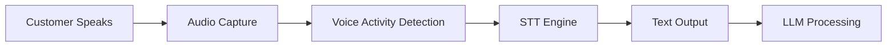

## Overview

Speech-to-text (STT) is the first step in your agent's processing pipeline. It converts customer speech into text that the AI model can understand and respond to. Accurate transcription is critical—errors in this step cascade through the entire conversation.

<Note>
Configure speech-to-text under **Models > Transcriber** in your agent settings. Changes apply immediately to new conversations.
</Note>

## How Speech-to-Text Works

The STT process happens in real-time during conversations:



1. **Customer speaks** - Audio captured from phone or web call
2. **Voice Activity Detection (VAD)** - System detects when customer is speaking vs. silence
3. **STT engine** - Transcribes audio chunks to text in real-time
4. **Text output** - Transcribed text sent to language model
5. **LLM processing** - AI model generates response based on transcription

<Panel>
  <Info>
    Picking a transcriber is a trade-off between latency, accuracy, and language coverage. Use this quick matrix while you read the sections below.
  </Info>
  <Columns cols={1}>
    <Card title="Cheat sheet" icon="table-cells">
      • **Deepgram Nova-3:** Fastest English + select EU/Asia languages<br/>
      • **Deepgram Nova-2:** Balanced accuracy vs. cost, still real-time<br/>
      • **Azure Standard:** Massive language coverage<br/>
      • **Azure Premium:** Compliance + better noise handling<br/>
      • **Azure Multilingual:** Auto-detect 2–5 languages per agent
    </Card>
  </Columns>
</Panel>

---

## The Transcriber Catalog

The transcriber selection interface provides a comprehensive view of all available STT engines.

### Catalog Features

<CardGroup cols={2}>
  <Card title="Provider Filter" icon="building">
    Switch between Deepgram and Azure with a single click
  </Card>
  <Card title="Language Chips" icon="globe">
    Each model lists every supported locale — click a chip to apply it immediately
  </Card>
  <Card title="EU-Hosted Badge" icon="location-dot">
    Quickly see whether a provider keeps audio inside the EU
  </Card>
  <Card title="Smart Labels" icon="star">
    “Recommended” tags and short descriptions help you pick the right model
  </Card>
</CardGroup>

### Browsing Transcribers

Each transcriber row shows:
- **Provider name** (Deepgram or Azure Speech)
- **Model name** (for example Nova-3 General or Azure STT Standard)
- **Short description** of when to use the model
- **Supported languages** rendered as clickable chips (with a “Multilingual” chip when the engine supports auto-detect)
- **EU hosting badge** when the provider keeps processing inside the EU
- **Recommended label** where we have a default choice for most teams

Use the search box to quickly find transcribers by name, provider, or capability.

---

## Available Transcription Providers

### Deepgram

Deepgram specializes in real-time speech recognition with low latency and strong phone-audio performance. We expose the following models today:

- **Nova-3 General (Recommended)** – latest generation with multilingual coverage (English, German, Dutch, Swedish, Hindi, Japanese, and more) plus a dedicated multilingual chip in the catalog.
- **Nova-3 Medical** – tuned for English healthcare terminology when compliance or vocabulary matters.
- **Nova-2 General** – previous generation with the broadest language list (e.g., Catalan, Portuguese-BR, Thai, Vietnamese, Chinese variants). Still excellent for global teams.
- **Nova-2 Phone Call / Meeting / Conversational AI** – optimized for narrow telephony scenarios when you only need English accuracy.

**Characteristics:**
- Fast streaming transcripts ideal for real-time agents
- Handles crosstalk, filler words, and noisy phone calls well
- Keyword boosting available on Nova-2 variants (handy for brand names)

**When to pick Deepgram:**
- You primarily serve English or the languages covered by Nova-3/Nova-2
- Ultra-low latency is more important than cloud-region alignment
- You want a single provider for both telephony and web calls

### Azure Speech

Microsoft Azure Speech complements Deepgram with a very wide language catalogue and regional hosting controls. The catalog currently lists:

- **Azure Speech STT (Standard)** – general-purpose model for 100+ locales (English, Spanish, Arabic, Mandarin, etc.) with solid accuracy on both telephony and web audio.
- **Azure Speech STT (Premium)** – same coverage with better noise handling and slightly lower latency.
- **Azure Multilingual Mode** – lets you specify a set of languages (for example en-US + es-ES + fr-FR). Azure automatically detects which one is being spoken and switches without an explicit reconfiguration.

**Characteristics:**
- Massive language coverage (best in industry)
- Multilingual auto-detection capabilities
- Can be deployed in EU, US, Asia regions
- GDPR compliant with DPAs
- Integration with Azure ecosystem

**Best for:**
- Multilingual agents serving global markets
- Enterprise deployments requiring compliance
- Agents serving non-English markets
- Applications requiring specific regional hosting (GDPR)

<Tip>
Need a provider outside Deepgram or Azure? Let us know — the catalog is powered by YAML configs and can be extended once we add the necessary backend integrations.
</Tip>

---

## Language Configuration

### Single Language Setup

For agents serving one language:

1. Open **Models > Transcriber**
2. Use the **Language Picker** to filter transcribers
3. Select by language name (e.g., "English") or locale code (e.g., "en-US")
4. Choose the transcriber with best latency/accuracy balance for your needs

**Language Variants:**
- **en-US:** American English (General American accent)
- **en-GB:** British English (Received Pronunciation)
- **en-AU:** Australian English
- **en-IN:** Indian English
- **en-CA:** Canadian English

Select the variant matching your customer base for best accuracy.

### Multilingual Auto-Detection

Azure Speech supports automatic language detection from a predefined set.

**Setup:**
1. Select an Azure Speech multilingual model
2. Configure primary language (default/fallback)
3. Add secondary languages to detect (up to 10 recommended)
4. Enable auto-detection

**How it works:**
- Customer starts speaking
- Azure detects language from first few words
- Transcribes in detected language for remainder of utterance
- Falls back to primary language if detection uncertain

**Example use case:**
```text wrap
Primary: en-US
Secondary: es-ES, fr-FR

Customer says: "Hola, necesito ayuda"
→ Detects Spanish, transcribes: "Hola, necesito ayuda"

Customer says: "Actually, I'll switch to English"
→ Detects English, transcribes: "Actually, I'll switch to English"
```

<Warning>
Auto-detection adds slight latency (~100-200ms) as the system analyzes language. For single-language agents, use language-specific models instead.
</Warning>

### Configuring Default Language

The default/primary language serves multiple purposes:
- **Fallback:** When auto-detection uncertain
- **Analytics:** Default language for transcripts and reports
- **Voice/LLM coordination:** Signals expected language to other components

Set this to your most common customer language.

---

## Keyword Boosting

Keyword boosting (also called custom vocabulary) helps the transcriber recognize specific terms accurately.

### What is Keyword Boosting?

Transcribers are trained on general language but may struggle with:
- Brand names (your company, products, competitors)
- Industry jargon (technical terms, acronyms)
- Proper nouns (people names, location names)
- Domain-specific vocabulary

Keyword boosting tells the transcriber to prioritize certain words when it hears similar sounds.

### How to Add Keywords

1. Open **Models > Transcriber**
2. Select your transcriber
3. Click **Keyword Boosting** or **Custom Vocabulary**
4. Add keywords one per line or comma-separated:
   ```
   itellicoAI
   Anthropic
   Claude
   ElevenLabs
   Deepgram
   API endpoint
   OAuth
   webhook
   ```

5. Save and test

### Keyword Best Practices

<AccordionGroup>
  <Accordion title="Add All Brand Names" icon="copyright">
    - Your company name and spelling variants
    - Product names and SKUs
    - Competitor names (if mentioned by customers)
    - Partner and integration names

    Example: itellicoAI, Acme Software, Salesforce, HubSpot
  </Accordion>

  <Accordion title="Include Industry Jargon" icon="industry">
    - Technical terms specific to your domain
    - Acronyms (spell them out if multi-word)
    - Common abbreviations

    Example (healthcare): HIPAA, EHR, EMR, copay, prior authorization
    Example (SaaS): API, webhook, OAuth, SSO, SAML
  </Accordion>

  <Accordion title="Proper Nouns Matter" icon="location-dot">
    - Common customer names if predictable (surnames for B2B)
    - Geographic locations you reference
    - Department names

    Example: Dr. Patel, Dr. Chen, Manhattan office, billing department
  </Accordion>

  <Accordion title="Test and Iterate" icon="arrows-rotate">
    - Add keywords based on actual transcription errors
    - Review call transcripts for common mistakes
    - Test after adding keywords to verify improvement
    - Remove ineffective keywords to avoid over-boosting
  </Accordion>
</AccordionGroup>

### Keyword Boosting Limits

Most providers limit keyword lists:
- **Deepgram:** 1,000 keywords recommended, 5,000 max
- **Azure:** 500-1,000 keywords depending on tier

Focus on quality over quantity—adding too many keywords can reduce overall accuracy.

<Tip>
Start with 20-50 high-priority keywords. Expand based on observed transcription errors in real conversations.
</Tip>

---

## Choosing the Right Transcriber

### Decision Framework

<AccordionGroup>
  <Accordion title="1. Language Requirements" icon="globe">
    **Single language (English):**
    - Deepgram Nova-3 or Nova-2 (best accuracy and speed)
    - Azure Speech Premium (enterprise compliance)

    **Single language (non-English):**
    - Azure Speech (broadest language coverage)
    - Deepgram Nova-3 General (covers select European + Asian languages)

    **Multilingual (auto-detect):**
    - Azure Speech Multilingual (best auto-detection)
  </Accordion>

  <Accordion title="2. Latency Sensitivity" icon="gauge-high">
    **Ultra-low latency critical (under 400ms):**
    - Deepgram Nova-3 / Nova-2 (~300ms)

    **Moderate latency acceptable (under 700ms):**
    - Azure Speech Premium (~500-600ms)

    **Latency less critical (>1s acceptable):**
    - Azure Speech Standard or any provider if coverage is the priority
  </Accordion>

  <Accordion title="3. Accuracy Requirements" icon="bullseye">
    **Highest accuracy needed (medical, legal, compliance):**
    - Deepgram Nova-2 + extensive keyword boosting
    - Azure Speech Premium + custom vocabulary
    - Consider human review for critical transcripts

    **Standard accuracy sufficient:**
    - Deepgram Nova-2
    - Azure Speech Standard

    **Occasional errors acceptable:**
    - Azure Speech Standard (with keyword support)
    - Archived Deepgram variants
  </Accordion>

  <Accordion title="4. Compliance and Hosting" icon="shield">
    **EU data residency required (GDPR):**
    - Filter for EU-hosted transcribers
    - Azure Speech deployed in EU regions
    - Deepgram EU endpoints

    **HIPAA compliance needed:**
    - Azure Speech with BAA (Business Associate Agreement)
    - Deepgram HIPAA-compliant plans

    **No specific compliance:**
    - All providers available
  </Accordion>
</AccordionGroup>

### Recommended Configurations by Use Case

| Use Case | Recommended Transcriber | Rationale |
|----------|------------------------|-----------|
| **Customer Support (English)** | Deepgram Nova-2 | Best accuracy + low latency for real-time |
| **Multilingual Support** | Azure Speech Multilingual | Auto-detection, 100+ languages |
| **High-Volume FAQ (English)** | Deepgram Nova-2 | Reliable performance for long-running calls |
| **Medical/Legal** | Deepgram Nova-2 + keywords | Highest accuracy for compliance |
| **Global Sales** | Azure Speech Multilingual | Wide language coverage |
| **High-Volume Multilingual** | Azure Speech Standard | Wide coverage for routine informational calls |
| **Technical Support** | Deepgram Nova-2 + keywords | Handles technical jargon well |

---

## Updating via API

Prefer automation? Patch your agent's transcriber directly from your CI/CD jobs.

<CodeGroup>
```bash update-transcriber.sh theme={null}
curl --request PATCH \
  --url "https://api.itellico.ai/v1/agents/$AGENT_UUID" \
  --header "Authorization: Bearer $API_TOKEN" \
  --header "Content-Type: application/json" \
  --data '{
    "transcriber": {
      "provider": "deepgram",
      "model": "deepgram:nova-3:general",
      "language": "en-US"
    }
  }'
```

```javascript updateTranscriber.mjs theme={null}
await fetch(`https://api.itellico.ai/v1/agents/${agentUuid}`, {
  method: "PATCH",
  headers: {
    Authorization: `Bearer ${process.env.API_TOKEN}`,
    "content-type": "application/json"
  },
  body: JSON.stringify({
    transcriber: {
      provider: "azure",
      model: "azure:stt:premium",
      languages: ["en-US", "es-ES"]
    }
  })
});
```
</CodeGroup>

---

## Advanced Configuration

itellicoAI voice agents always use real-time streaming transcription with sensible defaults (automatic punctuation, no profanity filtering, single-speaker focus). There are no batch-mode, diarization, or profanity toggles in the UI today. If you have a compliance requirement that needs those provider-level settings, reach out to support and we can help configure it for your account.

---

## Testing Transcription Accuracy

1. Place a quick test call from the dashboard and speak the scenarios your customers actually use (brand names, order numbers, addresses).
2. Open the conversation log, skim the transcript, and jot down any misheard words.
3. Add recurring mistakes to your keyword list or consider switching between Deepgram Nova and Azure Premium if the issue persists.
4. During rollout, spot-check a handful of real calls each week—looking for repeated “sorry, say that again?” moments is usually enough.

---

## Multilingual Support Deep Dive

For a full walkthrough of routing strategies, auto-detect, and language-specific prompts, see [Advanced → Multilingual Support](/build/advanced/multilingual-support). At a high level: use separate agents for high-volume languages, and turn on Azure Speech Multilingual if you need the assistant to detect two to five languages in a single flow.

## Troubleshooting Transcription Issues

### Low Accuracy / Many Errors

**Possible causes:**
1. Poor audio quality (background noise, low volume)
2. Strong accents not well-supported by model
3. Fast or unclear speech
4. Technical terms/brand names not in keyword list
5. Wrong language model selected

**Solutions:**
- Test different transcriber (e.g., Deepgram Nova-2 vs. Azure Premium)
- Add keywords for commonly misheard terms
- Improve audio source (better microphone, noise cancellation)
- Use transcriber trained on accent (e.g., en-IN for Indian English)
- Instruct customers to speak clearly (in greeting message)

### High Latency / Slow Transcription

**Possible causes:**
1. Transcriber with inherently high latency (e.g., older cloud models)
2. Network issues between customer and transcriber
3. Overloaded transcriber endpoint
4. Inefficient audio encoding

**Solutions:**
    - Switch to faster transcriber (Deepgram Nova-2 or Azure Premium)
- Check network latency in Analytics
- Contact support if issue persists (may be provider outage)
- Verify audio codec settings (usually automatic)

### Transcription Cuts Off

**Possible causes:**
1. Voice Activity Detection (VAD) too sensitive
2. Customer pauses mid-sentence
3. Background noise confusing VAD

**Solutions:**
- Adjust VAD settings (increase silence threshold)
- Instruct customers not to pause mid-sentence
- Reduce background noise
- Use transcriber with better VAD (Deepgram)

### Missing Words or Phrases

**Possible causes:**
1. Audio dropouts (network issues)
2. Very fast speech
3. Low volume
4. Overlapping speech (customer + agent speaking simultaneously)

**Solutions:**
- Check network quality
- Adjust interruption handling (reduce agent interruptions)
- Increase audio gain if available
- Instruct customers to speak clearly

### Wrong Language Detected (Multilingual)

**Possible causes:**
1. Too many languages in detection list
2. Similar languages confusing model (en-US vs. en-GB)
3. Customer has strong accent
4. Short initial utterance (not enough to detect)

**Solutions:**
- Reduce language list to most likely 2-3
- Use language-specific models instead of multilingual
- Let customer select language explicitly (IVR or web UI)
- Require longer initial utterance before detection

---

## Best Practices

<AccordionGroup>
  <Accordion title="Match Transcriber to Use Case" icon="bullseye">
    Don't use the same transcriber for all agents:
    - English customer support: Deepgram Nova-3 / Nova-2
    - Multilingual: Azure Speech Multilingual
    - Budget/high-volume: Azure Speech Standard or Deepgram Nova-2 with relaxed settings

    Optimize per agent based on language, volume, and requirements.
  </Accordion>

  <Accordion title="Always Use Keyword Boosting" icon="list">
    Even excellent transcribers need help with:
    - Your company and product names
    - Industry-specific jargon
    - Common proper nouns in your context

    Maintain and update keyword list based on observed errors.
  </Accordion>

  <Accordion title="Test with Real Audio Sources" icon="phone">
    Test transcription using:
    - Actual phone calls (not just web calls)
    - Different phone types (mobile, landline, VoIP)
    - Various audio quality conditions
    - Real customer accents and speech patterns

    Web call testing alone may not reveal phone-specific issues.
  </Accordion>

  <Accordion title="Monitor Transcription Quality" icon="chart-line">
    Review sample transcripts regularly:
    - Check weekly for new error patterns
    - Review high-value or escalated calls
    - Look for seasonal trends (e.g., new product launches introducing new terms)
    - Update keyword list based on findings
  </Accordion>

  <Accordion title="Consider Compliance Requirements Early" icon="shield">
    If you need:
    - EU data residency: Use EU-hosted transcribers from the start
    - Enterprise compliance: Contact support for specific requirements
    - Industry certifications: Verify transcriber compliance before selection

    Switching transcribers later due to compliance issues is disruptive.
  </Accordion>
</AccordionGroup>

## Next Steps

<CardGroup cols={2}>
  <Card title="Choose AI Model" icon="brain" href="/build/voice-speech/choose-ai-model">
    Select the language model that processes transcribed text
  </Card>
  <Card title="Select Voice" icon="microphone" href="/build/voice-speech/select-voice">
    Choose the voice that speaks responses to customers
  </Card>
  <Card title="Custom Pronunciations" icon="spell-check" href="/build/voice-speech/custom-pronunciations">
    Correct how the voice pronounces specific terms
  </Card>
  <Card title="Multilingual Support" icon="language" href="/build/advanced/multilingual-support">
    Configure multilingual support for your agents
  </Card>
</CardGroup>
