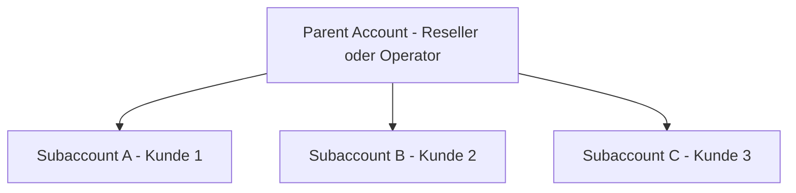

**Zugriff:** Nutze in der Seitenleiste **Einstellungen → Account** für Account-Seiten und den Account-Switcher oben links, um zwischen Accounts zu wechseln.

## Wer diesen Bereich nutzt

Der Bereich **Account** ist vor allem für Admins, Operations-Leads, Plattform-Operatoren, Reseller, Agenturen und alle gedacht, die für Teamzugriffe, die Kunden-Account-Struktur oder die Eigentümerschaft der Abrechnung verantwortlich sind.

Nutze ihn, wenn du:

- festlegen willst, wer sich anmelden kann und was diese Personen tun dürfen
- Kunden, Regionen oder Abteilungen in eigene Accounts trennen willst
- Branding und Einstellungen auf Account-Ebene aktualisieren willst
- Abrechnungszugriff und Integrations-Anmeldedaten auf Account-Ebene steuern willst

<Tip>
Wenn du zwischen einem Account, Team-Mitgliedern, Subaccounts oder Agency-Zugriff entscheidest, starte mit dem [Account Operating Model](/de/accounts/operating-model).
</Tip>

## Account-Struktur

itellicoAI nutzt Account-Grenzen, um Teams zu organisieren, Zugriffe zu verwalten und Voice-AI-Operationen zu skalieren. Egal ob du ein internes Einzelteam, ein Reseller mit vielen Kunden oder eine Agentur bist, die kunden­eigene Accounts verwaltet, das Account-System trennt Daten, Abrechnung und Verwaltungszugriff.

## Account-Typen

### Haupt-Accounts

Haupt-Accounts, auch Parent Accounts genannt, sind Accounts auf oberster Ebene mit:

- eigenständiger Abrechnung und eigenem Abo
- vollständiger administrativer Kontrolle
- der Möglichkeit, Subaccounts für zentrale Parent-Abrechnung oder isolierte Kundenprozesse zu erstellen
- getrennten [API-Schlüsseln](/de/accounts/api-keys), [Secrets](/de/accounts/secrets), [Webhooks](/de/accounts/webhooks) und [Integrationen](/de/accounts/integrations)

### Subaccounts

Subaccounts liegen unter Parent Accounts und bieten:

- isolierte Accounts für Kunden, Teams oder Geschäftseinheiten
- eigene Agents, Kontakte und [Gespräche](/de/manage/conversations/overview)
- eigenständige Team-Mitgliedschaften und Berechtigungen
- vom Parent verwaltete Governance, Sichtbarkeit, Abrechnung und API-gesteuerte Abläufe, soweit erlaubt

**Wichtige Eigenschaften:**
- Subaccounts können bei Bedarf verschachtelt werden, die meisten Setups sollten aber bei einer Parent-Child-Ebene bleiben
- Parent Accounts können auf Child Accounts zugreifen
- Child Accounts können nicht auf Parent- oder Schwester-Daten zugreifen
- Nutzer in mehreren Accounts können mit dem Account-Switcher zwischen Accounts wechseln

## Typische Account-Struktur

Nutze tiefere Verschachtelungen nur, wenn es einen klaren Governance-Grund gibt. Für die meisten Teams sind getrennte Kunden-, Marken- oder Abteilungs-Subaccounts unter einem Parent leichter zu verwalten.

### Zugriffsregeln

- **Zugriff nach unten**: Parents können auf Child-Subaccounts zugreifen
- **Kein Zugriff nach oben**: Children können nicht auf Parent-Daten zugreifen
- **Kein Zugriff zu Geschwistern**: Subaccounts können nicht direkt aufeinander zugreifen
- **Account-Wechsel**: Nutzer mit mehreren Mitgliedschaften können Accounts wechseln

## Sicherheitsbest Practices

<AccordionGroup>
  <Accordion title="Prinzip der geringsten Rechte nutzen" icon="shield-halved">
    Halte Rollen mit hohen Rechten auf die Personen beschränkt, die wirklich Account-weite Kontrolle brauchen.
  </Accordion>

  <Accordion title="Mitgliedschaften regelmäßig prüfen" icon="clipboard-list">
    Prüfe Team-Mitglieder und Rollen regelmäßig und entferne veraltete Zugriffe zügig.
  </Accordion>

  <Accordion title="Mit Subaccounts segmentieren" icon="sitemap">
    Nutze Subaccounts, um Kunden, Teams, Abteilungen oder Regionen zu isolieren, damit Daten­grenzen klar bleiben.
  </Accordion>

  <Accordion title="API-Schlüssel sorgfältig verwalten" icon="key">
    Nutze getrennte Schlüssel pro Umgebung, rotiere sie regelmäßig und widerrufe kompromittierte Schlüssel sofort.
  </Accordion>
</AccordionGroup>

## FAQs

<AccordionGroup>
  <Accordion title="Wie viele Subaccounts kann ich erstellen?">
    Die Anzahl der Subaccounts hängt von deinem Plan und den Account-Limits ab. Details findest du unter [Plans](/de/billing/plans).
  </Accordion>

  <Accordion title="Kann ein Nutzer Mitglied mehrerer Accounts sein?">
    Ja. Ein Nutzer kann mehreren Accounts angehören und mit dem Account-Switcher den Kontext wechseln.
  </Accordion>

  <Accordion title="Können Subaccounts eigene API-Schlüssel haben?">
    Ja. API-Schlüssel werden pro Account erstellt, also auch für Subaccounts.
  </Accordion>

  <Accordion title="Kann sich die Account-Inhaberschaft oder Hierarchie ändern?">
    Für Eigentumsübertragungen oder komplexe Hierarchieänderungen kontaktiere [support@itellico.ai](mailto:support@itellico.ai).
  </Accordion>
</AccordionGroup>

## Nächste Schritte

<CardGroup cols={2}>
  <Card title="Accounts erstellen" icon="plus" href="/de/accounts/creating-accounts">
    Neue Haupt-Accounts und Subaccounts anlegen
  </Card>
  <Card title="Team Management" icon="users-gear" href="/de/accounts/team-management">
    Mitglieder einladen, Rollen zuweisen und Zugriffe verwalten
  </Card>
  <Card title="Client Service Models" icon="briefcase" href="/de/accounts/agency-playbook">
    Parent Billing, Agency-Zugriff oder ein Hybrid-Setup wählen
  </Card>
  <Card title="Security" icon="shield-halved" href="/de/accounts/security">
    Authentifizierung und Sitzungssteuerung konfigurieren
  </Card>
  <Card title="API-Keys" icon="key" href="/de/accounts/api-keys">
    API-Schlüssel erzeugen und verwalten
  </Card>
</CardGroup>
