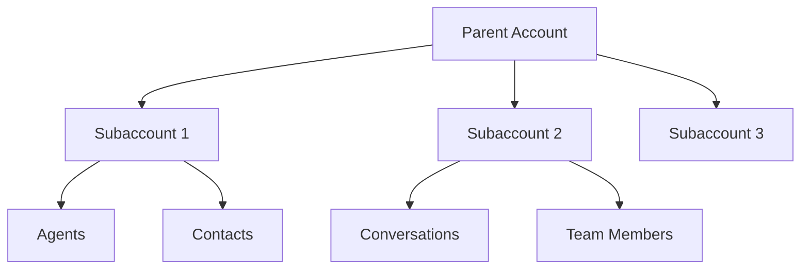

import { Screenshot } from "/snippets/screenshot.mdx";

## Wie Subaccounts funktionieren

Subaccounts ermöglichen es einem Parent Account, isolierte Kunden-, Mandanten-, Team- oder Geschäftseinheits-Accounts zu erstellen, während die übergeordnete Kontrolle erhalten bleibt.

Im Parent/Subaccount-Modell stellt itellicoAI dem Parent Account zentral in Rechnung. Der Parent kann seine eigenen Kunden dann separat paketieren, weiterverkaufen oder in Rechnung stellen. Das unterscheidet sich vom Agency-Zugriff, bei dem der Kunde seinen eigenen itellicoAI-Account besitzt und bezahlt und einem Dienstleister erhöhten Zugriff gewährt.

Subaccounts sind nützlich für:

- Reseller und Plattformbetreiber, die Kunden-Accounts organisieren
- API-Integratoren, die pro Kunde einen isolierten Account-Kontext bereitstellen
- Dienstleister, die eine Parent-Rechnung von itellicoAI möchten und ein eigenes nachgelagertes Abrechnungsmodell haben
- Unternehmen, die Regionen, Marken oder Abteilungen trennen
- Agenturen, die die Parent-Account-Beziehung besitzen und Kunden direkt in Rechnung stellen möchten

## Architektur

### Verantwortlichkeiten des Parent Accounts

- Subaccounts erstellen und verwalten
- Subaccount-Zugriffskategorien zuweisen und überprüfen
- Zwischen Accounts wechseln zur Überwachung
- Nutzung über alle Subaccounts hinweg überwachen
- Die Geschäftsbeziehung mit itellicoAI verwalten, wenn Subaccounts Parent Billing nutzen

### Eigenschaften von Subaccounts

- Eigene Team-Mitgliedschaft und Rollen
- Eigene Agents, Kontakte und Konversationsdaten
- Isolierter Account

Verschachtelte Subaccounts werden bis zu 5 Ebenen unterstützt, aber die meisten Teams sollten eine Parent-Kind-Ebene beibehalten, sofern es keinen klaren Governance-Grund für eine tiefere Verschachtelung gibt.

## Einen Subaccount erstellen

Schritt-für-Schritt-Anleitungen findest du unter [Accounts erstellen](/accounts/creating-accounts).

<Screenshot
  lightSrc="/images/accounts__subaccounts-light.png"
  darkSrc="/images/accounts__subaccounts-dark.png"
  alt="Subaccounts page showing nested list with members and agents counts"
/>

## Subaccounts verwalten

Die Subaccounts-Tabelle zeigt:

- **Name**
- **Billing-Plan** (zeigt den Billing-Typ an, zum Beispiel **Parent Billing**)
- **Mitglieder**-Anzahl
- **Agents**-Anzahl
- **Minuten** verbraucht
- **Wechseln zu**-Aktion

Von dieser Seite aus kannst du:

- Direkt in einen Subaccount wechseln
- Berechtigungsverwaltung für einen Subaccount öffnen
- Verschachtelte Hierarchien an Ort und Stelle aufklappen

## Subaccount-Detail

Klicke auf eine Subaccount-Zeile, um die Detailansicht zu öffnen. Die Detailansicht hat folgende Tabs:

| Tab | Zweck |
|-----|---------|
| **Übersicht** | Mitglieder, Agents, Subaccount-Anzahl, Erstellungsdatum, übernommener Billing-Plan |
| **Mitglieder** | Team-Mitglieder in diesem Subaccount |
| **Berechtigungen** | Detaillierte Zugriffskontrollen nach Kategorie |
| **Limits** | Ressourcenlimits für diesen Subaccount |
| **Billing** | Billing-Modus und Transfer-Kontrollen |
| **Produkte importieren** | Agents und Konfiguration vom Parent importieren |

---

## Billing-Modi

Neue Subaccounts verwenden standardmäßig **Parent Billing**: Der Parent Account zahlt für alle Subaccount-Nutzung, die Nutzung wird auf der Rechnung des Parents konsolidiert, und der Subaccount hat keine eigenständige Abrechnung oder Zahlungsmethode. Die Spalte **Billing-Plan** zeigt **Parent Billing** in der Subaccounts-Tabelle.

Der Parent kann seine eigene nachgelagerte Kundenabrechnug, Paketierung oder den Weiterverkauf außerhalb von itellicoAI abwickeln.

**Am besten geeignet für:** Reseller, API-Integratoren, Telefonieanbieter, Plattformbetreiber, Unternehmen und Agenturen, die möchten, dass der Parent Account das Billing zentral steuert.

Um die Billing-Verantwortung auf den Subaccount zu übertragen, verwende den unten beschriebenen **Billing Transfer**-Prozess. Nach Abschluss eines Transfers wird der Account vollständig unabhängig und verlässt die Parent-Hierarchie.

---

## Billing Transfer

Billing Transfer ist der geführte Prozess zum Überführen eines vom Parent abgerechneten Kunden-Accounts in einen eigenständigen, direkt abgerechneten Account.

**Zugriff:** Subaccount-Detail öffnen → Tab **Billing**.

### So funktioniert es

<Steps>
  <Step title="Transfer starten">
    Klicke im Tab **Billing** des Subaccounts auf **Billing übertragen**.
  </Step>

  <Step title="Transfer konfigurieren">
    Wähle eine **Übergangsfrist** (24, 48 oder 72 Stunden), während der der Parent weiter zahlt. Schalte optional **Agency-Zugriff behalten** ein, um nach Abschluss des Transfers als Agency-Mitglied verbunden zu bleiben. Füge optional eine Notiz für den Kunden-Account-Owner hinzu.
  </Step>

  <Step title="Kind-Account schließt die Einrichtung ab">
    Der Kind-Account sieht einen Billing-Einrichtungsflow. Er muss eine Zahlungsmethode hinzufügen und einen Plan wählen, bevor die Übergangsfrist abläuft.
  </Step>

  <Step title="Transfer abgeschlossen">
    Sobald das Billing eingerichtet ist, wird der Account automatisch unabhängig. Wenn die Übergangsfrist ohne Einrichtung abläuft, kann der Parent den Transfer abbrechen.
  </Step>
</Steps>

### Transfer-Status

| Status | Badge | Was passiert |
|-------|-------|-------------|
| Vom Parent abgerechnet | **Bezahlt vom Parent Account** | Parent zahlt, Transfer-Schaltfläche verfügbar |
| Transfer läuft | **Billing Transfer läuft** | Übergangsfrist aktiv, Kind richtet Billing ein |
| Unabhängig | **Unabhängiger Account** | Transfer abgeschlossen — Account verwaltet seine eigene Abrechnung und ist nicht mehr Teil der Parent-Hierarchie |

### Agency-Zugriff nach dem Transfer

Beim Transfer eines Subaccounts in die Unabhängigkeit kannst du wählen, ob der Agency-Zugriff erhalten bleibt:

- **Aktiviert** (Standard): Frühere Parent-Owner und Admins werden als Agency-Mitglieder auf dem neuen unabhängigen Account eingeladen
- **Deaktiviert**: Es werden keine Agency-Mitglieder automatisch eingeladen

Das ist nützlich, wenn ein Dienstleister die Einrichtung, Wartung oder Überwachung fortsetzen möchte, nachdem der Kunde ein unabhängiger, direkt abgerechneter Account geworden ist.

---

## Subaccount-Berechtigungen

Berechtigungen werden pro Subaccount im Tab **Berechtigungen** des Subaccount-Details konfiguriert. Jede Berechtigung unterstützt die Zugriffsebenen **Keine**, **Lesen** oder **Voll** (einige verwenden stattdessen **Keine**, **Eingeschränkt**, **Voll**).

### Übersicht

| Berechtigung | Beschreibung | Ebenen |
|-----------|-------------|--------|
| **Konversationen** | Zugriff auf Konversationen, Anrufverlauf und Live-Aktionen | Keine, Lesen |
| **Aufgaben** | Aufgaben erstellen, bearbeiten und verwalten | Keine, Lesen, Voll |

### Agents

| Berechtigung | Beschreibung | Ebenen |
|-----------|-------------|--------|
| **Allgemeine Agent-Rechte** | Voller Agent-Zugriff (steuert die einzelnen Tab-Rechte unten) | Keine, Lesen, Voll |
| **Allgemein** | Agent-Identität und KI-Stack bearbeiten | Keine, Lesen, Voll |
| **Prompt** | Agent-Prompts bearbeiten | Keine, Lesen, Voll |
| **Knowledge** | Agent-Wissensquellen verwalten | Keine, Lesen, Voll |
| **Tools** | Agent-Tools und -Aktionen konfigurieren | Keine, Lesen, Voll |
| **Call Flow** | Call Flow und Routing konfigurieren | Keine, Lesen, Voll |
| **Analytics** | Analytics-Einstellungen, Ziele und Post-Call-Analysen verwalten | Keine, Lesen, Voll |
| **Benachrichtigungen** | Agent-Benachrichtigungen konfigurieren | Keine, Lesen, Voll |
| **Knowledge Bases** | Knowledge Bases erstellen, bearbeiten und löschen | Keine, Lesen, Voll |

### Deploy

| Berechtigung | Beschreibung | Ebenen |
|-----------|-------------|--------|
| **Telefonie** | Voller Telefonie-Zugriff (steuert die Unteroptionen unten) | Keine, Lesen, Voll |
| **Telefonnummern** | Telefonnummern kaufen, konfigurieren und freigeben | Keine, Lesen, Voll |
| **SIP-Trunks** | SIP-Trunks verwalten | Keine, Lesen, Voll |
| **Compliance-Profile** | Compliance-Profile verwalten | Keine, Lesen, Voll |
| **Kampagnen & Kontakte** | Kampagnen und Kontakte anzeigen (Unteroptionen werden unten gesteuert) | Keine, Lesen, Voll |

### Account & Einstellungen

| Berechtigung | Beschreibung | Ebenen |
|-----------|-------------|--------|
| **Account** | Account anzeigen (steuert Unteroptionen unten) | Keine, Eingeschränkt, Voll |
| **Einstellungen** | Account-Einstellungen verwalten | Keine, Lesen, Voll |
| **Mitglieder** | Team-Mitglieder einladen und verwalten | Keine, Lesen, Voll |
| **Subaccounts** | Subaccounts erstellen und verwalten | Keine, Lesen, Voll |
| **Trust Center** | Aufbewahrung und Datenschutzrichtlinien verwalten | Keine, Lesen, Voll |
| **Zeitpläne** | Geschäftszeiten-Zeitpläne erstellen und verwalten | Keine, Lesen, Voll |
| **Entwickler** | Entwickler-Tools anzeigen (steuert Unteroptionen unten) | Keine, Lesen, Voll |
| **Integrationen** | Integrationen verbinden und verwalten | Keine, Lesen, Voll |
| **API-Schlüssel** | API-Schlüssel erstellen und verwalten | Keine, Lesen, Voll |
| **Webhooks** | Webhooks erstellen, testen und verwalten | Keine, Lesen, Voll |
| **Billing** | Voller Billing-Zugriff (Unteroptionen unten) | Keine, Voll |
| **Nutzung** | Nutzungsdaten anzeigen und exportieren | Keine, Voll |

## Best Practices

<AccordionGroup>
  <Accordion title="Hierarchie einfach halten" icon="sitemap">
    Starte mit einem Parent und klaren Kind-Grenzen. Füge tiefere Verschachtelung nur für klare Governance-Gründe hinzu.
  </Accordion>

  <Accordion title="Berechtigungskategorien gezielt einsetzen" icon="shield-halved">
    Blockiere Kategorien standardmäßig für neue Subaccounts und öffne dann nur das, was jeder Subaccount benötigt.
  </Accordion>

  <Accordion title="Subaccounts einheitlich benennen" icon="tag">
    Verwende Namenskonventionen, die einen Account-Wechsel sicher und eindeutig machen.
  </Accordion>

  <Accordion title="Mitgliedschaft und Berechtigungen regelmäßig überprüfen" icon="clipboard-list">
    Überprüfe regelmäßig sowohl Mitgliederrollen als auch gesperrte/erlaubte Kategorien, um Abweichungen zu vermeiden.
  </Accordion>
</AccordionGroup>

## Häufige Fragen

<AccordionGroup>
  <Accordion title="Wie tief können Subaccounts verschachtelt werden?">
    Subaccounts können bis zu 5 Ebenen verschachtelt werden, aber nutze tiefere Verschachtelung sparsam. Die meisten Kunden-, Mandanten-, Marken- oder Abteilungseinrichtungen lassen sich mit einer Parent-Kind-Ebene einfacher verwalten.
  </Accordion>

  <Accordion title="Kann ich von dieser Seite aus in jeden Subaccount wechseln?">
    Du kannst in Subaccounts wechseln, auf die du Zugriff hast.
  </Accordion>

  <Accordion title="Kann ich detaillierte Berechtigungsregeln pro Subaccount konfigurieren?">
    Ja. Öffne das Subaccount-Detail und nutze den Tab **Berechtigungen**, um detaillierte Zugriffskontrollen pro Kategorie festzulegen.
  </Accordion>

  <Accordion title="Wie übertrage ich das Billing auf einen Subaccount?">
    Öffne das Subaccount-Detail → Tab **Billing** → klicke auf **Billing übertragen**. Wähle eine Übergangsfrist und starte den Transfer. Der Kind-Account richtet während des Übergangsfensters seine eigene Zahlungsmethode und seinen Plan ein.
  </Accordion>

  <Accordion title="Kann ein Subaccount vollständig unabhängig werden?">
    Ja. Während eines Billing Transfers wird der Zielmodus auf **unabhängig** gesetzt. Nachdem der Kind-Account die Billing-Einrichtung abgeschlossen hat, verlässt der Account automatisch die Parent-Hierarchie.
  </Accordion>

  <Accordion title="Was passiert, wenn der Kind-Account das Billing während der Übergangsfrist nicht einrichtet?">
    Der Parent kann den Transfer abbrechen und der Subaccount kehrt zum Parent Billing zurück. Der Parent sponsert den Zugriff weiterhin während der Übergangsfrist.
  </Accordion>

  <Accordion title="Wenn ich bestimmte Berechtigungen für einen Subaccount eingeschränkt habe, bleiben diese Einschränkungen während eines Billing Transfers aktiv?">
    Ja. Alle Berechtigungen, die du für den Subaccount konfiguriert hast, bleiben während des gesamten Billing Transfer-Prozesses in Kraft. Sobald der Transfer abgeschlossen ist und du Agency-Mitglied auf dem nun unabhängigen Account wirst, gelten diese Berechtigungen weiter, bis du oder der Account-Owner sie ändert.
  </Accordion>

  <Accordion title="Was ist, wenn ich erweiterte Eigentumsänderungen oder Hierarchieänderungen benötige?">
    Bei komplexen Account-Umstrukturierungen wende dich an [support@itellico.ai](mailto:support@itellico.ai).
  </Accordion>
</AccordionGroup>

## Nächste Schritte

<CardGroup cols={2}>
  <Card title="Billing-Übersicht" icon="credit-card" href="/billing/overview">
    Pläne, Nutzung und Zusatzkosten verstehen
  </Card>
  <Card title="Team-Verwaltung" icon="users" href="/accounts/team-management">
    Mitglieder über Accounts hinweg einladen und verwalten
  </Card>
  <Card title="Accounts erstellen" icon="plus" href="/accounts/creating-accounts">
    Zusätzliche Parent Accounts oder Subaccounts erstellen
  </Card>
  <Card title="Pläne" icon="layer-group" href="/billing/plans">
    Plan-Limits und Account-Funktionen überprüfen
  </Card>
</CardGroup>
