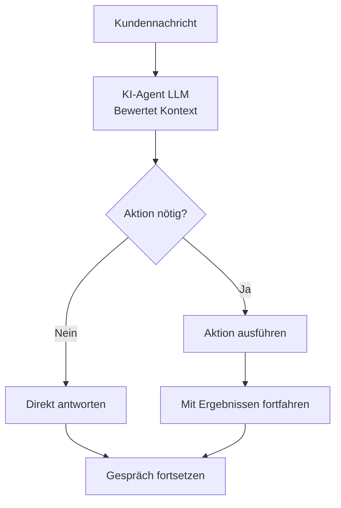

## Übersicht

Aktionen verwandeln deine KI-Agenten von reinen Gesprächsassistenten in leistungsstarke Tools zur Geschäftsautomatisierung. Über das Beantworten von Fragen hinaus können deine Agenten Termine planen, Anrufe weiterleiten, Systeme aktualisieren und sich in deine bestehenden Geschäftsabläufe integrieren - alles während sie einen natürlichen Gesprächsfluss aufrechterhalten.

Stelle sich Aktionen als Werkzeugkasten deines Agenten vor. So wie ein menschlicher Mitarbeiter verschiedene Tools zur Erledigung von Aufgaben nutzt, führt dein KI-Agent Aktionen aus, um während Kundeninteraktionen echte Arbeit zu leisten.

<Note>
Aktionen werden automatisch basierend auf dem Gesprächskontext und den Anweisungen ausgeführt, die du in der Aufforderung deines Agenten angibst. Du definierst wann und wie Aktionen verwendet werden sollten durch [Prompt Engineering](/de/build/conversation/prompt-engineering-guide).
</Note>

---

## Was sind Aktionen?

Aktionen sind vorkonfigurierte Tools, die dein Agent während Gesprächen aufrufen kann, um bestimmte Aufgaben zu erledigen. Wenn ein Kunde etwas anfordert, das eine Aktion erfordert - wie die Buchung eines Termins oder das Gespräch mit einem Spezialisten - kann dein Agent die entsprechende Aktion nahtlos ausführen.

### Wie Aktionen funktionieren

Während Gesprächen entscheidet dein Agent autonom, ob er direkt antworten oder eine Aktion ausführen soll:



Der Agent verwendet **Aktionsnamen und Beschreibungen**, um zu verstehen, was jede Aktion tut. Diese sind entscheidend dafür, dass das LLM das richtige Tool auswählt.

**Best Practices:**
- Gib Aktionen klare, beschreibende Namen (z.B. "termin_buchen" nicht "aktion1")
- Schreibe detaillierte Beschreibungen, die erklären, was die Aktion tut
- Füge explizite Anweisungen in deinen [Agentenanweisungen (System-Prompt)](/de/build/conversation/prompt-engineering-guide) hinzu, **wann** jede Aktion verwendet werden soll

<Note>
Während Aktionsnamen und Beschreibungen dem Agenten mitteilen, **was** eine Aktion tut, sollten deine Agentenanweisungen (System-Prompt) angeben, **wann** sie verwendet werden soll. Zum Beispiel: "Wenn ein Kunde darum bittet, mit einem Menschen zu sprechen, verwende die Aktion transfer_to_support."
</Note>

---

## Aktionskategorien

Aktionen sind im Dashboard in zwei Kategorien organisiert:

### Anrufsteuerung

<CardGroup cols={2}>
  <Card title="Anruf weiterleiten" icon="phone" href="/de/build/actions/transfer-details">
    Weiterleiten an einen anderen KI-Agenten, eine Telefonnummer oder SIP-Adresse
  </Card>
  <Card title="Gespräch beenden" icon="phone-slash" href="/de/build/actions/call-control">
    Lasse den Agenten das Gespräch mit einer benutzerdefinierten Nachricht beenden
  </Card>
</CardGroup>

### Integration

<CardGroup cols={2}>
  <Card title="Benutzerdefinierte Aktion" icon="code" href="/de/build/actions/custom-api-actions">
    Erstelle eine benutzerdefinierte API- oder Webhook-Aktion
  </Card>
  <Card title="Kalenderbuchung" icon="calendar" href="/de/build/actions/booking-calendar">
    Plane Termine mit Cal.com-Integration
  </Card>
</CardGroup>

---

## Wann Aktionen ausgeführt werden

Aktionen werden **während des Gesprächs** ausgeführt, wenn sie von deinem Agenten basierend auf seinen Anweisungen ausgelöst werden. Im Gegensatz zu traditionellen IVR-Systemen, die starren Skripten folgen, nutzen KI-Agenten kontextuelles Verständnis, um zu bestimmen, wann Aktionen angemessen sind.

### Auslösemechanismen

**Anweisungsbasierte Auslöser:**
```text wrap
Wenn der Kunde darum bittet, mit einem Menschen zu sprechen, verwenden Sie die Aktion 'Transfer zum Support'.

Nach erfolgreicher Terminbuchung verwenden Sie die Aktion 'Anruf höflich beenden'.

Wenn der Kunde sagt, dass er Zeit braucht, um etwas zu überprüfen, verwenden Sie die Aktion 'Inaktivitäts-Timer pausieren'.
```

**Bedingte Auslöser:**
```jinja
Wenn der Kunde ein Abrechnungsproblem meldet:
1. Verwenden Sie die Aktion 'Konto nachschlagen', um seine Informationen abzurufen
2. Wenn Saldo überfällig ist, weiterleiten an Abrechnungsabteilung
3. Wenn Saldo aktuell ist, Problem beheben


Bieten Sie VIP-Kunden immer sofort an, sie zu einem dedizierten Support zu verbinden.

```

**Mehrstufige Workflows:**
```text wrap
Terminbuchungsablauf:
1. Erforderliche Informationen sammeln (Name, E-Mail, bevorzugtes Datum)
2. Verwenden Sie die Aktion 'Verfügbarkeit prüfen', um Cal.com abzufragen
3. Optionen dem Kunden präsentieren
4. Verwenden Sie die Aktion 'Termin buchen', um zu bestätigen
5. Verwenden Sie die Aktion 'SMS-Bestätigung senden', wenn der Kunde eine Telefonnummer angegeben hat
6. Verwenden Sie die Aktion 'Anruf höflich beenden', um abzuschließen
```

<Warning>
Aktionen werden in Echtzeit während des Anrufs ausgeführt. Stelle sicher, dass deine Endpunkte zuverlässig sind und schnell antworten, um unangenehme Pausen im Gespräch zu vermeiden.
</Warning>

---

## Aktionen konfigurieren

Die gesamte Aktionskonfiguration erfolgt im Agenteneditor unter dem Tab **Fähigkeiten → Aktionen**.

<Steps>
  <Step title="Zu Aktionen navigieren">
    Öffne deinen Agenten im Editor und klicke auf **Fähigkeiten** → Tab **Aktionen**
  </Step>
  <Step title="Aktionstyp wählen">
    Durchsuche die Kategorien **Anrufsteuerung** und **Integration** und klicke auf **Hinzufügen** bei der Aktion, die du konfigurieren möchtest
  </Step>
  <Step title="Aktion konfigurieren">
    Fülle das aktionsspezifische Konfigurationsformular aus:
    - **Name**: Gib deiner Aktion einen klaren, beschreibenden Namen
    - **Beschreibung**: Erkläre, was diese Aktion tut
    - **Aktionsspezifische Einstellungen**: Konfiguriere Parameter basierend auf dem Aktionstyp
  </Step>
  <Step title="Speichern">
    Speichere die Aktion, um sie dem Werkzeugkasten deines Agenten hinzuzufügen
  </Step>
</Steps>

---

## Aktionsstatusanzeigen

Nach dem Hinzufügen von Aktionen siehst du diese im Aktionen-Tab deines Agenten mit Statusanzeigen aufgelistet:

<CardGroup cols={3}>
  <Card title="Konfiguriert" icon="circle-check">
    Aktion ist ordnungsgemäß konfiguriert und einsatzbereit
  </Card>
  <Card title="Unvollständig" icon="circle-exclamation">
    Fehlende erforderliche Konfiguration oder Anmeldeinformationen
  </Card>
  <Card title="Fehler" icon="circle-xmark">
    Konfigurationsfehler oder Authentifizierungsfehler
  </Card>
</CardGroup>

---

## Aktionen in Anweisungen referenzieren

Um Aktionen zu verwenden, referenziere diese **mit dem exakten Namen** in den Anweisungen deines Agenten:

### Direkte Referenz
```text wrap
Wenn ein Kunde darum bittet, mit jemandem über die Abrechnung zu sprechen,
verwenden Sie die Aktion 'Transfer zur Abrechnungsabteilung'.
```

### Mit Bedingungen
```text wrap
Wenn das Problem des Kunden nicht gelöst werden kann:
1. Entschuldigen Sie sich für die Unannehmlichkeiten
2. Erklären Sie, dass Sie ihn mit einem Spezialisten verbinden
3. Verwenden Sie die Aktion 'Transfer zum Support'
```

### Mit Parametern
```text wrap
Nachdem Sie die E-Mail und das bevorzugte Datum des Kunden gesammelt haben,
verwenden Sie die Aktion 'Beratungstermin buchen', um das Treffen zu planen.
```

<Note>
Aktionsnamen sind case-sensitive und müssen genau wie konfiguriert übereinstimmen. Wenn du eine Aktion umbenennst, aktualisiere alle Referenzen in deinen Anweisungen.
</Note>

---

## Best Practices für die Konfiguration

<AccordionGroup>
  <Accordion title="Einfach beginnen" icon="seedling">
    Beginne mit grundlegenden Aktionen, bevor du komplexe Integrationen hinzufügen. Füge eine Aktion nach der anderen hinzu, teste gründlich, dann füge die nächste hinzu.

    **Beispiel-Reihenfolge:**
    1. Aktion "Gespräch beenden" hinzufügen
    2. Aktion "Transfer zum Support" hinzufügen
    3. Buchungsaktion hinzufügen
    4. Benutzerdefinierte API-Aktionen hinzufügen
  </Accordion>

  <Accordion title="Verwende klare, beschreibende Namen" icon="tag">
    Aktionsnamen sind entscheidend - das LLM verwendet sie, um zu verstehen, was jedes Tool tut. Verwende beschreibende, aktionsorientierte Namen, die den Zweck der Funktion klar vermitteln.

    **Warum dies wichtig ist:** Das Modell verlässt sich auf Funktionsnamen und Beschreibungen, um zu erkennen, wann eine Funktion aufgerufen werden muss und das richtige Tool für die Aufgabe auszuwählen.

    **Gute Namen:**
    - "Kundenkonto abrufen" - Klares Aktionsverb + spezifisches Ziel
    - "Transfer zur Abrechnungsabteilung" - Spezifisches Ziel enthalten
    - "30-Minuten-Beratung buchen" - Enthält relevante Details

    **Schlechte Namen:**
    - "Aktion 1" - Kein Kontext darüber, was sie tut
    - "Transfer" - Zu allgemein, unklar wohin
    - "API-Aufruf" - Beschreibt die Aktion nicht
  </Accordion>

  <Accordion title="Schreibe detaillierte Beschreibungen" icon="file-lines">
    Aktionsbeschreibungen helfen dem LLM zu verstehen, **was** die Aktion tut. Die Beschreibung sollte den Zweck der Aktion, was sie zurückgibt und welche Parameter sie verwendet, erklären.

    **Best Practices von [OpenAI function calling](https://platform.openai.com/docs/guides/function-calling):**
    - Beschreibe klar, was die Aktion tut und was sie zurückgibt
    - Erkläre, welche Parameter oder Daten sie verwendet
    - Verwende präzise Sprache, die das Verständnis des Modells leitet
    - Halte es prägnant und dennoch umfassend

    **Beispiel:**
    ```
    Name: Kundenkonto abrufen
    Beschreibung: Ruft Kundenkontodaten aus Salesforce CRM mit
    ihrer Telefonnummer ab. Gibt Kontostatus, Saldo und letzte Bestellungen zurück.
    ```

    **Hinweis:** Beschreibe **was** die Aktion in der Beschreibung tut. Gib **wann** sie verwendet werden soll in deinen [Agentenanweisungen (System-Prompt)](/de/build/conversation/prompt-engineering-guide) an.
  </Accordion>

  <Accordion title="Gründlich testen" icon="vial">
    Teste jede Aktion in der Agenten-Testoberfläche, bevor du live gehen:
    - Überprüfe, ob die Aktion korrekt ausgeführt wird
    - Teste Erfolgsszenarien
    - Teste Fehlerszenarien
    - Überprüfe die Fehlerbehandlung
    - Überprüfe den Gesprächsfluss
  </Accordion>

  <Accordion title="Fehler elegant behandeln" icon="shield-check">
    Konfiguriere Fallback-Verhaltensweisen für den Fall, dass Aktionen fehlschlagen. Weise deinen Agenten an, was zu tun ist, wenn Aktionen nicht funktionieren.

    ```
    Wenn die Aktion 'Termin buchen' fehlschlägt:
    1. Entschuldigen Sie sich aufrichtig
    2. Bieten Sie an, dass jemand zurückruft, um einen Termin zu vereinbaren
    3. Sammeln Sie ihre bevorzugte Rückrufnummer
    4. Verwenden Sie die Aktion 'Anruf höflich beenden'
    ```
  </Accordion>

  <Accordion title="Sammle zuerst Informationen" icon="clipboard-check">
    Stelle sicher, dass Agenten erforderliche Daten sammeln, bevor sie Aktionen ausführen. Versuche nicht, Termine ohne E-Mail-Adressen zu buchen oder Anrufe weiterzuleiten, ohne zu erklären warum.

    ```
    Vor Verwendung der Aktion 'Beratungstermin buchen':
    1. Bestätigen Sie, dass der Kunde einen Termin vereinbaren möchte
    2. Fragen Sie nach seiner E-Mail-Adresse, wenn nicht im Kontaktdatensatz vorhanden
    3. Besprechen Sie seine bevorzugten Daten und Zeiten
    4. Erklären Sie, was die Beratung abdecken wird
    5. Erst dann die Buchungsaktion ausführen
    ```
  </Accordion>

  <Accordion title="Anmeldeinformationen sichern" icon="lock">
    Verwende geeignete Authentifizierung für alle benutzerdefinierten Aktionen. Exponiere niemals API-Schlüssel oder Anmeldeinformationen in URLs oder unverschlüsselten Feldern.

    - Verwende Bearer-Token für API-Authentifizierung
    - Verwende Basic Auth nur über HTTPS
    - Speichere sensible Anmeldeinformationen sicher
    - Rotiere Anmeldeinformationen regelmäßig
  </Accordion>
</AccordionGroup>

---

## Aktionen testen

Vor der Bereitstellung von Agenten mit Aktionen teste gründlich in der Dashboard-Testoberfläche:

<Steps>
  <Step title="Testoberfläche öffnen">
    Klicke auf **Testanruf** in der oberen rechten Ecke des Agenteneditors
  </Step>
  <Step title="Web-Anruf starten">
    Klicke auf **Web-Anruf starten**, um ein Testgespräch zu beginnen
  </Step>
  <Step title="Jede Aktion auslösen">
    Durchlaufe Szenarien, die jede konfigurierte Aktion auslösen
  </Step>
  <Step title="Ausführung überprüfen">
    Überprüfe, dass Aktionen korrekt ausgeführt werden und Antworten angemessen behandeln
  </Step>
  <Step title="Fehlerfälle testen">
    Simuliere Fehler, um zu überprüfen, dass die Fehlerbehandlung wie erwartet funktioniert
  </Step>
  <Step title="Transkript überprüfen">
    Untersuche das Gesprächstranskript, um sicherzustellen, dass der Fluss natürlich ist und Aktionen sich nahtlos integrieren
  </Step>
</Steps>

### Was zu testen ist

**Für Transfer-Aktionen:**
- Transfer wird zum richtigen Ziel ausgeführt
- Wartemusik wird abgespielt, wenn konfiguriert
- Transfer-Nachricht ist angemessen
- Kalt- vs. Warmtransfer-Modi funktionieren korrekt

**Für Buchungsaktionen:**
- Verfügbarkeit wird korrekt abgerufen
- Buchung wird erfolgreich bestätigt
- E-Mail/SMS-Benachrichtigungen werden ordnungsgemäß gesendet
- Zeitzonen-Behandlung ist genau

**Für benutzerdefinierte Aktionen:**
- API-Aufrufe erfolgreich
- Authentifizierung funktioniert
- Antwortdaten sind für den Agenten verfügbar
- Fehlerantworten werden elegant behandelt

**Für alle Aktionen:**
- Agent referenziert Aktion mit korrektem Namen
- Agent sammelt zuerst erforderliche Informationen
- Gesprächsfluss bleibt natürlich
- Fehler brechen das Gespräch nicht ab

<Warning>
Testanrufe verwenden echte Integrationen. Wenn du eine Buchungsaktion testest, werden echte Termine in deinem Cal.com-Konto erstellt. Bereinige danach Testdaten.
</Warning>

---

## Häufige Anwendungsfälle

### Kundensupport-Workflow

```text wrap
Agentenkonfiguration:
- Transfer zum Support (für komplexe Probleme)
- Kundenkonto nachschlagen (benutzerdefinierte API)
- Support-Ticket erstellen (benutzerdefinierte API)
- Anruf höflich beenden

Anweisungen:
Wenn ein Kunde anruft:
1. Begrüßen Sie ihn herzlich
2. Verwenden Sie 'Kundenkonto nachschlagen', um seine Informationen abzurufen
3. Fragen Sie nach seinem Problem
4. Wenn Sie es lösen können, tun Sie dies mit der Wissensdatenbank
5. Wenn es komplex ist, verwenden Sie 'Support-Ticket erstellen' und geben Sie die Ticket-Nummer an
6. Wenn der Kunde einen Menschen wünscht, verwenden Sie 'Transfer zum Support'
7. Wenn gelöst, verwenden Sie 'Anruf höflich beenden'
```

### Terminbuchungs-Workflow

```text wrap
Agentenkonfiguration:
- Beratungstermin buchen (Cal.com-Buchung)
- SMS-Bestätigung senden (optional)
- Transfer zur Terminplanung (Fallback)
- Anruf höflich beenden

Anweisungen:
Wenn ein Kunde buchen möchte:
1. Fragen Sie, welche Art von Termin er benötigt
2. Sammeln Sie die E-Mail-Adresse, wenn nicht im Kontaktdatensatz vorhanden
3. Besprechen Sie seine bevorzugten Daten
4. Verwenden Sie 'Beratungstermin buchen', um Verfügbarkeit anzuzeigen und zu bestätigen
5. Wenn Buchung erfolgreich, bestätigen Sie Details mündlich
6. Wenn Buchung fehlschlägt, verwenden Sie 'Transfer zur Terminplanung'
7. Verwenden Sie 'Anruf höflich beenden', um abzuschließen
```

### Vertriebsqualifizierungs-Workflow

```text wrap
Agentenkonfiguration:
- Unternehmensdaten nachschlagen (benutzerdefinierte API)
- CRM-Lead aktualisieren (benutzerdefinierte API)
- Transfer zum Vertrieb (für qualifizierte Leads)
- Anruf höflich beenden

Anweisungen:
Für ausgehende Vertriebsanrufe:
1. Stellen Sie sich und Ihren Zweck vor
2. Verwenden Sie 'Unternehmensdaten nachschlagen', um Firmendaten abzurufen
3. Stellen Sie qualifizierende Fragen (Budget, Zeitplan, Autorität)
4. Verwenden Sie 'CRM-Lead aktualisieren' mit Qualifizierungsstatus
5. Wenn qualifiziert, verwenden Sie 'Transfer zum Vertrieb' mit Kontext
6. Wenn nicht qualifiziert, bedanken Sie sich und verwenden Sie 'Anruf höflich beenden'
```

---

## Fehlerbehebung häufiger Probleme

<AccordionGroup>
  <Accordion title="Aktion wird nicht ausgelöst" icon="circle-exclamation">
    **Problem:** Agent verwendet die Aktion nicht, obwohl er sollte.

    **Lösungen:**
    - Überprüfe, ob der Aktionsname in den Anweisungen genau übereinstimmt (case-sensitive)
    - Überprüfe, ob der Aktionsstatus "Konfiguriert" ist, nicht "Unvollständig" oder "Fehler"
    - Mache Anweisungen expliziter darüber, wann die Aktion verwendet werden soll
    - Teste isoliert, indem du den Agenten explizit aufforderst, die Aktion zu verwenden
    - Überprüfe das Gesprächstranskript, um die Argumentation des Agenten zu sehen
  </Accordion>

  <Accordion title="Agent sagt, Aktion wird ausgeführt, aber tut es nicht" icon="comments">
    **Problem:** Agent bestätigt mündlich, dass er eine Aktion ausführt (z.B. "Ich verbinde du jetzt"), aber die Aktion wird erst im nächsten Gesprächszug ausgeführt.

    **Warum dies passiert:** Der Agent generiert eine Antwort und führt die Aktion im selben Zug aus, aber nur eines kann pro Zug passieren.

    **Lösung:** Fordere den Agenten auf, vor der Ausführung von Aktionen um Benutzerbestätigung zu bitten:

    ```jinja
    Vor Verwendung der Aktion 'Transfer zum Support':
    1. Erklären Sie, warum Sie ihn weiterleiten
    2. Fragen Sie "Möchten Sie, dass ich Sie jetzt verbinde?"
    3. Warten Sie auf Bestätigung
    4. Sobald bestätigt, führen Sie die Aktion 'Transfer zum Support' aus
    ```

    Dies stellt sicher, dass der Agent die Aktion unmittelbar nach Erhalt der Bestätigung ausführt, nicht im selben Zug wie die Ankündigung.
  </Accordion>

  <Accordion title="Authentifizierungsfehler" icon="key">
    **Problem:** Benutzerdefinierte Aktionen schlagen mit 401/403-Fehlern fehl.

    **Lösungen:**
    - Überprüfe, ob die Anmeldeinformationen korrekt sind und nicht abgelaufen sind
    - Überprüfe, ob der Authentifizierungstyp den API-Anforderungen entspricht
    - Stelle sicher, dass Bearer-Token das Präfix "Bearer" enthalten, falls erforderlich
    - Teste den Endpunkt unabhängig mit Postman oder curl
    - Überprüfe die API-Dokumentation zum Authentifizierungsformat
  </Accordion>

  <Accordion title="Buchungsaktion schlägt fehl" icon="calendar-xmark">
    **Problem:** Cal.com-Buchungsaktion gibt Fehler zurück.

    **Lösungen:**
    - Überprüfe, ob die Cal.com-Integration verbunden ist
    - Überprüfe, ob der Ereignistyp existiert und aktiv ist
    - Stelle sicher, dass die Meeting-Plattform in Cal.com konfiguriert ist
    - Überprüfe, ob Planungsfenster angeforderte Daten zulassen
    - Überprüfe die Zeitzonenkonfiguration
    - Teste die Buchung manuell in Cal.com, um die Verfügbarkeit zu überprüfen
  </Accordion>

  <Accordion title="Transfer verbindet nicht" icon="phone-slash">
    **Problem:** Transfer-Aktion wird ausgeführt, aber verbindet nicht.

    **Lösungen:**
    - Überprüfe, ob das Ziel im korrekten E.164-Format ist (z.B. +15551234567)
    - Stelle sicher, dass die Telefonnummer erreichbar ist (für Telefontransfers)
    - Überprüfe, ob die SIP-Adresse korrekt ist (für SIP-Transfers)
    - Teste das Ziel unabhängig
  </Accordion>

</AccordionGroup>

---

## Nächste Schritte

<CardGroup cols={2}>
  <Card title="Anrufsteuerungsaktionen" icon="phone" href="/de/build/actions/call-control">
    Konfiguriere Transfer-, Gesprächsbeendigungs- und Inaktivitätsverwaltungsaktionen
  </Card>
  <Card title="Transfer-Details" icon="right-left" href="/de/build/actions/transfer-details">
    Meistern du Transfer-Ziele, Modi und erweiterte Einstellungen
  </Card>
  <Card title="Buchungsintegration" icon="calendar" href="/de/build/actions/booking-calendar">
    Richte Cal.com-Terminplanung mit E-Mail- und SMS-Benachrichtigungen ein
  </Card>
  <Card title="Benutzerdefinierte API-Aktionen" icon="code" href="/de/build/actions/custom-api-actions">
    Verbinde deine Agenten mit externen Systemen und APIs
  </Card>
  <Card title="Anweisungsleitfaden" icon="pen" href="/de/build/conversation/instructions">
    Erfahre, wie du effektive Agentenanweisungen schreibst
  </Card>
  <Card title="Prompt Engineering" icon="book" href="/de/build/conversation/prompt-engineering-guide">
    Meistere fortgeschrittene Prompting-Techniken für zuverlässiges Agentenverhalten
  </Card>
</CardGroup>
