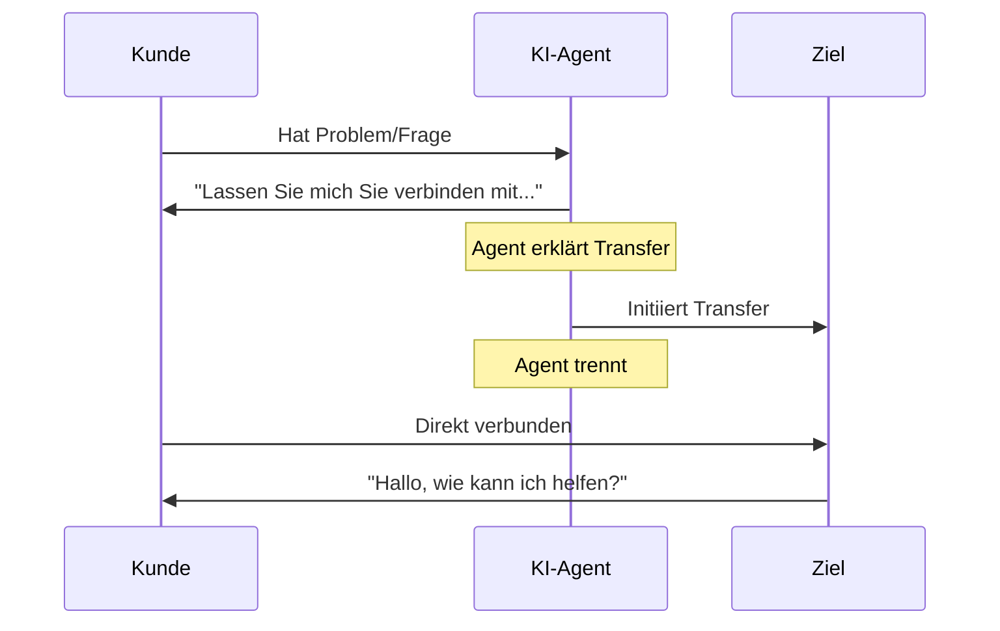

## Übersicht

Die Transfer-Aktion ist eines der leistungsstärksten Anrufsteuerungstools und ermöglicht es deinen KI-Agenten, Gespräche nahtlos an das richtige Ziel weiterzuleiten, wenn spezialisierte Hilfe benötigt wird. Ob Weiterleitung an menschliche Spezialisten, andere KI-Agenten oder externe Telefonsysteme - eine ordnungsgemäße Transfer-Konfiguration gewährleistet reibungslose Übergaben, welche die Kundenzufriedenheit aufrechterhalten.

Dieser umfassende Leitfaden deckt alles ab, was du über Transfer-Ziele, Transfer-Modi, erweiterte Einstellungen und Best Practices für zuverlässiges Anruf-Routing wissen musst.

<Note>
Transfers erfolgen in Echtzeit während aktiver Anrufe. Der Kunde bleibt in der Leitung, während er mit dem neuen Ziel verbunden wird - er wird nicht aufgelegt oder muss zurückrufen.
</Note>

---

## Transfer-Ziele

itellicoAI unterstützt drei Arten von Transfer-Zielen. Wähle dasjenige, das zu deinem Workflow passt:

<AccordionGroup>
  <Accordion title="Agenten-Transfer" icon="users" defaultOpen>
    Leite Anrufe an andere KI-Agenten in deinem itellicoAI-Konto weiter.

    ### Anwendungsfälle

    <CardGroup cols={2}>
      <Card title="Spezialisierte Agenten" icon="user-gear">
        Weiterleitung zu Agenten mit spezifischem Wissen (Abrechnung, Technik, Vertrieb)
      </Card>
      <Card title="Sprach-Routing" icon="language">
        Transfer zu Agenten, die für verschiedene Sprachen konfiguriert sind
      </Card>
      <Card title="Abteilungs-Routing" icon="sitemap">
        Direktweiterleitung zu Agenten, die für spezifische Abteilungen entwickelt wurden
      </Card>
      <Card title="Fähigkeitsbasiertes Routing" icon="certificate">
        Verbindung zu Agenten mit spezialisierten Fähigkeiten
      </Card>
    </CardGroup>

    ### Konfiguration

    <Steps>
      <Step title="Transfer-Typ auswählen">
        Wähle **AGENT** als Transfer-Typ
      </Step>
      <Step title="Zielagenten auswählen">
        Wähle den Zielagenten aus dem Dropdown-Menü
      </Step>
      <Step title="Optional: Wartemusik hinzufügen">
        Lade Audio hoch, das während der Verbindung abgespielt wird (optional)
      </Step>
      <Step title="Optional: Klingelton hinzufügen">
        Füge einen Klingelton während des Transfers hinzu (optional)
      </Step>
    </Steps>

    ### Audio-Einstellungen

    Agenten-Transfers unterstützen anpassbare Wartemusik und Klingeltöne:

    **Wartemusik:**
    - Spiele Musik ab, während der Kunde auf die Verbindung wartet
    - Dauer: 1-30 Sekunden (Standard: 6 Sekunden)
    - Verwendung für: Professionelle Erfahrung während Verbindungsverzögerungen
    - Nicht empfohlen für: Sofortige Transfers, wenn eine unmittelbare Verbindung bevorzugt wird

    **Klingeldauer:**
    - Klingelton abspielen, während auf die Antwort des Zielagenten gewartet wird
    - Dauer: 1-30 Sekunden (Standard: 4 Sekunden)
    - Standardmäßig aktiviert
    - Simuliert normales Anruferlebnis

    **Kombinierte Einstellungen:**
    Du kannst beide für eine vollständige Transfer-Erfahrung aktivieren:
    1. Musik wird abgespielt (z.B. 6 Sekunden) - Professionelle Warteerfahrung
    2. Klingeln wird abgespielt (z.B. 4 Sekunden) - Verbindung läuft
    3. Agent antwortet - Transfer abgeschlossen

    **Gesamtverzögerung:** Musikdauer + Klingeldauer (z.B. 10 Sekunden)

    <Info>
    Für sofortige Agent-zu-Agent-Transfers deaktiviere sowohl Musik als auch Klingeln für sofortige Verbindung.
    </Info>

    ### Vorteile

    - Gesprächsverlauf wird mit dem Anruf übertragen
    - Keine zusätzlichen Telefoniekosten
    - Sofortige Verbindung (keine Wählverzögerung)
    - Vollständige Kontextbewahrung
    - Anpassbare Wartemusik und Klingelton

    ### Beispielanweisungen

    ```
    Wenn ein Kunde ein technisches Problem meldet, das Fehlerbehebung erfordert:
    1. Sammle grundlegende Informationen über das Problem
    2. Erkläre, dass du ihn mit einem technischen Spezialisten verbindest
    3. Verwende die Aktion 'Transfer zum technischen Agenten'
    ```
  </Accordion>

  <Accordion title="Telefonnummern-Transfer" icon="phone">
    Leite Anrufe an externe Telefonnummern weiter - Mobiltelefone, Festnetzanschlüsse oder Geschäftsnummern.

    ### Anwendungsfälle

    <CardGroup cols={2}>
      <Card title="Menschliche Spezialisten" icon="user-headset">
        Verbindung zu Live-Support-Agenten
      </Card>
      <Card title="Bereitschaftsteams" icon="mobile">
        Weiterleitung zu Mobiltelefonen für dringende Probleme
      </Card>
      <Card title="Externe Abteilungen" icon="building">
        Transfer zu Teams außerhalb deines Kontos
      </Card>
      <Card title="Notfallkontakte" icon="triangle-exclamation">
        Eskalation kritischer Situationen
      </Card>
    </CardGroup>

    ### Konfiguration

    <Steps>
      <Step title="Transfer-Typ auswählen">
        Wähle **PHONE** als Transfer-Typ
      </Step>
      <Step title="Telefonnummer eingeben">
        Gib das Ziel im E.164-Format ein: `+1-555-123-4567`

        **Formatanforderungen:**
        - Muss Ländervorwahl enthalten (+1 für USA/Kanada)
        - Keine Leerzeichen, Bindestriche oder Klammern
        - Beispiele: `+14155551234`, `+442071234567`, `+61398765432`
      </Step>
    </Steps>

    ### Kosten & Einschränkungen

    <Warning>
    **Wichtig:**
    - Telefon-Transfers verursachen ausgehende Anrufkosten (Tarife variieren je nach Ziel)
    - **Funktionieren nur während aktiver Telefonanrufe** (nicht bei Web-Anrufen oder Widget-Gesprächen)
    - Überprüfe Telefonnummern, um Gebühren oder fehlgeschlagene Transfers zu vermeiden
    </Warning>

    ### Beispielanweisungen

    ```
    Für dringende Probleme außerhalb der Geschäftszeiten:
    1. Überprüfe, ob das Problem wirklich dringend ist
    2. Sammle wichtige Details (Kundenname, Problemzusammenfassung)
    3. Erkläre, dass du mit dem Bereitschaftsmanager verbindest
    4. Verwende die Aktion 'Transfer zum Bereitschaftsmanager'
    ```
  </Accordion>

  <Accordion title="SIP-Adressen-Transfer" icon="network-wired">
    Leite Anrufe an SIP-Adressen (Session Initiation Protocol URIs) für die Integration mit PBX-Systemen und Contact-Centern weiter.

    ### Anwendungsfälle

    <CardGroup cols={2}>
      <Card title="PBX-Integration" icon="phone-office">
        Weiterleitung zu internen Nebenstellen
      </Card>
      <Card title="Contact-Center" icon="users-viewfinder">
        Transfer zu ACD-Warteschlangensystemen
      </Card>
      <Card title="Unternehmenstelefonie" icon="building-columns">
        Verbindung zu Unternehmenstelefonanlagen
      </Card>
      <Card title="VoIP-Plattformen" icon="cloud">
        Integration mit Voice-Infrastruktur
      </Card>
    </CardGroup>

    ### Konfiguration

    <Steps>
      <Step title="Voraussetzungen">
        Vor der Konfiguration von SIP-Transfers:
        - SIP-Trunk in itellicoAI konfiguriert
        - Ziel-SIP-Endpunkt erreichbar
        - Ordnungsgemäße Authentifizierung konfiguriert
        - Netzwerk-Routing eingerichtet
      </Step>
      <Step title="Transfer-Typ auswählen">
        Wähle **SIP** als Transfer-Typ
      </Step>
      <Step title="SIP-Adresse eingeben">
        Gib die Ziel-SIP-URI ein: `sip:1001@yourpbx.example.com`

        **Formatanforderungen:**
        - Muss gültige SIP-URI sein
        - Benutzername und Domain einschließen
        - Beispiele: `sip:support@pbx.company.com`, `sip:1234@10.0.1.50`
      </Step>
    </Steps>

    <Tip>
    SIP-Transfers sind ideal für Unternehmen mit bestehenden Telefonanlagen. du bieten nahtlose Integration zwischen KI-Agenten und traditioneller Telefonie-Infrastruktur.
    </Tip>

    <Warning>
    **SIP-Transfers funktionieren nur während aktiver Telefonanrufe.** Du kannst sie nicht während Web-Anrufen oder Widget-Gesprächen verwenden.
    </Warning>

    ### Beispielanweisungen

    ```
    Für allgemeine Support-Anfragen:
    1. Sammle Anruferinformationen
    2. Erkläre die geschätzte Wartezeit
    3. Verwende die Aktion 'Transfer zur Support-Warteschlange'
    ```
  </Accordion>
</AccordionGroup>

---

## Transfer-Modi

### Kalttransfer (Standard)

Der Agent leitet den Anruf sofort weiter und trennt die Verbindung. Der Kunde wird direkt mit dem Ziel verbunden, ohne dass der Agent ihn vorstellt.

#### Wie es funktioniert



#### Beispielablauf

```
Kunde: "Ich habe eine Abrechnungsfrage"
Agent: "Gerne helfe ich Ihnen. Lassen Sie mich Sie mit unserer Abrechnungsabteilung
        verbinden, die auf Ihre Kontodaten zugreifen kann."
[Kalttransfer zur Abrechnung → Agent trennt]
Abrechnungsagent: "Hallo, wie kann ich Ihnen helfen?"
Kunde: "Ich habe eine Frage zu meiner Rechnung..."
```

#### Option für stillen Transfer

<Accordion title="Stillen Transfer aktivieren (Optional)" icon="phone-slash">
  Du kannst den **Stiller Transfer**-Modus aktivieren, bei dem der Agent ohne etwas zu sagen weiterleitet - der Anruf wird sofort zum Ziel geleitet.

  **Wie es funktioniert:**
  1. Agentenlogik löst Transferbedarf aus
  2. Transfer wird ohne Ankündigung ausgeführt
  3. Kunde wird still zum Ziel geleitet

  **Wann zu verwenden:**
  - Reines Routing, noch kein Gespräch (IVR-Ersatz)
  - Menübasiertes Routing
  - Spracherkennung und automatisches Routing

  **Konfiguration:**
  - Aktiviere das Kontrollkästchen **Stiller Transfer**
  - Jede Transfer-Nachricht wird ignoriert, wenn der stille Modus aktiviert ist

  **Beispiel:**
  ```
  Agent: Sprach-Router (stiller Routing-Agent)

  Anweisungen:
  Basierend auf der Sprache, die der Kunde spricht:
  - Wenn Spanisch erkannt, verwende 'Transfer zum spanischen Agenten' (still)
  - Wenn Französisch erkannt, verwende 'Transfer zum französischen Agenten' (still)
  - Wenn Englisch, Gespräch fortsetzen
  ```

  <Warning>
  Stille Transfers können für Kunden abrupt wirken. Sparsam und nur bei geeignetem Anwendungsfall verwenden.
  </Warning>
</Accordion>

### Warmtransfer

<Card title="Demnächst verfügbar" icon="clock">
  **Warmtransfers** verwenden einen Dreiwege-Anruf-Ansatz: Der Kunde hört Wartemusik, während der KI-Agent im Hintergrund einen neuen Anruf zum Ziel initiiert. Sobald das Ziel antwortet, gibt der KI-Agent Kontext (über Flüsternachricht, Zusammenfassung oder Dreiwege-Einführung), bevor der Kunde verbunden wird. Dies stellt sicher, dass der empfangende Agent informiert und vorbereitet ist, bevor er mit dem Kunden spricht.

  **Wie es funktioniert:**

  1. Kunde wird in die Warteschleife gelegt (hört Wartemusik)
  2. KI initiiert neuen Anruf zum Ziel im Hintergrund
  3. Ziel antwortet, KI gibt Briefing
  4. Kunde wird mit gebrieftem Zielagenten verbunden

  **Hauptunterschied zum Kalttransfer:** KI hält beide Anrufleitungen aufrecht und brieft das Ziel, bevor der Kunde verbunden wird, anstatt sofort zu trennen.

  Diese Funktion befindet sich derzeit in der Entwicklung und wird in einer zukünftigen Version verfügbar sein.
</Card>

---

## Unterstützung mehrerer Ziele

Erstelle mehrere Transfer-Aktionen für verschiedene Ziele, um verschiedene Routing-Szenarien zu handhaben:

<AccordionGroup>
  <Accordion title="Vollständige Routing-Konfiguration" icon="sitemap">
    Konfiguriere mehrere Transfer-Ziele für umfassendes Routing:

    ```text wrap
    Agent: Kundendienst-Router

    Konfigurierte Transfer-Aktionen:
    1. Transfer zur Abrechnungsabteilung (+1-555-100-0001)
    2. Transfer zum technischen Support (+1-555-100-0002)
    3. Transfer zum Vertriebsteam (+1-555-100-0003)
    4. Transfer zur Rücksendungsabteilung (+1-555-100-0004)
    5. Transfer zum Manager (sip:manager@pbx.company.com)
    6. Transfer zum spanischen Agenten (Agent-ID: ag_spanish_01)

    Anweisungen:
    Leite Kunden zur entsprechenden Abteilung:

    Abrechnungsfragen → 'Transfer zur Abrechnungsabteilung'
    Technische Probleme → 'Transfer zum technischen Support'
    Vertriebsanfragen → 'Transfer zum Vertriebsteam'
    Rücksendungsanfragen → 'Transfer zur Rücksendungsabteilung'
    Eskalationen → 'Transfer zum Manager'
    Spanischsprachige → 'Transfer zum spanischen Agenten'

    Erkläre immer, mit wem du sie verbindest, bevor du weiterleitest.
    ```
  </Accordion>

  <Accordion title="Fallback-Ketten" icon="arrow-turn-down-right">
    Konfiguriere mehrere Transfer-Optionen mit Fallback-Logik:

    ```text wrap
    Primärer Eskalationspfad:
    1. Versuche 'Transfer zum technischen Support'
    2. Wenn fehlgeschlagen, versuche 'Transfer zum allgemeinen Support'
    3. Wenn das fehlschlägt, versuche 'Transfer zum Manager'
    4. Wenn alles fehlschlägt, entschuldige dich und plane Rückruf

    Anweisungen:
    Wenn der primäre Transfer fehlschlägt, sollte der Agent das Backup versuchen,
    und vollständiges Versagen elegant behandeln, indem er Rückrufinformationen sammelt.
    ```
  </Accordion>

  <Accordion title="Bedingtes Routing" icon="code-branch">
    Verwende verschiedene Transfers basierend auf Kundendaten oder Gesprächskontext:

    ```jinja
    
    Leite Unternehmenskunden zu 'Transfer zum Enterprise-Support'
    
    Leite Premium-Kunden zu 'Transfer zum Premium-Support'
    
    Leite Standardkunden zu 'Transfer zum allgemeinen Support'
    
    ```
  </Accordion>
</AccordionGroup>

---

## Best Practices

<AccordionGroup>
  <Accordion title="Transfer immer erklären" icon="comment">
    Leite niemals Anrufe ohne Kontext weiter. Erkläre, mit wem du sie verbindest und warum.

    **Gut:**
    ```
    "Ich verstehe, dass du Hilfe bei deiner Rechnung benötigst. Lass mich dich
    mit unserer Abrechnungsabteilung verbinden, die auf dein Konto zugreifen und
    alle notwendigen Anpassungen vornehmen kann. Das sollte nur einen Moment dauern."
    ```

    **Schlecht:**
    ```
    "Bitte warten." [sofortiger Transfer]
    ```
  </Accordion>

  <Accordion title="Kundenerwartungen setzen" icon="clock">
    Teile Kunden mit, was sie während und nach dem Transfer erwarten können.

    **Gut:**
    ```
    "Ich werde dich mit unserem technischen Team verbinden. Du hörst
    eine kurze Wartenachricht, dann werden sie innerhalb von 30 Sekunden abnehmen.
    Deine Informationen stehen bereit."
    ```

    **Schlecht:**
    ```
    "Verbinde jetzt." [Kunde weiß nicht, was passiert]
    ```
  </Accordion>

  <Accordion title="Zuerst Informationen sammeln" icon="clipboard">
    Sammle grundlegende Details, bevor du weiterleitest, damit der Empfänger Kontext hat und der Kunde sich nicht wiederholen muss.

    ```
    Vor dem Weiterleiten:
    1. Kundennamen erfassen
    2. Grundlegendes Problem verstehen
    3. Konto-/Bestellnummer erfassen, falls relevant
    4. Nach Dringlichkeit fragen
    5. Dann mit Kontext weiterleiten
    ```
  </Accordion>

  <Accordion title="Beschreibende Namen verwenden" icon="tag">
    Benenne jede Transfer-Aktion klar basierend auf dem Ziel.

    **Gut:**
    - "Transfer zur Abrechnungsabteilung"
    - "Eskalation zum technischen Support"
    - "Weiterleitung zum spanischsprachigen Agenten"
    - "Verbindung zum Bereitschaftsmanager"

    **Schlecht:**
    - "Transfer 1"
    - "Telefon-Transfer"
    - "Eskalieren"
  </Accordion>

  <Accordion title="Transfer-Fehler behandeln" icon="triangle-exclamation">
    Habe immer einen Plan für den Fall, dass Transfers fehlschlagen (besetzt, keine Antwort, etc.).

    ```
    Wenn die Aktion 'Transfer zum Support' fehlschlägt:
    1. Entschuldigen: "Es tut mir leid, ich habe gerade Schwierigkeiten, eine Verbindung herzustellen"
    2. Rückruf anbieten: "Ich kann unser Support-Team dich innerhalb der
       nächsten Stunde zurückrufen lassen"
    3. Rückrufnummer und beste Zeit erfassen
    4. Bestätigen: "Großartig, erwarte einen Anruf von uns unter [Nummer] innerhalb der Stunde"
    5. Aktion 'Anruf höflich beenden' verwenden
    ```
  </Accordion>

  <Accordion title="E.164-Format für Telefonnummern verwenden" icon="phone">
    Formatiere Telefonnummern immer korrekt, um Transfer-Fehler zu vermeiden.

    **Korrektes E.164-Format:**
    - Ländervorwahl einschließen: `+1` für USA/Kanada
    - Keine Leerzeichen, Bindestriche oder Klammern
    - Beispiele: `+14155551234`, `+442071234567`

    **Falsche Formate:**
    - ❌ `(415) 555-1234`
    - ❌ `415-555-1234`
    - ❌ `14155551234` (fehlendes +)
    - ❌ `+1 415 555 1234` (Leerzeichen)
  </Accordion>

  <Accordion title="Kosten für Telefon-Transfers berücksichtigen" icon="dollar-sign">
    Sei dir der Telefoniekosten bewusst, besonders bei internationalen Transfers.

    **Kostenoptimierung:**
    - Verwende Agenten-Transfers, wenn möglich (kostenlos)
    - Verwende SIP-Transfers für internes Routing (typischerweise kostenlos oder kostengünstig)
    - Beschränke Telefon-Transfers auf notwendige Eskalationen
    - Überwache Transfer-Häufigkeit und -Kosten
    - Richte Warnungen für ungewöhnliche Transfer-Volumina ein
  </Accordion>

</AccordionGroup>

---

## Transfer-Aktionen testen

Teste alle Transfer-Ziele, bevor du live gehst, um zuverlässigen Betrieb sicherzustellen:

**Wesentliche Tests:**
- Transfer wird ausgeführt und Ziel empfängt Anruf
- Audioqualität ist in beiden Richtungen gut
- Agent erklärt Transfer angemessen in Anweisungen
- Fehlerszenarien werden elegant behandelt (keine Antwort, Besetztzeichen, ungültiges Ziel)
- Test von verschiedenen Anrufquellen (Telefon, Web)

<Info>
Für Telefon-/SIP-Transfers bestätige ordnungsgemäße E.164-Formatierung und Zielerreichbarkeit.
</Info>

---

## Fehlerbehebung

<AccordionGroup>
  <Accordion title="Transfer verbindet, bricht aber sofort ab" icon="phone-slash">
    **Symptome:** Transfer scheint zu verbinden, aber Anruf endet sofort

    **Mögliche Ursachen:**
    - Ziel nicht für Transferannahme konfiguriert
    - SIP-Endpunkt-Konfigurationsproblem
    - Agent nicht aktiv (bei Agenten-Transfers)
    - Netzwerk-/Firewall-Blockierung

    **Lösungen:**
    - Überprüfe, ob Zielagent aktiv und veröffentlicht ist
    - Teste Zieltelefonnummer unabhängig
    - Überprüfe SIP-Trunk-Konfiguration und Authentifizierung
    - Überprüfe Firewall-Regeln für SIP-Verkehr
    - Prüfe auf "Nicht stören" oder Anrufblockierung am Ziel
  </Accordion>

  <Accordion title="Kein Audio nach Transfer" icon="volume-xmark">
    **Symptome:** Transfer verbindet, aber kein Audio in einer oder beiden Richtungen

    **Mögliche Ursachen:**
    - RTP (Media)-Ports blockiert
    - NAT-Traversal-Probleme
    - Codec-Inkompatibilität
    - SIP-Endpunkt-Audioeinstellungen

    **Lösungen:**
    - Überprüfe, ob RTP-Ports offen sind (typischerweise 10000-20000)
    - Überprüfe NAT-Konfiguration auf SIP-Endpunkten
    - Stelle sicher, dass kompatible Codecs konfiguriert sind (G.711, Opus)
    - Teste Audio mit einfachem Testanruf zuerst
    - Überprüfe SIP-Trunk-Audioeinstellungen
  </Accordion>

  <Accordion title="Telefon-Transfers schlagen mit Fehler fehl" icon="circle-exclamation">
    **Symptome:** Transfer-Aktion gibt Fehler zurück, Anruf nicht verbunden

    **Mögliche Ursachen:**
    - Ungültiges Telefonnummernformat
    - Unzureichendes Kontoguthaben
    - Nummer nicht erreichbar
    - Carrier-Einschränkungen

    **Lösungen:**
    - Überprüfe E.164-Format: +14155551234 (nicht (415) 555-1234)
    - Überprüfe Kontoguthaben und Telefonie-Guthaben
    - Teste mit anderer Telefonnummer
    - Überprüfe, ob Zielland unterstützt wird
    - Prüfe auf Carrier-Blockierung oder Spam-Filter
  </Accordion>

  <Accordion title="Agenten-Transfers bewahren Kontext nicht" icon="message-slash">
    **Symptome:** Kontext/Verlauf nicht für empfangenden Agenten verfügbar

    **Mögliche Ursachen:**
    - Konfigurationsproblem
    - Agenten in verschiedenen Konten
    - Transfer-Modus-Einstellung

    **Lösungen:**
    - Überprüfe, ob beide Agenten im selben itellicoAI-Konto sind
    - Überprüfe, ob Transfer als Agenten-Transfer konfiguriert ist, nicht als Telefon
    - Überprüfe Agenten-Transfer-Einstellungen
    - Teste mit einfachem Agent-zu-Agent-Transfer
    - Kontaktiere den Support, wenn Problem weiterbesteht
  </Accordion>

  <Accordion title="Wartemusik wird nicht abgespielt" icon="music-slash">
    **Symptome:** Transfer erfolgt, aber keine Wartemusik

    **Mögliche Ursachen:**
    - Wartemusik in Einstellungen deaktiviert
    - Dauer auf 0 gesetzt
    - Agenten-Transfer (Musik nur für Telefon/SIP)

    **Lösungen:**
    - Aktivieren du das Kontrollkästchen "Musik abspielen" in Transfer-Einstellungen
    - Setze Musikdauer (4-8 Sekunden empfohlen)
    - Überprüfe, ob Transfer-Typ Musik unterstützt (nicht alle Agenten-Transfers verwenden Musik)
    - Teste mit Telefon-Transfer, um zu bestätigen, dass Musik funktioniert
  </Accordion>

  <Accordion title="Klingelton wird nicht abgespielt" icon="bell-slash">
    **Symptome:** Kein Klingelton während Transfer

    **Mögliche Ursachen:**
    - Klingeln in Einstellungen deaktiviert
    - Klingeldauer auf 0 gesetzt
    - Transfer wird abgeschlossen, bevor Klingeln beginnt

    **Lösungen:**
    - Aktivieren du das Kontrollkästchen "Sollte klingeln"
    - Setze Klingeldauer (4-6 Sekunden typisch)
    - Passe Musikdauer an, wenn Klingeln danach spielen soll
    - Überprüfe, ob Ziel tatsächlich Klingeln unterstützt
  </Accordion>

  <Accordion title="SIP-Transfers können nicht verbinden" icon="network-wired">
    **Symptome:** SIP-Transfers geben Fehler zurück oder verbinden nicht

    **Mögliche Ursachen:**
    - Ungültiges SIP-URI-Format
    - SIP-Trunk nicht konfiguriert
    - Authentifizierungsfehler
    - Netzwerk-Routing-Problem

    **Lösungen:**
    - Überprüfe SIP-URI-Format: sip:user@domain.com
    - Überprüfe, ob SIP-Trunk in itellicoAI konfiguriert ist
    - Überprüfe, ob SIP-Anmeldeinformationen korrekt sind
    - Teste SIP-Endpunkt mit SIP-Client
    - Überprüfe DNS-Auflösung für SIP-Domain
    - Überprüfe Firewall-Regeln für SIP-Verkehr (Port 5060/5061)
  </Accordion>

  <Accordion title="Anrufer-ID zeigt falsche Nummer" icon="id-card">
    **Symptome:** Weitergeleiteter Anruf zeigt falsche Anrufer-ID

    **Mögliche Ursachen:**
    - SIP-Trunk-Anrufer-ID-Durchleitung nicht konfiguriert
    - PBX-Einstellungen blockieren Anrufer-ID
    - Carrier blockiert oder ändert Anrufer-ID

    **Lösungen:**
    - Überprüfe, ob dein SIP-Trunk konfiguriert ist, um Anrufer-ID korrekt durchzuleiten
    - Überprüfe deine PBX-Anrufer-ID-Einstellungen
    - Einige Carrier blockieren Anrufer-ID-Durchleitung - prüfen du bei deinem Carrier
    - Möglicherweise müssen du erlaubte Anrufer-IDs auf deinem SIP-Trunk konfigurieren
  </Accordion>
</AccordionGroup>

---

## Praxisbeispiele

<AccordionGroup>
  <Accordion title="Mehrstufiges Support-Routing" icon="layer-group">
    Leiten du Support-Probleme nach Komplexitätsstufe:

    ```text wrap
    Agent: Kundensupport-Router

    Transfer-Aktionen:
    - Transfer zu L1-Support (sip:support-l1@queue.company.com)
    - Transfer zu L2-Support (sip:support-l2@queue.company.com)
    - Transfer zu Engineering (+1-555-100-9999)

    Anweisungen:
    Leiten Sie Support-Probleme nach Komplexität:

    Einfache Fragen (Passwortzurücksetzung, Kontofragen):
    - Direkt mit Wissensdatenbank beantworten
    - Nicht weiterleiten, es sei denn, Kunde fordert es an

    Mittlere Komplexität (Feature-Fragen, kleinere Bugs):
    - Versuchen Sie mit Wissensdatenbank zu helfen
    - Wenn nicht lösbar, verwenden Sie 'Transfer zu L1-Support'

    Hohe Komplexität (Systemausfälle, kritische Bugs):
    - Sammeln Sie detaillierte Informationen
    - Verwenden Sie 'Transfer zu L2-Support'

    Kritische Notfälle (Datenverlust, Sicherheitsvorfälle):
    - Sammeln Sie sofort alle Details
    - Verwenden Sie 'Transfer zu Engineering' ohne Verzögerung
    ```
  </Accordion>

  <Accordion title="Vertriebsqualifizierung mit Transfer" icon="chart-line">
    Qualifizieren du Leads und leiten du zum entsprechenden Vertriebsteam:

    ```text wrap
    Agent: Vertriebsqualifizierungs-Agent

    Transfer-Aktionen:
    - Transfer zum Innenvertrieb (+1-555-200-1000)
    - Transfer zum Enterprise-Vertrieb (+1-555-200-2000)
    - Transfer zum Customer Success (sip:cs-team@company.com)

    Anweisungen:
    Für eingehende Vertriebsanfragen:

    1. Begrüßen und Interesse verstehen
    2. Qualifizierende Fragen stellen:
       - Unternehmensgröße
       - Budgetbereich
       - Zeitplan
       - Entscheidungsbefugnis

    Basierend auf Antworten:

    Kleinunternehmen (<50 Mitarbeiter, <10.000 € Budget):
    - Selbstbedienungs-Ressourcen bereitstellen
    - Demo über Buchungsaktion anbieten
    - Nicht weiterleiten, es sei denn, sie fordern es an

    Mittelstand (50-500 Mitarbeiter, 10.000-100.000 € Budget):
    - Verwenden Sie 'Transfer zum Innenvertrieb'
    - Erklären: "Ich verbinde Sie mit einem Account Executive,
      der unsere Mittelstandspakete besprechen kann"

    Enterprise (500+ Mitarbeiter, 100.000 €+ Budget):
    - Verwenden Sie 'Transfer zum Enterprise-Vertrieb'
    - Erklären: "Ich verbinde Sie mit unserem Enterprise-Team,
      das auf große Implementierungen spezialisiert ist"

    Bestandskunde möchte Erweiterung:
    - Verwenden Sie 'Transfer zum Customer Success'
    ```
  </Accordion>

  <Accordion title="Routing außerhalb der Geschäftszeiten" icon="moon">
    Behandeln du Anrufe außerhalb der Geschäftszeiten:

    <Tip>
    **Best Practice:** Wenn du ein PBX-System haben, behandeln du Routing außerhalb der Geschäftszeiten auf PBX-Ebene für überlegene Zuverlässigkeit und Kontrolle.
    </Tip>

    ```text wrap
    Agent: Support außerhalb der Geschäftszeiten

    Transfer-Aktionen:
    - Transfer zum Bereitschaftsingenieur (+1-555-emergency)
    - Transfer zur Mailbox (sip:vm@pbx.company.com)

    Anweisungen:
    Außerhalb der normalen Geschäftszeiten (Mo-Fr 9-17 Uhr):

    1. Begrüßen: "Vielen Dank für Ihren Anruf. Unser Büro ist derzeit geschlossen."

    2. Nach Dringlichkeit fragen:
       "Ist dies ein dringendes Problem, das Ihre Geschäftsprozesse beeinträchtigt?"

    Wenn dringend/Notfall:
    - Details sammeln: Name, Unternehmen, Problembeschreibung, Auswirkung
    - Erklären: "Ich verbinde Sie mit unserem Bereitschaftsingenieur, der
      sofort helfen kann"
    - Verwenden Sie 'Transfer zum Bereitschaftsingenieur'

    Wenn nicht dringend:
    - Geschäftszeiten erklären
    - Optionen anbieten:
      a) Mailbox hinterlassen (Verwenden Sie 'Transfer zur Mailbox')
      b) Rückruf für nächsten Geschäftstag planen (Verwenden Sie Buchungsaktion)
      c) Selbstbedienungs-Wissensdatenbank besuchen
    ```
  </Accordion>
</AccordionGroup>

---

## Erweiterte Konfigurationen

<AccordionGroup>
  <Accordion title="Dynamisches Ziel-Routing" icon="globe">
    Verwende Variablen, um Transfer-Ziele dynamisch zu bestimmen:

    ```jinja
    
    Transfer-Ziel: +1-555-WEST-001
    
    Transfer-Ziel: +1-555-EAST-001
    
    Transfer-Ziel: +1-555-MAIN-001
    

    Beim Weiterleiten die entsprechende regionale Nummer verwenden.
    ```
  </Accordion>

  <Accordion title="Zeitbasiertes Routing" icon="clock">
    Leiten du Transfers basierend auf Tageszeit:

    ```jinja
    

    
    Geschäftszeiten: Verwenden Sie 'Transfer zum Support-Team'
    
    Nach Geschäftsschluss: Verwenden Sie 'Transfer zum Bereitschaftssupport'
    
    ```

    <Info>
    Die Variable `current_datetime` muss über [Dynamic Context](/de/build/advanced/dynamic-context) an deinen Agenten übergeben werden. Konfiguriere einen Kontext-Endpunkt, der diese Daten in den Betriebseinstellungen deines Agenten zurückgibt.
    </Info>
  </Accordion>

  <Accordion title="Fähigkeitsbasiertes Routing" icon="user-gear">
    Leiten du basierend auf erforderlichem Fachwissen:

    ```text wrap
    Erforderliche Fähigkeit bestimmen:
    - Abrechnungsfrage → 'Transfer zum Abrechnungsspezialisten'
    - Technisches Problem → 'Transfer zum technischen Support'
    - Produktfrage → 'Transfer zum Produktexperten'
    - Kontoverwaltung → 'Transfer zum Account Manager'

    Verwenden Sie Kontotyp des Kunden, um Routing zu beeinflussen:
    - VIP-Konten erhalten immer Prioritätswarteschlangen-Transfers
    - Enterprise-Konten werden zu dediziertem Support geleitet
    - Standardkonten werden zu allgemeiner Support-Warteschlange geleitet
    ```
  </Accordion>
</AccordionGroup>

---

## Nächste Schritte

<CardGroup cols={2}>
  <Card title="Anrufsteuerungsaktionen" icon="phone" href="/de/build/actions/call-control">
    Erfahren du mehr über Gesprächsbeendigungs- und Inaktivitätsverwaltungsaktionen
  </Card>
  <Card title="Aktionen Übersicht" icon="bolt" href="/de/build/actions/overview">
    Verstehen du alle Aktionstypen und wann sie verwendet werden
  </Card>
  <Card title="Buchungsaktionen" icon="calendar" href="/de/build/actions/booking-calendar">
    Richte Terminplanung mit Cal.com ein
  </Card>
  <Card title="Benutzerdefinierte API-Aktionen" icon="code" href="/de/build/actions/custom-api-actions">
    Verbindung zu externen Systemen und APIs herstellen
  </Card>
  <Card title="Anweisungsleitfaden" icon="pen" href="/de/build/conversation/instructions">
    Schreibe effektive Anweisungen für zuverlässige Transfers
  </Card>
  <Card title="Teste deinen Agenten" icon="vial" href="/de/test/web-simulator">
    Umfassender Testleitfaden für Agenten mit Transfers
  </Card>
</CardGroup>
