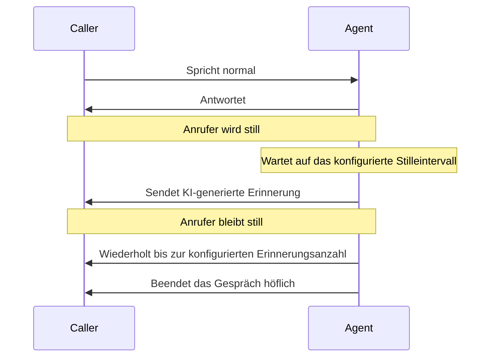

import { Screenshot } from "/snippets/screenshot.mdx";

**Zugriff:** Öffne einen Agenten und gehe zu **Anrufablauf**, dann scrolle zu **Inaktivität & Zeitüberschreitung**.

## Wie Inaktivitätseinstellungen funktionieren

Inaktivitätseinstellungen helfen deinem Agenten, Stille zu handhaben und Anrufe innerhalb einer sicheren Maximaldauer zu halten. Sie arbeiten mit [VAD and turn detection](/de/build/advanced/vad-turn-detection) zusammen: VAD entscheidet, wann der Anrufer aufgehört hat zu sprechen, während Inaktivitätseinstellungen entscheiden, was passiert, wenn das Gespräch still bleibt.

<Screenshot
  lightSrc="/images/inactivity__inactivity_DE-light.png"
  darkSrc="/images/inactivity__inactivity_DE-dark.png"
  alt="Call-Flow-Tab mit Response Timing, Max Call Duration, Silence Reminders, Allow AI to hang up und Keypad Input"
/>

<Note>
Diese Einstellungen gelten für Sprachgespräche, einschließlich Telefonanrufen und Web-Anrufen. Das aktuelle Dashboard zeigt maximale Anrufdauer, Stille-Erinnerungen und Profi-Timing. Der Text der Erinnerungen wird automatisch von der Runtime generiert.
</Note>

## Sichtbare Steuerungen

<AccordionGroup>
  <Accordion title="Max Call Duration" icon="hourglass">
    Lege die maximale Länge des Anrufs vom Start bis zum Ende fest.

    Der Dashboard-Bereich liegt bei **1-120 Minuten**. Das Backend speichert den Wert in Sekunden, und die Runtime kann das effektive Limit verkürzen, wenn Metadaten zur Nutzung für die Sitzung eine niedrigere Maximaldauer setzen.
  </Accordion>

  <Accordion title="Silence Reminders" icon="bell">
    Schalte ein Folge-Verhalten ein, wenn der Anrufer still wird.

    Wenn aktiviert, überwacht die Runtime die Stille und fragt den Anrufer, ob er noch da ist, bevor ein scheinbar verwaistes Gespräch beendet wird.
  </Accordion>

  <Accordion title="Timing" icon="clock">
    Der Profi zeigt die Erinnerungsfrequenz:

    - **After:** Sekunden Stille vor der ersten Erinnerung, von **5-120 Sekunden**
    - **Up to:** Anzahl der Erinnerungen vor dem Beenden, von **1-10**

    Diese Steuerungen erscheinen nur, wenn **Silence Reminders** aktiviert ist.
  </Accordion>
</AccordionGroup>

## Runtime-Verhalten

## Empfohlene Startwerte

| Szenario | Max Call Duration | Silence-Reminder-Timing |
| --- | --- | --- |
| Kundensupport | 30-60 Minuten | Nach 10-20 Sekunden, bis zu 3 Erinnerungen |
| Terminbuchung | 30-60 Minuten | Nach 15-30 Sekunden, bis zu 4 Erinnerungen |
| Kurze Outbound-Qualifizierung | 10-20 Minuten | Nach 8-15 Sekunden, bis zu 2 Erinnerungen |
| Komplexe beratende Gespräche | 60-120 Minuten | Nach 20-45 Sekunden, bis zu 4 Erinnerungen |

<Tip>
Nutze längere Erinnerungszeiten, wenn Anrufer oft Kontonummern, Kalender oder Dokumente nachschlagen müssen. Nutze kürzere Zeiten für kurze Outbound-Anrufe, bei denen Stille meist bedeutet, dass der Anruf abgebrochen wurde.
</Tip>

## Was im Dashboard nicht konfigurierbar ist

Die Runtime generiert den Text der Erinnerungen automatisch. Das aktuelle Dashboard zeigt nicht:

- benutzerdefinierte Rotationen für Erinnerungstexte
- benutzerdefinierte Timeout-Endnachrichten

Wenn du einen bestimmten gesprochenen Satz brauchst, hinterlege ihn in deinem Agent-[prompt](/de/build/conversation/prompt). Zum Beispiel: „Wenn ein Anrufer still wird, nachdem du nach einer Kontonummer gefragt hast, sag höflich, dass du warten kannst, während er sie sucht.“

## Troubleshooting

<AccordionGroup>
  <Accordion title="Der Agent sendet Erinnerungen zu häufig" icon="bell-ring">
    Erhöhe den Profi-Wert **After** und prüfe, ob VAD die Turns des Anrufers zu aggressiv beendet.
  </Accordion>

  <Accordion title="Der Agent wartet zu lange, bevor er eine Erinnerung sendet" icon="hourglass-end">
    Verringere den Wert **After** oder reduziere die Anzahl der Erinnerungen für schnelle Flows, bei denen Stille meist bedeutet, dass der Anrufer gegangen ist.
  </Accordion>

  <Accordion title="Anrufe enden zu schnell" icon="clock-rotate-left">
    Erhöhe **Max Call Duration** und die Erinnerungsanzahl. Prüfe außerdem, ob ein nutzungsbezogenes Maximum die Runtime-Grenze verkürzt.
  </Accordion>

  <Accordion title="Anrufe laufen zu lange" icon="coins">
    Reduziere **Max Call Duration**, senke die Erinnerungsanzahl und passe deinen Prompt an, damit Antworten knapper werden.
  </Accordion>
</AccordionGroup>

## Verwandte Funktionen

<CardGroup cols={2}>
  <Card title="VAD & Turn Detection" icon="microphone-lines" href="/de/build/advanced/vad-turn-detection">
    Turn-Taking und Unterbrechungsverhalten konfigurieren
  </Card>
  <Card title="Transfer Tools" icon="phone-arrow-right" href="/de/build/tools/transfer-tools">
    Transfers und Anruf-Endverhalten konfigurieren
  </Card>
  <Card title="Greeting Messages" icon="hand-wave" href="/de/build/conversation/greeting-messages">
    Konfigurieren, wie Gespräche beginnen
  </Card>
  <Card title="Conversation Goals" icon="bullseye-arrow" href="/de/build/analytics/conversation-goals">
    Gesprächserfolg und Abschluss verfolgen
  </Card>
</CardGroup>
