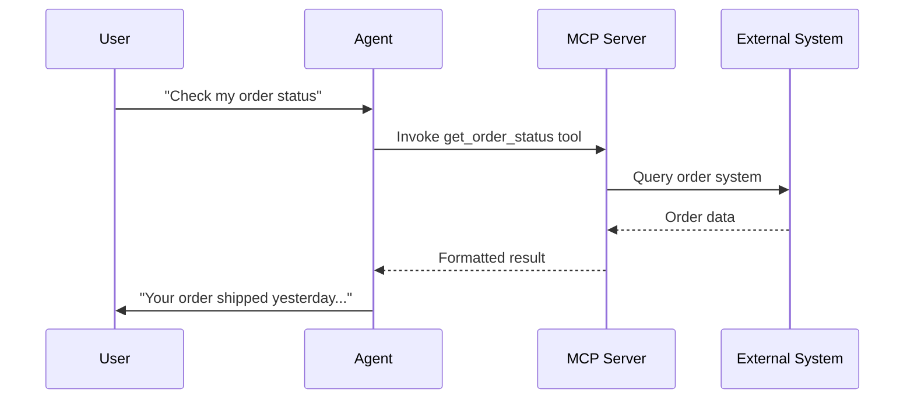

import { Screenshot } from "/snippets/screenshot.mdx";

## Was MCP Servers tun

<Badge>Profi</Badge>

Model Context Protocol (MCP)-Server erlauben dir, deine KI-Agenten mit externen Tools und Datenquellen über einen offenen Standard zu erweitern. Füge MCP-Server im Agent Editor hinzu, konfiguriere Authentifizierung und verwalte im **Tools**-Tab im **Profi**, welche gefundenen Tools der Agent verwenden darf.

<Note>
MCP ist ein offener Standard, um KI-Modelle mit externen Systemen zu verbinden. Mehr erfährst du auf [modelcontextprotocol.io](https://modelcontextprotocol.io).
</Note>

## Wie es funktioniert

MCP-Server stellen **Tools** bereit, die dein KI-Agent während des Gesprächs aufrufen kann:

1. Du verbindest einen MCP-Server per URL
2. itellicoAI entdeckt automatisch die vom Server bereitgestellten Tools
3. Du aktivierst die Tools, die dein Agent verwenden darf
4. Während des Gesprächs ruft der Agent Tools nach Bedarf auf, um Fragen zu beantworten oder Aktionen auszuführen

---

## Einen MCP-Server hinzufügen

MCP-Server fügst du direkt über den **Tools**-Tab hinzu.

So fügst du einen Server hinzu:

<Steps>
  <Step title="Auf Profi wechseln">
    Wenn du im Einfach bist, wechsle zuerst in den **Profi**.
  </Step>
  <Step title="MCP-Server-Flow öffnen">
    Gehe im Agent Editor zu **Tools**, klicke auf **Add** und wähle dann **MCP Server**.
  </Step>
  <Step title="Server konfigurieren">
    Füge einen **Name** und entweder eine direkte **URL** oder ein URL-Credential aus **Secrets** hinzu.
  </Step>
  <Step title="Bei Bedarf Credentials hinzufügen">
    Nutze optionale **Headers** und **Query Parameters** für Authentifizierung oder serverseitige Optionen.
  </Step>
  <Step title="Server speichern">
    Speichere die Verbindung, um sie dem aktuellen Agenten zuzuweisen.
  </Step>
</Steps>

---

## Tools des Servers verwalten

Das Speichern einer Server-Verbindung macht nicht automatisch jedes gefundene Tool für den Agenten verfügbar. Du wählst selbst aus, auf welche Tools der Agent Zugriff hat.

<Screenshot lightSrc="/images/advanced__mcp-config_DE-light.png" darkSrc="/images/advanced__mcp-config_DE-dark.png" alt="MCP-Server-Konfigurationspanel mit URL-Feld, Secret-basierten Credentials, Headers, Query Parameters und Auswahl gefundener Tools" />

<Steps>
  <Step title="Manage tools öffnen">
    Öffne in der MCP-Server-Zeile unter **Tools** die Option **Manage tools**.
  </Step>
  <Step title="Discovery aktualisieren, falls nötig">
    Tools werden automatisch entdeckt. Nutze **Refresh**, um die Discovery nach Änderungen am Server erneut auszuführen.
  </Step>
  <Step title="Tools auswählen">
    Wähle ein oder mehrere gefundene Tools aus oder nutze **Select all**, wenn der Server absichtlich schmal gehalten ist.
  </Step>
  <Step title="Zugriff speichern">
    Speichere, um die explizite Allow-List für den aktuellen Agenten zu aktualisieren.
  </Step>
</Steps>

<Note>
Bestehende MCP-Server-Zeilen sind im Einfach sichtbar, aber Hinzufügen und Bearbeiten erfordern den Profi.
</Note>
