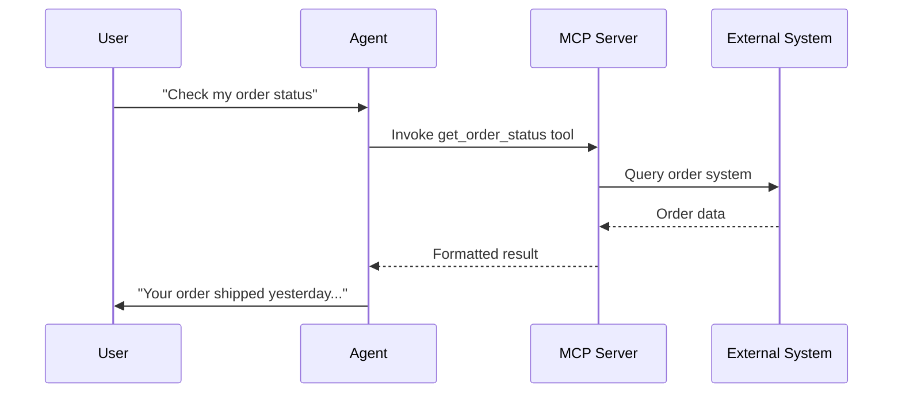

import { Screenshot } from "/snippets/screenshot.mdx";

## Was MCP-Server tun

<Badge>Profi</Badge>

Model Context Protocol (MCP)-Server erlauben dir, deine KI-Agenten mit externen Tools und Datenquellen über einen offenen Standard zu erweitern. Füge MCP-Server im Agent-Editor hinzu, konfiguriere Authentifizierung und verwalte im Tab **Tools** im **Profi**, welche gefundenen Tools der Agent verwenden darf.

<Note>
MCP ist ein offener Standard, um KI-Modelle mit externen Systemen zu verbinden. Mehr erfährst du auf [modelcontextprotocol.io](https://modelcontextprotocol.io).
</Note>

## Wie es funktioniert

MCP-Server stellen **Tools** bereit, die dein KI-Agent während des Gesprächs aufrufen kann:

1. Du verbindest einen MCP-Server per URL
2. itellicoAI entdeckt automatisch die vom Server bereitgestellten Tools
3. Du aktivierst die Tools, die dein Agent verwenden darf
4. Während des Gesprächs ruft der Agent Tools nach Bedarf auf, um Fragen zu beantworten oder Aktionen auszuführen



---

## Einen MCP-Server hinzufügen

MCP-Server fügst du direkt über den Tab **Tools** hinzu.

So fügst du einen Server hinzu:

<Steps>
  <Step title="Auf Profi wechseln">
    Wenn du im Einfach bist, wechsle zuerst in den **Profi**.
  </Step>
  <Step title="MCP-Server-Dialog öffnen">
    Gehe im Agent-Editor zu **Tools**, klicke auf **Hinzufügen** und wähle dann **MCP-Server**.
  </Step>
  <Step title="Server konfigurieren">
    Füge einen **Name** und entweder eine direkte **URL** oder ein URL-Credential aus **Secrets** hinzu.
  </Step>
  <Step title="Bei Bedarf Credentials hinzufügen">
    Nutze optionale **Headers** und **Query Parameters** für Authentifizierung oder serverseitige Optionen.
  </Step>
  <Step title="Server speichern">
    Speichere die Verbindung, um sie dem aktuellen Agenten zuzuweisen.
  </Step>
</Steps>

---

## Tools des Servers verwalten

Das Speichern einer Server-Verbindung macht nicht automatisch jedes gefundene Tool für den Agenten verfügbar. Du wählst selbst aus, auf welche Tools der Agent Zugriff hat.

<Screenshot
  lightSrc="/images/advanced__mcp-config_DE-light.png"
  darkSrc="/images/advanced__mcp-config_DE-dark.png"
  alt="MCP-Server-Konfigurationspanel mit URL-Feld, Secret-basierten Credentials, Headers, Query Parameters und Auswahl gefundener Tools"
/>

<Steps>
  <Step title="Tools verwalten öffnen">
    Öffne in der MCP-Server-Zeile unter **Tools** die Option **Tools verwalten**.
  </Step>
  <Step title="Discovery aktualisieren, falls nötig">
    Tools werden automatisch erkannt. Nutze **Aktualisieren**, um die Erkennung nach Änderungen am Server erneut auszuführen.
  </Step>
  <Step title="Tools auswählen">
    Wähle ein oder mehrere gefundene Tools aus oder nutze **Alle auswählen**, wenn der Server absichtlich schmal gehalten ist.
  </Step>
  <Step title="Zugriff speichern">
    Speichere, um die explizite Allow-List für den aktuellen Agenten zu aktualisieren.
  </Step>
</Steps>

<Note>
Bestehende MCP-Server-Zeilen sind im Einfach sichtbar, aber Hinzufügen und Bearbeiten erfordern den Profi.
</Note>

---

## Benutzerdefinierte Headers und Query Parameters konfigurieren

### Benutzerdefinierte Headers

Verwende Headers für API-Key- oder Bearer-Token-Authentifizierung:

```json
{
  "Authorization": "Bearer your-api-key",
  "X-API-Key": "your-key"
}
```

Füge Headers als Schlüssel-Wert-Paare im Konfigurationspanel hinzu.

### Query Parameters

Für Server, die URL-basierte Authentifizierung erfordern:

```json
{
  "api_key": "your-key",
  "client_id": "your-client-id"
}
```

<Warning>
Speichere Credentials sicher. Trage API-Keys niemals in clientseitigem Code oder öffentlichen Repositories ein.
</Warning>

---

## Automatische Tool-Discovery

Wenn du **Tools verwalten** für einen MCP-Server öffnest, fragt itellicoAI den Server ab und ruft Folgendes ab:

- **Tool-Namen** – Bezeichner zum Aufrufen des Tools
- **Beschreibungen** – Was das Tool tut (wird dem KI-Modell zur Entscheidungsfindung angezeigt)
- **Parameter-Schemas** – Eingabeparameter mit Typen und Beschreibungen
- **Rückgabetypen** – Erwartetes Antwortformat

Die Tool-Discovery läuft automatisch, wenn du die Tool-Einstellungen öffnest, und kann mit **Aktualisieren** erneut ausgeführt werden, um neu hinzugefügte Tools zu erfassen.

---

## Einzelne Tools aktivieren und deaktivieren

Nach der Discovery entscheidest du, welche einzelnen Server-Tools für den aktuellen Agenten aktiviert werden. So bleibt der Tool-Zugriff eng gefasst und das Modell kann ihn besser nutzen.

**Best Practices für die Tool-Verwaltung:**

- **Aktiviere nur, was du brauchst.** Weniger Tools bedeuten bessere Tool-Auswahlentscheidungen seitens der KI.
- **Schreibe klare Beschreibungen.** Wenn eine Tool-Beschreibung vom Server unklar ist, weiß die KI möglicherweise nicht, wann sie das Tool einsetzen soll.
- **Deaktiviere destruktive Tools** (Löschen, Aktualisieren), sofern dein Anwendungsfall sie nicht ausdrücklich erfordert.
- **Führe die Discovery regelmäßig erneut aus**, wenn der Server neue Tools hinzufügt.

---

## Latenzerwartungen

Der aktuelle MCP-Flow bietet keine Timeout-Einstellungen in der Benutzeroberfläche. Behandle niedrige Latenz als Teil des MCP-Server-Designs.

**Best Practices:**
- Halte Tool-Antworten schnell genug für Live-Gespräche
- Caching für aufwendige Abfragen wo möglich einsetzen
- Lang laufende Workflows in synchronen MCP-Tools vermeiden
- Vor dem Go-live unter realistischen Netzwerkbedingungen testen

---

## MCP-Server testen

Teste deine MCP-Server-Verbindung und die Tools vor dem Deployment in der Produktion.

<Steps>
  <Step title="Verbindung prüfen">
    Bestätige nach dem Hinzufügen des Servers, dass unter **Tools verwalten** erkannte Tools für den Server angezeigt werden.
  </Step>
  <Step title="In einer Konversation testen">
    Starte **Agent testen** und führe ein browserbasiertes Gespräch, einen **Telefonanruf** oder eine **Chat**-Sitzung durch, die das MCP-Tool auslösen soll.
  </Step>
  <Step title="Fehlerszenarien testen">
    Prüfe, ob der Agent mit Tool-Fehlern sicher umgeht – zum Beispiel, wenn der MCP-Server nicht erreichbar ist oder einen Fehler zurückgibt.
  </Step>
</Steps>

---

## Eigene MCP-Server bauen

Dein MCP-Server muss:

1. **Einen HTTPS-Endpunkt bereitstellen** – Sichere Verbindungen sind erforderlich
2. **Das MCP-Protokoll implementieren** – Standard-Tool-Discovery und -Aufruf
3. **Strukturierte Antworten zurückgeben** – JSON-formatierte Tool-Ergebnisse
4. **Fehler sicher behandeln** – Aussagekräftige Fehlermeldungen zurückgeben

### Beispiel-Server

```python
from mcp import Server

server = Server("my-custom-server")

@server.tool("get_customer")
async def get_customer(customer_id: str) -> dict:
    """Look up customer information by ID"""
    customer = await database.get_customer(customer_id)
    return {
        "name": customer.name,
        "email": customer.email,
        "status": customer.status
    }
```

<Note>
Ausführliche Hinweise zur MCP-Server-Entwicklung findest du in der [MCP-Dokumentation](https://modelcontextprotocol.io).
</Note>

---

## Fehlerbehebung

<AccordionGroup>
  <Accordion title="Verbindung fehlgeschlagen" icon="plug">
    - Prüfe, ob die Server-URL korrekt und erreichbar ist
    - Stelle sicher, dass HTTPS korrekt konfiguriert ist
    - Prüfe, ob die Authentifizierungs-Credentials gültig sind
    - Teste den Endpunkt direkt mit cURL oder Postman
  </Accordion>

  <Accordion title="Tool-Discovery findet keine Tools" icon="magnifying-glass">
    - Prüfe, ob dein Server die MCP-Tool-Discovery implementiert
    - Sieh dir die Server-Logs auf Fehler an
    - Stelle sicher, dass der Server auf Anfragen antwortet
    - Führe die Discovery erneut aus, nachdem du Server-Probleme behoben hast
  </Accordion>

  <Accordion title="Agent ruft Tools nicht auf" icon="phone-slash">
    - Überprüfe Tool-Beschreibungen – sind sie klar genug für die KI?
    - Überprüfe den Agenten-[Prompt](/de/build/conversation/prompt) – weiß der Agent, wann er Tools einsetzen soll?
    - Stelle sicher, dass die Tools aktiviert (nicht deaktiviert) sind
    - Reduziere die Gesamtzahl aktivierter Tools, wenn die KI schlecht auswählt
  </Accordion>

  <Accordion title="Langsame Tool-Antworten" icon="clock">
    - Optimiere die Performance deines MCP-Servers
    - Erwäge Caching für häufig abgerufene Daten
    - Prüfe die Netzwerklatenz zwischen itellicoAI und deinem Server
  </Accordion>
</AccordionGroup>

---

## Sicherheitshinweise

<Warning>
MCP-Server haben Zugang zu externen Systemen. Befolge die Security-Best-Practices:

- Verwende minimale Zugriffsrechte für API-Credentials
- Rotiere Authentifizierungsschlüssel regelmäßig
- Überwache Tool-Aufruf-Logs auf ungewöhnliche Aktivitäten
- Prüfe regelmäßig, welche Tools auf den einzelnen Agenten aktiviert sind
</Warning>

**Netzwerksicherheit:**
- Alle Verbindungen müssen HTTPS verwenden
- Erwäge IP-Allowlisting für deine MCP-Server
- Verwende starke Authentifizierungsmethoden

**Datensicherheit:**
- Stelle nur Daten bereit, die der Agent benötigt
- Implementiere geeignete Zugriffskontrollen auf der Server-Seite
- Protokolliere alle Tool-Aufrufe für Auditzwecke

---

## Nächste Schritte

<CardGroup cols={2}>
  <Card title="Custom Action" icon="code" href="/de/build/tools/custom-api-actions">
    Einfachere HTTP-Integrationen ohne MCP nutzen
  </Card>
  <Card title="Tools-Übersicht" icon="bolt" href="/de/build/tools/overview">
    Alle Tool-Typen erkunden
  </Card>
  <Card title="Websuche" icon="magnifying-glass" href="/de/build/tools/web-search">
    Das integrierte Web-Search-Tool nutzen
  </Card>
  <Card title="Agenten testen" icon="vial" href="/de/test/web-simulator">
    MCP-Tools in Konversationen testen
  </Card>
</CardGroup>
