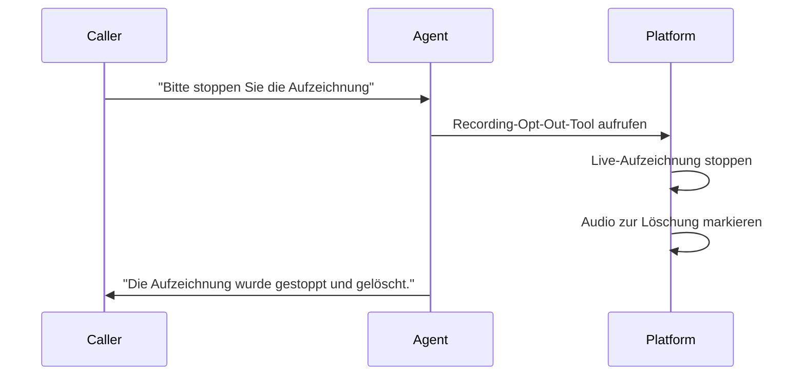

## Wie Aufzeichnung ablehnen funktioniert

**Aufzeichnung ablehnen** ermöglicht es Anrufern, während des Gesprächs zu verlangen, dass ihre Anrufaufzeichnung gestoppt und gelöscht wird. Diese Alpha-Funktion hilft bei der DSGVO-Konformität und zeigt Respekt für die Privatsphäre der Anrufer.

<Note>
Wenn aktiviert, fügt diese Funktion ein Tool hinzu, das dein KI-Agent aufrufen kann, wenn ein Anrufer ausdrückt, dass er nicht aufgenommen werden möchte.
</Note>

---

## So funktioniert es

Wenn ein Anrufer etwas sagt wie „Ich möchte nicht aufgenommen werden“ oder „Bitte stoppen Sie die Aufzeichnung“:



1. **Agent erkennt die Anfrage:** Die KI versteht die Opt-out-Anfrage
2. **Tool aufgerufen:** Der Agent löst die Recording-Opt-Out-Aktion aus
3. **Aufzeichnung stoppt:** Die Live-Aufzeichnung endet sofort
4. **Daten gelöscht:** Die Plattform löscht alle aufgezeichneten Audiodaten dieses Anrufs
5. **Anrufer bestätigt:** Der Agent bestätigt die Aktion gegenüber dem Anrufer

---

## Konfiguration

Gehe im Agent-Editor zu → Tab **Datenschutz** → Bereich **Aufzeichnung ablehnen**.

### Aufzeichnung ablehnen aktivieren

Schalte die Funktion ein oder aus:

- **Enabled:** Anrufer können verlangen, dass die Aufzeichnung gestoppt und gelöscht wird
- **Disabled:** Opt-out-Anfragen sind nicht verfügbar (Standard)

---

## Trigger für Anrufer

Der Agent erkennt Opt-out-Anfragen in unterschiedlichen Formulierungen:

**Englisch:**
- "Stop recording this call"
- "I don't want to be recorded"
- "Please don't record me"
- "Turn off the recording"
- "Delete this recording"

**Deutsch:**
- "Bitte nicht aufnehmen"
- "Aufnahme stoppen"
- "Ich möchte nicht aufgenommen werden"

Der Agent nutzt Natural Language Understanding, um die Absicht zu erkennen, nicht nur exakte Formulierungen.

---

## Anwendungsfälle

<CardGroup cols={2}>
  <Card title="DSGVO-Compliance" icon="shield-check">
    Europäische Datenschutzanforderungen für den Widerruf der Einwilligung erfüllen
  </Card>
  <Card title="Sensible Gespräche" icon="lock">
    Anrufern ermöglichen, sensible Themen ohne Aufzeichnung zu besprechen
  </Card>
  <Card title="Kundenvertrauen" icon="handshake">
    Engagement für Privatsphäre und Datenrechte der Anrufer zeigen
  </Card>
  <Card title="Rechtliche Anforderungen" icon="scale-balanced">
    Zwei-Parteien-Zustimmungsgesetze in bestimmten Jurisdiktionen einhalten
  </Card>
</CardGroup>

---

## Was passiert, wenn Opt-out ausgelöst wird

| Komponente | Aktion |
|-----------|--------|
| Live recording | Wird sofort gestoppt |
| Recorded audio | Zur Löschung markiert und beim Abschluss des Uploads nicht gespeichert |
| Transcript | Wird separat durch die Aufbewahrung-Einstellungen gesteuert |
| Call metadata | Wird aufbewahrt (Anruf fand statt, Dauer usw.) |
| Analytik | Grundlegende Anrufstatistiken bleiben erhalten |

<Warning>
Sobald die Plattform die Aufnahme löscht, kann sie nicht wiederhergestellt werden. Stelle sicher, dass dein Team versteht, dass dies eine dauerhafte Aktion ist.
</Warning>

---

## Best Practices

**Mit der Ansage vor dem Anruf kombinieren:** Wenn du Anrufe aufzeichnest, informiere Anrufer zu Beginn mit einer Ansage vor dem Anruf. Nenne die Opt-out-Option:

```text
Dieser Anruf kann zu Qualitätszwecken aufgezeichnet werden. Wenn Sie nicht
aufgezeichnet werden möchten, sagen Sie mir jederzeit Bescheid.
```

**Agent trainieren:** Ergänze deinen Prompt um Anweisungen, damit der Agent Opt-out-Anfragen professionell beantwortet:

```text
Wenn ein Anrufer die Aufzeichnung stoppen möchte:
- Die Anfrage sofort bestätigen
- Bestätigen, dass die Aufzeichnung gestoppt und gelöscht wurde
- Versichern, dass das Gespräch fortgesetzt werden kann
- Keinen Druck ausüben, die Aufzeichnung fortzusetzen
```

**Richtlinie dokumentieren:** Lege eine klare interne Richtlinie fest, was passiert, wenn Anrufer opt-outen, und wie sich das auf Qualitätssicherungsprozesse auswirkt.

---

## DSGVO-Überlegungen

Unter der DSGVO haben Personen das Recht:

<Steps>
  <Step title="Informiert zu werden">
    Zu wissen, dass eine Aufzeichnung stattfindet (nutze Ansage vor dem Anruf)
  </Step>
  <Step title="Einwilligen zu können">
    Vor der Aufzeichnung zuzustimmen
  </Step>
  <Step title="Einwilligung zu widerrufen">
    Ihre Meinung zu ändern und das Stoppen der Aufzeichnung zu verlangen
  </Step>
  <Step title="Löschung zu verlangen">
    Aufgezeichnete Daten entfernen zu lassen (Recht auf Löschung)
  </Step>
</Steps>

Aufzeichnung ablehnen adressiert die letzten beiden Rechte - es erlaubt Anrufern, ihre Einwilligung zu widerrufen und während des Gesprächs die Löschung zu verlangen.

<Warning>
Dies ist allgemeine Orientierung, keine Rechtsberatung. Konsultiere eine Rechtsberatung, um sicherzustellen, dass deine Aufzeichnungspraktiken deine spezifischen regulatorischen Anforderungen erfüllen.
</Warning>

---

## Einschränkungen

- **Gilt nur für den aktuellen Anruf:** Kann Aufzeichnungen früherer Anrufe nicht löschen
- **Sofortige Wirkung:** Nach Auslösung kann die Löschung innerhalb desselben Anrufs nicht rückgängig gemacht werden
- **Metadaten bleiben erhalten:** Grundlegende Anrufinformationen (dass ein Anruf stattfand) bleiben erhalten
- **Audio-fokussiert:** Transkript- und Analytik-Speicherung folgen deinen Aufbewahrungseinstellungen

---

## Nächste Schritte

<CardGroup cols={2}>
  <Card title="Ansage vor dem Anruf" icon="shield-check" href="/de/build/advanced/announcements">
    Anrufer zu Beginn über Aufzeichnungen informieren
  </Card>
  <Card title="Produktions-Checkliste" icon="rocket" href="/de/launch/production-checklist">
    Mit passenden Compliance-Maßnahmen ausrollen
  </Card>
  <Card title="Trust Center" icon="building-shield" href="/de/manage/trust-center/overview">
    Deine Datenschutzpraktiken öffentlich zeigen
  </Card>
  <Card title="Agent testen" icon="vial" href="/de/test/web-simulator">
    Opt-out im Simulator testen
  </Card>
</CardGroup>
