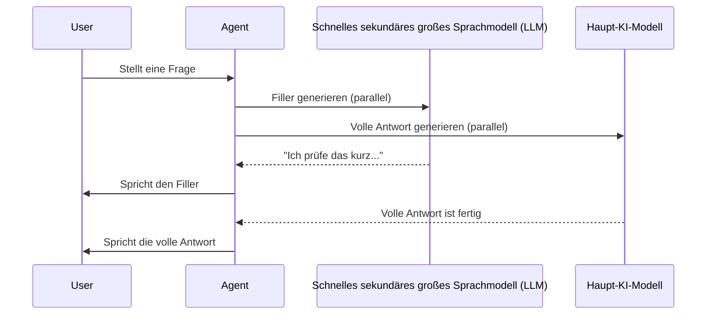

## Wie Smart Filler funktioniert

<Badge>Profi</Badge>

Smart Filler reduziert die wahrgenommene Latenz, indem kontextbezogene Filler-Antworten generiert werden, während dein Haupt-KI-Modell die vollständige Antwort verarbeitet. Statt Stille während der Verarbeitung sagt dein Agent zum Beispiel "Ich prüfe das kurz für dich...", bevor die komplette Antwort folgt.

<Note>
Smart Filler nutzt ein schnelles sekundäres KI-Modell, um kontextbezogene Filler parallel zum Haupt-KI-Modell zu erzeugen. Es reduziert die wahrgenommene Latenz, macht die eigentliche Antwort aber nicht schneller fertig.
</Note>

## So funktioniert es



1. Die nutzende Person stellt eine Frage
2. Smart Filler erzeugt sofort eine kontextbezogene Filler-Phrase mit einem schnellen sekundären KI-Modell
3. Der Filler läuft, während dein Haupt-KI-Modell die vollständige Antwort verarbeitet
4. Die komplette Antwort folgt ohne Unterbrechung

---

## Konfiguration

Navigiere im **Allgemein**-Tab deines Agenten, wechsle in den **Profi** und öffne **Sounds**, um Smart Filler zu konfigurieren.

### Smart Filler aktivieren

Schalte Smart Filler an oder aus. Wenn er deaktiviert ist, wartet der Agent still, bis die vollständige Antwort bereit ist.

### Verzögerungsschwelle

Wähle, wie lange die Hauptantwort dauern darf, bevor der Filler abgespielt wird. Das Dashboard unterstützt **0-2000 ms** in 50-ms-Schritten. Ein Wert von `0 ms` lässt den Filler sofort spielen, sobald er verfügbar ist; höhere Werte vermeiden Filler bei schnellen Antworten.

### Eigener Filler-Prompt

Passe an, wie dein Agent Filler-Antworten generiert, mit einem eigenen Prompt.

**Standardverhalten:** Der Agent erzeugt passende Bestätigungen wie:
- "Ich prüfe das kurz für dich..."
- "Einen Moment, ich schaue mir das an..."
- "Gute Frage, ich finde das heraus..."

**Beispiele für Custom Prompts:**

<AccordionGroup>
  <Accordion title="Österreichischer Stil" icon="flag">
    ```text
    Verwende österreichische Ausdrücke wie „Passt" oder „Jo eh"
    für lockere Bestätigungen.
    ```
  </Accordion>

  <Accordion title="Formeller Business-Stil" icon="briefcase">
    ```text
    Verwende formelle Geschäftssprache. Keine umgangssprachlichen Formulierungen.
    Beispiel: „Ich prüfe das sofort für Sie" statt „Ich schaue kurz nach".
    ```
  </Accordion>

  <Accordion title="Freundlicher Kundendienst" icon="face-smile">
    ```text
    Sei warm und freundlich. Nutze Formulierungen wie „Gute Frage!"
    und „Gerne helfe ich dir dabei!"
    ```
  </Accordion>

  <Accordion title="Multilingual" icon="language">
    ```text
    Nutze dieselbe Sprache wie der Kunde. Wenn er Deutsch spricht,
    antworte auf Deutsch. Wenn er Spanisch spricht, antworte auf Spanisch.
    ```
  </Accordion>
</AccordionGroup>

<Warning>
Eigene Filler-Prompts sind auf 2000 Zeichen begrenzt. Halte die Anweisungen knapp und fokussiert.
</Warning>

---

## Anwendungsfälle

<CardGroup cols={2}>
  <Card title="Antworten mit hoher Latenz" icon="clock">
    Wartezeit von fortgeschrittenen KI-Modellen mit längeren Antwortzeiten überbrücken
  </Card>
  <Card title="Komplexe Anfragen" icon="brain">
    Pausen während Tool-Calls, Datenbankabfragen oder mehrstufigem Reasoning füllen
  </Card>
  <Card title="Wissensdatenbank-Suchen" icon="magnifying-glass">
    Anrufende Bestätigung geben, während die [Wissensdatenbank](/de/build/knowledge/architecture) zusätzliche Verarbeitungszeit benötigt
  </Card>
  <Card title="API-Integrationen" icon="plug">
    Latenz aus [Benutzerdefinierten Aktionen](/de/build/tools/custom-api-actions) überbrücken
  </Card>
</CardGroup>

---

## Best Practices

**Pass die Markenstimme an:** Nutze den Custom Prompt, damit Filler zur Persönlichkeit und zu den Markenrichtlinien deines Agenten passen. Im [Prompt-Leitfaden](/de/build/conversation/prompt-engineering-guide) findest du Hinweise für wirksame Prompts.

**Natürlich bleiben:** Die besten Filler klingen wie natürliche menschliche Bestätigungen, nicht wie roboterhafte Platzhalter.

**Kontext berücksichtigen:** Unterschiedliche Situationen brauchen unterschiedliche Filler-Stile. Sales-Calls können energiegeladene Filler nutzen, Support-Calls eher beruhigende.

**Ausgiebig testen:** Mache Test-Calls, um sicherzustellen, dass Filler in echten Gesprächen natürlich wirken und keine merkwürdigen Pausen oder Wiederholungen erzeugen.

---

## Auswirkungen auf die Performance

| Metrik | Ohne Smart Filler | Mit Smart Filler |
|--------|---------------------|-------------------|
| Wahrgenommene Latenz | Vollständige KI-Verarbeitungszeit | ~500ms |
| Nutzererlebnis | Stille Wartezeit | Natürlicher Gesprächsfluss |
| Tatsächliche Antwortzeit | Unverändert | Unverändert |

<Tip>
Smart Filler beschleunigt deine tatsächliche Antwortzeit nicht - es lässt die Wartezeit nur kürzer wirken, indem sofort eine Bestätigung ausgegeben wird.
</Tip>

---

## Einschränkungen

- **Nicht immer passend:** Manche Kontexte (rechtliche Hinweise, kritische Informationen) brauchen möglicherweise Stille statt Filler
- **Sprachabgleich:** Funktioniert am besten, wenn der Filler-Prompt zur Gesprächssprache passt

---

## Nächste Schritte

<CardGroup cols={2}>
  <Card title="Denk-Sounds" icon="keyboard" href="/de/build/voice-speech/thinking-sounds">
    Audio-Feedback während der Verarbeitung hinzufügen
  </Card>
  <Card title="Spracheinstellungen" icon="sliders" href="/de/build/voice-speech/voice-settings">
    Stimmparameter feinjustieren
  </Card>
  <Card title="KI-Modell auswählen" icon="microchip" href="/de/build/voice-speech/choose-ai-model">
    Das Modell wählen, das deinen Agenten antreibt
  </Card>
  <Card title="Agent testen" icon="vial" href="/de/test/web-simulator">
    Smart Filler im Simulator testen
  </Card>
</CardGroup>
