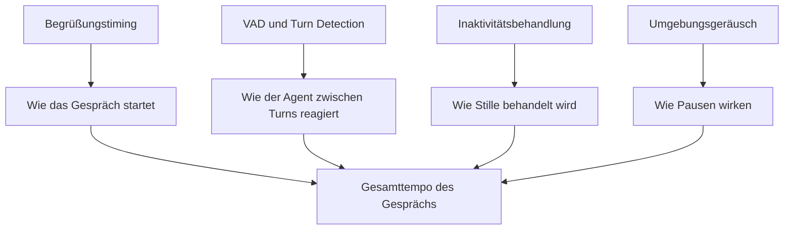

Natürliche Spracherlebnisse hängen vom Timing ab.

Spricht der Agent zu schnell, fühlen sich Kundinnen und Kunden unterbrochen. Wartet er zu lange, wirkt der Anruf unsicher oder langsam.

Diese Seite erklärt die wichtigsten Steuerungen für Timing und Turn-Taking.

<Tip>
Timing ist nur eine Ebene des Anrufererlebnisses. Wenn sich das Gespräch nach Timing-Änderungen immer noch falsch anfühlt, geh einen Schritt zurück und prüfe den vollständigen [AI Pipeline Guide](/de/build/voice-speech/ai-pipeline-guide).
</Tip>

## Die vier Steuerungen

| Steuerung | Was sie beeinflusst | Hauptdokument |
| --- | --- | --- |
| **Begrüßungstiming** | Wann die erste Nachricht startet und ob Anrufer sie unterbrechen können | [Greeting Messages](/de/build/conversation/greeting-messages) |
| **VAD / Turn Detection** | Wann die Plattform entscheidet, dass der Anrufer fertig gesprochen hat | [VAD & Turn Detection](/de/build/advanced/vad-turn-detection) |
| **Inaktivitätsbehandlung** | Was passiert, wenn längere Zeit niemand spricht | [Inactivity Timeout Settings](/de/build/advanced/inactivity-timeout-settings) |
| **Umgebungsgeräusch** | Wie Pausen zwischen gesprochenen Turns wirken | [Ambient Sound](/de/build/voice-speech/ambient-sound) |

## 1. Begrüßungstiming

Die ersten Sekunden setzen den Ton für den gesamten Anruf.

Mit dem Begrüßungstiming steuerst du:

- wie lange der Agent wartet, bevor er spricht
- ob der Anrufer die Eröffnungszeile unterbrechen kann
- ob sich eingehende und ausgehende Begrüßungen unterschiedlich verhalten

### Empfohlener Startpunkt

- kurze Anfangsverzögerung
- nicht unterbrechbare Begrüßung für die meisten Inbound-Use-Cases
- outbound-spezifische Überschreibung nur dann, wenn proaktive Anrufe eine andere Eröffnung brauchen

## 2. VAD und Turn Detection

VAD entscheidet, wann der Anrufer aufgehört hat zu sprechen und wann der Agent antworten soll.

Das beeinflusst stark:

- wahrgenommene Reaktionsgeschwindigkeit
- Unterbrechungsverhalten
- ob der Agent Menschen ins Wort fällt
- ob der Agent nach kurzen Pausen zu lange wartet

### Wann du es straffer einstellen solltest

- der Agent wartet nach offensichtlichen Antworten zu lange
- Anrufer sagen, der Assistent sei langsam

### Wann du es lockern solltest

- der Agent unterbricht mitten im Gedanken
- Anrufer machen natürliche Pausen, bevor sie fertig sind
- der Anruf enthält Zahlenfolgen oder sorgfältige Erklärungen

## 3. Inaktivitätsbehandlung

Inaktivitätseinstellungen steuern, was passiert, wenn der Anruf still wird.

Nutze sie, um festzulegen:

- wie lange die Plattform wartet
- ob sie erneut anstoßen soll
- wann sie das Gespräch beenden soll

Das ist besonders wichtig für:

- Outbound-Anrufe, bei denen die Zielperson nicht eindeutig antwortet
- längere Pausen in Support- oder Buchungsflows
- Anrufe, bei denen die Kundin oder der Kunde kurz weg sein kann

## 4. Umgebungsgeräusch

Umgebungsgeräusch verändert die Turn-Erkennung nicht direkt, aber es beeinflusst, wie Pausen wahrgenommen werden.

Richtig eingesetzt, kann es Pausen so wirken lassen:

- beabsichtigt
- weniger steril
- natürlicher

Falsch eingesetzt, kann es den Anruf so wirken lassen:

- laut
- ablenkend
- weniger professionell

Für regulierte oder klarheitskritische Use-Cases ist weniger meist besser.

## Wie diese Steuerungen zusammenspielen

## Symptome und wahrscheinliche Fixes

| Symptom | Wahrscheinlichster Bereich zur Prüfung |
| --- | --- |
| Agent redet zu früh los | Begrüßungsverzögerung oder VAD-Empfindlichkeit |
| Agent fällt Anrufern ins Wort | VAD / Turn Detection |
| Agent wirkt nach kurzen Antworten langsam | VAD / Pausen-Timing |
| Anrufe fühlen sich während Stille unangenehm an | Inaktivitätseinstellungen |
| Pausen wirken steril oder abrupt | Umgebungsgeräusch und Gesamttempo |

## Wie Modell- und Transcriber-Auswahl das Timing beeinflussen

Ein Einstellungsbereich steuert nicht alles Timing.

Dein Erlebnis hängt auch ab von:

- dem Sprachmodell und der Stimmenauswahl
- dem Verhalten des Transcribers
- wie viel Arbeit der Agent während des Turns erledigt
- ob Tools oder Wissensabrufe zusätzliche Latenz verursachen

Wenn sich ein Gespräch langsam anfühlt, ändere nicht nur einen Timing-Regler. Prüfe auch:

- [Choose AI Model](/de/build/voice-speech/choose-ai-model)
- [Transcriber](/de/build/voice-speech/transcriber)
- [Knowledge issues](/de/troubleshooting/knowledge-issues)
- [Tool and integration issues](/de/troubleshooting/tools-integrations)

## Ein praktischer Tuning-Loop

1. Starte mit den Standardwerten für Timing.
2. Führe einen kurzen Test im [Web Simulator](/de/test/web-simulator) durch.
3. Führe mindestens einen echten [Phone Test](/de/test/phone-testing) aus.
4. Höre auf Unterbrechungen, lange Pausen und unangenehme Stille.
5. Ändere immer nur eine Timing-Variable auf einmal.
6. Teste mit demselben Szenario erneut.

## Häufige Fehler

<AccordionGroup>
  <Accordion title="Zu viele Timing-Einstellungen auf einmal ändern" icon="sliders">
    Wenn du Begrüßungsverzögerung, VAD, Inaktivität und Umgebungsgeräusch gleichzeitig änderst, ist es schwer nachzuvollziehen, was das Erlebnis wirklich verbessert oder verschlechtert hat.
  </Accordion>

  <Accordion title="Umgebungsgeräusch nutzen, um ein Latenzproblem zu kaschieren" icon="music">
    Umgebungsgeräusch kann das Gefühl verbessern, behebt aber keine langsamen Tools, langsamen Abruf oder langsame Modelle.
  </Accordion>

  <Accordion title="Nur in Browser-Tests feinjustieren" icon="laptop">
    Browser-Tests sind nützlich, aber Telefonate machen Timing-Probleme deutlicher sichtbar, besonders bei Begrüßungstempo und Unterbrechungsverhalten.
  </Accordion>
</AccordionGroup>

## Nächste Schritte

<CardGroup cols={2}>
  <Card title="Greeting Messages" icon="hand-wave" href="/de/build/conversation/greeting-messages">
    Das Eröffnungserlebnis konfigurieren
  </Card>
  <Card title="VAD & Turn Detection" icon="ear-listen" href="/de/build/advanced/vad-turn-detection">
    Feinjustieren, wie die Plattform abgeschlossene Sprache erkennt
  </Card>
  <Card title="Inactivity Timeout Settings" icon="hourglass-half" href="/de/build/advanced/inactivity-timeout-settings">
    Festlegen, was bei Stille passiert
  </Card>
  <Card title="Ambient Sound" icon="volume" href="/de/build/voice-speech/ambient-sound">
    Das Gefühl von Pausen und Hintergrundatmosphäre anpassen
  </Card>
</CardGroup>
