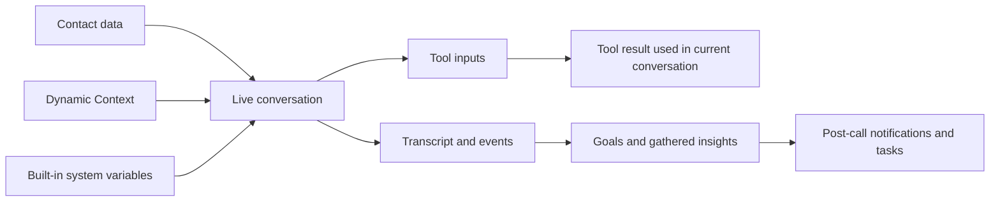

Diese Seite zeigt, wie Werte durch ein Gespräch wandern.

Sie beantwortet drei praktische Fragen:

- Welche Daten sind verfügbar, bevor der Anruf startet?
- Welche Daten kann der Agent während des Anrufs erfassen oder verwenden?
- Welche Daten werden erst nach dem Anruf verfügbar?

## Der Datenfluss

## Phase 1: Daten, die vor dem Anruf verfügbar sind

Diese Daten können sofort in Begrüßung und Prompt verwendet werden.

### Kontaktdaten

Wenn der Anrufer einem bekannten Kontakt entspricht, sind diese Werte vor dem Start verfügbar.

Beispiele:

- `{{contact.first_name}}`
- `{{contact.email}}`
- `{{contact.phone_number}}`

### Dynamic Context

[Dynamic Context](/de/build/advanced/dynamic-context) erlaubt dir, vor dem Gespräch JSON aus deinen eigenen Systemen abzurufen.

Beispiele:

- `{{account_tier}}`
- `{{open_tickets}}`
- `{{last_order_status}}`

### Eingebaute Systemwerte

Diese existieren in jedem Gespräch.

Beispiele:

- `{{agent_uuid}}`
- `{{current_datetime}}`
- `{{direction}}`
- `{{timezone}}`

## Phase 2: Daten, die während des Anrufs erfasst werden

Während des Gesprächs kann der Agent Details einsammeln, die zu Beginn noch unbekannt waren.

Typische Beispiele:

- Bestellnummer
- Gewünschtes Termindatum
- Abteilungswahl
- Problembeschreibung

Diese erfassten Informationen werden normalerweise auf zwei Arten genutzt:

- um das Gespräch genauer fortzuführen
- um die Eingaben für ein Tool bereitzustellen

## Phase 3: Tool-Inputs und Tool-Ergebnisse

Tools nutzen den Live-Gesprächsstatus.

Das heißt, der Agent kann kombinieren:

- Kontaktfelder
- Pre-Call-Kontext
- eingebaute Variablen
- vom Anrufer erfasste Werte

### Was Tools mit diesen Daten tun können

| Tool-Typ | Typische Quelle | Typisches Ergebnis |
| --- | --- | --- |
| **Transfer** | Absicht des Anrufers, Abteilung, Dringlichkeit | Leitet das Gespräch an ein anderes Ziel weiter |
| **Booking** | Datum, Uhrzeit, Kontaktdaten | Erstellt oder aktualisiert einen Termin |
| **Custom Action** | Erfasste Werte plus Kontextvariablen | Ruft deine externe API auf und nutzt die Antwort im Live-Gespräch |
| **Web Search** | Aktuelle Frage | Liefert externe Informationen für die aktuelle Antwort |

### Wichtige Einschränkung

Ergebnisse von Custom Actions sind Teil des aktuellen Gesprächsflusses. Sie helfen dem Agenten, den Anrufer zu beantworten oder den nächsten Schritt zu wählen.

Behandle sie **nicht** als allgemeinen Speicher für Post-Call-Variablen. Für wiederverwendbare Werte nach dem Gespräch nutze [Gather Insights](/de/build/analytics/gather-insights) und [Post-Call Automation](/de/build/analytics/post-call-automation).

## Phase 4: Daten, die nach dem Anruf erstellt werden

Nach dem Gespräch kann die Plattform das Transkript und die Ereignisse analysieren.

Diese Phase erzeugt:

- Zielergebnisse
- gesammelte Insights
- `{{dyn_*}}`-Variablen für Benachrichtigungen nach dem Anruf
- Folgetasks und nachgelagerte Automatisierungen

Beispiele:

- `{{dyn_issue_summary}}`
- `{{dyn_next_steps}}`
- `{{dyn_appointment_date}}`

Diese Werte sind nützlich für:

- Benachrichtigungs-E-Mails
- Follow-up-Tasks
- Reporting
- nachgelagerte Systeme über Webhooks

Sie sind **nicht** während des abgeschlossenen Anrufs für den Agenten verfügbar, weil die Analyse erst danach passiert.

## Was wo verwendet werden kann

| Ort | Kontaktdaten | Dynamic Context | Eingebaute Systemwerte | Live-erfasste Werte | `{{dyn_*}}` Post-Call-Werte |
| --- | --- | --- | --- | --- | --- |
| **Greeting** | Ja | Ja | Ja | Nein | Nein |
| **Prompt** | Ja | Ja | Ja | Nein direkt vor der Erfassung | Nein |
| **Live tools** | Ja | Ja | Ja | Ja | Nein |
| **Notification templates** | Nur Kundenfelder | Nein | Nur Gesprächsfelder | Kein direkter Live-Call-Status | Ja |

<Note>
Notification-Templates verwenden den Live-Call-Prompt-Kontext nicht erneut. Nutze Post-Call-Variablen wie `{{customer_name}}`, `{{customer_email}}`, `{{customer_number}}`, `{{conversation_date}}`, `{{conversation_direction}}`, `{{conversation_url}}` und `{{dyn_*}}`.
</Note>

## Empfohlenes Muster

Nutze die richtige Datenquelle für die richtige Aufgabe:

- verwende **Contacts** für stabile Kundenprofil-Daten
- verwende **Dynamic Context** für frische Business-System-Daten vor dem Anruf
- verwende **Tool-Inputs** für Live-Aktionen während des Anrufs
- verwende **Gather Insights** für strukturierte Analysen nach dem Anruf

Das macht dein System vorhersagbarer und leichter zu debuggen.

## Häufige Fehler

<AccordionGroup>
  <Accordion title="Alles mit einer einzigen Variablenquelle lösen wollen" icon="triangle-exclamation">
    Nutze Kontaktdaten, Dynamic Context, Live-Tool-Inputs und Post-Call-Insights für unterschiedliche Aufgaben. Sie sind nicht austauschbar.
  </Accordion>

  <Accordion title="Erwarten, dass Dynamic Context mitten im Anruf aktualisiert wird" icon="rotate-right">
    Dynamic Context läuft vor dem Start des Gesprächs. Wenn du während des Anrufs frische Informationen brauchst, verwende ein Live-Tool wie eine [Custom Action](/de/build/tools/custom-api-actions).
  </Accordion>

  <Accordion title="Post-Call-Variablen im Live-Prompt verwenden" icon="hourglass-half">
    `{{dyn_*}}`-Werte werden erst nach Ende des Anrufs erzeugt. Nutze sie in [Post-Call Automation](/de/build/analytics/post-call-automation), nicht in Begrüßung oder Prompt.
  </Accordion>
</AccordionGroup>

## Nächste Schritte

<CardGroup cols={2}>
  <Card title="Variable Sources" icon="brackets-curly" href="/de/build/conversation/variable-sources">
    Jede Quelle einzeln ansehen
  </Card>
  <Card title="Dynamic Context" icon="database" href="/de/build/advanced/dynamic-context">
    Pre-Call-Kontext aus deinen Systemen einbinden
  </Card>
  <Card title="Custom API Tools" icon="code" href="/de/build/tools/custom-api-actions">
    Live-Daten während des Gesprächs nutzen
  </Card>
  <Card title="Post-Call Automation" icon="envelope-open-text" href="/de/build/analytics/post-call-automation">
    Post-Call-Werte in Folgeaktionen umwandeln
  </Card>
</CardGroup>
