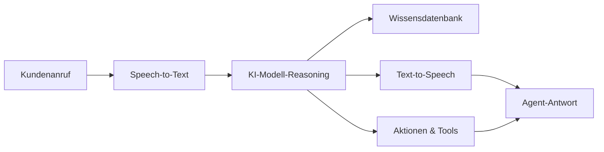

## Was ist ein KI Voice Agent?

Ein KI Voice Agent ist ein intelligenter virtueller Assistent, der Sprachgespräche mit deinen Kunden über Telefon und Web führen kann. Im Gegensatz zu traditionellen IVR-Systemen oder Chatbots verstehen itellicoAI-Agents natürliche Sprache, behalten den Kontext während des gesamten Gesprächs bei und können echte Aktionen durchführen wie Termine buchen, Anrufe weiterleiten oder deine Systeme aktualisieren.

## Kernfunktionen

Deine itellicoAI-Agents können:

<CardGroup cols={2}>
  <Card title="Natürliche Sprache verstehen" icon="brain">
    Kundenabsichten, Fragen und Anfragen in natürlichen Gesprächen verstehen
  </Card>
  <Card title="Auf dein Wissen zugreifen" icon="book">
    Während Anrufen auf deine Unternehmensinformationen, Richtlinien und Dokumentation verweisen
  </Card>
  <Card title="Aktionen ausführen" icon="bolt">
    Termine buchen, Anrufe weiterleiten, Systeme aktualisieren und Workflows auslösen
  </Card>
  <Card title="Natürlich sprechen" icon="microphone">
    Mit natürlich klingenden Stimmen in mehreren Sprachen antworten
  </Card>
</CardGroup>

## Wie KI Voice Agents funktionieren

1. **Kunde spricht** - Dein Kunde stellt eine Frage oder macht eine Anfrage
2. **Speech-to-Text** - Der Agent wandelt Sprache mit fortschrittlicher Transkription in Text um
3. **KI-Reasoning** - Das Sprachmodell versteht die Absicht und formuliert eine Antwort
4. **Wissensabruf** - Agent greift bei Bedarf auf dein Unternehmenswissen zu
5. **Aktionsausführung** - Agent kann Buchungen, Weiterleitungen oder API-Aufrufe auslösen
6. **Sprachsynthese** - Antwort wird in natürlich klingende Sprache umgewandelt
7. **Agent antwortet** - Kunde hört eine hilfreiche, kontextbezogene Antwort

## Hauptvorteile

<CardGroup cols={2}>
  <Card title="24/7 Verfügbarkeit" icon="clock">
    Schlafen nie, immer bereit zu helfen in jeder Zeitzone
  </Card>

  <Card title="Konsistente Qualität" icon="star">
    Jede Interaktion folgt deinen Richtlinien und deiner Markenstimme
  </Card>

  <Card title="Sofortige Skalierung" icon="chart-line">
    Bearbeite 1 Anruf oder 1.000 gleichzeitig ohne Infrastrukturänderungen
  </Card>

  <Card title="Kosteneffizienz" icon="dollar-sign">
    Kosten senken und gleichzeitig menschliches Personal für komplexe Probleme freisetzen
  </Card>

  <Card title="Umfangreiche Integration" icon="plug">
    Mit CRMs, Kalendern und Business-Tools für Echtzeit-Datenzugriff verbinden
  </Card>
</CardGroup>

## Häufige Anwendungsfälle

<AccordionGroup>
  <Accordion title="Kundensupport" icon="headset">
    FAQs beantworten, Probleme beheben und komplexe Fälle an menschliche Agents eskalieren
  </Accordion>

  <Accordion title="Terminbuchung" icon="calendar">
    Termine planen, umbuchen und automatisierte Bestätigungen und Erinnerungen senden
  </Accordion>

  <Accordion title="Lead-Qualifizierung" icon="user-plus">
    Interessenten ansprechen, Informationen sammeln und qualifizierte Leads an den Vertrieb weiterleiten
  </Accordion>

  <Accordion title="Bestellstatus & Tracking" icon="box">
    Bestellstatus prüfen und Tracking-Updates bereitstellen
  </Accordion>

  <Accordion title="Zahlung & Abrechnung" icon="credit-card">
    Abrechnungsfragen beantworten, Zahlungen bearbeiten und Erinnerungen senden
  </Accordion>

  <Accordion title="Feedback-Sammlung" icon="comment">
    Umfragen durchführen und Kundenfeedback im großen Maßstab sammeln
  </Accordion>
</AccordionGroup>

## Nächste Schritte

Bereit, deinen ersten Agent zu erstellen? Fahre fort mit:

<CardGroup cols={2}>
  <Card title="Erstelle deinen ersten Agent" icon="plus" href="/de/build/getting-started/create-first-agent">
    Schritt-für-Schritt-Anleitung zur Erstellung deines ersten KI Voice Agent
  </Card>
  <Card title="Agent-Typen & Anwendungsfälle" icon="list" href="/de/build/getting-started/agent-use-cases">
    Verstehe verschiedene Agent-Typen und wann du jeden verwenden solltest
  </Card>
</CardGroup>
