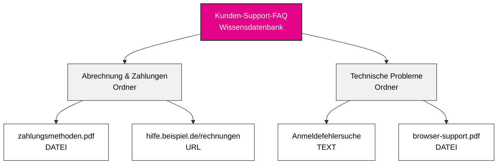
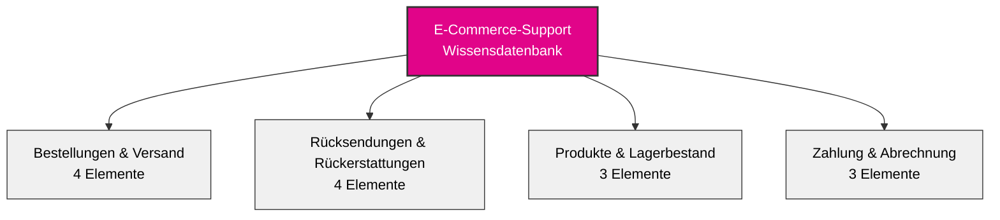

## Überblick

Wissensdatenbanken verwandeln deinen KI-Agenten von einem generischen Assistenten in einen Geschäftsexperten. Durch die Organisation der Informationen deines Unternehmens in eine strukturierte Hierarchie kann dein Agent sofort auf Richtlinien, Verfahren, Produktdetails und alle anderen Informationen zugreifen und diese referenzieren, auf die sich dein Unternehmen stützt.

Betrachte Wissensdatenbanken als intelligente Aktenschränke, die dein Agent in Millisekunden während Gesprächen durchsuchen kann.

## Wissensarchitektur

### Die dreistufige Hierarchie

Wissen in itellicoAI folgt einer einfachen, intuitiven Struktur:

**Wissensdatenbank → Ordner → Elemente**

Elemente können **Text**, **Dateien** (PDF, Word, Markdown, CSV, JSON, YAML, XML usw.) oder **URLs** (nur einzelne Webseiten - nicht ganze Websites) sein.

Diese Hierarchie erleichtert die Organisation großer Informationsmengen und macht sie gleichzeitig zugänglich und verwaltbar.

---

## Dashboard-Überblick

### Hauptoberfläche für Wissen

Navigiere zu **Knowledge** in der linken Seitenleiste, um auf dein Wissensverwaltungs-Dashboard mit einer Übersicht über alle deine Wissensdatenbanken zuzugreifen:

<CardGroup cols={1}>
  <Card title="Kunden-Support-FAQ">
    - 127 Elemente
    - Heute aktualisiert
  </Card>
  <Card title="Produktdokumentation">
    - 89 Elemente
    - Gestern aktualisiert
  </Card>
  <Card title="Unternehmensrichtlinien">
    - 45 Elemente
    - Vor 3 Tagen aktualisiert
  </Card>
</CardGroup>

Jede Wissensdatenbank-Karte zeigt:
- Gesamtanzahl der Elemente über alle Ordner hinweg
- Zeitstempel der letzten Aktualisierung
- Aktionen: Referenzplatzhalter kopieren, Bearbeiten, Löschen

---

## Verstehen der einzelnen Ebenen

### Wissensdatenbanken

<Card title="Was ist eine Wissensdatenbank?" icon="database">
  Eine Wissensdatenbank ist der Container der obersten Ebene, der zusammengehörige Informationen gruppiert. Sie repräsentiert eine Hauptkategorie oder Domäne deines Geschäftswissens.
</Card>

**Betrachte Wissensdatenbanken als verschiedene Aktenschränke in deinem Büro:**
- Ein Schrank für Kundensupport-Materialien
- Ein anderer für Produktdokumentation
- Ein weiterer für Unternehmensrichtlinien
- Ein anderer für Vertriebsressourcen

**Beispiele für Wissensdatenbanken:**
- **Kunden-Support-FAQ** - Alle kundenorientierten Support-Informationen
- **Produktdokumentation** - Technische Dokumentation, Benutzerhandbücher, Funktionsbeschreibungen
- **Unternehmensrichtlinien** - HR-Richtlinien, Compliance-Dokumente, interne Verfahren
- **Vertriebsressourcen** - Preisblätter, Wettbewerbsvergleiche, Pitch-Decks

### Ordner

<Card title="Was ist ein Ordner?" icon="folder">
  Ordner sind Organisationseinheiten innerhalb einer Wissensdatenbank. Sie gruppieren zusammengehörige Elemente nach Thema, Kategorie oder Zweck.
</Card>

**Betrachte Ordner innerhalb deines Aktenschranks:**
- Sie organisieren ähnliche Inhalte zusammen
- Sie machen Informationen leichter auffindbar und verwaltbar
- Sie ermöglichen es dir, bestimmte Themen Agenten zuzuweisen

**Beispielordner innerhalb einer Kundensupport-Wissensdatenbank:**
- **Abrechnung & Zahlungen** - Rechnungsfragen, Zahlungsmethoden, Rückerstattungen
- **Technische Probleme** - Fehlersuchleitfäden, Fehlermeldungen, Bug-Workarounds
- **Produktinformationen** - Funktionen, Spezifikationen, Kompatibilität
- **Rückgaberichtlinien** - Rückgabefristen, Bedingungen, Prozessschritte

<Tip>
Verwende klare, beschreibende Ordnernamen. Sowohl dein Team als auch deine KI profitieren von intuitiver Organisation.
</Tip>

### Wissenselemente

<Card title="Was ist ein Wissenselement?" icon="file">
  Wissenselemente sind die tatsächlichen Informationsteile - Dokumente, FAQs, Richtlinien, Verfahren oder beliebige Inhalte, die dein Agent kennen soll.
</Card>

**Wissenselemente können sein:**
- **Texteinträge** - Direkt geschriebene Inhalte
- **Datei-Uploads** - PDF, Word (.doc, .docx), Text (.txt, .log), Markdown (.md), CSV/TSV, JSON, YAML, XML (bis zu 10MB)
- **URL-Scrapes** - Inhalte von einer einzelnen Webseite (nicht ganzen Websites)

**Beispiele für Wissenselemente:**
- "Rückerstattungsrichtlinie für digitale Produkte"
- "Passwort zurücksetzen - Schritt für Schritt"
- "Produktspezifikationen - Modell X200"
- "Versandzeiten nach Region"

Jedes Wissenselement umfasst:
- **Titel** - Beschreibender Name für den Inhalt
- **Inhalt/Quelle** - Die tatsächlichen Informationen (Text, Datei oder URL)
- **Inhaltsverarbeitungsstatus** - Extraktionszustand (Ausstehend, Verarbeitung läuft, Abgeschlossen, Fehlgeschlagen)
- **Vektorindizierungsstatus** - RAG-Vorbereitungszustand (Ausstehend, Indizierung läuft, Indiziert, Fehlgeschlagen)
- **Metadaten** - Erstellungsdatum, letzte Aktualisierung, Inhaltsgröße, Token-Anzahl

---

## Wann Wissensdatenbanken verwendet werden sollten

<AccordionGroup>
  <Accordion title="Dein Agent muss spezifische Fragen beantworten" icon="circle-question">
    Wenn Kunden regelmäßig nach Richtlinien, Verfahren oder Produktdetails fragen, füge diese Informationen zu einer Wissensdatenbank hinzu. Dein Agent wird sie jedes Mal genau referenzieren.

    **Beispiel:** Kunde fragt "Was ist deine Rückgaberichtlinie?" Agent ruft die genaue Richtlinie aus deiner Wissensdatenbank ab und erklärt sie natürlich.
  </Accordion>

  <Accordion title="Du hast detaillierte Dokumentation" icon="book">
    Wenn du vorhandene Dokumentation hast - Benutzerhandbücher, FAQs, Richtliniendokumente - kannst du diese direkt in verschiedenen Formaten (PDF, DOC, DOCX, TXT) hochladen. Dein Agent wird in der Lage sein, sie in Gesprächen zu durchsuchen und zu referenzieren.

    **Beispiel:** Lade dein 50-seitiges Produkthandbuch hoch. Wenn Kunden technische Fragen haben, findet dein Agent die relevanten Abschnitte und erklärt sie.
  </Accordion>

  <Accordion title="Informationen ändern sich häufig" icon="arrows-rotate">
    Wissensdatenbanken erleichtern die Aktualisierung von Informationen, ohne die Kernanweisungen deines Agenten zu ändern. Aktualisiere ein Preisblatt oder Richtliniendokument, und dein Agent hat sofort die neuen Informationen.

    **Beispiel:** Du aktualisierst dein Preisdokument einmal, und alle Agenten, die diese Wissensdatenbank verwenden, referenzieren sofort die neuen Preise.
  </Accordion>

  <Accordion title="Mehrere Agenten benötigen dieselben Informationen" icon="users">
    Erstelle eine Wissensdatenbank und teile sie über mehrere Agenten. Pflege Informationen an einem Ort, verwende sie überall.

    **Beispiel:** Deine "Produktspezifikationen"-Wissensdatenbank kann von deinem Vertriebs-Agent, Support-Agent und Vorqualifizierungs-Agent verwendet werden.
  </Accordion>

  <Accordion title="Du möchtest Zuständigkeiten trennen" icon="layer-group">
    Halte die Gesprächsanweisungen deines Agenten getrennt von sachlichen Informationen. Anweisungen definieren Persönlichkeit und Verhalten; Wissensdatenbanken liefern Fakten und Details.

    **Beispiel:** Deine Agentenanweisungen sagen "sei freundlich und professionell." Deine Wissensdatenbank enthält die tatsächlichen Produktspezifikationen, Preise und Richtlinien.
  </Accordion>
</AccordionGroup>

---

## Best Practices für die Organisation

### Beginne mit klaren Kategorien

<CardGroup cols={2}>
  <Card title="Nach Abteilung" icon="building">
    - Vertriebswissen
    - Support-Wissen
    - Abrechnungswissen
    - Technische Dokumentation
  </Card>
  <Card title="Nach Thema" icon="tags">
    - Produktinformationen
    - Richtlinien & Verfahren
    - Fehlerbehebung
    - FAQs
  </Card>
  <Card title="Nach Customer Journey" icon="map">
    - Informationen vor dem Verkauf
    - Onboarding-Leitfäden
    - Nutzung & Funktionen
    - Support & Fehlerbehebung
  </Card>
  <Card title="Nach Zielgruppe" icon="user-group">
    - Kundenorientierte Informationen
    - Interne Verfahren
    - Partner-Ressourcen
    - Technische Spezifikationen
  </Card>
</CardGroup>

### Namenskonventionen

Verwende klare, konsistente Namen, die für dein gesamtes Team sinnvoll sind:

**Gute Namensbeispiele:**
- Wissensdatenbank: "Kundensupport-Ressourcen"
- Ordner: "Abrechnung & Zahlungen"
- Element: "Rückerstattungsrichtlinie - Digitale Produkte"

**Schlechte Namensbeispiele:**
- Wissensdatenbank: "KB_001"
- Ordner: "Verschiedene Dokumente"
- Element: "Richtlinie_v2_final_AKTUALISIERT"

<Tip>
Füge Versionsdaten oder -nummern in Elementtiteln hinzu, wenn du mehrere Versionen pflegst: "Preisblatt - 2025 Q1"
</Tip>

### Beispiel einer gut strukturierten Wissensdatenbank

Hier ist ein Beispiel einer gut organisierten E-Commerce-Wissensdatenbank:

**Ordnerinhalte:**
- **Bestellungen & Versand:** Tracking, Versandzeiten, internationale Informationen, Änderungen
- **Rücksendungen & Rückerstattungen:** Richtlinie, Versandprozess, Bearbeitungszeiten, Umtausch
- **Produkte & Lagerbestand:** Kategorien, Lagerverfügbarkeit, Spezifikationen
- **Zahlung & Abrechnung:** Zahlungsmethoden, Rechnungen, Zahlungspläne

**Was diese Struktur gut macht:**
- Klare, beschreibende Ordnernamen, die zusammengehörige Inhalte gruppieren
- Ausgewogene Verteilung (3-4 Elemente pro Ordner)
- Einfach zu navigieren und Informationen zu finden
- Skaliert gut, wenn du weitere Inhalte hinzufügst

### Extrahiere nur relevante Inhalte

<Warning>
**Mehr Wissen ≠ Bessere Leistung**

Das Hinzufügen von zu viel Wissen erhöht die Wahrscheinlichkeit, dass dein Agent irrelevante Informationen zusammen mit dem tatsächlich Benötigten abruft.
</Warning>

**Best Practice für große Dokumente:**

Anstatt ganze Handbücher oder Richtliniendokumente hochzuladen, extrahiere nur die Seiten/Abschnitte, die dein Agent benötigt.

<AccordionGroup>
  <Accordion title="❌ Vermeiden: Gesamtes 200-Seiten-Mitarbeiterhandbuch hochladen" icon="xmark">
    **Problem:**
    - Agent findet und mischt irrelevante Abschnitte mit der richtigen Antwort
    - Schwieriger für den Agent zu bestimmen, was tatsächlich relevant ist
    - Verschwendet Gesprächsraum mit unzusammenhängenden Inhalten

    **Beispiel:**
    Kunde fragt: "Was ist deine Rückgaberichtlinie?"

    Agent könnte abrufen: HR-Urlaubsrichtlinien, interne Verfahren, Mitarbeiterleistungen - und Schwierigkeiten haben, zu trennen, was der Kunde tatsächlich benötigt.
  </Accordion>

  <Accordion title="✅ Besser: Spezifische Abschnitte extrahieren" icon="check">
    **Ansatz:**
    - "Rückgaberichtlinie - Seiten 45-48"
    - "Versandrichtlinie - Seiten 52-55"
    - "Garantiebedingungen - Seiten 89-92"

    **Vorteil:**
    - Agent findet nur kundenrelevante Inhalte
    - Klarere, genauere Antworten
    - Effizientere Nutzung des Gesprächsraums

    **Beispiel:**
    Kunde fragt: "Was ist deine Rückgaberichtlinie?"

    Agent ruft ab: Nur den 4-seitigen Rückgaberichtlinienabschnitt - genau das, was benötigt wird, nichts anderes.
  </Accordion>
</AccordionGroup>

**So extrahierst du relevante Abschnitte:**
- Exportiere bestimmte Seiten aus PDF als separate Dateien
- Kopiere relevante Abschnitte in TEXT-Elemente
- Verlinke auf spezifische verankerte URLs anstatt auf ganze Dokumentationsseiten

### Regelmäßige Wartung

<Steps>
  <Step title="Vierteljährliche Überprüfung">
    Plane regelmäßige Überprüfungen deiner Wissensdatenbanken, um sicherzustellen, dass die Informationen aktuell bleiben.
  </Step>
  <Step title="Veraltete Inhalte entfernen">
    Lösche Elemente, die nicht mehr relevant sind, oder trenne sie von Agenten. Veraltete Informationen können deinen Agent verwirren und falsche Antworten liefern.
  </Step>
  <Step title="Basierend auf Feedback aktualisieren">
    Wenn Kunden falsche Informationen melden, überprüfe sofort deine Wissensdatenbank.
  </Step>
</Steps>

---

## Beispiele aus der Praxis

<AccordionGroup>
  <Accordion title="SaaS-Support-Agent" icon="headset">
    **Wissensdatenbank:** "SaaS-Produkt-Support"

    **Ordner:**
    - **Kontoverwaltung** (15 Elemente)
      - Passwort-Zurücksetzungsprozess
      - Konto-Upgrade-Anleitung
      - Abrechnungszyklus-Informationen
      - Plan-Vergleichstabelle
    - **Funktionsdokumentation** (47 Elemente)
      - Einzelne Funktionsleitfäden
      - Integrations-Tutorials
      - API-Dokumentation
      - Best Practices
    - **Fehlerbehebung** (23 Elemente)
      - Häufige Fehlermeldungen
      - Verbindungsprobleme
      - Browser-Kompatibilität
      - Leistungsoptimierung

    **Ergebnis:** Support-Agent kann 80% der technischen Fragen ohne menschliches Eingreifen beantworten.
  </Accordion>

  <Accordion title="Gesundheits-Terminagent" icon="calendar">
    **Wissensdatenbank:** "Patientenservices"

    **Ordner:**
    - **Terminrichtlinien** (8 Elemente)
      - Planungsrichtlinien
      - Stornierungsrichtlinie
      - Versicherungsanforderungen
      - Neupatienten-Prozess
    - **Büro-Informationen** (5 Elemente)
      - Büro-Standorte und Öffnungszeiten
      - Parkanleitung
      - Barrierefreiheitsinformationen
      - Kontaktverzeichnis
    - **Versicherung & Abrechnung** (12 Elemente)
      - Akzeptierte Versicherungsanbieter
      - Zahlungsoptionen
      - Abrechnungsfragen
      - Finanzielle Unterstützung

    **Ergebnis:** Agent wickelt Terminbuchung und Richtlinienfragen 24/7 mit vollständiger Genauigkeit ab.
  </Accordion>

  <Accordion title="E-Commerce-Vertriebs-Agent" icon="shopping-cart">
    **Wissensdatenbank:** "Produktkatalog & Vertrieb"

    **Ordner:**
    - **Produktspezifikationen** (89 Elemente)
      - Detaillierte Produktbeschreibungen
      - Technische Spezifikationen
      - Kompatibilitätsinformationen
      - Größenleitfäden
    - **Preise & Aktionen** (15 Elemente)
      - Aktuelle Preise
      - Aktive Aktionen
      - Mengenrabatte
      - Saisonale Verkäufe
    - **Versand & Lieferung** (7 Elemente)
      - Versandoptionen
      - Lieferzeiten
      - Internationaler Versand
      - Tracking-Informationen

    **Ergebnis:** Vertriebs-Agent liefert genaue Produktinformationen und Preise sofort während Kundengesprächen.
  </Accordion>
</AccordionGroup>

---

## Nächste Schritte

<CardGroup cols={2}>
  <Card title="Wissensdatenbanken erstellen" icon="plus" href="/de/build/knowledge/create-knowledge-bases">
    Schritt-für-Schritt-Anleitung zum Erstellen und Organisieren deines Wissens
  </Card>
  <Card title="Inhaltstypen" icon="file-lines" href="/de/build/knowledge/content-types">
    Erfahre mehr über Text-, Datei- und URL-Wissenselemente
  </Card>
  <Card title="Agenten zuweisen" icon="link" href="/de/build/knowledge/assign-knowledge">
    Verbinde Wissensdatenbanken mit deinen Agenten
  </Card>
  <Card title="Context vs RAG" icon="brain" href="/de/build/knowledge/context-vs-rag">
    Wähle die richtige Zugriffsmethode für deinen Anwendungsfall
  </Card>
</CardGroup>
