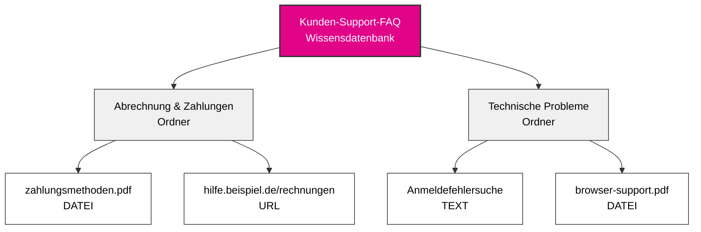
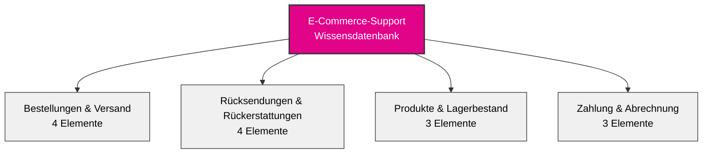

## Überblick

Wissensdatenbanken verwandeln Ihren KI-Agenten von einem generischen Assistenten in einen Geschäftsexperten. Durch die Organisation der Informationen Ihres Unternehmens in eine strukturierte Hierarchie kann Ihr Agent sofort auf Richtlinien, Verfahren, Produktdetails und alle anderen Informationen zugreifen und diese referenzieren, auf die sich Ihr Unternehmen stützt.

Betrachten Sie Wissensdatenbanken als intelligente Aktenschränke, die Ihr Agent in Millisekunden während Gesprächen durchsuchen kann.

## Wissensarchitektur

### Die dreistufige Hierarchie

Wissen in itellicoAI folgt einer einfachen, intuitiven Struktur:

**Wissensdatenbank → Ordner → Elemente**

Elemente können **Text**, **Dateien** (PDF, Word, Markdown, CSV, JSON, YAML, XML usw.) oder **URLs** (nur einzelne Webseiten - nicht ganze Websites) sein.

```mermaid
graph TB
    KB[Kunden-Support-FAQ<br/>Wissensdatenbank]

    KB --> F1[Abrechnung & Zahlungen<br/>Ordner]
    KB --> F2[Technische Probleme<br/>Ordner]

    F1 --> I1[zahlungsmethoden.pdf<br/>DATEI]
    F1 --> I2[hilfe.beispiel.de/rechnungen<br/>URL]

    F2 --> I3[Anmeldefehlersuche<br/>TEXT]
    F2 --> I4[browser-support.pdf<br/>DATEI]

    style KB fill:#E10489,stroke:#333,stroke-width:2px,color:#fff
    style F1 fill:#f0f0f0,stroke:#333,stroke-width:1px,color:#000
    style F2 fill:#f0f0f0,stroke:#333,stroke-width:1px,color:#000
    style I1 fill:#fff,stroke:#333,stroke-width:1px,color:#000
    style I2 fill:#fff,stroke:#333,stroke-width:1px,color:#000
    style I3 fill:#fff,stroke:#333,stroke-width:1px,color:#000
    style I4 fill:#fff,stroke:#333,stroke-width:1px,color:#000
```

Diese Hierarchie erleichtert die Organisation großer Informationsmengen und macht sie gleichzeitig zugänglich und verwaltbar.

---

## Dashboard-Überblick

### Hauptoberfläche für Wissen

Navigieren Sie zu **Knowledge** in der linken Seitenleiste, um auf Ihr Wissensverwaltungs-Dashboard mit einer Übersicht über alle Ihre Wissensdatenbanken zuzugreifen:

<CardGroup cols={1}>
  <Card title="Kunden-Support-FAQ">
    - 127 Elemente
    - Heute aktualisiert
  </Card>
  <Card title="Produktdokumentation">
    - 89 Elemente
    - Gestern aktualisiert
  </Card>
  <Card title="Unternehmensrichtlinien">
    - 45 Elemente
    - Vor 3 Tagen aktualisiert
  </Card>
</CardGroup>

Jede Wissensdatenbank-Karte zeigt:
- Gesamtanzahl der Elemente über alle Ordner hinweg
- Zeitstempel der letzten Aktualisierung
- Aktionen: Referenzplatzhalter kopieren, Bearbeiten, Löschen

---

## Verstehen der einzelnen Ebenen

### Wissensdatenbanken

<Card title="Was ist eine Wissensdatenbank?" icon="database">
  Eine Wissensdatenbank ist der Container der obersten Ebene, der zusammengehörige Informationen gruppiert. Sie repräsentiert eine Hauptkategorie oder Domäne Ihres Geschäftswissens.
</Card>

**Betrachten Sie Wissensdatenbanken als verschiedene Aktenschränke in Ihrem Büro:**
- Ein Schrank für Kundensupport-Materialien
- Ein anderer für Produktdokumentation
- Ein weiterer für Unternehmensrichtlinien
- Ein anderer für Vertriebsressourcen

**Beispiele für Wissensdatenbanken:**
- **Kunden-Support-FAQ** - Alle kundenorientierten Support-Informationen
- **Produktdokumentation** - Technische Dokumentation, Benutzerhandbücher, Funktionsbeschreibungen
- **Unternehmensrichtlinien** - HR-Richtlinien, Compliance-Dokumente, interne Verfahren
- **Vertriebsressourcen** - Preisblätter, Wettbewerbsvergleiche, Pitch-Decks

### Ordner

<Card title="Was ist ein Ordner?" icon="folder">
  Ordner sind Organisationseinheiten innerhalb einer Wissensdatenbank. Sie gruppieren zusammengehörige Elemente nach Thema, Kategorie oder Zweck.
</Card>

**Betrachten Sie Ordner innerhalb Ihres Aktenschranks:**
- Sie organisieren ähnliche Inhalte zusammen
- Sie machen Informationen leichter auffindbar und verwaltbar
- Sie ermöglichen es Ihnen, bestimmte Themen Agenten zuzuweisen

**Beispielordner innerhalb einer Kundensupport-Wissensdatenbank:**
- **Abrechnung & Zahlungen** - Rechnungsfragen, Zahlungsmethoden, Rückerstattungen
- **Technische Probleme** - Fehlersuchleitfäden, Fehlermeldungen, Bug-Workarounds
- **Produktinformationen** - Funktionen, Spezifikationen, Kompatibilität
- **Rückgaberichtlinien** - Rückgabefristen, Bedingungen, Prozessschritte

<Tip>
Verwenden Sie klare, beschreibende Ordnernamen. Sowohl Ihr Team als auch Ihre KI profitieren von intuitiver Organisation.
</Tip>

### Wissenselemente

<Card title="Was ist ein Wissenselement?" icon="file">
  Wissenselemente sind die tatsächlichen Informationsteile - Dokumente, FAQs, Richtlinien, Verfahren oder beliebige Inhalte, die Ihr Agent kennen soll.
</Card>

**Wissenselemente können sein:**
- **Texteinträge** - Direkt geschriebene Inhalte
- **Datei-Uploads** - PDF, Word (.doc, .docx), Text (.txt, .log), Markdown (.md), CSV/TSV, JSON, YAML, XML (bis zu 10MB)
- **URL-Scrapes** - Inhalte von einer einzelnen Webseite (nicht ganzen Websites)

**Beispiele für Wissenselemente:**
- "Rückerstattungsrichtlinie für digitale Produkte"
- "Passwort zurücksetzen - Schritt für Schritt"
- "Produktspezifikationen - Modell X200"
- "Versandzeiten nach Region"

Jedes Wissenselement umfasst:
- **Titel** - Beschreibender Name für den Inhalt
- **Inhalt/Quelle** - Die tatsächlichen Informationen (Text, Datei oder URL)
- **Inhaltsverarbeitungsstatus** - Extraktionszustand (Ausstehend, Verarbeitung läuft, Abgeschlossen, Fehlgeschlagen)
- **Vektorindizierungsstatus** - RAG-Vorbereitungszustand (Ausstehend, Indizierung läuft, Indiziert, Fehlgeschlagen)
- **Metadaten** - Erstellungsdatum, letzte Aktualisierung, Inhaltsgröße, Token-Anzahl

---

## Wann Wissensdatenbanken verwendet werden sollten

<AccordionGroup>
  <Accordion title="Ihr Agent muss spezifische Fragen beantworten" icon="circle-question">
    Wenn Kunden regelmäßig nach Richtlinien, Verfahren oder Produktdetails fragen, fügen Sie diese Informationen zu einer Wissensdatenbank hinzu. Ihr Agent wird sie jedes Mal genau referenzieren.

    **Beispiel:** Kunde fragt "Was ist Ihre Rückgaberichtlinie?" Agent ruft die genaue Richtlinie aus Ihrer Wissensdatenbank ab und erklärt sie natürlich.
  </Accordion>

  <Accordion title="Sie haben detaillierte Dokumentation" icon="book">
    Wenn Sie vorhandene Dokumentation haben - Benutzerhandbücher, FAQs, Richtliniendokumente - können Sie diese direkt in verschiedenen Formaten (PDF, DOC, DOCX, TXT) hochladen. Ihr Agent wird in der Lage sein, sie in Gesprächen zu durchsuchen und zu referenzieren.

    **Beispiel:** Laden Sie Ihr 50-seitiges Produkthandbuch hoch. Wenn Kunden technische Fragen haben, findet Ihr Agent die relevanten Abschnitte und erklärt sie.
  </Accordion>

  <Accordion title="Informationen ändern sich häufig" icon="arrows-rotate">
    Wissensdatenbanken erleichtern die Aktualisierung von Informationen, ohne die Kernanweisungen Ihres Agenten zu ändern. Aktualisieren Sie ein Preisblatt oder Richtliniendokument, und Ihr Agent hat sofort die neuen Informationen.

    **Beispiel:** Sie aktualisieren Ihr Preisdokument einmal, und alle Agenten, die diese Wissensdatenbank verwenden, referenzieren sofort die neuen Preise.
  </Accordion>

  <Accordion title="Mehrere Agenten benötigen dieselben Informationen" icon="users">
    Erstellen Sie eine Wissensdatenbank und teilen Sie sie über mehrere Agenten. Pflegen Sie Informationen an einem Ort, verwenden Sie sie überall.

    **Beispiel:** Ihre "Produktspezifikationen"-Wissensdatenbank kann von Ihrem Vertriebs-Agent, Support-Agent und Vorqualifizierungs-Agent verwendet werden.
  </Accordion>

  <Accordion title="Sie möchten Zuständigkeiten trennen" icon="layer-group">
    Halten Sie die Gesprächsanweisungen Ihres Agenten getrennt von sachlichen Informationen. Anweisungen definieren Persönlichkeit und Verhalten; Wissensdatenbanken liefern Fakten und Details.

    **Beispiel:** Ihre Agentenanweisungen sagen "sei freundlich und professionell." Ihre Wissensdatenbank enthält die tatsächlichen Produktspezifikationen, Preise und Richtlinien.
  </Accordion>
</AccordionGroup>

---

## Best Practices für die Organisation

### Beginnen Sie mit klaren Kategorien

<CardGroup cols={2}>
  <Card title="Nach Abteilung" icon="building">
    - Vertriebswissen
    - Support-Wissen
    - Abrechnungswissen
    - Technische Dokumentation
  </Card>
  <Card title="Nach Thema" icon="tags">
    - Produktinformationen
    - Richtlinien & Verfahren
    - Fehlerbehebung
    - FAQs
  </Card>
  <Card title="Nach Customer Journey" icon="map">
    - Informationen vor dem Verkauf
    - Onboarding-Leitfäden
    - Nutzung & Funktionen
    - Support & Fehlerbehebung
  </Card>
  <Card title="Nach Zielgruppe" icon="user-group">
    - Kundenorientierte Informationen
    - Interne Verfahren
    - Partner-Ressourcen
    - Technische Spezifikationen
  </Card>
</CardGroup>

### Namenskonventionen

Verwenden Sie klare, konsistente Namen, die für Ihr gesamtes Team sinnvoll sind:

**Gute Namensbeispiele:**
- Wissensdatenbank: "Kundensupport-Ressourcen"
- Ordner: "Abrechnung & Zahlungen"
- Element: "Rückerstattungsrichtlinie - Digitale Produkte"

**Schlechte Namensbeispiele:**
- Wissensdatenbank: "KB_001"
- Ordner: "Verschiedene Dokumente"
- Element: "Richtlinie_v2_final_AKTUALISIERT"

<Tip>
Fügen Sie Versionsdaten oder -nummern in Elementtiteln hinzu, wenn Sie mehrere Versionen pflegen: "Preisblatt - 2025 Q1"
</Tip>

### Beispiel einer gut strukturierten Wissensdatenbank

Hier ist ein Beispiel einer gut organisierten E-Commerce-Wissensdatenbank:

```mermaid
graph TB
    KB[E-Commerce-Support<br/>Wissensdatenbank]

    KB --> F1[Bestellungen & Versand<br/>4 Elemente]
    KB --> F2[Rücksendungen & Rückerstattungen<br/>4 Elemente]
    KB --> F3[Produkte & Lagerbestand<br/>3 Elemente]
    KB --> F4[Zahlung & Abrechnung<br/>3 Elemente]

    style KB fill:#E10489,stroke:#333,stroke-width:2px,color:#fff
    style F1 fill:#f0f0f0,stroke:#333,stroke-width:1px,color:#000
    style F2 fill:#f0f0f0,stroke:#333,stroke-width:1px,color:#000
    style F3 fill:#f0f0f0,stroke:#333,stroke-width:1px,color:#000
    style F4 fill:#f0f0f0,stroke:#333,stroke-width:1px,color:#000
```

**Ordnerinhalte:**
- **Bestellungen & Versand:** Tracking, Versandzeiten, internationale Informationen, Änderungen
- **Rücksendungen & Rückerstattungen:** Richtlinie, Versandprozess, Bearbeitungszeiten, Umtausch
- **Produkte & Lagerbestand:** Kategorien, Lagerverfügbarkeit, Spezifikationen
- **Zahlung & Abrechnung:** Zahlungsmethoden, Rechnungen, Zahlungspläne

**Was diese Struktur gut macht:**
- Klare, beschreibende Ordnernamen, die zusammengehörige Inhalte gruppieren
- Ausgewogene Verteilung (3-4 Elemente pro Ordner)
- Einfach zu navigieren und Informationen zu finden
- Skaliert gut, wenn Sie weitere Inhalte hinzufügen

### Extrahieren Sie nur relevante Inhalte

<Warning>
**Mehr Wissen ≠ Bessere Leistung**

Das Hinzufügen von zu viel Wissen erhöht die Wahrscheinlichkeit, dass Ihr Agent irrelevante Informationen zusammen mit dem tatsächlich Benötigten abruft.
</Warning>

**Best Practice für große Dokumente:**

Anstatt ganze Handbücher oder Richtliniendokumente hochzuladen, extrahieren Sie nur die Seiten/Abschnitte, die Ihr Agent benötigt.

<AccordionGroup>
  <Accordion title="❌ Vermeiden: Gesamtes 200-Seiten-Mitarbeiterhandbuch hochladen" icon="xmark">
    **Problem:**
    - Agent findet und mischt irrelevante Abschnitte mit der richtigen Antwort
    - Schwieriger für den Agent zu bestimmen, was tatsächlich relevant ist
    - Verschwendet Gesprächsraum mit unzusammenhängenden Inhalten

    **Beispiel:**
    Kunde fragt: "Was ist Ihre Rückgaberichtlinie?"

    Agent könnte abrufen: HR-Urlaubsrichtlinien, interne Verfahren, Mitarbeiterleistungen - und Schwierigkeiten haben, zu trennen, was der Kunde tatsächlich benötigt.
  </Accordion>

  <Accordion title="✅ Besser: Spezifische Abschnitte extrahieren" icon="check">
    **Ansatz:**
    - "Rückgaberichtlinie - Seiten 45-48"
    - "Versandrichtlinie - Seiten 52-55"
    - "Garantiebedingungen - Seiten 89-92"

    **Vorteil:**
    - Agent findet nur kundenrelevante Inhalte
    - Klarere, genauere Antworten
    - Effizientere Nutzung des Gesprächsraums

    **Beispiel:**
    Kunde fragt: "Was ist Ihre Rückgaberichtlinie?"

    Agent ruft ab: Nur den 4-seitigen Rückgaberichtlinienabschnitt - genau das, was benötigt wird, nichts anderes.
  </Accordion>
</AccordionGroup>

**So extrahieren Sie relevante Abschnitte:**
- Exportieren Sie bestimmte Seiten aus PDF als separate Dateien
- Kopieren Sie relevante Abschnitte in TEXT-Elemente
- Verlinken Sie auf spezifische verankerte URLs anstatt auf ganze Dokumentationsseiten

### Regelmäßige Wartung

<Steps>
  <Step title="Vierteljährliche Überprüfung">
    Planen Sie regelmäßige Überprüfungen Ihrer Wissensdatenbanken, um sicherzustellen, dass die Informationen aktuell bleiben.
  </Step>
  <Step title="Veraltete Inhalte entfernen">
    Löschen Sie Elemente, die nicht mehr relevant sind, oder trennen Sie sie von Agenten. Veraltete Informationen können Ihren Agent verwirren und falsche Antworten liefern.
  </Step>
  <Step title="Basierend auf Feedback aktualisieren">
    Wenn Kunden falsche Informationen melden, überprüfen Sie sofort Ihre Wissensdatenbank.
  </Step>
</Steps>

---

## Beispiele aus der Praxis

<AccordionGroup>
  <Accordion title="SaaS-Support-Agent" icon="headset">
    **Wissensdatenbank:** "SaaS-Produkt-Support"

    **Ordner:**
    - **Kontoverwaltung** (15 Elemente)
      - Passwort-Zurücksetzungsprozess
      - Konto-Upgrade-Anleitung
      - Abrechnungszyklus-Informationen
      - Plan-Vergleichstabelle
    - **Funktionsdokumentation** (47 Elemente)
      - Einzelne Funktionsleitfäden
      - Integrations-Tutorials
      - API-Dokumentation
      - Best Practices
    - **Fehlerbehebung** (23 Elemente)
      - Häufige Fehlermeldungen
      - Verbindungsprobleme
      - Browser-Kompatibilität
      - Leistungsoptimierung

    **Ergebnis:** Support-Agent kann 80% der technischen Fragen ohne menschliches Eingreifen beantworten.
  </Accordion>

  <Accordion title="Gesundheits-Terminagent" icon="calendar">
    **Wissensdatenbank:** "Patientenservices"

    **Ordner:**
    - **Terminrichtlinien** (8 Elemente)
      - Planungsrichtlinien
      - Stornierungsrichtlinie
      - Versicherungsanforderungen
      - Neupatienten-Prozess
    - **Büro-Informationen** (5 Elemente)
      - Büro-Standorte und Öffnungszeiten
      - Parkanleitung
      - Barrierefreiheitsinformationen
      - Kontaktverzeichnis
    - **Versicherung & Abrechnung** (12 Elemente)
      - Akzeptierte Versicherungsanbieter
      - Zahlungsoptionen
      - Abrechnungsfragen
      - Finanzielle Unterstützung

    **Ergebnis:** Agent wickelt Terminbuchung und Richtlinienfragen 24/7 mit vollständiger Genauigkeit ab.
  </Accordion>

  <Accordion title="E-Commerce-Vertriebs-Agent" icon="shopping-cart">
    **Wissensdatenbank:** "Produktkatalog & Vertrieb"

    **Ordner:**
    - **Produktspezifikationen** (89 Elemente)
      - Detaillierte Produktbeschreibungen
      - Technische Spezifikationen
      - Kompatibilitätsinformationen
      - Größenleitfäden
    - **Preise & Aktionen** (15 Elemente)
      - Aktuelle Preise
      - Aktive Aktionen
      - Mengenrabatte
      - Saisonale Verkäufe
    - **Versand & Lieferung** (7 Elemente)
      - Versandoptionen
      - Lieferzeiten
      - Internationaler Versand
      - Tracking-Informationen

    **Ergebnis:** Vertriebs-Agent liefert genaue Produktinformationen und Preise sofort während Kundengesprächen.
  </Accordion>
</AccordionGroup>

---

## Nächste Schritte

<CardGroup cols={2}>
  <Card title="Wissensdatenbanken erstellen" icon="plus" href="/build/knowledge/create-knowledge-bases">
    Schritt-für-Schritt-Anleitung zum Erstellen und Organisieren Ihres Wissens
  </Card>
  <Card title="Inhaltstypen" icon="file-lines" href="/build/knowledge/content-types">
    Erfahren Sie mehr über Text-, Datei- und URL-Wissenselemente
  </Card>
  <Card title="Agenten zuweisen" icon="link" href="/build/knowledge/assign-knowledge">
    Verbinden Sie Wissensdatenbanken mit Ihren Agenten
  </Card>
  <Card title="Context vs RAG" icon="brain" href="/build/knowledge/context-vs-rag">
    Wählen Sie die richtige Zugriffsmethode für Ihren Anwendungsfall
  </Card>
</CardGroup>
