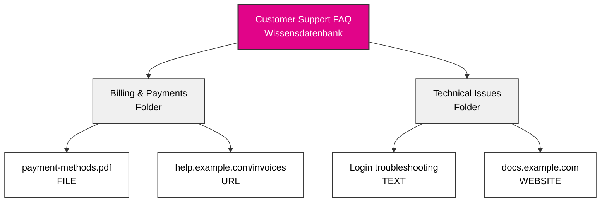
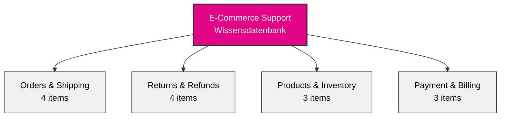

import { Screenshot } from "/snippets/screenshot.mdx";

**In diesem Leitfaden lernst du:**
- Wie Wissensdatenbanken, Ordner und Items strukturiert sind
- Wie du Inhalte für beste Retrieval-Qualität organisierst
- Wo die Entscheidungen für Context- und RAG-Mode in der Hierarchie liegen
- Grenzen für Items, Dateien und Ordner

---

## Übersicht

Wissensdatenbanken geben deinem KI-Agenten Zugriff auf echte Unternehmensinformationen - Richtlinien, Prozesse, Produktdetails und alles, worauf dein Business basiert. Wenn du diese Informationen in eine strukturierte Hierarchie organisierst, kann dein Agent sie während des Gesprächs sofort abrufen und referenzieren.

Diese Seite erklärt die Struktur von Knowledge-Inhalten. Für die Entscheidungstabelle zum Zugriffsmodus nutze [Context vs RAG](/de/build/knowledge/context-vs-rag).

## Knowledge-Architektur

### Die dreistufige Hierarchie

Knowledge in itellicoAI folgt einer dreistufigen Struktur:

**Wissensdatenbank -> Ordner -> Items**

Items können **Text**, **Dateien** (PDF, Word, Excel, Markdown, CSV, JSON, YAML, XML), **URLs** (eine Web-Seite) oder **Website-Crawls** (mehrere Seiten einer Website) sein. Siehe [content types](/de/build/knowledge/content-types) für Details zu jedem Format.

```mermaid
graph TB
    KB[Customer Support FAQ<br/>Wissensdatenbank]

    KB --> F1[Billing & Payments<br/>Folder]
    KB --> F2[Technical Issues<br/>Folder]

    F1 --> I1[payment-methods.pdf<br/>FILE]
    F1 --> I2[help.example.com/invoices<br/>URL]

    F2 --> I3[Login troubleshooting<br/>TEXT]
    F2 --> I4[docs.example.com<br/>WEBSITE]

    style KB fill:#E10489,stroke:#333,stroke-width:2px,color:#fff
    style F1 fill:#f0f0f0,stroke:#333,stroke-width:1px,color:#000
    style F2 fill:#f0f0f0,stroke:#333,stroke-width:1px,color:#000
    style I1 fill:#fff,stroke:#333,stroke-width:1px,color:#000
    style I2 fill:#fff,stroke:#333,stroke-width:1px,color:#000
    style I3 fill:#fff,stroke:#333,stroke-width:1px,color:#000
    style I4 fill:#fff,stroke:#333,stroke-width:1px,color:#000
```

Diese Hierarchie macht es leicht, große Informationsmengen zu organisieren und trotzdem gut zugreifbar und wartbar zu halten.

---

## Wissensdatenbank-Liste

Gehe in der linken Seitenleiste zu **Wissensdatenbanken**, um alle Wissensdatenbanken in einer Tabelle zu sehen.

**Zugriff:** Klicke im Hauptmenü auf **Wissensdatenbanken**.

<Screenshot
  lightSrc="/images/knowledgebase__kb-list_DE-light.png"
  darkSrc="/images/knowledgebase__kb-list_DE-dark.png"
  alt="Liste der Wissensdatenbanken mit Spalten für Name, Items, Tokens, Status und zuletzt aktualisiert"
/>

Die Liste zeigt Name, Item-Anzahl, Token-Verbrauch, Verarbeitungsstatus und den Zeitpunkt der letzten Aktualisierung. Du kannst suchen, sortieren und mehrere Wissensdatenbanken für Sammelaktionen auswählen.

### Kopierte Wissensdatenbanken

Wenn eine Wissensdatenbank über unterstützte Import-Flows kopiert wird, enthält die Kopie auch ihre Ordner und Items. Das System übernimmt das Indexing automatisch mit den Standardwerten der Plattform.

---

## Jede Ebene verstehen

### Wissensdatenbanken

<Card title="Was ist eine Wissensdatenbank?" icon="database">
  Eine Wissensdatenbank ist der oberste Container, der zusammengehörige Informationen bündelt. Sie steht für eine große Kategorie oder einen Bereich deines Unternehmenswissens.
</Card>

**Beispiel-Wissensdatenbanken:**
- **Customer Support FAQ** - Alle kundenorientierten Support-Informationen
- **Product Documentation** - Technische Doku, Benutzerhandbücher, Feature-Beschreibungen
- **Company Policies** - HR-Richtlinien, Compliance-Dokumente, interne Prozesse
- **Sales Resources** - Preissheets, Wettbewerbsvergleiche, Pitch Decks

### Ordner

<Card title="Was ist ein Ordner?" icon="folder">
  Ordner sind organisatorische Einheiten innerhalb einer Wissensdatenbank. Sie bündeln zusammenhängende Items nach Thema, Kategorie oder Zweck.
</Card>

Ordner gruppieren zusammenhängende Items nach Thema und machen Inhalte leichter auffindbar und verwaltbar.

**Beispiel-Ordner in einer Customer-Support-Wissensdatenbank:**
- **Billing & Payments** - Fragen zu Rechnungen, Zahlungsmethoden, Rückerstattungen
- **Technical Issues** - Troubleshooting, Fehlermeldungen, Workarounds
- **Product Information** - Features, Spezifikationen, Kompatibilität
- **Return Policies** - Rückgabezeiträume, Bedingungen, Prozessschritte

<Tip>
Verwende klare, beschreibende Ordnernamen. Davon profitieren sowohl dein Team als auch deine KI.
</Tip>

### Einträge

<Card title="Was ist ein Knowledge Item?" icon="file">
  Einträge sind die eigentlichen Informationsbausteine - Dokumente, FAQs, Richtlinien, Prozesse oder beliebige Inhalte, die dein Agent kennen soll.
</Card>

**Einträge können sein:**
- **Text-Einträge** - Direkt geschriebener Inhalt
- **Datei-Uploads** - PDF, Word (.doc, .docx), Excel (.xlsx), Text (.txt, .log), Markdown (.md), CSV/TSV, JSON, YAML, XML (bis 10MB)
- **URL-Scrapes** - Inhalte von einer einzelnen Web-Seite
- **Website-Crawls** - Mehrere gefundene Seiten einer Website, optional mit Aktualisieren-Einstellungen

**Beispiel-Items:**
- "Refund Policy for Digital Products"
- "How to Reset Password - Step by Step"
- "Product Specifications - Model X200"
- "Shipping Times by Region"

Orange bedeutet: Item wird noch verarbeitet. Grün bedeutet: Es ist bereit.

---

## Wann Wissensdatenbanken sinnvoll sind

<AccordionGroup>
  <Accordion title="Dein Agent muss konkrete Fragen beantworten" icon="circle-question">
    Wenn Kunden regelmäßig nach Richtlinien, Prozessen oder Produktdetails fragen, lege diese Informationen in einer Wissensdatenbank ab. Dein Agent kann dann immer genau darauf zugreifen.

    **Beispiel:** Ein Kunde fragt "Wie lautet eure Rückgaberegelung?" Der Agent holt die exakte Regelung aus der Wissensdatenbank und erklärt sie natürlich.
  </Accordion>

  <Accordion title="Du hast umfangreiche Dokumentation" icon="book">
    Wenn du bereits Dokumentation hast - Benutzerhandbücher, FAQs, Richtliniendokumente - kannst du sie direkt in verschiedenen Formaten hochladen (PDF, DOC, DOCX, TXT). Dein Agent kann sie dann durchsuchen und referenzieren.

    **Beispiel:** Lade dein 50-seitiges Produktmanual hoch. Wenn Kunden technische Fragen haben, findet und erklärt dein Agent die relevanten Abschnitte.
  </Accordion>

  <Accordion title="Informationen ändern sich häufig" icon="arrows-rotate">
    Wissensdatenbanken machen es leicht, Informationen zu aktualisieren, ohne die Kernanweisungen deines Agenten zu ändern. Aktualisiere ein Preissheet oder ein Richtliniendokument, und dein Agent hat sofort die neuen Informationen.

    **Beispiel:** Du aktualisierst dein Preisdokument einmal, und alle Agenten, die diese Wissensdatenbank nutzen, referenzieren sofort die neuen Preise.
  </Accordion>

  <Accordion title="Mehrere Agenten brauchen dieselben Informationen" icon="users">
    Erstelle eine Wissensdatenbank und teile sie mit mehreren Agenten. Pflege Informationen an einem Ort und nutze sie überall.

    **Beispiel:** Deine Wissensdatenbank "Product Specifications" kann vom Sales-Agent, Support-Agent und Pre-Sales-Qualifizierungsagenten genutzt werden.
  </Accordion>

  <Accordion title="Du möchtest Verantwortlichkeiten trennen" icon="layer-group">
    Halte den [Prompt](/de/build/conversation/prompt) deines Agenten von den sachlichen Informationen getrennt. Der Prompt definiert Persönlichkeit und Verhalten; Wissensdatenbanken liefern Fakten und Details.

    **Beispiel:** Dein Agent-Prompt sagt "sei freundlich und professionell". Deine Wissensdatenbank enthält die eigentlichen Produktspezifikationen, Preise und Richtlinien.
  </Accordion>
</AccordionGroup>

---

## Best Practices für die Organisation

### Mit klaren Kategorien starten

<CardGroup cols={2}>
  <Card title="Nach Abteilung" icon="building">
    - Sales Knowledge
    - Support Knowledge
    - Billing Knowledge
    - Technical Documentation
  </Card>
  <Card title="Nach Thema" icon="tags">
    - Product Information
    - Policies & Procedures
    - Troubleshooting
    - FAQs
  </Card>
  <Card title="Nach Customer Journey" icon="map">
    - Pre-Sales Information
    - Onboarding Guides
    - Usage & Features
    - Support & Troubleshooting
  </Card>
  <Card title="Nach Zielgruppe" icon="user-group">
    - Customer-Facing Info
    - Internal Procedures
    - Partner Resources
    - Technical Specs
  </Card>
</CardGroup>

### Benennungskonventionen

Verwende klare, konsistente Namen, die für dein gesamtes Team Sinn ergeben:

**Gute Beispiele:**
- Wissensdatenbank: "Customer Support Resources"
- Ordner: "Billing & Payments"
- Item: "Refund Policy - Digital Products"

**Schlechte Beispiele:**
- Wissensdatenbank: "KB_001"
- Ordner: "Misc Docs"
- Item: "Policy_v2_final_UPDATED"

<Tip>
Füge Versionsdaten oder Nummern in Eintrags-Titeln hinzu, wenn du mehrere Versionen pflegst: "Pricing Sheet - 2025 Q1"
</Tip>

### Beispiel für eine gut strukturierte Wissensdatenbank

Hier ist ein Beispiel für eine gut organisierte E-Commerce-Wissensdatenbank:

```mermaid
graph TB
    KB[E-Commerce Support<br/>Wissensdatenbank]

    KB --> F1[Orders & Shipping<br/>4 items]
    KB --> F2[Returns & Refunds<br/>4 items]
    KB --> F3[Products & Inventory<br/>3 items]
    KB --> F4[Payment & Billing<br/>3 items]

    style KB fill:#E10489,stroke:#333,stroke-width:2px,color:#fff
    style F1 fill:#f0f0f0,stroke:#333,stroke-width:1px,color:#000
    style F2 fill:#f0f0f0,stroke:#333,stroke-width:1px,color:#000
    style F3 fill:#f0f0f0,stroke:#333,stroke-width:1px,color:#000
    style F4 fill:#f0f0f0,stroke:#333,stroke-width:1px,color:#000
```

**Ordnerinhalte:**
- **Orders & Shipping:** Tracking, Versandzeiten, internationale Infos, Änderungen
- **Returns & Refunds:** Richtlinie, Rücksendeprozess, Bearbeitungszeiten, Umtausch
- **Products & Inventory:** Kategorien, Lagerbestand, Spezifikationen
- **Payment & Billing:** Zahlungsmethoden, Rechnungen, Zahlungspläne

**Warum diese Struktur gut ist:**
- Klare, beschreibende Ordnernamen, die verwandte Inhalte bündeln
- Ausgewogene Verteilung (3-4 Items pro Ordner)
- Leicht zu navigieren und Informationen schnell zu finden
- Skaliert gut, wenn du mehr Inhalte hinzufügst

### Nur relevante Inhalte extrahieren

<Warning>
**Mehr Knowledge != bessere Performance**

Zu viel Knowledge erhöht die Wahrscheinlichkeit, dass dein Agent irrelevante Informationen zusammen mit der eigentlichen Antwort abruft.
</Warning>

**Best Practice für große Dokumente:**

Lade nicht ganze Handbücher oder Richtliniendokumente hoch, sondern extrahiere nur die Seiten oder Abschnitte, die dein Agent wirklich braucht.

<AccordionGroup>
  <Accordion title="❌ Vermeiden: komplettes 200-seitiges Mitarbeiterhandbuch hochladen" icon="xmark">
    **Problem:**
    - Der Agent findet und mischt irrelevante Abschnitte mit der richtigen Antwort
    - Es wird schwieriger, die wirklich relevanten Stellen zu bestimmen
    - Unnötiger Verbrauch von Gesprächsraum durch themenfremde Inhalte

    **Beispiel:**
    Kunde fragt: "Wie lauten eure Rückgabebedingungen?"

    Der Agent könnte stattdessen HR-Urlaubsregeln, interne Prozesse und Mitarbeiter-Benefits heranziehen - und müssen die passende Antwort erst herausfiltern.
  </Accordion>

  <Accordion title="✅ Besser: spezifische Abschnitte extrahieren" icon="check">
    **Vorgehen:**
    - "Return Policy - Pages 45-48"
    - "Shipping Policy - Pages 52-55"
    - "Warranty Terms - Pages 89-92"

    **Vorteil:**
    - Der Agent findet nur kundenrelevante Inhalte
    - Klarere, genauere Antworten
    - Effizienterer Einsatz des Gesprächsraums

    **Beispiel:**
    Kunde fragt: "Wie lauten eure Rückgabebedingungen?"

    Der Agent ruft nur den 4-seitigen Abschnitt zur Rückgabe ab - genau das, was gebraucht wird, nichts anderes.
  </Accordion>
</AccordionGroup>

**So extrahierst du relevante Abschnitte:**
- Exportiere konkrete Seiten aus PDFs als separate Dateien
- Kopiere relevante Abschnitte in TEXT-Items
- Nutze Website-Crawls nur, wenn du mehrere Seiten derselben öffentlichen Website brauchst

### Regelmäßige Pflege

<Steps>
  <Step title="Quartalsweise prüfen">
    Plane regelmäßige Reviews deiner Wissensdatenbanken, damit die Informationen aktuell bleiben.
  </Step>
  <Step title="Veraltete Inhalte entfernen">
    Lösche Items, die nicht mehr relevant sind, oder entkopple sie von Agenten. Veraltete Informationen können deinen Agenten verwirren und falsche Antworten erzeugen.
  </Step>
  <Step title="Feedback einarbeiten">
    Wenn Kunden falsche Informationen melden, prüfe sofort deine Wissensdatenbank.
  </Step>
</Steps>

---

## Praxisbeispiele

<AccordionGroup>
  <Accordion title="SaaS Support Agent" icon="headset">
    **Wissensdatenbank:** "SaaS Product Support"

    **Ordner:**
    - **Account Management** (15 Items)
      - Passwort-zurücksetzen
      - Anweisungen für Upgrades
      - Informationen zum Billing-Zyklus
      - Planvergleichstabelle
    - **Feature Documentation** (47 Items)
      - Einzelne Feature-Guides
      - Integrations-Tutorials
      - API-Dokumentation
      - Best Practices
    - **Troubleshooting** (23 Items)
      - Häufige Fehlermeldungen
      - Verbindungsprobleme
      - Browser-Kompatibilität
      - Performance-Optimierung

    **Ergebnis:** Der Support-Agent kann 80% der technischen Fragen ohne menschliche Hilfe beantworten.
  </Accordion>

  <Accordion title="Healthcare Appointment Agent" icon="calendar">
    **Wissensdatenbank:** "Patient Services"

    **Ordner:**
    - **Appointment Policies** (8 Items)
      - Terminrichtlinien
      - Stornierungsregelung
      - Versicherungsanforderungen
      - Ablauf für neue Patienten
    - **Office Information** (5 Items)
      - Standorte und Öffnungszeiten
      - Parkhinweise
      - Barrierefreiheitsinformationen
      - Kontaktverzeichnis
    - **Insurance & Billing** (12 Items)
      - Akzeptierte Versicherer
      - Zahlungsoptionen
      - Billing-Fragen
      - Finanzielle Unterstützung

    **Ergebnis:** Der Agent bearbeitet Terminbuchungen und Richtlinienfragen 24/7 mit voller Genauigkeit.
  </Accordion>

  <Accordion title="E-Commerce Sales Agent" icon="shopping-cart">
    **Wissensdatenbank:** "Product Catalog & Sales"

    **Ordner:**
    - **Product Specifications** (89 Items)
      - Detaillierte Produktbeschreibungen
      - Technische Spezifikationen
      - Kompatibilitätsinformationen
      - Größentabellen
    - **Pricing & Promotions** (15 Items)
      - Aktuelle Preise
      - Laufende Aktionen
      - Mengenrabatte
      - Saisonale Angebote
    - **Shipping & Delivery** (7 Items)
      - Versandoptionen
      - Lieferzeiten
      - Internationaler Versand
      - Tracking-Informationen

    **Ergebnis:** Der Sales-Agent liefert während Kundengesprächen sofort genaue Produkt- und Preisinformationen.
  </Accordion>
</AccordionGroup>

---

## Nächste Schritte

<CardGroup cols={2}>
  <Card title="Wissensdatenbanken erstellen" icon="plus" href="/de/build/knowledge/create-knowledge-bases">
    Erstelle und organisiere dein Wissen Schritt für Schritt
  </Card>
  <Card title="Inhaltstypen" icon="file-lines" href="/de/build/knowledge/content-types">
    Lerne Text-, Datei-, URL- und Website-Crawl-Items kennen
  </Card>
  <Card title="Assign to Agents" icon="link" href="/de/build/knowledge/assign-knowledge">
    Wissensdatenbanken mit deinen Agenten verbinden
  </Card>
  <Card title="Context vs RAG" icon="brain" href="/de/build/knowledge/context-vs-rag">
    Den passenden Zugriffsmodus für deinen Anwendungsfall wählen
  </Card>
  <Card title="Support Agent Example" icon="life-ring" href="/de/examples/customer-support">
    Ein vollständiges Beispiel mit Knowledge-gestütztem Support ansehen
  </Card>
</CardGroup>
