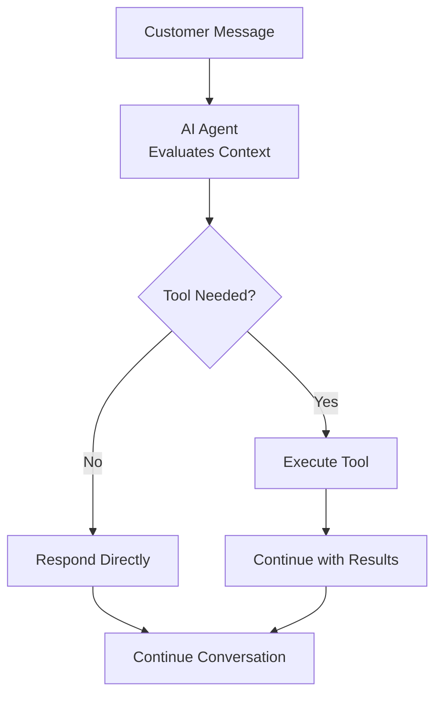

## Übersicht

Tools erlauben deinen KI-Agenten, mehr zu tun als nur Fragen zu beantworten. Mit konfigurierten Tools können Agenten Termine planen, Anrufe weiterleiten, Systeme aktualisieren und sich mit deinen bestehenden Workflows verbinden - alles während eines Live-Gesprächs.

<Note>
Tools werden automatisch basierend auf dem Gesprächskontext und dem Prompt ausgeführt, den du dem Agenten gibst. Du definierst über [Prompt Engineering](/de/build/conversation/prompt-engineering-guide), wann und wie Tools genutzt werden.
</Note>

## Was sind Tools?

Tools sind vorkonfigurierte Fähigkeiten, die dein Agent während des Gesprächs aufrufen kann, um konkrete Aufgaben zu erledigen. Wenn ein Kunde etwas wie Terminbuchung oder ein Gespräch mit einem Spezialisten anfragt, führt dein Agent automatisch das passende Tool aus.

### Wie Tools funktionieren

Während eines Gesprächs entscheidet dein Agent, ob er direkt antwortet oder ein Tool ausführt:



Der Agent nutzt **Tool-Namen und Beschreibungen**, um zu verstehen, was jedes Tool macht. Diese Details helfen dem Modell, im richtigen Moment das richtige Tool zu wählen.

**Best Practices:**
- Gib Tools klare, beschreibende Namen, etwa "book_appointment" statt "tool1"
- Schreibe detaillierte Beschreibungen, die erklären, was das Tool tut
- Füge im [Agent Prompt](/de/build/conversation/prompt-engineering-guide) explizite Hinweise dazu ein, **wann** jedes Tool verwendet werden soll

<Note>
Während Tool-Namen und Beschreibungen dem Agenten sagen, **was** ein Tool macht, sollte dein Agent-Prompt festlegen, **wann** es genutzt wird. Beispiel: "Wenn ein Kunde mit einem Menschen sprechen will, nutze das Tool transfer_to_support."
</Note>

---

## Verfügbare Tool-Typen

Im Add-Menü des **Tools**-Tabs findest du:

- **Transfer Call**
- **Calendar Booking**
- **Custom Action**
- **Web Search** *(Alpha)*
- **Calculator** (Profi)
- **MCP Server** (Profi)

<Note>
Call ending ist kein separat hinzufügbares Tool mehr. Konfiguriere es unter **Conversation** -> **Call End** mit **Allow AI to hang up**.
</Note>

Für die Einrichtung der einzelnen Tools siehe [Transfer Tools](/de/build/tools/transfer-tools), [Calendar Booking](/de/build/tools/booking-calendar), [Custom Action](/de/build/tools/custom-api-actions), [Web Search](/de/build/tools/web-search), [Calculator](/de/build/tools/calculator) und [MCP Servers](/de/build/advanced/mcp-servers).

Für den Ablauf von Live-Variablen und Ergebnissen lies [Conversation Data Flow](/de/build/conversation/runtime-data-flow).

---

## Wann Tools ausgeführt werden

Tools laufen **während des Gesprächs**, wenn dein Agent sie anhand des Prompts auslöst. Anders als klassische IVR-Systeme, die starren Skripten folgen, nutzen KI-Agenten kontextuelles Verständnis, um zu entscheiden, wann Tools angebracht sind.

### Trigger-Mechanismen

**Instruction-Based Triggers:**
```text wrap
When the customer asks to speak to a human, use the 'Transfer to Support' tool.

When the customer wants to schedule, use the 'Book Consultation' tool after you have the required details.

When the customer asks for up-to-date external information, use the 'Web Search' tool.
```

**Conditional Triggers:**
```jinja
If the customer reports a billing issue:
1. Use the 'Lookup Account' tool to retrieve their information
2. If balance is overdue, transfer to billing department
3. If balance is current, troubleshoot the issue


Always offer to transfer VIP customers to dedicated support immediately.

```

**Multi-Step Workflows:**
```text wrap
Appointment Booking Flow:
1. Gather required information (name, email, preferred date)
2. Use 'Check Availability' tool to query Cal.com
3. Present options to customer
4. Use 'Book Appointment' tool to confirm
5. Confirm the booked slot and next steps clearly
6. End the conversation naturally or rely on **Allow AI to hang up** if you have enabled it in **Conversation** → **Call End**
```

<Warning>
Tools laufen in Echtzeit während des Anrufs. Stelle sicher, dass verbundene Systeme zuverlässig sind und schnell reagieren, um unangenehme Pausen im Gespräch zu vermeiden.
</Warning>

---

## Tools konfigurieren

Die gesamte Tool-Konfiguration passiert im Agent Editor unter dem Tab **Tools**.

<Steps>
  <Step title="Zu Tools navigieren">
    Öffne deinen Agenten im Editor und klicke auf den Tab **Tools**
  </Step>
  <Step title="Tool-Typ wählen">
    Durchsuche die verfügbaren Tools und klicke auf **Add**, um ein Tool zu konfigurieren
  </Step>
  <Step title="Tool konfigurieren">
    Fülle das tool-spezifische Formular aus:
    - **Name**: Gib deinem Tool einen klaren, beschreibenden Namen
    - **Description**: Erkläre, was dieses Tool tut
    - **Tool-specific settings**: Konfiguriere Parameter je nach Tool-Typ
  </Step>
  <Step title="Speichern">
    Speichere das Tool, damit es zur Werkzeugkiste deines Agenten hinzugefügt wird
  </Step>
</Steps>

---

## Tools-Tabelle

Konfigurierte Tools erscheinen in einer einzigen Tabelle im **Tools**-Tab.

Typische Spalten sind:

- **Name** - Anzeigename des Tools
- **Type** - Tool-Typ, zum Beispiel Transfer, Booking, Custom, Web Search, MCP Server
- **Category** - Untertyp oder Anbieter-Detail
- **Details** - Wichtige Konfigurationsdetails

Nutze **Add**, um weitere Tools zu erstellen, klicke eine Zeile zum Bearbeiten und verwende die Entfernen-Aktion zum Löschen.

---

## Tools im Prompt referenzieren

Um Tools zu nutzen, referenziere sie im Prompt **mit genauem Namen**:

### Direkte Referenz
```text wrap
When a customer asks to speak to someone about billing,
use the 'Transfer to Billing Department' tool.
```

### Mit Bedingungen
```text wrap
If the customer's issue cannot be resolved:
1. Apologize for the inconvenience
2. Explain you're connecting them to a specialist
3. Use the 'Transfer to Support' tool
```

### Mit Parametern
```text wrap
After gathering the customer's email and preferred date,
use the 'Book Consultation' tool to schedule the meeting.
```

<Note>
Tool-Namen sind case-sensitiv und müssen exakt mit der Konfiguration übereinstimmen. Wenn du ein Tool umbenennst, aktualisiere alle Referenzen in deinem Prompt.
</Note>

---

## Best Practices für die Konfiguration

<AccordionGroup>
  <Accordion title="Einfach starten" icon="seedling">
    Beginne mit grundlegenden Tools, bevor du komplexe Integrationen hinzufügst. Füge jeweils nur ein Tool hinzu, teste es gründlich und nimm dann das nächste.

    **Beispiel-Reihenfolge:**
    1. Transfer to Support hinzufügen
    2. Booking oder Web Search hinzufügen
    3. Custom Action hinzufügen
    4. MCP Server nur dann hinzufügen, wenn du externe Tool-Kataloge brauchst
  </Accordion>

  <Accordion title="Klare, beschreibende Namen verwenden" icon="tag">
    Tool-Namen sind entscheidend, weil das Modell sie benutzt, um zu verstehen, was jedes Tool macht. Nutze beschreibende, handlungsorientierte Namen, die den Zweck klar vermitteln.

    **Warum das wichtig ist:** Das Modell stützt sich auf Funktionsnamen und Beschreibungen, um zu erkennen, wann eine Funktion aufgerufen werden muss und welches Tool für die Aufgabe passt.

    **Gute Namen:**
    - "Get Customer Account" - klares Verb + konkretes Ziel
    - "Transfer to Billing Department" - konkretes Ziel enthalten
    - "Book 30-Minute Consultation" - relevante Details enthalten

    **Schlechte Namen:**
    - "Tool 1" - kein Kontext
    - "Transfer" - zu allgemein
    - "API Call" - beschreibt das Tool nicht
  </Accordion>

  <Accordion title="Detaillierte Beschreibungen schreiben" icon="file-lines">
    Tool-Beschreibungen helfen dem Modell zu verstehen, **was** das Tool tut. Die Beschreibung sollte den Zweck, die Rückgabe und die verwendeten Parameter erklären.

    **Best Practices aus [OpenAI function calling](https://platform.openai.com/docs/guides/function-calling):**
    - Klar beschreiben, was das Tool tut und was es zurückgibt
    - Erklären, welche Parameter oder Daten es verwendet
    - Präzise Sprache verwenden, die dem Modell hilft
    - Kurz, aber umfassend bleiben

    **Beispiel:**
    ```
    Name: Get Customer Account
    Description: Retrieves customer account data from Salesforce CRM using
    their phone number. Returns account status, balance, and recent orders.
    ```

    **Hinweis:** Beschreibe in der Beschreibung **was** das Tool tut. Lege in deinem [Agent Prompt](/de/build/conversation/prompt-engineering-guide) fest, **wann** es verwendet werden soll.
  </Accordion>

  <Accordion title="Gründlich testen" icon="vial">
    Teste jedes Tool in der Agent-Testoberfläche, bevor du live gehst:
    - Prüfe, ob das Tool korrekt ausgeführt wird
    - Teste Erfolgsfälle
    - Teste Fehlerfälle
    - Prüfe das Error-Handling
    - Kontrolliere den Gesprächsfluss
  </Accordion>

  <Accordion title="Fehler elegant behandeln" icon="shield-check">
    Konfiguriere Fallback-Verhalten für den Fall, dass Tools fehlschlagen. Sage deinem Agenten, was er tun soll, wenn Tools nicht funktionieren.

    ```
    If the 'Book Appointment' tool fails:
    1. Apologize sincerely
    2. Offer to have someone call back to schedule
    3. Collect their preferred callback number
    4. Summarize the fallback plan before ending the conversation
    ```
  </Accordion>

  <Accordion title="Informationen zuerst sammeln" icon="clipboard-check">
    Stelle sicher, dass Agenten die nötigen Daten einsammeln, bevor sie Tools ausführen. Versuche nicht, Termine ohne E-Mail-Adressen zu buchen oder Anrufe ohne Begründung weiterzuleiten.

    ```
    Before using the 'Book Consultation' tool:
    1. Confirm the customer wants to schedule
    2. Ask for their email address if not in contact record
    3. Discuss their preferred dates and times
    4. Explain what the consultation will cover
    5. Only then execute the booking tool
    ```
  </Accordion>

  <Accordion title="Zugangsdaten absichern" icon="lock">
    Verwende geeignete Authentifizierung für alle benutzerdefinierten Tools. Exponiere niemals API-Schlüssel oder Zugangsdaten in URLs oder unverschlüsselten Feldern.

    - Bearer-Tokens für API-Authentifizierung verwenden
    - Basic Auth nur über HTTPS einsetzen
    - Sensible Zugangsdaten sicher speichern
    - Zugangsdaten regelmäßig rotieren
  </Accordion>
</AccordionGroup>

---

## Tools testen

<Note>
Einige Tools funktionieren nur bei einem echten Telefonanruf. Weiterleitungen an eine Telefonnummer oder SIP-Adresse können nicht im Web-Simulator getestet werden — die Weiterleitungsaktion erfordert eine echte Telefonieverbindung. Verwende **Agent testen → Telefonanruf**, um diese zu testen.
</Note>

Teste vor dem Einsatz von Agenten mit Tools gründlich in der Dashboard-Testoberfläche:

<Steps>
  <Step title="Testoberfläche öffnen">
    Klicke auf **Agent testen** in der oberen rechten Ecke des Agenten-Editors.
  </Step>
  <Step title="Web-Call starten">
    Klicke auf **Web-Call starten**, um ein Testgespräch zu beginnen.
  </Step>
  <Step title="Jedes Tool auslösen">
    Führe Szenarien durch, die jedes konfigurierte Tool auslösen.
  </Step>
  <Step title="Ausführung prüfen">
    Überprüfe, ob Tools korrekt ausgeführt werden und Antworten angemessen verarbeiten.
  </Step>
  <Step title="Fehlerfälle testen">
    Simuliere Fehler, um sicherzustellen, dass die Fehlerbehandlung wie erwartet funktioniert.
  </Step>
  <Step title="Transkript prüfen">
    Überprüfe das Gesprächstranskript, um sicherzustellen, dass der Ablauf natürlich ist und Tools reibungslos integriert sind.
  </Step>
</Steps>

### Was zu testen ist

**Für Weiterleitungs-Tools:**
- Weiterleitung zum richtigen Ziel
- Wartemusik bei Agent-Weiterleitung, sofern konfiguriert
- Weiterleitungsnachricht ist angemessen
- Cold-Transfer-Verhalten und Fallback-Behandlung funktionieren korrekt

**Für Buchungs-Tools:**
- Verfügbarkeit wird korrekt abgerufen
- Buchung wird erfolgreich bestätigt
- E-Mail-/SMS-Benachrichtigungen werden korrekt gesendet
- Zeitzonenbehandlung ist korrekt

**Für benutzerdefinierte Aktionen:**
- Verbundene Systeme antworten erfolgreich
- Authentifizierung funktioniert
- Antwortdaten sind für den Agenten verfügbar
- Fehlerantworten werden korrekt behandelt

**Für alle Tools:**
- Agent referenziert Tool mit dem richtigen Namen
- Agent sammelt zuerst erforderliche Informationen
- Gesprächsfluss bleibt natürlich
- Fehler unterbrechen das Gespräch nicht

<Warning>
Testanrufe verwenden echte Integrationen. Wenn du ein Buchungs-Tool testest, werden echte Termine in deinem Cal.com-Account erstellt. Bereinige Testdaten anschließend.
</Warning>

---

## Häufige Anwendungsfälle

### Kundensupport-Workflow

```text wrap
Agentenkonfiguration:
- Weiterleitung zum Support (für komplexe Probleme)
- Kundenkonto nachschlagen (benutzerdefinierte API)
- Support-Ticket erstellen (benutzerdefinierte API)
- "KI darf auflegen" aktiviert unter Gespräch → Gesprächsende

Anweisungen:
Wenn ein Kunde anruft:
1. Begrüße ihn freundlich
2. Verwende "Kundenkonto nachschlagen", um seine Informationen abzurufen
3. Frage nach seinem Anliegen
4. Wenn du es lösen kannst, tue es mithilfe der Wissensdatenbank
5. Bei komplexen Problemen verwende "Support-Ticket erstellen" und gib die Ticketnummer an
6. Wenn der Kunde einen Menschen wünscht, verwende "Weiterleitung zum Support"
7. Bei Lösung bestätige die nächsten Schritte und beende natürlich
```

### Terminbuchungs-Workflow

```text wrap
Agentenkonfiguration:
- Beratung buchen (Cal.com-Buchung)
- Weiterleitung zur Terminplanung (Fallback)
- "KI darf auflegen" aktiviert unter Gespräch → Gesprächsende

Anweisungen:
Wenn ein Kunde einen Termin buchen möchte:
1. Frage, welche Art von Termin benötigt wird
2. E-Mail-Adresse erfragen, falls nicht im Kontaktdatensatz
3. Bevorzugte Termine besprechen
4. Verwende "Beratung buchen", um Verfügbarkeit anzuzeigen und zu bestätigen
5. Bei erfolgreicher Buchung Details mündlich bestätigen
6. Bei fehlgeschlagener Buchung "Weiterleitung zur Terminplanung" verwenden
7. Gespräch nach Bestätigung des Ergebnisses natürlich beenden
```

### Verkaufsqualifizierungs-Workflow

```text wrap
Agentenkonfiguration:
- Unternehmensdaten nachschlagen (benutzerdefinierte API)
- CRM-Lead aktualisieren (benutzerdefinierte API)
- Weiterleitung zum Vertrieb (für qualifizierte Leads)
- "KI darf auflegen" aktiviert unter Gespräch → Gesprächsende

Anweisungen:
Für ausgehende Verkaufsanrufe:
1. Stelle dich und den Zweck vor
2. Verwende "Unternehmensdaten nachschlagen", um Firmendaten abzurufen
3. Stelle Qualifizierungsfragen (Budget, Zeitplan, Entscheidungsbefugnis)
4. Verwende "CRM-Lead aktualisieren" mit Qualifizierungsstatus
5. Bei Qualifizierung "Weiterleitung zum Vertrieb" mit Kontext verwenden
6. Bei fehlender Qualifizierung bedanke dich und beende das Gespräch natürlich
```

---

## Häufige Probleme beheben

<AccordionGroup>
  <Accordion title="Tool wird nicht ausgelöst" icon="circle-exclamation">
    **Problem:** Agent verwendet das Tool nicht, obwohl er sollte.

    **Lösungen:**
    - Überprüfe, ob der Tool-Name im Prompt exakt übereinstimmt (Groß-/Kleinschreibung beachten)
    - Stelle sicher, dass das Tool in der Tools-Tabelle vorhanden ist und eine erforderliche Integration verbunden ist
    - Mache deinen Prompt expliziter, wann das Tool verwendet werden soll
    - Teste isoliert, indem du den Agenten explizit auffordest, das Tool zu verwenden
    - Überprüfe das Gesprächstranskript, um die Überlegungen des Agenten zu sehen
  </Accordion>

  <Accordion title="Agent kündigt Tool an, führt es aber nicht aus" icon="comments">
    **Problem:** Agent bestätigt mündlich die Ausführung eines Tools (z.B. "Ich leite dich jetzt weiter"), aber das Tool wird erst im nächsten Gesprächszug ausgeführt.

    **Warum das passiert:** Der Agent generiert eine Antwort und führt das Tool im selben Zug aus, aber nur eines kann pro Zug passieren.

    **Lösung:** Weise den Agenten an, vor der Tool-Ausführung eine Bestätigung einzuholen:

    ```jinja
    Bevor du das Tool "Weiterleitung zum Support" verwendest:
    1. Erkläre, warum du weiterleitest
    2. Frage: "Soll ich dich jetzt weiterleiten?"
    3. Warte auf Bestätigung
    4. Nach Bestätigung führe das Tool "Weiterleitung zum Support" aus
    ```

    So stellt der Agent sicher, dass das Tool sofort nach der Bestätigung ausgeführt wird, nicht im selben Zug wie die Ankündigung.
  </Accordion>

  <Accordion title="Authentifizierungsfehler" icon="key">
    **Problem:** Benutzerdefinierte Tools schlagen mit 401/403-Fehlern fehl.

    **Lösungen:**
    - Überprüfe, ob Zugangsdaten korrekt und nicht abgelaufen sind
    - Prüfe, ob der Authentifizierungstyp den Anforderungen des verbundenen Systems entspricht
    - Stelle sicher, dass Bearer-Tokens ggf. den Präfix "Bearer" enthalten
    - Bitte den Eigentümer des verbundenen Systems zu bestätigen, dass die Verbindung außerhalb des Agenten funktioniert
    - Überprüfe die Authentifizierungsanforderungen des verbundenen Systems
  </Accordion>

  <Accordion title="Buchungsaktion schlägt fehl" icon="calendar-xmark">
    **Problem:** Das Cal.com-Buchungs-Tool gibt Fehler zurück.

    **Lösungen:**
    - Überprüfe, ob die Cal.com-Integration verbunden ist
    - Prüfe, ob der Event-Typ vorhanden und aktiv ist
    - Stelle sicher, dass die Meeting-Plattform in Cal.com konfiguriert ist
    - Überprüfe, ob Planungsfenster die angeforderten Termine zulassen
    - Zeitzonenkonfiguration prüfen
    - Teste die Buchung manuell in Cal.com, um die Verfügbarkeit zu prüfen
  </Accordion>

  <Accordion title="Weiterleitung stellt keine Verbindung her" icon="phone-slash">
    **Problem:** Das Weiterleitungs-Tool wird ausgeführt, stellt aber keine Verbindung her.

    **Lösungen:**
    - Überprüfe, ob das Ziel im korrekten E.164-Format vorliegt (z.B. +49151234567)
    - Stelle sicher, dass die Telefonnummer erreichbar ist (bei Telefon-Weiterleitungen)
    - Überprüfe, ob die SIP-Adresse korrekt ist (bei SIP-Weiterleitungen)
    - Teste das Ziel unabhängig
  </Accordion>
</AccordionGroup>

---

## Nächste Schritte

<CardGroup cols={2}>
  <Card title="Weiterleitungs-Tools" icon="phone-arrow-right" href="/build/tools/transfer-tools">
    Ziele, Modi, Routing-Muster und Gesprächsende konfigurieren
  </Card>
  <Card title="Buchungsintegration" icon="calendar" href="/build/tools/booking-calendar">
    Cal.com-Terminplanung mit E-Mail- und SMS-Benachrichtigungen einrichten
  </Card>
  <Card title="Benutzerdefinierte Aktion" icon="code" href="/build/tools/custom-api-actions">
    Agenten mit externen Systemen und APIs verbinden
  </Card>
  <Card title="Gesprächsdatenfluss" icon="arrows-turn-right" href="/build/conversation/runtime-data-flow">
    Verstehen, wie Werte in Live-Tools und Post-Call-Workflows fließen
  </Card>
  <Card title="Prompt" icon="pen" href="/build/conversation/prompt">
    Effektive Agenten-Prompts schreiben
  </Card>
  <Card title="Prompt Engineering" icon="book" href="/build/conversation/prompt-engineering-guide">
    Fortgeschrittene Prompt-Techniken für zuverlässiges Agentenverhalten
  </Card>
</CardGroup>

---

## Häufige Fragen

<AccordionGroup>
  <Accordion title="Spielt der Tool-Name eine Rolle?">
    Ja. Der Agent wählt Tools basierend auf dem von dir angegebenen Namen und der Beschreibung aus. Verwende klare, beschreibende Namen wie "Weiterleitung zum Vertrieb" oder "Termin buchen" — nicht "Tool 1" oder "Aktion A". Namen unterscheiden zwischen Groß- und Kleinschreibung.
  </Accordion>

  <Accordion title="Kann ich Tools ohne Programmierung hinzufügen?">
    Integrierte Tools (Anruf weiterleiten, Kalenderbuchung, Websuche) erfordern keinen Code. Benutzerdefinierte API-Aktionen benötigen einen aufzurufenden API-Endpunkt, werden aber vollständig in der Benutzeroberfläche konfiguriert — kein SDK oder serverseitiger Code erforderlich.
  </Accordion>

  <Accordion title="Was passiert, wenn ein Tool während eines Anrufs fehlschlägt?">
    Der Agent erhält die Fehlerantwort und kann damit umgehen, wenn dein Prompt Fallback-Anweisungen enthält. Überprüfe die Gesprächszeitleiste, um die genaue Anfrage und Antwort für jeden Tool-Aufruf zu sehen.
  </Accordion>
</AccordionGroup>
