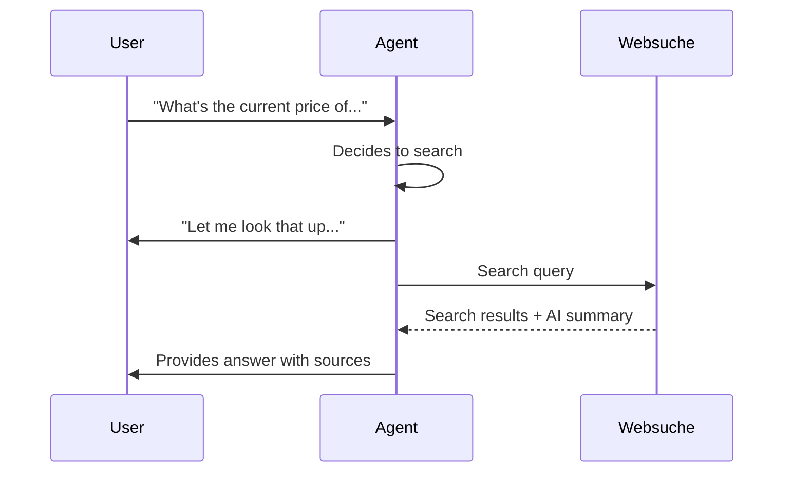

import { Screenshot } from "/snippets/screenshot.mdx";

## Wie Websuche funktioniert

Das Tool **Websuche** erlaubt deinem Agenten, während des Gesprächs das Internet nach Informationen in Echtzeit zu durchsuchen. Es liefert aktuelle Antworten auf Fragen, die über das Training oder die Wissensbasis deines Agenten hinausgehen.

<Note>
Die Websuche befindet sich aktuell in Alpha. Jede Suche verursacht zusätzliche Kosten von 0,01 €.
</Note>

---

## Anwendungsfälle

<CardGroup cols={2}>
  <Card title="Aktuelle Ereignisse" icon="newspaper">
    Beantworte Fragen zu aktuellen Nachrichten, Updates oder zeitkritischen Informationen
  </Card>
  <Card title="Wettbewerbsrecherche" icon="chart-bar">
    Schau in Vertriebsgesprächen nach aktuellen Preisen, Features oder Angeboten
  </Card>
  <Card title="Produktinformationen" icon="box">
    Finde Spezifikationen, Verfügbarkeit oder Reviews, die nicht in deiner Wissensdatenbank stehen
  </Card>
  <Card title="Ortsdaten" icon="location-dot">
    Suche nach Adressen, Öffnungszeiten, Wegbeschreibungen oder lokalen Informationen
  </Card>
</CardGroup>

---

## Konfiguration

Öffne **Tools** im Agent-Editor und füge eine neue **Websuche** hinzu.

<Screenshot lightSrc="/images/tools__web-search-modal_DE-light.png" darkSrc="/images/tools__web-search-modal_DE-dark.png" alt="Websuche-Konfigurationsmodal mit Füllphrase, zulässigen Domains, Suchtiefe, maximalen Ergebnissen und Einstellungen für Antwort einbeziehen" caption="Das Modal Websuche steuert, was der Agent während der Suche sagt, welche Domains durchsucht werden dürfen und wie viele Ergebnisse er erhält." />

### Basis-Einstellungen

| Einstellung | Beschreibung | Standard |
|---------|-------------|---------|
| **Füllphrase** | Was der Agent während der Suche sagt | "Lass mich das nachschlagen..." |
| **Maximale Ergebnisse** | Maximal zurückgegebene Suchergebnisse (1-10) | 3 |
| **Suchtiefe** | Einfach (schneller) oder Erweitert (umfassender) | Einfach |
| **Antwort einbeziehen** | KI-Zusammenfassung der Ergebnisse einbeziehen | Aktiviert |

### Füllphrase

Passe den Satz an, den dein Agent während der Suche sagt. Die Suche dauert typischerweise 2-5 Sekunden.

**Beispiele:**
- "Let me search for that..."
- "One moment while I look this up..."
- "I'll find the latest information on that..."

### Suchtiefe

<Tabs>
  <Tab title="Einfach">
    **Schnellere Ergebnisse, weniger umfassend**

    - Antwortzeit: 1-2 Sekunden
    - Am besten für: Einfache Sachfragen
    - Kosten: Günstiger pro Suche

    **Verwende das, wenn:**
    - Schnelle Antworten wichtiger sind als Tiefe
    - Einfache Sachfragen
    - Hohe Anruflast und Geschwindigkeit zählt
  </Tab>

  <Tab title="Erweitert">
    **Umfassender, etwas langsamer**

    - Antwortzeit: 2-4 Sekunden
    - Am besten für: Komplexe Fragen mit umfangreicher Recherche
    - Kosten: Höher pro Suche

    **Verwende das, wenn:**
    - Detaillierte Informationen nötig sind
    - Komplexe mehrteilige Fragen
    - Recherche-intensive Gespräche
  </Tab>
</Tabs>

### Domain-Beschränkungen

Optional kannst du Suchen auf bestimmte Domains begrenzen:

```json
["example.com", "docs.example.com", "help.example.com"]
```

**Use cases für Domain-Restriktionen:**
- Auf eigene Dokumentationsseiten begrenzen
- Nur vertrauenswürdige Quellen zulassen
- Auf bestimmte Fachpublikationen fokussieren

Leer lassen, um das gesamte Web zu durchsuchen.

Zur Laufzeit werden Domains normalisiert und auf 25 Einträge begrenzt.

---

## Wie es funktioniert



1. Du stellst eine Frage, die aktuelle Informationen braucht
2. Der Agent erkennt, dass Websuche nötig ist
3. Der Agent spricht die Füllphrase
4. Die Suche läuft
5. Der Agent verdichtet die Ergebnisse zu einer natürlichen Antwort

---

## Best Practices

**Klare Auslöser schreiben:** Lege im Prompt fest, wann Websuche verwendet werden soll:

```text
Verwende die Websuche, wenn:
- Nach aktuellen Ereignissen, Nachrichten oder neuesten Entwicklungen gefragt wird
- Fragen zu Preisen oder Funktionen von Wettbewerbern gestellt werden
- Informationen nicht in deiner Wissensdatenbank vorhanden sind
- Zeitkritische Daten benötigt werden (Kurse, Wetter, Fahrpläne)

Verwende die Websuche NICHT, wenn:
- Die Information in der Wissensdatenbank vorhanden ist
- Es sich um allgemeine Wissensfragen handelt
- Du bereits firmenspezifische Informationen hast
```

**Füllphrases natürlich halten:** Passe die Formulierung an die Persönlichkeit des Agenten und die Situation an.

**Domain-Restriktionen mit Bedacht einsetzen:** Nur einschränken, wenn du einen klaren Grund hast. Offene Suche liefert umfassendere Ergebnisse.

**Suchtiefe beachten:** Starte mit Basic für Geschwindigkeit und wechsle zu Advanced, wenn die Ergebnisse nicht ausreichen.

---

## Einschränkungen

- **Internetzugang erforderlich:** Benötigt Netzwerkverbindung
- **Suche dauert:** 2-5 Sekunden pro Suche
- **Ergebnisse variieren:** Die Qualität hängt von der Klarheit der Anfrage ab
- **Query-Länge:** Suchanfragen sind auf 500 Zeichen begrenzt
- **Kosten pro Suche:** Jede erfolgreiche Suche wird als abrechenbare Nutzung erfasst

---

## Mit Wissensdatenbank kombinieren

Websuche und Wissensdatenbank arbeiten zusammen:

| Quelle | Am besten für |
|--------|----------------|
| Wissensdatenbank | Unternehmensspezifische, kuratierte, kontrollierte Informationen |
| Websuche | Aktuelle Ereignisse, externe Daten, Informationen in Echtzeit |

**Empfehlung:** Nutze deine Wissensdatenbank für stabile Unternehmensinformationen und Websuche für dynamische externe Daten.

---

## Nächste Schritte

<CardGroup cols={2}>
  <Card title="Tools-Übersicht" icon="bolt" href="/de/build/tools/overview">
    Alle verfügbaren Tools erkunden
  </Card>
  <Card title="Benutzerdefinierte Aktionen" icon="code" href="/de/build/tools/custom-api-actions">
    Eigene Integrationen bauen
  </Card>
  <Card title="Wissensdatenbank" icon="book" href="/de/build/knowledge/architecture">
    Kuratierte Informationsquellen hinzufügen
  </Card>
  <Card title="Agent testen" icon="vial" href="/de/test/web-simulator">
    Websuche in Gesprächen testen
  </Card>
</CardGroup>
