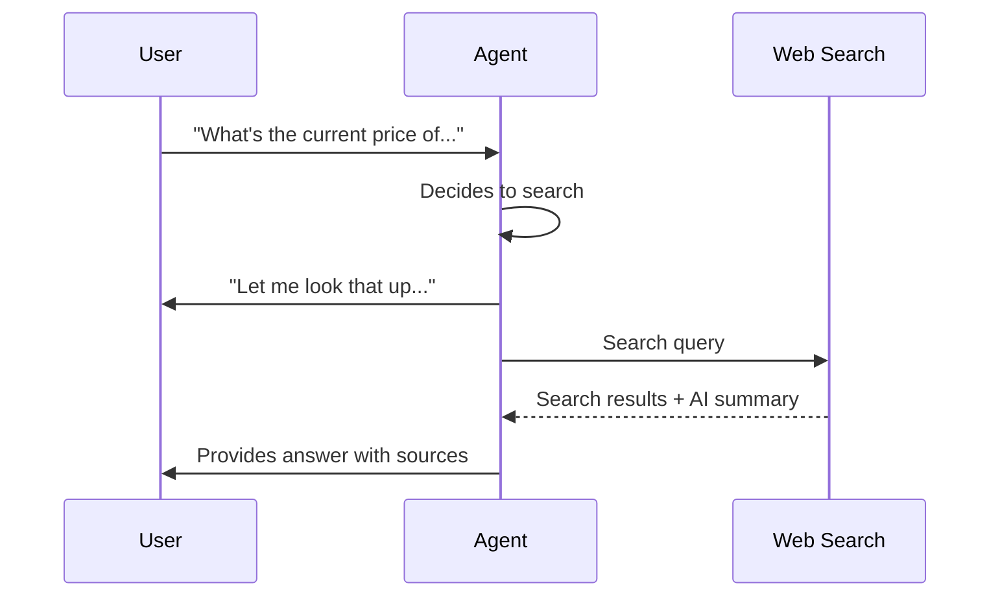

import { Screenshot } from "/snippets/screenshot.mdx";

## Wie Web Search funktioniert

Das Web-Search-Tool erlaubt deinem Agenten, während des Gesprächs das Internet nach Informationen in Echtzeit zu durchsuchen. Es liefert aktuelle Antworten auf Fragen, die über das Training oder die Knowledge Base deines Agenten hinausgehen.

<Note>
Web Search befindet sich aktuell in Alpha. Jede Suche verursacht zusätzliche Kosten von 0,01 €.
</Note>

---

## Use Cases

<CardGroup cols={2}>
  <Card title="Aktuelle Ereignisse" icon="newspaper">
    Beantworte Fragen zu aktuellen Nachrichten, Updates oder zeitkritischen Informationen
  </Card>
  <Card title="Wettbewerbsrecherche" icon="chart-bar">
    Schau in Sales Calls nach aktuellen Preisen, Features oder Angeboten
  </Card>
  <Card title="Produktinformationen" icon="box">
    Finde Spezifikationen, Verfügbarkeit oder Reviews, die nicht in deiner Knowledge Base stehen
  </Card>
  <Card title="Ortsdaten" icon="location-dot">
    Suche nach Adressen, Öffnungszeiten, Wegbeschreibungen oder lokalen Informationen
  </Card>
</CardGroup>

---

## Konfiguration

Öffne **Tools** im Agent Editor und füge ein neues Web-Search-Tool hinzu.

<Screenshot lightSrc="/images/tools__web-search-modal_DE-light.png" darkSrc="/images/tools__web-search-modal_DE-dark.png" alt="Web-Search-Konfigurationsmodal mit Filler Phrase, erlaubten Domains, Suchtiefe, maximalen Ergebnissen und KI-Antwort-Einstellungen" caption="Das Web-Search-Modal steuert, was der Agent während der Suche sagt, welche Domains durchsucht werden dürfen und wie viele Ergebnisse er erhält." />

### Basis-Einstellungen

| Einstellung | Beschreibung | Standard |
|---------|-------------|---------|
| **Filler Phrase** | Was der Agent während der Suche sagt | "Let me look that up for you..." |
| **Max Results** | Maximal zurückgegebene Suchergebnisse (1-10) | 3 |
| **Search Depth** | Basic (schneller) oder Advanced (umfassender) | Basic |
| **Include AI Answer** | KI-Zusammenfassung der Ergebnisse einbeziehen | Aktiviert |

### Filler Phrase

Passe den Satz an, den dein Agent während der Suche sagt. Die Suche dauert typischerweise 2-5 Sekunden.

**Beispiele:**
- "Let me search for that..."
- "One moment while I look this up..."
- "I'll find the latest information on that..."

### Search Depth

<Tabs>
  <Tab title="Basic">
    **Schnellere Ergebnisse, weniger umfassend**

    - Antwortzeit: 1-2 Sekunden
    - Am besten für: Einfache Sachfragen
    - Kosten: Günstiger pro Suche

    **Use when:**
    - Schnelle Antworten wichtiger sind als Tiefe
    - Einfache Sachfragen
    - Hohe Anruflast und Geschwindigkeit zählt
  </Tab>

  <Tab title="Advanced">
    **Umfassender, etwas langsamer**

    - Antwortzeit: 2-4 Sekunden
    - Am besten für: Komplexe Fragen mit umfangreicher Recherche
    - Kosten: Höher pro Suche

    **Use when:**
    - Detaillierte Informationen nötig sind
    - Komplexe mehrteilige Fragen
    - Recherche-intensive Gespräche
  </Tab>
</Tabs>

### Domain-Beschränkungen

Optional kannst du Suchen auf bestimmte Domains begrenzen:

```json
["example.com", "docs.example.com", "help.example.com"]
```

**Use cases für Domain-Restriktionen:**
- Auf eigene Dokumentationsseiten begrenzen
- Nur vertrauenswürdige Quellen zulassen
- Auf bestimmte Fachpublikationen fokussieren

Leer lassen, um das gesamte Web zu durchsuchen.

Zur Laufzeit werden Domains normalisiert und auf 25 Einträge begrenzt.

---

## Wie es funktioniert



1. Du stellst eine Frage, die aktuelle Informationen braucht
2. Der Agent erkennt, dass Web Search nötig ist
3. Der Agent spricht die Filler Phrase
4. Die Suche läuft
5. Der Agent verdichtet die Ergebnisse zu einer natürlichen Antwort

---

## Best Practices

**Klare Auslöser schreiben:** Lege im Prompt fest, wann Web Search verwendet werden soll:

```text
Use web search when:
- Asked about current events, news, or recent developments
- Questions about competitor pricing or features
- Information not in your knowledge base
- Time-sensitive data (stocks, weather, schedules)

Do NOT use web search when:
- Information is in the knowledge base
- General knowledge questions
- Company-specific information you already have
```

**Filler Phrases natürlich halten:** Passe die Formulierung an die Persönlichkeit des Agenten und die Situation an.

**Domain-Restriktionen mit Bedacht einsetzen:** Nur einschränken, wenn du einen klaren Grund hast. Offene Suche liefert umfassendere Ergebnisse.

**Suchtiefe beachten:** Starte mit Basic für Geschwindigkeit und wechsle zu Advanced, wenn die Ergebnisse nicht ausreichen.

---

## Einschränkungen

- **Internetzugang erforderlich:** Benötigt Netzwerkverbindung
- **Suche dauert:** 2-5 Sekunden pro Suche
- **Ergebnisse variieren:** Die Qualität hängt von der Klarheit der Anfrage ab
- **Query-Länge:** Suchanfragen sind auf 500 Zeichen begrenzt
- **Kosten pro Suche:** Jede erfolgreiche Suche wird als abrechenbare Nutzung erfasst

---

## Mit Knowledge Base kombinieren

Web Search und Knowledge Base arbeiten zusammen:

| Quelle | Am besten für |
|--------|----------------|
| Knowledge Base | Unternehmensspezifische, kuratierte, kontrollierte Informationen |
| Web Search | Aktuelle Ereignisse, externe Daten, Informationen in Echtzeit |

**Empfehlung:** Nutze deine Knowledge Base für stabile Unternehmensinformationen und Web Search für dynamische externe Daten.

---

## Nächste Schritte

<CardGroup cols={2}>
  <Card title="Tools Overview" icon="bolt" href="/de/build/tools/overview">
    Alle verfügbaren Tools erkunden
  </Card>
  <Card title="Custom API Actions" icon="code" href="/de/build/tools/custom-api-actions">
    Eigene Integrationen bauen
  </Card>
  <Card title="Knowledge Base" icon="book" href="/de/build/knowledge/architecture">
    Kuratierte Informationsquellen hinzufügen
  </Card>
  <Card title="Test Your Agent" icon="vial" href="/de/test/web-simulator">
    Websuche in Gesprächen testen
  </Card>
</CardGroup>
