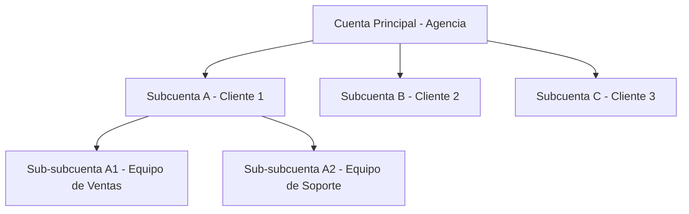

## Descripción General

itellicoAI utiliza un sistema de cuentas jerárquicas que te permite organizar tus equipos, gestionar el control de acceso y escalar tus operaciones de IA de voz. Ya seas un solo equipo o una empresa con múltiples departamentos, el sistema de cuentas proporciona flexibilidad y seguridad.

## Tipos de Cuenta

### Cuentas Principales

Las cuentas principales (también llamadas "cuentas raíz" o "cuentas principales") son organizaciones de nivel superior con:

- Facturación y suscripciones independientes
- Control administrativo completo
- Capacidad de crear subcuentas (dependiendo de la suscripción)
- Claves API e integraciones separadas

**Casos de uso:**
- Empresas individuales
- Agencias gestionando múltiples clientes
- Empresas con unidades de negocio distintas

### Subcuentas

Las subcuentas están anidadas bajo cuentas principales y proporcionan:

- Espacio de trabajo aislado para equipos o clientes
- Agentes, contactos y conversaciones separados
- Miembros del equipo y permisos independientes
- Facturación compartida con cuenta principal

**Características clave:**
- Las subcuentas pueden tener sus propias subcuentas (mantén el anidamiento simple para facilitar la gestión)
- Las cuentas principales pueden acceder a datos de subcuentas
- Las subcuentas **no pueden** acceder a datos de la cuenta principal o hermanas
- Cada subcuenta tiene su propio propietario y equipo

**Casos de uso:**
- Espacios de trabajo de clientes de agencias
- Separación de departamentos dentro de empresas
- Divisiones regionales o de líneas de producto
- Cuentas de clientes de revendedores

## Jerarquía de Cuentas

El sistema sigue una jerarquía padre-hijo con control de acceso estricto:



### Reglas de Acceso

- **Acceso hacia abajo**: Los padres pueden acceder a todas las subcuentas secundarias
- **Sin acceso hacia arriba**: Los hijos no pueden acceder a datos del padre
- **Sin acceso entre hermanos**: Las subcuentas no pueden acceder entre sí
- **Cambio de contexto**: Los usuarios con múltiples membresías pueden cambiar entre cuentas

## Casos de Uso Comunes

<AccordionGroup>
  <Accordion title="Agencia Gestionando Múltiples Clientes" icon="building">
    ```mermaid
    graph TD
        A[Agencia - Cuenta Principal]
        A --> B[Subcuenta Cliente A]
        A --> C[Subcuenta Cliente B]
        B --> D[Personal de Cliente A tiene acceso completo]
        C --> E[Personal de Cliente B tiene acceso completo]
    ```

    **Beneficios:**
    - Los clientes no pueden ver datos de otros
    - Los administradores de agencia pueden gestionar todas las cuentas
    - Seguimiento de facturación separado por cliente
    - Incorporación y desvinculación fácil
  </Accordion>

  <Accordion title="Empresa con Equipos Regionales" icon="globe">
    ```mermaid
    graph TD
        A[Sede de Empresa - Cuenta Principal]
        A --> B[Región América del Norte]
        A --> C[Región Europa]
        A --> D[Región APAC]
        B --> E[Equipo de Ventas]
        B --> F[Equipo de Soporte]
        C --> G[Equipo de Ventas]
        C --> H[Equipo de Soporte]
    ```

    **Beneficios:**
    - Autonomía regional con supervisión central
    - Control de acceso a nivel departamental
    - Facturación e informes consolidados
    - Estructuras de equipo flexibles
  </Accordion>

  <Accordion title="Revendedor o Proveedor de Marca Blanca" icon="store">
    ```mermaid
    graph TD
        A[Revendedor - Cuenta Principal]
        A --> B[Subcuenta Cliente 1]
        A --> C[Subcuenta Cliente 2]
        A --> D[Subcuenta Cliente 3]
    ```

    **Beneficios:**
    - Aislamiento y privacidad de clientes
    - Facturación centralizada al revendedor
    - Marca personalizada por cliente
    - Incorporación de clientes escalable
  </Accordion>
</AccordionGroup>

## Qué Puedes Hacer

<CardGroup cols={2}>
  <Card title="Crear Cuentas" icon="plus" href="/es/accounts/creating-accounts">
    Aprende cómo crear cuentas principales y subcuentas
  </Card>
  <Card title="Gestionar Miembros del Equipo" icon="users" href="/es/accounts/team-management">
    Invita y gestiona miembros del equipo
  </Card>
  <Card title="Claves API" icon="key" href="/es/accounts/api-keys">
    Crea y gestiona el acceso programático
  </Card>
  <Card title="Configuración de Cuenta" icon="gear" href="/es/accounts/account-settings">
    Personaliza la marca y gestiona detalles de cuenta
  </Card>
</CardGroup>

## Mejores Prácticas de Seguridad

<AccordionGroup>
  <Accordion title="Gestionar acceso de equipo cuidadosamente" icon="shield-halved">
    - Solo invitar a miembros de equipo confiables
    - Revisar miembros del equipo regularmente
    - Eliminar acceso cuando los miembros del equipo se vayan
  </Accordion>

  <Accordion title="Organizar con subcuentas" icon="sitemap">
    - Crear subcuentas separadas para clientes
    - Usar subcuentas para aislar departamentos
    - Aprovechar la jerarquía para el control de acceso
  </Accordion>

  <Accordion title="Gestionar claves API cuidadosamente" icon="key">
    - Crear claves separadas por entorno
    - Revocar claves no utilizadas o comprometidas inmediatamente
    - Establecer fechas de expiración para acceso temporal
    - Monitorear marcas de tiempo de último uso
  </Accordion>

  <Accordion title="Auditar miembros del equipo regularmente" icon="clipboard-list">
    - Revisar miembros del equipo trimestralmente
    - Eliminar empleados salientes inmediatamente
    - Actualizar acceso cuando las responsabilidades cambien
  </Accordion>
</AccordionGroup>

## Preguntas Frecuentes

<AccordionGroup>
  <Accordion title="¿Cuántas subcuentas puedo crear?">
    El número de subcuentas depende de tu plan de suscripción. Contacta a [support@itellico.ai](mailto:support@itellico.ai) para discutir tus necesidades.
  </Accordion>

  <Accordion title="¿Puedo transferir una subcuenta a otro padre?">
    Contacta a soporte para transferir subcuentas entre padres o convertir subcuentas en cuentas principales.
  </Accordion>

  <Accordion title="¿A quién se factura el uso de subcuentas?">
    La cuenta principal es responsable de toda la facturación de subcuentas. El uso se rastrea por separado para informes.
  </Accordion>

  <Accordion title="¿Pueden las subcuentas tener sus propias claves API?">
    ¡Sí! Cada subcuenta puede crear claves API independientes. Las claves tienen ámbito al contexto de su cuenta.
  </Accordion>

  <Accordion title="¿Qué sucede con los datos cuando desactivo una cuenta?">
    Las cuentas se eliminan suavemente (marcadas como inactivas). Los datos se conservan y pueden reactivarse contactando a soporte.
  </Accordion>

  <Accordion title="¿Puede un usuario ser miembro de múltiples cuentas?">
    ¡Sí! Los usuarios pueden ser invitados a múltiples cuentas y cambiar entre ellas usando el selector de cuentas.
  </Accordion>

  <Accordion title="¿Cómo transfiero la propiedad de una cuenta?">
    Contacta a soporte para transferir la propiedad. Esto no se puede hacer a través de la interfaz de usuario por razones de seguridad.
  </Accordion>
</AccordionGroup>

## ¿Necesitas Ayuda?

Contacta a [support@itellico.ai](mailto:support@itellico.ai) para asistencia con gestión de cuentas, preguntas de facturación o transferencias de propiedad.
