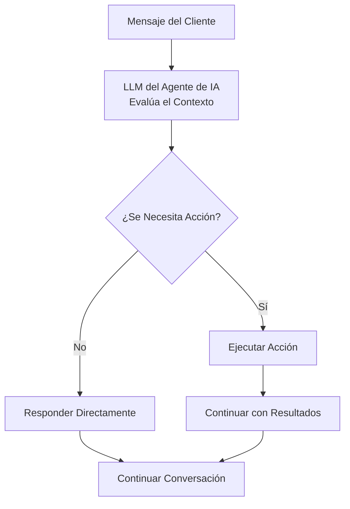

## Descripción General

Las acciones transforman a sus agentes de IA de asistentes solo de conversación en potentes herramientas de automatización empresarial. Más allá de responder preguntas, sus agentes pueden programar citas, transferir llamadas, actualizar sistemas e integrarse con sus flujos de trabajo comerciales existentes, todo mientras mantienen el flujo natural de la conversación.

Piense en las acciones como el kit de herramientas de su agente. Así como un empleado humano usa diferentes herramientas para completar tareas, su agente de IA realiza acciones para ejecutar trabajo real durante las interacciones con los clientes.

<Note>
Las acciones se ejecutan automáticamente según el contexto de la conversación y las instrucciones que proporcione en el prompt de su agente. Usted define cuándo y cómo se deben usar las acciones a través de [ingeniería de prompts](/es/build/conversation/prompt-engineering-guide).
</Note>

---

## ¿Qué Son las Acciones?

Las acciones son herramientas preconfiguradas que su agente puede invocar durante las conversaciones para realizar tareas específicas. Cuando un cliente solicita algo que requiere acción, como reservar una cita o hablar con un especialista, su agente puede ejecutar la acción apropiada sin problemas.

### Cómo Funcionan las Acciones

Durante las conversaciones, su agente decide autónomamente si responder directamente o ejecutar una acción:



El agente usa **nombres y descripciones de acciones** para entender qué hace cada acción. Estos son cruciales para ayudar al LLM a seleccionar la herramienta correcta.

**Mejores prácticas:**
- Dé a las acciones nombres claros y descriptivos (ej., "book_appointment" no "action1")
- Escriba descripciones detalladas explicando qué hace la acción
- Agregue instrucciones explícitas en sus [instrucciones del agente (prompt del sistema)](/es/build/conversation/prompt-engineering-guide) sobre **cuándo** usar cada acción

<Note>
Mientras que los nombres y descripciones de las acciones le dicen al agente **qué** hace una acción, las instrucciones de su agente (prompt del sistema) deben especificar **cuándo** usarla. Por ejemplo: "Cuando un cliente pide hablar con un humano, use la acción transfer_to_support."
</Note>

---

## Categorías de Acciones

Las acciones se organizan en dos categorías en el panel de control:

### Control de Llamadas

<CardGroup cols={2}>
  <Card title="Transferir Llamada" icon="phone" href="/es/build/actions/transfer-details">
    Transferir a otro agente de IA, número de teléfono o dirección SIP
  </Card>
  <Card title="Finalizar Conversación" icon="phone-slash" href="/es/build/actions/call-control">
    Hacer que el agente finalice la conversación con un mensaje personalizado
  </Card>
</CardGroup>

### Integración

<CardGroup cols={2}>
  <Card title="Acción Personalizada" icon="code" href="/es/build/actions/custom-api-actions">
    Crear una acción personalizada de API o webhook
  </Card>
  <Card title="Reserva de Calendario" icon="calendar" href="/es/build/actions/booking-calendar">
    Programar citas usando la integración de Cal.com
  </Card>
</CardGroup>

---

## Cuándo Se Ejecutan las Acciones

Las acciones se ejecutan **durante la conversación** cuando las activa su agente según sus instrucciones. A diferencia de los sistemas IVR tradicionales que siguen scripts rígidos, los agentes de IA usan comprensión contextual para determinar cuándo las acciones son apropiadas.

### Mecanismos de Activación

**Activadores Basados en Instrucciones:**
```text wrap
Cuando el cliente pide hablar con un humano, use la acción 'Transferir a Soporte'.

Después de reservar exitosamente una cita, use la acción 'Finalizar Llamada Cortésmente'.

Si el cliente dice que necesita tiempo para verificar algo, use la acción 'Pausar Temporizador de Inactividad'.
```

**Activadores Condicionales:**
```jinja
Si el cliente informa un problema de facturación:
1. Use la acción 'Buscar Cuenta' para recuperar su información
2. Si el saldo está vencido, transfiera al departamento de facturación
3. Si el saldo está al día, solucione el problema


Siempre ofrezca transferir a clientes VIP a soporte dedicado inmediatamente.

```

**Flujos de Trabajo de Múltiples Pasos:**
```text wrap
Flujo de Reserva de Citas:
1. Recopilar información requerida (nombre, email, fecha preferida)
2. Usar acción 'Verificar Disponibilidad' para consultar Cal.com
3. Presentar opciones al cliente
4. Usar acción 'Reservar Cita' para confirmar
5. Usar acción 'Enviar Confirmación por SMS' si el cliente proporcionó teléfono
6. Usar acción 'Finalizar Llamada Cortésmente' para concluir
```

<Warning>
Las acciones se ejecutan en tiempo real durante la llamada. Asegúrese de que sus endpoints sean confiables y respondan rápidamente para evitar pausas incómodas en la conversación.
</Warning>

---

## Configuración de Acciones

Toda la configuración de acciones ocurre en el editor de agentes bajo la pestaña **Habilidades → Acciones**.

<Steps>
  <Step title="Navegar a Acciones">
    Abra su agente en el editor y haga clic en **Habilidades** → pestaña **Acciones**
  </Step>
  <Step title="Elegir Tipo de Acción">
    Navegue por las categorías **Control de Llamadas** e **Integración** y haga clic en **Agregar** en la acción que desea configurar
  </Step>
  <Step title="Configurar Acción">
    Complete el formulario de configuración específico de la acción:
    - **Nombre**: Dé a su acción un nombre claro y descriptivo
    - **Descripción**: Explique qué hace esta acción
    - **Configuraciones específicas de la acción**: Configure parámetros según el tipo de acción
  </Step>
  <Step title="Guardar">
    Guarde la acción para agregarla al kit de herramientas de su agente
  </Step>
</Steps>

---

## Indicadores de Estado de Acciones

Después de agregar acciones, las verá listadas en la pestaña Acciones de su agente con indicadores de estado:

<CardGroup cols={3}>
  <Card title="Configurada" icon="circle-check">
    La acción está configurada correctamente y lista para usar
  </Card>
  <Card title="Incompleta" icon="circle-exclamation">
    Falta configuración o credenciales requeridas
  </Card>
  <Card title="Error" icon="circle-xmark">
    Error de configuración o fallo de autenticación
  </Card>
</CardGroup>

---

## Referenciando Acciones en las Instrucciones

Para usar acciones, referencie las **por nombre exacto** en las instrucciones de su agente:

### Referencia Directa
```text wrap
Cuando un cliente pide hablar con alguien sobre facturación,
use la acción 'Transferir al Departamento de Facturación'.
```

### Con Condiciones
```text wrap
Si el problema del cliente no puede resolverse:
1. Discúlpese por el inconveniente
2. Explique que lo está conectando con un especialista
3. Use la acción 'Transferir a Soporte'
```

### Con Parámetros
```text wrap
Después de recopilar el email del cliente y la fecha preferida,
use la acción 'Reservar Consulta' para programar la reunión.
```

<Note>
Los nombres de las acciones son sensibles a mayúsculas y deben coincidir exactamente como están configurados. Si cambia el nombre de una acción, actualice todas las referencias en sus instrucciones.
</Note>

---

## Mejores Prácticas de Configuración

<AccordionGroup>
  <Accordion title="Empiece Simple" icon="seedling">
    Comience con acciones básicas antes de agregar integraciones complejas. Agregue una acción a la vez, pruebe a fondo, luego agregue la siguiente.

    **Ejemplo de progresión:**
    1. Agregar acción Finalizar Conversación
    2. Agregar acción Transferir a Soporte
    3. Agregar acción de Reserva
    4. Agregar acciones de API personalizadas
  </Accordion>

  <Accordion title="Use Nombres Claros y Descriptivos" icon="tag">
    Los nombres de las acciones son críticos: el LLM los usa para entender qué hace cada herramienta. Use nombres descriptivos orientados a la acción que transmitan claramente el propósito de la función.

    **Por qué esto importa:** El modelo se basa en los nombres y descripciones de las funciones para detectar cuándo se necesita llamar a una función y elegir la herramienta correcta para la tarea.

    **Buenos nombres:**
    - "Obtener Cuenta de Cliente" - Verbo de acción claro + objetivo específico
    - "Transferir al Departamento de Facturación" - Destino específico incluido
    - "Reservar Consulta de 30 Minutos" - Incluye detalles relevantes

    **Nombres pobres:**
    - "Acción 1" - Sin contexto sobre qué hace
    - "Transferir" - Demasiado genérico, no claro a dónde
    - "Llamada API" - No describe la acción
  </Accordion>

  <Accordion title="Escriba Descripciones Detalladas" icon="file-lines">
    Las descripciones de acciones ayudan al LLM a entender **qué** hace la acción. La descripción debe explicar el propósito de la acción, qué devuelve y qué parámetros usa.

    **Mejores prácticas de [llamada de funciones de OpenAI](https://platform.openai.com/docs/guides/function-calling):**
    - Describa claramente qué hace la acción y qué devuelve
    - Explique qué parámetros o datos usa
    - Use lenguaje preciso que guíe la comprensión del modelo
    - Manténgalo conciso pero completo

    **Ejemplo:**
    ```
    Nombre: Obtener Cuenta de Cliente
    Descripción: Recupera datos de cuenta de cliente de Salesforce CRM usando
    su número de teléfono. Devuelve estado de cuenta, saldo y pedidos recientes.
    ```

    **Nota:** Describa **qué** hace la acción en la descripción. Especifique **cuándo** usarla en sus [instrucciones del agente (prompt del sistema)](/es/build/conversation/prompt-engineering-guide).
  </Accordion>

  <Accordion title="Pruebe a Fondo" icon="vial">
    Pruebe cada acción en la interfaz de prueba del agente antes de publicar:
    - Verifique que la acción se ejecute correctamente
    - Pruebe escenarios de éxito
    - Pruebe escenarios de falla
    - Verifique el manejo de errores
    - Revise el flujo de conversación
  </Accordion>

  <Accordion title="Maneje Fallos con Gracia" icon="shield-check">
    Configure comportamientos de respaldo para cuando las acciones fallen. Instruya a su agente qué hacer cuando las acciones no funcionen.

    ```
    Si la acción 'Reservar Cita' falla:
    1. Discúlpese sinceramente
    2. Ofrezca que alguien llame de vuelta para programar
    3. Recopile su número de devolución de llamada preferido
    4. Use la acción 'Finalizar Llamada Cortésmente'
    ```
  </Accordion>

  <Accordion title="Recopile Información Primero" icon="clipboard-check">
    Asegúrese de que los agentes recopilen los datos requeridos antes de ejecutar acciones. No intente reservar citas sin direcciones de email o transferir llamadas sin explicar por qué.

    ```
    Antes de usar la acción 'Reservar Consulta':
    1. Confirme que el cliente quiere programar
    2. Pregunte por su dirección de email si no está en el registro de contacto
    3. Discuta sus fechas y horas preferidas
    4. Explique qué cubrirá la consulta
    5. Solo entonces ejecute la acción de reserva
    ```
  </Accordion>

  <Accordion title="Asegure las Credenciales" icon="lock">
    Use autenticación apropiada para todas las acciones personalizadas. Nunca exponga claves API o credenciales en URLs o campos sin cifrar.

    - Use tokens Bearer para autenticación API
    - Use autenticación básica solo sobre HTTPS
    - Almacene credenciales sensibles de forma segura
    - Rote credenciales regularmente
  </Accordion>
</AccordionGroup>

---

## Prueba de Acciones

Antes de implementar agentes con acciones, pruebe a fondo en la interfaz de prueba del panel:

<Steps>
  <Step title="Abrir Interfaz de Prueba">
    Haga clic en **Llamada de Prueba** en la esquina superior derecha del editor de agentes
  </Step>
  <Step title="Iniciar Llamada Web">
    Haga clic en **Iniciar Llamada Web** para comenzar una conversación de prueba
  </Step>
  <Step title="Activar Cada Acción">
    Ejecute escenarios que activen cada acción configurada
  </Step>
  <Step title="Verificar Ejecución">
    Verifique que las acciones se ejecuten correctamente y manejen las respuestas apropiadamente
  </Step>
  <Step title="Probar Casos de Falla">
    Simule fallos para verificar que el manejo de errores funcione como se espera
  </Step>
  <Step title="Revisar Transcripción">
    Examine la transcripción de la conversación para asegurar que el flujo sea natural y las acciones se integren sin problemas
  </Step>
</Steps>

### Qué Probar

**Para Acciones de Transferencia:**
- La transferencia se ejecuta al destino correcto
- La música de espera se reproduce si está configurada
- El mensaje de transferencia es apropiado
- Los modos de transferencia fría vs cálida funcionan correctamente

**Para Acciones de Reserva:**
- La disponibilidad se recupera correctamente
- La reserva se confirma exitosamente
- Las notificaciones por email/SMS se envían correctamente
- El manejo de zona horaria es preciso

**Para Acciones Personalizadas:**
- Las llamadas API tienen éxito
- La autenticación funciona
- Los datos de respuesta están disponibles para el agente
- Las respuestas de error se manejan con gracia

**Para Todas las Acciones:**
- El agente referencia la acción por el nombre correcto
- El agente recopila la información requerida primero
- El flujo de conversación permanece natural
- Los fallos no rompen la conversación

<Warning>
Las llamadas de prueba usan integraciones reales. Si está probando una acción de reserva, creará citas reales en su cuenta de Cal.com. Limpie los datos de prueba después.
</Warning>

---

## Casos de Uso Comunes

### Flujo de Trabajo de Soporte al Cliente

```text wrap
Configuración del Agente:
- Transferir a Soporte (para problemas complejos)
- Buscar Cuenta de Cliente (API personalizada)
- Crear Ticket de Soporte (API personalizada)
- Finalizar Llamada Cortésmente

Instrucciones:
Cuando un cliente llama:
1. Salude cálidamente
2. Use 'Buscar Cuenta de Cliente' para recuperar su información
3. Pregunte sobre su problema
4. Si puede resolverlo, hágalo usando la base de conocimientos
5. Si es complejo, use 'Crear Ticket de Soporte' y proporcione el número de ticket
6. Si el cliente solicita un humano, use 'Transferir a Soporte'
7. Cuando se resuelva, use 'Finalizar Llamada Cortésmente'
```

### Flujo de Trabajo de Reserva de Citas

```text wrap
Configuración del Agente:
- Reservar Consulta (reserva de Cal.com)
- Enviar Confirmación por SMS (opcional)
- Transferir a Programación (respaldo)
- Finalizar Llamada Cortésmente

Instrucciones:
Cuando un cliente quiere reservar:
1. Pregunte qué tipo de cita necesitan
2. Recopile dirección de email si no está en el registro de contacto
3. Discuta sus fechas preferidas
4. Use 'Reservar Consulta' para mostrar disponibilidad y confirmar
5. Si la reserva tiene éxito, confirme los detalles verbalmente
6. Si la reserva falla, use 'Transferir a Programación'
7. Use 'Finalizar Llamada Cortésmente' para terminar
```

### Flujo de Trabajo de Calificación de Ventas

```text wrap
Configuración del Agente:
- Buscar Datos de Empresa (API personalizada)
- Actualizar Lead de CRM (API personalizada)
- Transferir a Ventas (para leads calificados)
- Finalizar Llamada Cortésmente

Instrucciones:
Para llamadas de ventas salientes:
1. Preséntese y explique el propósito
2. Use 'Buscar Datos de Empresa' para recuperar firmográficos
3. Haga preguntas de calificación (presupuesto, cronograma, autoridad)
4. Use 'Actualizar Lead de CRM' con estado de calificación
5. Si está calificado, use 'Transferir a Ventas' con contexto
6. Si no está calificado, agradezca y use 'Finalizar Llamada Cortésmente'
```

---

## Solución de Problemas Comunes

<AccordionGroup>
  <Accordion title="La Acción No Se Activa" icon="circle-exclamation">
    **Problema:** El agente no usa la acción aunque debería.

    **Soluciones:**
    - Verifique que el nombre de la acción en las instrucciones coincida exactamente (sensible a mayúsculas)
    - Verifique que el estado de la acción sea "Configurada" no "Incompleta" o "Error"
    - Haga las instrucciones más explícitas sobre cuándo usar la acción
    - Pruebe en aislamiento pidiendo explícitamente al agente que use la acción
    - Revise la transcripción de la conversación para ver el razonamiento del agente
  </Accordion>

  <Accordion title="El Agente Dice Que la Acción Se Ejecutará Pero No Lo Hace" icon="comments">
    **Problema:** El agente confirma verbalmente que está ejecutando una acción (ej., "Lo estoy transfiriendo ahora") pero la acción no se ejecuta hasta el siguiente turno de conversación.

    **Por qué sucede esto:** El agente genera una respuesta y ejecuta la acción en el mismo turno, pero solo uno puede suceder por turno.

    **Solución:** Indique al agente que pida confirmación al usuario antes de ejecutar acciones:

    ```jinja
    Antes de usar la acción 'Transferir a Soporte':
    1. Explique por qué los está transfiriendo
    2. Pregunte "¿Le gustaría que lo transfiera ahora?"
    3. Espere confirmación
    4. Una vez confirmado, ejecute la acción 'Transferir a Soporte'
    ```

    Esto asegura que el agente ejecute la acción inmediatamente después de recibir confirmación, no en el mismo turno en que la anuncia.
  </Accordion>

  <Accordion title="Fallos de Autenticación" icon="key">
    **Problema:** Las acciones personalizadas fallan con errores 401/403.

    **Soluciones:**
    - Verifique que las credenciales sean correctas y no hayan expirado
    - Verifique que el tipo de autenticación coincida con los requisitos de la API
    - Asegúrese de que los tokens Bearer incluyan el prefijo "Bearer" si es necesario
    - Pruebe el endpoint independientemente con Postman o curl
    - Revise la documentación de la API para el formato de autenticación
  </Accordion>

  <Accordion title="La Acción de Reserva Falla" icon="calendar-xmark">
    **Problema:** La acción de reserva de Cal.com devuelve errores.

    **Soluciones:**
    - Verifique que la integración de Cal.com esté conectada
    - Verifique que el tipo de evento exista y esté activo
    - Asegúrese de que la plataforma de reuniones esté configurada en Cal.com
    - Verifique que las ventanas de programación permitan las fechas solicitadas
    - Verifique la configuración de zona horaria
    - Pruebe la reserva manualmente en Cal.com para verificar disponibilidad
  </Accordion>

  <Accordion title="La Transferencia No Se Conecta" icon="phone-slash">
    **Problema:** La acción de transferencia se ejecuta pero no se conecta.

    **Soluciones:**
    - Verifique que el destino esté en el formato E.164 correcto (ej., +15551234567)
    - Asegúrese de que el número de teléfono sea alcanzable (para transferencias telefónicas)
    - Verifique que la dirección SIP sea correcta (para transferencias SIP)
    - Pruebe el destino independientemente
  </Accordion>

</AccordionGroup>

---

## Próximos Pasos

<CardGroup cols={2}>
  <Card title="Acciones de Control de Llamadas" icon="phone" href="/es/build/actions/call-control">
    Configure acciones de Transferencia, Finalizar Conversación y Gestión de Inactividad
  </Card>
  <Card title="Detalles de Transferencia" icon="right-left" href="/es/build/actions/transfer-details">
    Domine destinos de transferencia, modos y configuraciones avanzadas
  </Card>
  <Card title="Integración de Reservas" icon="calendar" href="/es/build/actions/booking-calendar">
    Configure programación de citas de Cal.com con notificaciones por email y SMS
  </Card>
  <Card title="Acciones API Personalizadas" icon="code" href="/es/build/actions/custom-api-actions">
    Conecte sus agentes a sistemas externos y APIs
  </Card>
  <Card title="Guía de Instrucciones" icon="pen" href="/es/build/conversation/instructions">
    Aprenda a escribir instrucciones efectivas para el agente
  </Card>
  <Card title="Ingeniería de Prompts" icon="book" href="/es/build/conversation/prompt-engineering-guide">
    Domine técnicas avanzadas de prompting para un comportamiento confiable del agente
  </Card>
</CardGroup>
