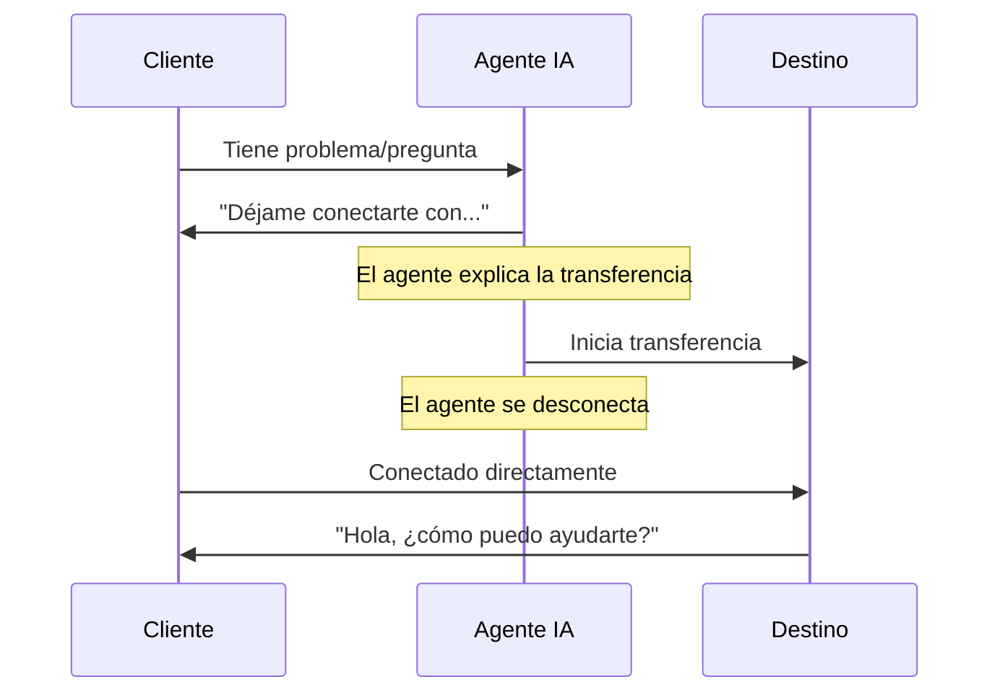

## Descripción General

La acción de Transferencia es una de las herramientas de control de llamadas más poderosas, permitiendo a tus agentes de IA enrutar conversaciones sin problemas al destino correcto cuando se necesita ayuda especializada. Ya sea transfiriendo a especialistas humanos, otros agentes de IA o sistemas telefónicos externos, la configuración adecuada de transferencia asegura transiciones fluidas que mantienen la satisfacción del cliente.

Esta guía completa cubre todo lo que necesitas saber sobre destinos de transferencia, modos de transferencia, configuraciones avanzadas y mejores prácticas para un enrutamiento de llamadas confiable.

<Note>
Las transferencias ocurren en tiempo real durante llamadas activas. El cliente permanece en la línea mientras se conecta al nuevo destino - no se le cuelga ni necesita volver a llamar.
</Note>

---

## Destinos de Transferencia

itellicoAI soporta tres tipos de destinos de transferencia. Elige el que se ajuste a tu flujo de trabajo:

<Frame>
  <div className="block dark:hidden">
    
  </div>
  <div className="hidden dark:block">
    
  </div>
</Frame>

<AccordionGroup>
  <Accordion title="Transferencia a Agente" icon="users" defaultOpen>
    Transfiere llamadas a otros agentes de IA en tu cuenta de itellicoAI.

    ### Casos de Uso

    <CardGroup cols={2}>
      <Card title="Agentes Especializados" icon="user-gear">
        Enruta a agentes con conocimiento específico (facturación, técnico, ventas)
      </Card>
      <Card title="Enrutamiento por Idioma" icon="language">
        Transfiere a agentes configurados para diferentes idiomas
      </Card>
      <Card title="Enrutamiento por Departamento" icon="sitemap">
        Dirige a agentes diseñados para departamentos específicos
      </Card>
      <Card title="Enrutamiento por Habilidades" icon="certificate">
        Conecta a agentes con capacidades especializadas
      </Card>
    </CardGroup>

    ### Configuración

    <Steps>
      <Step title="Seleccionar tipo de transferencia">
        Elige **AGENTE** como tipo de transferencia
      </Step>
      <Step title="Elegir agente de destino">
        Selecciona el agente objetivo del menú desplegable
      </Step>
      <Step title="Opcional: Agregar música de espera">
        Sube audio para reproducir mientras se conecta (opcional)
      </Step>
      <Step title="Opcional: Agregar tono de llamada">
        Agrega un sonido de timbre durante la transferencia (opcional)
      </Step>
    </Steps>

    ### Configuración de Audio

    Las transferencias a agentes soportan música de espera y tonos de llamada personalizables:

    **Música de Espera:**
    - Reproduce música mientras el cliente espera que se conecte la transferencia
    - Duración: 1-30 segundos (predeterminado: 6 segundos)
    - Usar para: Experiencia profesional durante retrasos de conexión
    - No recomendado para: Transferencias instantáneas cuando se prefiere conexión inmediata

    **Duración del Tono:**
    - Reproduce sonido de timbre mientras se espera que el agente de destino responda
    - Duración: 1-30 segundos (predeterminado: 4 segundos)
    - Habilitado por defecto
    - Simula experiencia de llamada normal

    **Configuraciones Combinadas:**
    Puedes habilitar ambas para una experiencia de transferencia completa:
    1. La música se reproduce (ej., 6 segundos) - Experiencia de espera profesional
    2. El timbre suena (ej., 4 segundos) - Conexión en progreso
    3. El agente responde - Transferencia completada

    **Retraso total:** Duración de música + Duración de timbre (ej., 10 segundos)

    <Info>
    Para transferencias instantáneas de agente a agente, deshabilita tanto música como timbre para conexión inmediata.
    </Info>

    ### Beneficios

    - El historial de conversación se transfiere con la llamada
    - Sin costos telefónicos adicionales
    - Conexión instantánea (sin retraso de marcado)
    - Preservación completa del contexto
    - Música de espera y tono de llamada personalizables

    ### Ejemplo de Instrucciones

    ```
    Cuando un cliente reporte un problema técnico que requiere solución de problemas:
    1. Recopilar información básica sobre el problema
    2. Explicar que lo estás conectando con un especialista técnico
    3. Usar la acción 'Transferir a Agente Técnico'
    ```
  </Accordion>

  <Accordion title="Transferencia a Número Telefónico" icon="phone">
    Transfiere llamadas a números telefónicos externos - teléfonos móviles, fijos o números comerciales.

    ### Casos de Uso

    <CardGroup cols={2}>
      <Card title="Especialistas Humanos" icon="user-headset">
        Conecta a agentes de soporte en vivo
      </Card>
      <Card title="Equipos de Guardia" icon="mobile">
        Enruta a teléfonos móviles para problemas urgentes
      </Card>
      <Card title="Departamentos Externos" icon="building">
        Transfiere a equipos fuera de tu cuenta
      </Card>
      <Card title="Contactos de Emergencia" icon="triangle-exclamation">
        Escala situaciones críticas
      </Card>
    </CardGroup>

    ### Configuración

    <Steps>
      <Step title="Seleccionar tipo de transferencia">
        Elige **TELÉFONO** como tipo de transferencia
      </Step>
      <Step title="Ingresar número telefónico">
        Ingresa el destino en formato E.164: `+1-555-123-4567`

        **Requisitos de formato:**
        - Debe incluir código de país (+1 para EE.UU./Canadá)
        - Sin espacios, guiones o paréntesis
        - Ejemplos: `+14155551234`, `+442071234567`, `+61398765432`
      </Step>
    </Steps>

    ### Costos y Limitaciones

    <Warning>
    **Importante:**
    - Las transferencias telefónicas incurren en costos de llamadas salientes (las tarifas varían según el destino)
    - **Solo funcionan durante llamadas telefónicas activas** (no llamadas web o conversaciones de widget)
    - Verifica los números telefónicos para evitar cargos o transferencias fallidas
    </Warning>

    ### Ejemplo de Instrucciones

    ```
    Para problemas urgentes fuera del horario comercial:
    1. Verificar que el problema es verdaderamente urgente
    2. Recopilar detalles clave (nombre del cliente, resumen del problema)
    3. Explicar que estás conectando con el gerente de guardia
    4. Usar la acción 'Transferir a Gerente de Guardia'
    ```
  </Accordion>

  <Accordion title="Transferencia a Dirección SIP" icon="network-wired">
    Transfiere llamadas a direcciones SIP (URIs de Protocolo de Inicio de Sesión) para integración con sistemas PBX y centros de contacto.

    ### Casos de Uso

    <CardGroup cols={2}>
      <Card title="Integración PBX" icon="phone-office">
        Enruta a extensiones internas
      </Card>
      <Card title="Centros de Contacto" icon="users-viewfinder">
        Transfiere a sistemas de cola ACD
      </Card>
      <Card title="Telefonía Empresarial" icon="building-columns">
        Conecta a sistemas telefónicos corporativos
      </Card>
      <Card title="Plataformas VoIP" icon="cloud">
        Integra con infraestructura de voz
      </Card>
    </CardGroup>

    ### Configuración

    <Steps>
      <Step title="Prerrequisitos">
        Antes de configurar transferencias SIP:
        - Troncal SIP configurado en itellicoAI
        - Endpoint SIP de destino alcanzable
        - Autenticación adecuada configurada
        - Enrutamiento de red en su lugar
      </Step>
      <Step title="Seleccionar tipo de transferencia">
        Elige **SIP** como tipo de transferencia
      </Step>
      <Step title="Ingresar dirección SIP">
        Ingresa URI SIP de destino: `sip:1001@yourpbx.example.com`

        **Requisitos de formato:**
        - Debe ser URI SIP válido
        - Incluir nombre de usuario y dominio
        - Ejemplos: `sip:support@pbx.company.com`, `sip:1234@10.0.1.50`
      </Step>
    </Steps>

    <Tip>
    Las transferencias SIP son ideales para empresas con sistemas telefónicos existentes. Proporcionan integración sin problemas entre agentes de IA e infraestructura telefónica tradicional.
    </Tip>

    <Warning>
    **Las transferencias SIP solo funcionan durante llamadas telefónicas activas.** No se pueden usar durante llamadas web o conversaciones de widget.
    </Warning>

    ### Ejemplo de Instrucciones

    ```
    Para solicitudes de soporte general:
    1. Recopilar información del llamante
    2. Explicar tiempo de espera estimado
    3. Usar acción 'Transferir a Cola de Soporte'
    ```
  </Accordion>
</AccordionGroup>

---

## Modos de Transferencia

### Transferencia Fría (Predeterminado)

El agente transfiere la llamada inmediatamente y se desconecta. El cliente se conecta directamente al destino sin que el agente lo presente.

#### Cómo Funciona



#### Ejemplo de Flujo

```
Cliente: "Tengo una pregunta de facturación"
Agente: "Con gusto te ayudaré. Déjame conectarte con nuestro
        departamento de facturación que puede acceder a los detalles de tu cuenta."
[Transferencia fría a facturación → El agente se desconecta]
Agente de Facturación: "Hola, ¿cómo puedo ayudarte?"
Cliente: "Tengo una pregunta sobre mi factura..."
```

#### Opción de Transferencia Silenciosa

<Accordion title="Habilitar Transferencia Silenciosa (Opcional)" icon="phone-slash">
  Puedes habilitar el modo **Transferencia Silenciosa** donde el agente transfiere sin decir nada - la llamada se enruta inmediatamente al destino.

  **Cómo funciona:**
  1. La lógica del agente activa la necesidad de transferencia
  2. La transferencia se ejecuta sin anuncio
  3. El cliente se enruta al destino silenciosamente

  **Cuándo usar:**
  - Enrutamiento puro, sin conversación aún (reemplazo de IVR)
  - Enrutamiento basado en menú
  - Detección de idioma y auto-enrutamiento

  **Configuración:**
  - Marca la casilla **Transferencia Silenciosa**
  - Cualquier mensaje de transferencia se ignora cuando el modo silencioso está habilitado

  **Ejemplo:**
  ```
  Agente: Enrutador de Idiomas (agente de enrutamiento silencioso)

  Instrucciones:
  Según el idioma que hable el cliente:
  - Si se detecta español, usar 'Transferir a Agente en Español' (silencioso)
  - Si se detecta francés, usar 'Transferir a Agente en Francés' (silencioso)
  - Si es inglés, continuar conversación
  ```

  <Warning>
  Las transferencias silenciosas pueden sentirse abruptas para los clientes. Usar con moderación y solo cuando sea apropiado para el caso de uso.
  </Warning>
</Accordion>

### Transferencia Cálida

<Card title="Próximamente" icon="clock">
  **Las transferencias cálidas** usan un enfoque de llamada de tres vías: el cliente escucha música de espera mientras la IA inicia una nueva llamada al destino en segundo plano. Una vez que el destino responde, la IA proporciona contexto (mediante mensaje susurrado, resumen o introducción de tres vías) antes de conectar al cliente. Esto asegura que el agente receptor esté informado y preparado antes de hablar con el cliente.

  **Cómo funciona:**

  1. Cliente puesto en espera (escucha música de espera)
  2. IA inicia nueva llamada al destino en segundo plano
  3. Destino responde, IA proporciona briefing
  4. Cliente conectado al agente de destino informado

  **Diferencia clave con transferencia fría:** La IA mantiene ambas líneas de llamada e informa al destino antes de conectar al cliente, en lugar de desconectarse inmediatamente.

  Esta característica está actualmente en desarrollo y estará disponible en una versión futura.
</Card>

---

## Soporte Multi-Destino

Crea múltiples acciones de transferencia para diferentes destinos para manejar varios escenarios de enrutamiento:

<AccordionGroup>
  <Accordion title="Configuración de Enrutamiento Completa" icon="sitemap">
    Configura múltiples destinos de transferencia para enrutamiento completo:

    ```text wrap
    Agente: Enrutador de Servicio al Cliente

    Acciones de Transferencia Configuradas:
    1. Transferir a Departamento de Facturación (+1-555-100-0001)
    2. Transferir a Soporte Técnico (+1-555-100-0002)
    3. Transferir a Equipo de Ventas (+1-555-100-0003)
    4. Transferir a Departamento de Devoluciones (+1-555-100-0004)
    5. Transferir a Gerente (sip:manager@pbx.company.com)
    6. Transferir a Agente en Español (ID de Agente: ag_spanish_01)

    Instrucciones:
    Enrutar clientes al departamento apropiado:

    Preguntas de facturación → 'Transferir a Departamento de Facturación'
    Problemas técnicos → 'Transferir a Soporte Técnico'
    Consultas de ventas → 'Transferir a Equipo de Ventas'
    Solicitudes de devolución → 'Transferir a Departamento de Devoluciones'
    Escalamientos → 'Transferir a Gerente'
    Hablantes de español → 'Transferir a Agente en Español'

    Siempre explica a quién los estás conectando antes de transferir.
    ```
  </Accordion>

  <Accordion title="Cadenas de Respaldo" icon="arrow-turn-down-right">
    Configura múltiples opciones de transferencia con lógica de respaldo:

    ```text wrap
    Ruta de escalamiento principal:
    1. Intentar 'Transferir a Soporte Técnico'
    2. Si falla, intentar 'Transferir a Soporte General'
    3. Si eso falla, intentar 'Transferir a Gerente'
    4. Si todo falla, disculparse y programar devolución de llamada

    Instrucciones:
    Si la transferencia principal falla, el agente debe intentar el respaldo,
    y manejar la falla completa con gracia recopilando información de devolución de llamada.
    ```
  </Accordion>

  <Accordion title="Enrutamiento Condicional" icon="code-branch">
    Usa diferentes transferencias basadas en datos del cliente o contexto de conversación:

    ```jinja
    
    Enrutar clientes empresariales a 'Transferir a Soporte Empresarial'
    
    Enrutar clientes premium a 'Transferir a Soporte Premium'
    
    Enrutar clientes estándar a 'Transferir a Soporte General'
    
    ```
  </Accordion>
</AccordionGroup>

---

## Mejores Prácticas

<AccordionGroup>
  <Accordion title="Siempre Explicar la Transferencia" icon="comment">
    Nunca transfieras llamadas sin contexto. Explica a quién los estás conectando y por qué.

    **Bien:**
    ```
    "Entiendo que necesitas ayuda con tu factura. Déjame conectarte
    con nuestro departamento de facturación que puede acceder a tu cuenta y
    hacer los ajustes necesarios. Esto solo tomará un momento."
    ```

    **Mal:**
    ```
    "Espera por favor." [transferencia inmediata]
    ```
  </Accordion>

  <Accordion title="Establecer Expectativas del Cliente" icon="clock">
    Dile a los clientes qué esperar durante y después de la transferencia.

    **Bien:**
    ```
    "Te voy a conectar con nuestro equipo técnico. Escucharás
    un breve mensaje de espera, luego te atenderán en 30 segundos.
    Tendrán tu información lista."
    ```

    **Mal:**
    ```
    "Transfiriendo ahora." [el cliente no sabe qué está pasando]
    ```
  </Accordion>

  <Accordion title="Recopilar Información Primero" icon="clipboard">
    Recopila detalles básicos antes de transferir para que el receptor tenga contexto y el cliente no necesite repetirse.

    ```
    Antes de transferir:
    1. Obtener nombre del cliente
    2. Entender el problema básico
    3. Recopilar número de cuenta/pedido si es relevante
    4. Preguntar sobre urgencia
    5. Luego transferir con contexto
    ```
  </Accordion>

  <Accordion title="Usar Nombres Descriptivos" icon="tag">
    Nombra cada acción de transferencia claramente según el destino.

    **Bien:**
    - "Transferir a Departamento de Facturación"
    - "Escalar a Soporte Técnico"
    - "Enrutar a Agente de Habla Hispana"
    - "Conectar con Gerente de Guardia"

    **Mal:**
    - "Transferencia 1"
    - "Transferencia Telefónica"
    - "Escalar"
  </Accordion>

  <Accordion title="Manejar Fallos de Transferencia" icon="triangle-exclamation">
    Siempre ten un plan para cuando las transferencias fallen (ocupado, sin respuesta, etc.).

    ```
    Si la acción 'Transferir a Soporte' falla:
    1. Disculparse: "Disculpa, tengo problemas para conectar en este momento"
    2. Ofrecer devolución de llamada: "Puedo hacer que nuestro equipo de soporte te
       llame de vuelta dentro de la próxima hora"
    3. Recopilar número de devolución de llamada y mejor hora
    4. Confirmar: "Genial, espera una llamada nuestra al [número] dentro de la hora"
    5. Usar acción 'Finalizar Llamada Cortésmente'
    ```
  </Accordion>

  <Accordion title="Usar Formato E.164 para Números Telefónicos" icon="phone">
    Siempre formatea los números telefónicos correctamente para evitar fallos de transferencia.

    **Formato E.164 correcto:**
    - Incluir código de país: `+1` para EE.UU./Canadá
    - Sin espacios, guiones o paréntesis
    - Ejemplos: `+14155551234`, `+442071234567`

    **Formatos incorrectos:**
    - ❌ `(415) 555-1234`
    - ❌ `415-555-1234`
    - ❌ `14155551234` (falta +)
    - ❌ `+1 415 555 1234` (espacios)
  </Accordion>

  <Accordion title="Considerar Costos para Transferencias Telefónicas" icon="dollar-sign">
    Ten en cuenta los costos telefónicos, especialmente para transferencias internacionales.

    **Optimización de costos:**
    - Usar transferencias a agente cuando sea posible (gratis)
    - Usar transferencias SIP para enrutamiento interno (típicamente gratis o bajo costo)
    - Limitar transferencias telefónicas a escalamientos necesarios
    - Monitorear frecuencia y costos de transferencia
    - Configurar alertas para volúmenes inusuales de transferencia
  </Accordion>

</AccordionGroup>

---

## Pruebas de Acciones de Transferencia

Prueba todos los destinos de transferencia antes de entrar en producción para asegurar operación confiable:

**Pruebas esenciales:**
- La transferencia se ejecuta y el destino recibe la llamada
- La calidad de audio es buena en ambas direcciones
- El agente explica la transferencia apropiadamente en las instrucciones
- Los escenarios de fallo se manejan con gracia (sin respuesta, señal ocupada, destino inválido)
- Prueba desde diferentes fuentes de llamada (teléfono, web)

<Info>
Para transferencias telefónicas/SIP, confirma formato E.164 adecuado y alcanzabilidad del destino.
</Info>

---

## Solución de Problemas

<AccordionGroup>
  <Accordion title="Transferencia Conecta Pero Se Cae Inmediatamente" icon="phone-slash">
    **Síntomas:** La transferencia parece conectar, pero la llamada termina de inmediato

    **Posibles causas:**
    - Destino no configurado para aceptar transferencias
    - Problema de configuración de endpoint SIP
    - Agente no activo (para transferencias a agente)
    - Bloqueo de red/firewall

    **Soluciones:**
    - Verificar que el agente de destino esté activo y publicado
    - Probar número telefónico de destino independientemente
    - Revisar configuración y autenticación de troncal SIP
    - Revisar reglas de firewall para tráfico SIP
    - Verificar "No Molestar" o bloqueo de llamadas en destino
  </Accordion>

  <Accordion title="Sin Audio Después de Transferencia" icon="volume-xmark">
    **Síntomas:** La transferencia conecta pero no hay audio en una o ambas direcciones

    **Posibles causas:**
    - Puertos RTP (medios) bloqueados
    - Problemas de travesía NAT
    - Desajuste de códec
    - Configuración de audio de endpoint SIP

    **Soluciones:**
    - Verificar que los puertos RTP estén abiertos (típicamente 10000-20000)
    - Revisar configuración NAT en endpoints SIP
    - Asegurar códecs compatibles configurados (G.711, Opus)
    - Probar audio con llamada de prueba simple primero
    - Revisar configuración de audio de troncal SIP
  </Accordion>

  <Accordion title="Transferencias Telefónicas Fallan Con Error" icon="circle-exclamation">
    **Síntomas:** La acción de transferencia devuelve error, llamada no conectada

    **Posibles causas:**
    - Formato de número telefónico inválido
    - Saldo de cuenta insuficiente
    - Número no alcanzable
    - Restricciones del operador

    **Soluciones:**
    - Verificar formato E.164: +14155551234 (no (415) 555-1234)
    - Revisar saldo de cuenta y créditos telefónicos
    - Probar con número telefónico diferente
    - Verificar que el país de destino sea soportado
    - Revisar bloqueo de operador o filtros de spam
  </Accordion>

  <Accordion title="Transferencias a Agente No Preservan Contexto" icon="message-slash">
    **Síntomas:** Contexto/historial no disponible para agente receptor

    **Posibles causas:**
    - Problema de configuración
    - Agentes en cuentas diferentes
    - Configuración de modo de transferencia

    **Soluciones:**
    - Verificar que ambos agentes estén en la misma cuenta de itellicoAI
    - Revisar que la transferencia esté configurada como transferencia a agente, no teléfono
    - Revisar configuraciones de transferencia a agente
    - Probar con transferencia simple de agente a agente
    - Contactar soporte si el problema persiste
  </Accordion>

  <Accordion title="Música de Espera No Se Reproduce" icon="music-slash">
    **Síntomas:** La transferencia ocurre pero sin música de espera

    **Posibles causas:**
    - Música de espera deshabilitada en configuraciones
    - Duración establecida en 0
    - Transferencia a agente (música solo para teléfono/SIP)

    **Soluciones:**
    - Habilitar casilla "Reproducir Música" en configuraciones de transferencia
    - Establecer duración de música (4-8 segundos recomendado)
    - Verificar que el tipo de transferencia soporte música (no todas las transferencias a agente usan música)
    - Probar con transferencia telefónica para confirmar que funciona la música
  </Accordion>

  <Accordion title="Tono de Llamada No Se Reproduce" icon="bell-slash">
    **Síntomas:** Sin sonido de timbre durante la transferencia

    **Posibles causas:**
    - Timbre deshabilitado en configuraciones
    - Duración de timbre establecida en 0
    - Transferencia completa antes de que comience el timbre

    **Soluciones:**
    - Habilitar casilla "Debe Sonar"
    - Establecer duración de timbre (4-6 segundos típico)
    - Ajustar duración de música si el timbre debe reproducirse después
    - Verificar que el destino realmente soporte timbre
  </Accordion>

  <Accordion title="Transferencias SIP Fallan al Conectar" icon="network-wired">
    **Síntomas:** Las transferencias SIP devuelven errores o no conectan

    **Posibles causas:**
    - Formato de URI SIP inválido
    - Troncal SIP no configurado
    - Fallo de autenticación
    - Problema de enrutamiento de red

    **Soluciones:**
    - Verificar formato de URI SIP: sip:user@domain.com
    - Revisar que la troncal SIP esté configurada en itellicoAI
    - Verificar que las credenciales SIP sean correctas
    - Probar endpoint SIP con cliente SIP
    - Revisar resolución DNS para dominio SIP
    - Revisar reglas de firewall para tráfico SIP (puerto 5060/5061)
  </Accordion>

  <Accordion title="ID de Llamante Muestra Número Incorrecto" icon="id-card">
    **Síntomas:** La llamada transferida muestra ID de llamante incorrecto

    **Posibles causas:**
    - Paso de ID de llamante de troncal SIP no configurado
    - Configuraciones de PBX bloqueando ID de llamante
    - Operador bloqueando o modificando ID de llamante

    **Soluciones:**
    - Verificar que tu troncal SIP esté configurado para pasar ID de llamante correctamente
    - Revisar configuraciones de ID de llamante de tu PBX
    - Algunos operadores bloquean paso de ID de llamante - consultar con tu operador
    - Puede ser necesario configurar IDs de llamante permitidos en tu troncal SIP
  </Accordion>
</AccordionGroup>

---

## Ejemplos del Mundo Real

<AccordionGroup>
  <Accordion title="Enrutamiento de Soporte Multi-Nivel" icon="layer-group">
    Enruta problemas de soporte por nivel de complejidad:

    ```text wrap
    Agente: Enrutador de Soporte al Cliente

    Acciones de Transferencia:
    - Transferir a Soporte L1 (sip:support-l1@queue.company.com)
    - Transferir a Soporte L2 (sip:support-l2@queue.company.com)
    - Transferir a Ingeniería (+1-555-100-9999)

    Instrucciones:
    Enrutar problemas de soporte por complejidad:

    Preguntas simples (restablecer contraseña, preguntas de cuenta):
    - Responder directamente usando base de conocimiento
    - No transferir a menos que el cliente lo solicite

    Complejidad media (preguntas de características, bugs menores):
    - Intentar ayudar usando base de conocimiento
    - Si no se puede resolver, usar 'Transferir a Soporte L1'

    Alta complejidad (interrupciones del sistema, bugs críticos):
    - Recopilar información detallada
    - Usar 'Transferir a Soporte L2'

    Emergencias críticas (pérdida de datos, incidentes de seguridad):
    - Recopilar todos los detalles inmediatamente
    - Usar 'Transferir a Ingeniería' sin demora
    ```
  </Accordion>

  <Accordion title="Calificación de Ventas con Transferencia" icon="chart-line">
    Califica clientes potenciales y enruta al equipo de ventas apropiado:

    ```text wrap
    Agente: Agente de Calificación de Ventas

    Acciones de Transferencia:
    - Transferir a Ventas Internas (+1-555-200-1000)
    - Transferir a Ventas Empresariales (+1-555-200-2000)
    - Transferir a Éxito del Cliente (sip:cs-team@company.com)

    Instrucciones:
    Para consultas de ventas entrantes:

    1. Saludar y entender su interés
    2. Hacer preguntas calificadoras:
       - Tamaño de empresa
       - Rango de presupuesto
       - Cronograma
       - Autoridad de decisión

    Según las respuestas:

    Pequeña empresa (<50 empleados, <$10k presupuesto):
    - Proporcionar recursos de autoservicio
    - Ofrecer programar demo mediante acción de reserva
    - No transferir a menos que lo soliciten

    Mercado medio (50-500 empleados, $10k-$100k presupuesto):
    - Usar 'Transferir a Ventas Internas'
    - Explicar: "Te estoy conectando con un ejecutivo de cuenta
      que puede discutir nuestros paquetes de mercado medio"

    Empresarial (500+ empleados, $100k+ presupuesto):
    - Usar 'Transferir a Ventas Empresariales'
    - Explicar: "Te estoy conectando con nuestro equipo empresarial
      que se especializa en implementaciones grandes"

    Cliente existente queriendo expansión:
    - Usar 'Transferir a Éxito del Cliente'
    ```
  </Accordion>

  <Accordion title="Enrutamiento Fuera de Horario" icon="moon">
    Maneja llamadas fuera del horario comercial:

    <Tip>
    **Mejor práctica:** Si tienes un sistema PBX, maneja el enrutamiento fuera de horario a nivel de PBX para mayor confiabilidad y control.
    </Tip>

    ```text wrap
    Agente: Soporte Fuera de Horario

    Acciones de Transferencia:
    - Transferir a Ingeniero de Guardia (+1-555-emergency)
    - Transferir a Buzón de Voz (sip:vm@pbx.company.com)

    Instrucciones:
    Fuera del horario comercial normal (Lun-Vie 9am-5pm):

    1. Saludar: "Gracias por llamar. Nuestras oficinas están actualmente cerradas."

    2. Preguntar sobre urgencia:
       "¿Es un problema urgente que afecta las operaciones de tu negocio?"

    Si es urgente/emergencia:
    - Recopilar detalles: nombre, empresa, descripción del problema, impacto
    - Explicar: "Te estoy conectando con nuestro ingeniero de guardia que puede
      ayudar inmediatamente"
    - Usar 'Transferir a Ingeniero de Guardia'

    Si no es urgente:
    - Explicar horario comercial
    - Ofrecer opciones:
      a) Dejar buzón de voz (Usar 'Transferir a Buzón de Voz')
      b) Programar devolución de llamada para próximo día hábil (Usar acción de reserva)
      c) Visitar base de conocimiento de autoservicio
    ```
  </Accordion>
</AccordionGroup>

---

## Configuraciones Avanzadas

<AccordionGroup>
  <Accordion title="Enrutamiento de Destino Dinámico" icon="globe">
    Usa variables para determinar dinámicamente destinos de transferencia:

    ```jinja
    
    Destino de transferencia: +1-555-WEST-001
    
    Destino de transferencia: +1-555-EAST-001
    
    Destino de transferencia: +1-555-MAIN-001
    

    Al transferir, usar el número regional apropiado.
    ```
  </Accordion>

  <Accordion title="Enrutamiento Basado en Tiempo" icon="clock">
    Enruta transferencias según la hora del día:

    ```jinja
    

    
    Horario comercial: Usar 'Transferir a Equipo de Soporte'
    
    Fuera de horario: Usar 'Transferir a Soporte de Guardia'
    
    ```

    <Info>
    La variable `current_datetime` debe pasarse a tu agente mediante [Contexto Dinámico](/es/build/advanced/dynamic-context). Configura un endpoint de contexto que devuelva estos datos en la configuración operacional de tu agente.
    </Info>
  </Accordion>

  <Accordion title="Enrutamiento Basado en Habilidades" icon="user-gear">
    Enruta según experiencia requerida:

    ```text wrap
    Determinar habilidad requerida:
    - Pregunta de facturación → 'Transferir a Especialista en Facturación'
    - Problema técnico → 'Transferir a Soporte Técnico'
    - Pregunta de producto → 'Transferir a Experto en Producto'
    - Gestión de cuenta → 'Transferir a Gerente de Cuenta'

    Usar tipo de cuenta del cliente para influir en enrutamiento:
    - Cuentas VIP siempre obtienen transferencias de cola prioritaria
    - Cuentas empresariales enrutan a soporte dedicado
    - Cuentas estándar enrutan a cola de soporte general
    ```
  </Accordion>
</AccordionGroup>

---

## Próximos Pasos

<CardGroup cols={2}>
  <Card title="Acciones de Control de Llamadas" icon="phone" href="/es/build/actions/call-control">
    Aprende sobre acciones de Finalizar Conversación y Gestión de Inactividad
  </Card>
  <Card title="Descripción General de Acciones" icon="bolt" href="/es/build/actions/overview">
    Comprende todos los tipos de acciones y cuándo usarlas
  </Card>
  <Card title="Acciones de Reserva" icon="calendar" href="/es/build/actions/booking-calendar">
    Configura programación de citas con Cal.com
  </Card>
  <Card title="Acciones API Personalizadas" icon="code" href="/es/build/actions/custom-api-actions">
    Conéctate a sistemas y APIs externos
  </Card>
  <Card title="Guía de Instrucciones" icon="pen" href="/es/build/conversation/instructions">
    Escribe instrucciones efectivas para transferencias confiables
  </Card>
  <Card title="Prueba Tu Agente" icon="vial" href="/es/test/web-simulator">
    Guía completa de pruebas para agentes con transferencias
  </Card>
</CardGroup>
