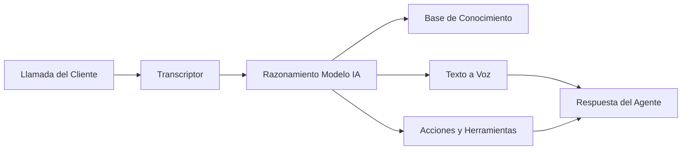

## ¿Qué es un Agente de Voz IA?

Un agente de voz IA es un asistente virtual inteligente que puede manejar conversaciones de voz con tus clientes por teléfono y web. A diferencia de los sistemas IVR tradicionales o chatbots, los agentes de itellicoAI comprenden lenguaje natural, mantienen contexto durante las conversaciones y pueden tomar acciones reales como reservar citas, transferir llamadas o actualizar tus sistemas.

## Capacidades Principales

Tus agentes de itellicoAI pueden:

<CardGroup cols={2}>
  <Card title="Comprender Lenguaje Natural" icon="brain">
    Comprender intención, preguntas y solicitudes del cliente en conversación natural
  </Card>
  <Card title="Acceder a tu Conocimiento" icon="book">
    Referenciar tu información empresarial, políticas y documentación durante las llamadas
  </Card>
  <Card title="Tomar Acciones" icon="bolt">
    Reservar citas, transferir llamadas, actualizar sistemas y activar flujos de trabajo
  </Card>
  <Card title="Hablar Naturalmente" icon="microphone">
    Responder con voces de sonido natural en múltiples idiomas
  </Card>
</CardGroup>

## Cómo Funcionan los Agentes de Voz IA

1. **El cliente habla** - Tu cliente hace una pregunta o solicitud
2. **Transcriptor** - El agente convierte habla a texto usando transcripción avanzada
3. **Razonamiento IA** - El modelo de lenguaje comprende intención y formula una respuesta
4. **Recuperación de conocimiento** - El agente accede a tu conocimiento empresarial cuando es necesario
5. **Ejecución de acción** - El agente puede activar reservas, transferencias o llamadas API
6. **Síntesis de habla** - La respuesta se convierte a habla de sonido natural
7. **El agente responde** - El cliente escucha una respuesta útil y contextual

## Beneficios Clave

<CardGroup cols={2}>
  <Card title="Disponibilidad 24/7" icon="clock">
    Nunca duerme, siempre listo para ayudar en cualquier zona horaria
  </Card>

  <Card title="Calidad Consistente" icon="star">
    Cada interacción sigue tus pautas y voz de marca
  </Card>

  <Card title="Escalado Instantáneo" icon="chart-line">
    Maneja 1 llamada o 1,000 simultáneamente sin cambios de infraestructura
  </Card>

  <Card title="Eficiencia de Costos" icon="dollar-sign">
    Reduce costos mientras libera personal humano para problemas complejos
  </Card>

  <Card title="Integración Rica" icon="plug">
    Conecta a CRMs, calendarios y herramientas empresariales para acceso a datos en tiempo real
  </Card>
</CardGroup>

## Casos de Uso Comunes

<AccordionGroup>
  <Accordion title="Soporte al Cliente" icon="headset">
    Responde FAQs, soluciona problemas y escala casos complejos a agentes humanos
  </Accordion>

  <Accordion title="Reserva de Citas" icon="calendar">
    Programa, reprograma y envía confirmaciones y recordatorios automatizados
  </Accordion>

  <Accordion title="Calificación de Leads" icon="user-plus">
    Involucra prospectos, recopila información y enruta leads calificados a ventas
  </Accordion>

  <Accordion title="Estado y Seguimiento de Pedidos" icon="box">
    Verifica estado de pedidos y proporciona actualizaciones de seguimiento
  </Accordion>

  <Accordion title="Pagos y Facturación" icon="credit-card">
    Responde preguntas de facturación, procesa pagos y envía recordatorios
  </Accordion>

  <Accordion title="Recopilación de Retroalimentación" icon="comment">
    Realiza encuestas y recopila retroalimentación de clientes a escala
  </Accordion>
</AccordionGroup>

## Próximos Pasos

¿Listo para crear tu primer agente? Continúa con:

<CardGroup cols={2}>
  <Card title="Crea tu Primer Agente" icon="plus" href="/es/build/getting-started/create-first-agent">
    Guía paso a paso para crear tu primer agente de voz IA
  </Card>
  <Card title="Tipos de Agentes y Casos de Uso" icon="list" href="/es/build/getting-started/agent-use-cases">
    Comprende diferentes tipos de agentes y cuándo usar cada uno
  </Card>
</CardGroup>
