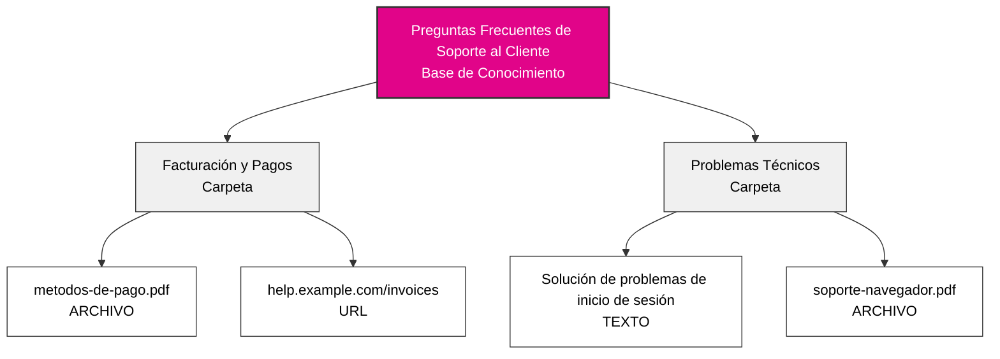
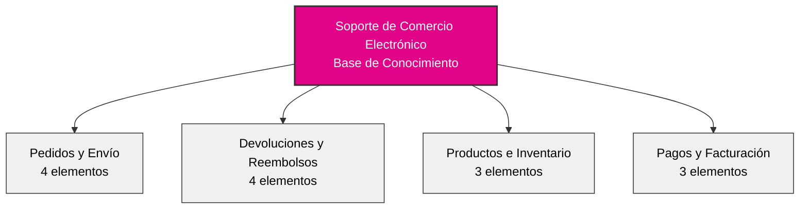

## Descripción General

Las bases de conocimiento transforman su agente de IA de un asistente genérico en un experto empresarial. Al organizar la información de su empresa en una jerarquía estructurada, su agente puede acceder instantáneamente y hacer referencia a políticas, procedimientos, detalles de productos y cualquier otra información en la que su negocio confíe.

Piense en las bases de conocimiento como archivadores inteligentes que su agente puede buscar en milisegundos durante las conversaciones.

## Arquitectura del Conocimiento

### La Jerarquía de Tres Niveles

El conocimiento en itellicoAI sigue una estructura simple e intuitiva:

**Base de Conocimiento → Carpetas → Elementos**

Los elementos pueden ser **texto**, **archivos** (PDF, Word, Markdown, CSV, JSON, YAML, XML, etc.) o **URLs** (solo una página web individual, no sitios web completos).

Esta jerarquía facilita la organización de grandes cantidades de información mientras la mantiene accesible y manejable.

---

## Descripción General del Panel

### Interfaz Principal de Conocimiento

Navegue a **Conocimiento** en la barra lateral izquierda para acceder a su panel de gestión de conocimiento con una vista rápida de todas sus bases de conocimiento:

<CardGroup cols={1}>
  <Card title="Preguntas Frecuentes de Soporte al Cliente">
    - 127 elementos
    - Actualizado Hoy
  </Card>
  <Card title="Documentación del Producto">
    - 89 elementos
    - Actualizado Ayer
  </Card>
  <Card title="Políticas de la Empresa">
    - 45 elementos
    - Actualizado hace 3 días
  </Card>
</CardGroup>

Cada tarjeta de base de conocimiento muestra:
- Número total de elementos en todas las carpetas
- Marca de tiempo de última actualización
- Acciones: Copiar marcador de referencia, Editar, Eliminar

---

## Comprender Cada Nivel

### Bases de Conocimiento

<Card title="¿Qué es una Base de Conocimiento?" icon="database">
  Una base de conocimiento es el contenedor de nivel superior que agrupa información relacionada. Representa una categoría principal o dominio del conocimiento de su negocio.
</Card>

**Piense en las bases de conocimiento como diferentes archivadores en su oficina:**
- Un archivador para materiales de soporte al cliente
- Otro para documentación del producto
- Otro para políticas de la empresa
- Otro para recursos de ventas

**Ejemplos de bases de conocimiento:**
- **Preguntas Frecuentes de Soporte al Cliente** - Toda la información de soporte orientada al cliente
- **Documentación del Producto** - Documentos técnicos, guías de usuario, descripciones de características
- **Políticas de la Empresa** - Políticas de RRHH, documentos de cumplimiento, procedimientos internos
- **Recursos de Ventas** - Hojas de precios, comparaciones con competidores, presentaciones comerciales

### Carpetas

<Card title="¿Qué es una Carpeta?" icon="folder">
  Las carpetas son unidades organizativas dentro de una base de conocimiento. Agrupan elementos relacionados por tema, categoría o propósito.
</Card>

**Piense en las carpetas dentro de su archivador:**
- Organizan contenido similar juntos
- Facilitan encontrar y gestionar la información
- Le permiten asignar temas específicos a los agentes

**Ejemplos de carpetas dentro de una base de conocimiento de Soporte al Cliente:**
- **Facturación y Pagos** - Preguntas sobre facturas, métodos de pago, reembolsos
- **Problemas Técnicos** - Guías de solución de problemas, mensajes de error, soluciones a errores
- **Información del Producto** - Características, especificaciones, compatibilidad
- **Políticas de Devolución** - Plazos de devolución, condiciones, pasos del proceso

<Tip>
Use nombres de carpetas claros y descriptivos. Tanto su equipo como su IA se beneficiarán de una organización intuitiva.
</Tip>

### Elementos de Conocimiento

<Card title="¿Qué es un Elemento de Conocimiento?" icon="file">
  Los elementos de conocimiento son las piezas reales de información: documentos, preguntas frecuentes, políticas, procedimientos o cualquier contenido que desee que su agente conozca.
</Card>

**Los elementos de conocimiento pueden ser:**
- **Entradas de texto** - Contenido escrito directamente
- **Cargas de archivos** - PDF, Word (.doc, .docx), Texto (.txt, .log), Markdown (.md), CSV/TSV, JSON, YAML, XML (hasta 10MB)
- **Raspado de URLs** - Contenido de una sola página web (no sitios web completos)

**Ejemplos de elementos de conocimiento:**
- "Política de Reembolso para Productos Digitales"
- "Cómo Restablecer la Contraseña - Paso a Paso"
- "Especificaciones del Producto - Modelo X200"
- "Tiempos de Envío por Región"

Cada elemento de conocimiento incluye:
- **Título** - Nombre descriptivo del contenido
- **Contenido/Fuente** - La información real (texto, archivo o URL)
- **Estado de Procesamiento de Contenido** - Estado de extracción (Pendiente, Procesando, Completado, Fallido)
- **Estado de Indexación Vectorial** - Estado de preparación RAG (Pendiente, Indexando, Indexado, Fallido)
- **Metadatos** - Fecha de creación, última actualización, tamaño del contenido, recuento de tokens

---

## Cuándo Usar Bases de Conocimiento

<AccordionGroup>
  <Accordion title="Su agente necesita responder preguntas específicas" icon="circle-question">
    Si los clientes preguntan regularmente sobre políticas, procedimientos o detalles del producto, agregue esa información a una base de conocimiento. Su agente la referenciará con precisión cada vez.

    **Ejemplo:** Un cliente pregunta "¿Cuál es su política de devolución?" El agente recupera la política exacta de su base de conocimiento y la explica naturalmente.
  </Accordion>

  <Accordion title="Tiene documentación detallada" icon="book">
    Si tiene documentación existente (manuales de usuario, preguntas frecuentes, documentos de políticas), puede cargarlos directamente en varios formatos (PDF, DOC, DOCX, TXT). Su agente podrá buscar y referenciarlos en conversaciones.

    **Ejemplo:** Cargue su manual de producto de 50 páginas. Cuando los clientes tengan preguntas técnicas, su agente encuentra y explica las secciones relevantes.
  </Accordion>

  <Accordion title="La información cambia frecuentemente" icon="arrows-rotate">
    Las bases de conocimiento facilitan actualizar información sin cambiar las instrucciones principales de su agente. Actualice una hoja de precios o documento de política, y su agente tiene instantáneamente la nueva información.

    **Ejemplo:** Actualiza su documento de precios una vez, y todos los agentes que usan esa base de conocimiento referencian inmediatamente los nuevos precios.
  </Accordion>

  <Accordion title="Múltiples agentes necesitan la misma información" icon="users">
    Cree una base de conocimiento y compártala entre múltiples agentes. Mantenga la información en un solo lugar, úsela en todas partes.

    **Ejemplo:** Su base de conocimiento de "Especificaciones del Producto" puede ser usada por su agente de ventas, agente de soporte y agente de calificación de preventas.
  </Accordion>

  <Accordion title="Desea separar responsabilidades" icon="layer-group">
    Mantenga las instrucciones conversacionales de su agente separadas de la información factual. Las instrucciones definen la personalidad y el comportamiento; las bases de conocimiento proporcionan hechos y detalles.

    **Ejemplo:** Las instrucciones de su agente dicen "sea amigable y profesional". Su base de conocimiento contiene las especificaciones reales del producto, precios y políticas.
  </Accordion>
</AccordionGroup>

---

## Mejores Prácticas de Organización

### Comience con Categorías Claras

<CardGroup cols={2}>
  <Card title="Por Departamento" icon="building">
    - Conocimiento de Ventas
    - Conocimiento de Soporte
    - Conocimiento de Facturación
    - Documentación Técnica
  </Card>
  <Card title="Por Tema" icon="tags">
    - Información del Producto
    - Políticas y Procedimientos
    - Solución de Problemas
    - Preguntas Frecuentes
  </Card>
  <Card title="Por Viaje del Cliente" icon="map">
    - Información Previa a la Venta
    - Guías de Incorporación
    - Uso y Características
    - Soporte y Solución de Problemas
  </Card>
  <Card title="Por Audiencia" icon="user-group">
    - Información Orientada al Cliente
    - Procedimientos Internos
    - Recursos para Socios
    - Especificaciones Técnicas
  </Card>
</CardGroup>

### Convenciones de Nomenclatura

Use nombres claros y consistentes que tengan sentido para todo su equipo:

**Buenos ejemplos de nomenclatura:**
- Base de Conocimiento: "Recursos de Soporte al Cliente"
- Carpeta: "Facturación y Pagos"
- Elemento: "Política de Reembolso - Productos Digitales"

**Malos ejemplos de nomenclatura:**
- Base de Conocimiento: "BC_001"
- Carpeta: "Documentos Varios"
- Elemento: "Politica_v2_final_ACTUALIZADO"

<Tip>
Incluya fechas o números de versión en los títulos de los elementos si mantiene múltiples versiones: "Hoja de Precios - 2025 Q1"
</Tip>

### Ejemplo de Base de Conocimiento Bien Estructurada

Aquí hay un ejemplo de una base de conocimiento de comercio electrónico bien organizada:

**Contenidos de las carpetas:**
- **Pedidos y Envío:** Seguimiento, tiempos de envío, información internacional, modificaciones
- **Devoluciones y Reembolsos:** Política, proceso de envío, tiempos de procesamiento, intercambios
- **Productos e Inventario:** Categorías, disponibilidad de stock, especificaciones
- **Pagos y Facturación:** Métodos de pago, facturas, planes de pago

**Lo que hace que esta estructura sea buena:**
- Nombres de carpetas claros y descriptivos que agrupan contenido relacionado
- Distribución equilibrada (3-4 elementos por carpeta)
- Fácil de navegar y encontrar información
- Se escala bien a medida que agrega más contenido

### Extraiga Solo Contenido Relevante

<Warning>
**Más conocimiento ≠ Mejor rendimiento**

Agregar demasiado conocimiento aumenta la posibilidad de que su agente recupere información irrelevante junto con lo que realmente se necesita.
</Warning>

**Mejor práctica para documentos grandes:**

En lugar de cargar manuales completos o documentos de políticas, extraiga solo las páginas/secciones que su agente necesita.

<AccordionGroup>
  <Accordion title="❌ Evite: Cargar el manual completo de empleados de 200 páginas" icon="xmark">
    **Problema:**
    - El agente encuentra y mezcla secciones irrelevantes con la respuesta correcta
    - Más difícil para el agente determinar qué es realmente relevante
    - Desperdicia espacio de conversación en contenido no relacionado

    **Ejemplo:**
    Cliente pregunta: "¿Cuál es su política de devolución?"

    El agente podría incluir: políticas de vacaciones de RRHH, procedimientos internos, beneficios para empleados, y luchar para separar lo que el cliente realmente necesita.
  </Accordion>

  <Accordion title="✅ Mejor: Extraiga secciones específicas" icon="check">
    **Enfoque:**
    - "Política de Devolución - Páginas 45-48"
    - "Política de Envío - Páginas 52-55"
    - "Términos de Garantía - Páginas 89-92"

    **Beneficio:**
    - El agente encuentra solo contenido relevante para el cliente
    - Respuestas más claras y precisas
    - Uso más eficiente del espacio de conversación

    **Ejemplo:**
    Cliente pregunta: "¿Cuál es su política de devolución?"

    El agente recupera: Solo la sección de política de devolución de 4 páginas, exactamente lo que se necesita, nada más.
  </Accordion>
</AccordionGroup>

**Cómo extraer secciones relevantes:**
- Exportar páginas específicas de PDF como archivos separados
- Copiar secciones relevantes en elementos de TEXTO
- Enlazar a URLs específicas con anclajes en lugar de sitios de documentación completos

### Mantenimiento Regular

<Steps>
  <Step title="Revisar trimestralmente">
    Programe revisiones regulares de sus bases de conocimiento para asegurar que la información se mantenga actualizada.
  </Step>
  <Step title="Eliminar contenido obsoleto">
    Elimine elementos que ya no sean relevantes o desvinculelos de los agentes. La información obsoleta puede confundir a su agente y proporcionar respuestas incorrectas.
  </Step>
  <Step title="Actualizar basándose en comentarios">
    Si los clientes reportan información incorrecta, verifique su base de conocimiento inmediatamente.
  </Step>
</Steps>

---

## Ejemplos del Mundo Real

<AccordionGroup>
  <Accordion title="Agente de Soporte SaaS" icon="headset">
    **Base de Conocimiento:** "Soporte de Producto SaaS"

    **Carpetas:**
    - **Gestión de Cuentas** (15 elementos)
      - Proceso de restablecimiento de contraseña
      - Instrucciones de actualización de cuenta
      - Información del ciclo de facturación
      - Gráfico de comparación de planes
    - **Documentación de Características** (47 elementos)
      - Guías de características individuales
      - Tutoriales de integración
      - Documentación de API
      - Mejores prácticas
    - **Solución de Problemas** (23 elementos)
      - Mensajes de error comunes
      - Problemas de conexión
      - Compatibilidad del navegador
      - Optimización del rendimiento

    **Resultado:** El agente de soporte puede responder el 80% de las preguntas técnicas sin intervención humana.
  </Accordion>

  <Accordion title="Agente de Citas Médicas" icon="calendar">
    **Base de Conocimiento:** "Servicios para Pacientes"

    **Carpetas:**
    - **Políticas de Citas** (8 elementos)
      - Directrices de programación
      - Política de cancelación
      - Requisitos de seguro
      - Proceso para nuevos pacientes
    - **Información de la Oficina** (5 elementos)
      - Ubicaciones y horarios de oficina
      - Instrucciones de estacionamiento
      - Información de accesibilidad
      - Directorio de contacto
    - **Seguro y Facturación** (12 elementos)
      - Proveedores de seguro aceptados
      - Opciones de pago
      - Preguntas de facturación
      - Asistencia financiera

    **Resultado:** El agente maneja reservas de citas y preguntas sobre políticas 24/7 con completa precisión.
  </Accordion>

  <Accordion title="Agente de Ventas de Comercio Electrónico" icon="shopping-cart">
    **Base de Conocimiento:** "Catálogo de Productos y Ventas"

    **Carpetas:**
    - **Especificaciones del Producto** (89 elementos)
      - Descripciones detalladas de productos
      - Especificaciones técnicas
      - Información de compatibilidad
      - Guías de tallas
    - **Precios y Promociones** (15 elementos)
      - Precios actuales
      - Promociones activas
      - Descuentos por volumen
      - Ventas estacionales
    - **Envío y Entrega** (7 elementos)
      - Opciones de envío
      - Plazos de entrega
      - Envío internacional
      - Información de seguimiento

    **Resultado:** El agente de ventas proporciona información precisa del producto y precios instantáneamente durante conversaciones con clientes.
  </Accordion>
</AccordionGroup>

---

## Próximos Pasos

<CardGroup cols={2}>
  <Card title="Crear Bases de Conocimiento" icon="plus" href="/es/build/knowledge/create-knowledge-bases">
    Guía paso a paso para crear y organizar su conocimiento
  </Card>
  <Card title="Tipos de Contenido" icon="file-lines" href="/es/build/knowledge/content-types">
    Aprenda sobre elementos de conocimiento de texto, archivo y URL
  </Card>
  <Card title="Asignar a Agentes" icon="link" href="/es/build/knowledge/assign-knowledge">
    Conecte bases de conocimiento a sus agentes
  </Card>
  <Card title="Contexto vs RAG" icon="brain" href="/es/build/knowledge/context-vs-rag">
    Elija el método de acceso correcto para su caso de uso
  </Card>
</CardGroup>
