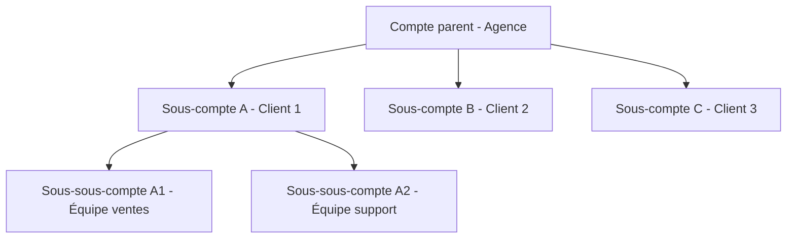

## Vue d'ensemble

itellicoAI utilise un système de comptes hiérarchiques qui vous permet d'organiser vos équipes, de gérer le contrôle d'accès et de faire évoluer vos opérations d'IA vocale. Que vous soyez une équipe unique ou une entreprise avec plusieurs départements, le système de comptes offre flexibilité et sécurité.

## Types de comptes

### Comptes principaux

Les comptes principaux (également appelés "comptes racine" ou "comptes parents") sont des organisations de premier niveau avec :

- Facturation et abonnements indépendants
- Contrôle administratif complet
- Capacité à créer des sous-comptes (selon l'abonnement)
- Clés API et intégrations séparées

**Cas d'usage :**
- Entreprises individuelles
- Agences gérant plusieurs clients
- Entreprises avec des unités commerciales distinctes

### Sous-comptes

Les sous-comptes sont imbriqués sous les comptes parents et fournissent :

- Espace de travail isolé pour les équipes ou clients
- Agents, contacts et conversations séparés
- Membres d'équipe et permissions indépendants
- Facturation partagée avec le compte parent

**Caractéristiques clés :**
- Les sous-comptes peuvent avoir leurs propres sous-comptes (gardez l'imbrication simple pour une gestion plus facile)
- Les comptes parents peuvent accéder aux données enfants
- Les sous-comptes **ne peuvent pas** accéder aux données du parent ou des comptes frères
- Chaque sous-compte a son propre propriétaire et équipe

**Cas d'usage :**
- Espaces de travail clients pour agences
- Séparation des départements au sein des entreprises
- Divisions régionales ou par ligne de produits
- Comptes clients revendeurs

## Hiérarchie des comptes

Le système suit une hiérarchie parent-enfant avec un contrôle d'accès strict :



### Règles d'accès

- **Accès descendant** : Les parents peuvent accéder à tous les sous-comptes enfants
- **Pas d'accès ascendant** : Les enfants ne peuvent pas accéder aux données du parent
- **Pas d'accès entre frères** : Les sous-comptes ne peuvent pas accéder les uns aux autres
- **Changement de contexte** : Les utilisateurs avec plusieurs appartenances peuvent basculer entre les comptes

## Cas d'usage courants

<AccordionGroup>
  <Accordion title="Agence gérant plusieurs clients" icon="building">
    ```mermaid
    graph TD
        A[Agence - Compte parent]
        A --> B[Sous-compte client A]
        A --> C[Sous-compte client B]
        B --> D[Le personnel du client A a un accès complet]
        C --> E[Le personnel du client B a un accès complet]
    ```

    **Avantages :**
    - Les clients ne peuvent pas voir les données des autres
    - Les administrateurs de l'agence peuvent gérer tous les comptes
    - Suivi de facturation séparé par client
    - Intégration et départ faciles
  </Accordion>

  <Accordion title="Entreprise avec équipes régionales" icon="globe">
    ```mermaid
    graph TD
        A[Siège social - Compte parent]
        A --> B[Région Amérique du Nord]
        A --> C[Région Europe]
        A --> D[Région APAC]
        B --> E[Équipe ventes]
        B --> F[Équipe support]
        C --> G[Équipe ventes]
        C --> H[Équipe support]
    ```

    **Avantages :**
    - Autonomie régionale avec supervision centrale
    - Contrôle d'accès au niveau départemental
    - Facturation et rapports consolidés
    - Structures d'équipe flexibles
  </Accordion>

  <Accordion title="Revendeur ou fournisseur marque blanche" icon="store">
    ```mermaid
    graph TD
        A[Revendeur - Compte parent]
        A --> B[Sous-compte client 1]
        A --> C[Sous-compte client 2]
        A --> D[Sous-compte client 3]
    ```

    **Avantages :**
    - Isolation et confidentialité des clients
    - Facturation centralisée au revendeur
    - Image de marque personnalisée par client
    - Intégration client évolutive
  </Accordion>
</AccordionGroup>

## Ce que vous pouvez faire

<CardGroup cols={2}>
  <Card title="Créer des comptes" icon="plus" href="/fr/accounts/creating-accounts">
    Apprenez à créer des comptes principaux et des sous-comptes
  </Card>
  <Card title="Gérer les membres de l'équipe" icon="users" href="/fr/accounts/team-management">
    Inviter et gérer les membres de l'équipe
  </Card>
  <Card title="Clés API" icon="key" href="/fr/accounts/api-keys">
    Créer et gérer l'accès programmatique
  </Card>
  <Card title="Paramètres du compte" icon="gear" href="/fr/accounts/account-settings">
    Personnaliser l'image de marque et gérer les détails du compte
  </Card>
</CardGroup>

## Bonnes pratiques de sécurité

<AccordionGroup>
  <Accordion title="Gérer l'accès de l'équipe avec soin" icon="shield-halved">
    - N'inviter que des membres d'équipe de confiance
    - Examiner régulièrement les membres de l'équipe
    - Supprimer l'accès lorsque les membres de l'équipe partent
  </Accordion>

  <Accordion title="Organiser avec des sous-comptes" icon="sitemap">
    - Créer des sous-comptes séparés pour les clients
    - Utiliser des sous-comptes pour isoler les départements
    - Exploiter la hiérarchie pour le contrôle d'accès
  </Accordion>

  <Accordion title="Gérer les clés API avec soin" icon="key">
    - Créer des clés séparées par environnement
    - Révoquer immédiatement les clés inutilisées ou compromises
    - Définir des dates d'expiration pour les accès temporaires
    - Surveiller les horodatages de dernière utilisation
  </Accordion>

  <Accordion title="Auditer régulièrement les membres de l'équipe" icon="clipboard-list">
    - Examiner les membres de l'équipe trimestriellement
    - Supprimer immédiatement les employés partants
    - Mettre à jour l'accès lors de changements de responsabilités
  </Accordion>
</AccordionGroup>

## FAQ

<AccordionGroup>
  <Accordion title="Combien de sous-comptes puis-je créer ?">
    Le nombre de sous-comptes dépend de votre formule d'abonnement. Contactez [support@itellico.ai](mailto:support@itellico.ai) pour discuter de vos besoins.
  </Accordion>

  <Accordion title="Puis-je transférer un sous-compte vers un autre parent ?">
    Contactez le support pour transférer des sous-comptes entre parents ou convertir des sous-comptes en comptes principaux.
  </Accordion>

  <Accordion title="Qui est facturé pour l'utilisation du sous-compte ?">
    Le compte parent est responsable de toute la facturation des sous-comptes. L'utilisation est suivie séparément pour les rapports.
  </Accordion>

  <Accordion title="Les sous-comptes peuvent-ils avoir leurs propres clés API ?">
    Oui ! Chaque sous-compte peut créer des clés API indépendantes. Les clés sont limitées à leur contexte de compte.
  </Accordion>

  <Accordion title="Qu'arrive-t-il aux données lorsque je désactive un compte ?">
    Les comptes sont supprimés de manière douce (marqués comme inactifs). Les données sont préservées et peuvent être réactivées en contactant le support.
  </Accordion>

  <Accordion title="Un utilisateur peut-il être membre de plusieurs comptes ?">
    Oui ! Les utilisateurs peuvent être invités à plusieurs comptes et basculer entre eux à l'aide du sélecteur de compte.
  </Accordion>

  <Accordion title="Comment transférer la propriété d'un compte ?">
    Contactez le support pour transférer la propriété. Cela ne peut pas être fait via l'interface utilisateur pour des raisons de sécurité.
  </Accordion>
</AccordionGroup>

## Besoin d'aide ?

Contactez [support@itellico.ai](mailto:support@itellico.ai) pour obtenir de l'aide sur la gestion des comptes, les questions de facturation ou les transferts de propriété.
