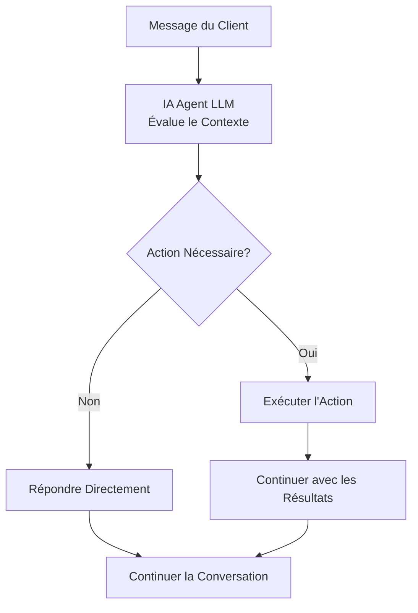

## Vue d'ensemble

Les actions transforment vos agents IA d'assistants conversationnels en outils d'automatisation métier puissants. Au-delà de répondre aux questions, vos agents peuvent planifier des rendez-vous, transférer des appels, mettre à jour des systèmes et s'intégrer à vos flux de travail métier existants - tout en maintenant un flux de conversation naturel.

Considérez les actions comme la boîte à outils de votre agent. Tout comme un employé humain utilise différents outils pour accomplir des tâches, votre agent IA exécute des actions pour effectuer un travail réel pendant les interactions client.

<Note>
Les actions s'exécutent automatiquement en fonction du contexte de conversation et des instructions que vous fournissez dans le prompt de votre agent. Vous définissez quand et comment les actions doivent être utilisées grâce à [l'ingénierie de prompt](/fr/build/conversation/prompt-engineering-guide).
</Note>

---

## Que sont les Actions ?

Les actions sont des outils préconfigurés que votre agent peut invoquer pendant les conversations pour accomplir des tâches spécifiques. Lorsqu'un client demande quelque chose qui nécessite une action - comme réserver un rendez-vous ou parler à un spécialiste - votre agent peut exécuter l'action appropriée de manière transparente.

### Comment fonctionnent les Actions

Pendant les conversations, votre agent décide de manière autonome s'il doit répondre directement ou exécuter une action :



L'agent utilise les **noms et descriptions d'actions** pour comprendre ce que chaque action fait. Ceux-ci sont cruciaux pour aider le LLM à sélectionner le bon outil.

**Meilleures pratiques :**
- Donnez aux actions des noms clairs et descriptifs (par exemple, "book_appointment" et non "action1")
- Écrivez des descriptions détaillées expliquant ce que fait l'action
- Ajoutez des instructions explicites dans vos [instructions d'agent (prompt système)](/fr/build/conversation/prompt-engineering-guide) sur **quand** utiliser chaque action

<Note>
Alors que les noms et descriptions d'actions indiquent à l'agent **ce que** fait une action, vos instructions d'agent (prompt système) doivent spécifier **quand** l'utiliser. Par exemple : "Lorsqu'un client demande à parler à un humain, utilisez l'action transfer_to_support."
</Note>

---

## Catégories d'Actions

Les actions sont organisées en deux catégories dans le tableau de bord :

### Contrôle d'Appel

<CardGroup cols={2}>
  <Card title="Transférer l'Appel" icon="phone" href="/fr/build/actions/transfer-details">
    Transférer vers un autre agent IA, numéro de téléphone ou adresse SIP
  </Card>
  <Card title="Terminer la Conversation" icon="phone-slash" href="/fr/build/actions/call-control">
    Faire en sorte que l'agent termine la conversation avec un message personnalisé
  </Card>
</CardGroup>

### Intégration

<CardGroup cols={2}>
  <Card title="Action Personnalisée" icon="code" href="/fr/build/actions/custom-api-actions">
    Créer une action API personnalisée ou webhook
  </Card>
  <Card title="Réservation de Calendrier" icon="calendar" href="/fr/build/actions/booking-calendar">
    Planifier des rendez-vous en utilisant l'intégration Cal.com
  </Card>
</CardGroup>

---

## Quand les Actions s'Exécutent

Les actions s'exécutent **pendant la conversation** lorsqu'elles sont déclenchées par votre agent en fonction de ses instructions. Contrairement aux systèmes IVR traditionnels qui suivent des scripts rigides, les agents IA utilisent la compréhension contextuelle pour déterminer quand les actions sont appropriées.

### Mécanismes de Déclenchement

**Déclencheurs Basés sur les Instructions :**
```text wrap
Lorsque le client demande à parler à un humain, utilisez l'action 'Transfer to Support'.

Après avoir réussi à réserver un rendez-vous, utilisez l'action 'End Call Politely'.

Si le client dit qu'il a besoin de temps pour vérifier quelque chose, utilisez l'action 'Pause Inactivity Timer'.
```

**Déclencheurs Conditionnels :**
```jinja
Si le client signale un problème de facturation :
1. Utilisez l'action 'Lookup Account' pour récupérer ses informations
2. Si le solde est en retard, transférez au département de facturation
3. Si le solde est à jour, résolvez le problème


Proposez toujours de transférer les clients VIP vers le support dédié immédiatement.

```

**Workflows Multi-Étapes :**
```text wrap
Flux de Réservation de Rendez-vous :
1. Recueillir les informations requises (nom, email, date préférée)
2. Utiliser l'action 'Check Availability' pour interroger Cal.com
3. Présenter les options au client
4. Utiliser l'action 'Book Appointment' pour confirmer
5. Utiliser l'action 'Send SMS Confirmation' si le client a fourni un téléphone
6. Utiliser l'action 'End Call Politely' pour conclure
```

<Warning>
Les actions s'exécutent en temps réel pendant l'appel. Assurez-vous que vos endpoints sont fiables et répondent rapidement pour éviter des pauses gênantes dans la conversation.
</Warning>

---

## Configuration des Actions

Toute configuration d'action se fait dans l'éditeur d'agent sous l'onglet **Abilities → Actions**.

<Steps>
  <Step title="Naviguer vers les Actions">
    Ouvrez votre agent dans l'éditeur et cliquez sur **Abilities** → onglet **Actions**
  </Step>
  <Step title="Choisir le Type d'Action">
    Parcourez les catégories **Call Control** et **Integration** et cliquez sur **Add** sur l'action que vous souhaitez configurer
  </Step>
  <Step title="Configurer l'Action">
    Remplissez le formulaire de configuration spécifique à l'action :
    - **Name** : Donnez à votre action un nom clair et descriptif
    - **Description** : Expliquez ce que fait cette action
    - **Paramètres spécifiques à l'action** : Configurez les paramètres en fonction du type d'action
  </Step>
  <Step title="Enregistrer">
    Enregistrez l'action pour l'ajouter à la boîte à outils de votre agent
  </Step>
</Steps>

---

## Indicateurs de Statut d'Action

Après avoir ajouté des actions, vous les verrez listées dans l'onglet Actions de votre agent avec des indicateurs de statut :

<CardGroup cols={3}>
  <Card title="Configurée" icon="circle-check">
    L'action est correctement configurée et prête à être utilisée
  </Card>
  <Card title="Incomplète" icon="circle-exclamation">
    Configuration ou identifiants requis manquants
  </Card>
  <Card title="Erreur" icon="circle-xmark">
    Erreur de configuration ou échec d'authentification
  </Card>
</CardGroup>

---

## Référencer les Actions dans les Instructions

Pour utiliser les actions, référencez-les **par nom exact** dans les instructions de votre agent :

### Référence Directe
```text wrap
Lorsqu'un client demande à parler à quelqu'un concernant la facturation,
utilisez l'action 'Transfer to Billing Department'.
```

### Avec Conditions
```text wrap
Si le problème du client ne peut pas être résolu :
1. Excusez-vous pour le désagrément
2. Expliquez que vous les connectez à un spécialiste
3. Utilisez l'action 'Transfer to Support'
```

### Avec Paramètres
```text wrap
Après avoir recueilli l'email du client et la date préférée,
utilisez l'action 'Book Consultation' pour planifier la réunion.
```

<Note>
Les noms d'actions sont sensibles à la casse et doivent correspondre exactement à la configuration. Si vous renommez une action, mettez à jour toutes les références dans vos instructions.
</Note>

---

## Meilleures Pratiques de Configuration

<AccordionGroup>
  <Accordion title="Commencer Simple" icon="seedling">
    Commencez par des actions de base avant d'ajouter des intégrations complexes. Ajoutez une action à la fois, testez minutieusement, puis ajoutez la suivante.

    **Exemple de progression :**
    1. Ajouter l'action End Conversation
    2. Ajouter l'action Transfer to Support
    3. Ajouter l'action Booking
    4. Ajouter les actions Custom API
  </Accordion>

  <Accordion title="Utiliser des Noms Clairs et Descriptifs" icon="tag">
    Les noms d'actions sont critiques - le LLM les utilise pour comprendre ce que fait chaque outil. Utilisez des noms descriptifs, orientés action qui transmettent clairement le but de la fonction.

    **Pourquoi c'est important :** Le modèle s'appuie sur les noms et descriptions de fonctions pour détecter quand une fonction doit être appelée et choisir le bon outil pour la tâche.

    **Bons noms :**
    - "Get Customer Account" - Verbe d'action clair + cible spécifique
    - "Transfer to Billing Department" - Destination spécifique incluse
    - "Book 30-Minute Consultation" - Inclut des détails pertinents

    **Mauvais noms :**
    - "Action 1" - Aucun contexte sur ce qu'elle fait
    - "Transfer" - Trop générique, peu clair où
    - "API Call" - Ne décrit pas l'action
  </Accordion>

  <Accordion title="Écrire des Descriptions Détaillées" icon="file-lines">
    Les descriptions d'actions aident le LLM à comprendre **ce que** fait l'action. La description doit expliquer le but de l'action, ce qu'elle retourne et quels paramètres elle utilise.

    **Meilleures pratiques d'[OpenAI function calling](https://platform.openai.com/docs/guides/function-calling) :**
    - Décrire clairement ce que fait l'action et ce qu'elle retourne
    - Expliquer quels paramètres ou données elle utilise
    - Utiliser un langage précis qui guide la compréhension du modèle
    - Rester concis mais complet

    **Exemple :**
    ```
    Name: Get Customer Account
    Description: Récupère les données du compte client depuis Salesforce CRM en utilisant
    leur numéro de téléphone. Retourne le statut du compte, le solde et les commandes récentes.
    ```

    **Note :** Décrivez **ce que** fait l'action dans la description. Spécifiez **quand** l'utiliser dans vos [instructions d'agent (prompt système)](/fr/build/conversation/prompt-engineering-guide).
  </Accordion>

  <Accordion title="Tester Minutieusement" icon="vial">
    Testez chaque action dans l'interface de test d'agent avant de la mettre en production :
    - Vérifier que l'action s'exécute correctement
    - Tester les scénarios de succès
    - Tester les scénarios d'échec
    - Vérifier la gestion des erreurs
    - Vérifier le flux de conversation
  </Accordion>

  <Accordion title="Gérer les Échecs avec Élégance" icon="shield-check">
    Configurez des comportements de secours pour quand les actions échouent. Instruisez votre agent sur quoi faire quand les actions ne fonctionnent pas.

    ```
    Si l'action 'Book Appointment' échoue :
    1. Excusez-vous sincèrement
    2. Proposez qu'une personne rappelle pour planifier
    3. Collectez leur numéro de rappel préféré
    4. Utilisez l'action 'End Call Politely'
    ```
  </Accordion>

  <Accordion title="Collecter d'Abord les Informations" icon="clipboard-check">
    Assurez-vous que les agents recueillent les données requises avant d'exécuter les actions. N'essayez pas de réserver des rendez-vous sans adresse email ou de transférer des appels sans expliquer pourquoi.

    ```
    Avant d'utiliser l'action 'Book Consultation' :
    1. Confirmer que le client souhaite planifier
    2. Demander son adresse email si elle n'est pas dans le dossier de contact
    3. Discuter de ses dates et heures préférées
    4. Expliquer ce que couvrira la consultation
    5. Seulement alors exécuter l'action de réservation
    ```
  </Accordion>

  <Accordion title="Sécuriser les Identifiants" icon="lock">
    Utilisez une authentification appropriée pour toutes les actions personnalisées. Ne jamais exposer les clés API ou identifiants dans les URL ou champs non cryptés.

    - Utiliser des tokens Bearer pour l'authentification API
    - Utiliser Basic auth sur HTTPS uniquement
    - Stocker les identifiants sensibles en toute sécurité
    - Faire tourner les identifiants régulièrement
  </Accordion>
</AccordionGroup>

---

## Tester les Actions

Avant de déployer des agents avec des actions, testez minutieusement dans l'interface de test du tableau de bord :

<Steps>
  <Step title="Ouvrir l'Interface de Test">
    Cliquez sur **Test Call** dans le coin supérieur droit de l'éditeur d'agent
  </Step>
  <Step title="Démarrer un Appel Web">
    Cliquez sur **Start Web Call** pour commencer une conversation de test
  </Step>
  <Step title="Déclencher Chaque Action">
    Passez en revue les scénarios qui déclenchent chaque action configurée
  </Step>
  <Step title="Vérifier l'Exécution">
    Vérifiez que les actions s'exécutent correctement et traitent les réponses de manière appropriée
  </Step>
  <Step title="Tester les Cas d'Échec">
    Simulez des échecs pour vérifier que la gestion des erreurs fonctionne comme prévu
  </Step>
  <Step title="Examiner la Transcription">
    Examinez la transcription de conversation pour vous assurer que le flux est naturel et que les actions s'intègrent en douceur
  </Step>
</Steps>

### Ce qu'il faut Tester

**Pour les Actions de Transfert :**
- Le transfert s'exécute vers la bonne destination
- La musique d'attente joue si configurée
- Le message de transfert est approprié
- Les modes de transfert froid vs chaud fonctionnent correctement

**Pour les Actions de Réservation :**
- La disponibilité est récupérée correctement
- La réservation se confirme avec succès
- Les notifications email/SMS sont envoyées correctement
- La gestion des fuseaux horaires est précise

**Pour les Actions Personnalisées :**
- Les appels API réussissent
- L'authentification fonctionne
- Les données de réponse sont disponibles pour l'agent
- Les réponses d'erreur sont gérées avec élégance

**Pour Toutes les Actions :**
- L'agent référence l'action par le bon nom
- L'agent collecte d'abord les informations requises
- Le flux de conversation reste naturel
- Les échecs ne cassent pas la conversation

<Warning>
Les appels de test utilisent de vraies intégrations. Si vous testez une action de réservation, elle créera de vrais rendez-vous dans votre compte Cal.com. Nettoyez les données de test après.
</Warning>

---

## Cas d'Usage Courants

### Workflow de Support Client

```text wrap
Configuration de l'Agent :
- Transfer to Support (pour les problèmes complexes)
- Lookup Customer Account (API personnalisée)
- Create Support Ticket (API personnalisée)
- End Call Politely

Instructions :
Lorsqu'un client appelle :
1. Le saluer chaleureusement
2. Utiliser 'Lookup Customer Account' pour récupérer ses informations
3. Demander quel est son problème
4. Si vous pouvez le résoudre, faites-le en utilisant la base de connaissances
5. Si c'est complexe, utilisez 'Create Support Ticket' et fournissez le numéro de ticket
6. Si le client demande un humain, utilisez 'Transfer to Support'
7. Lorsque résolu, utilisez 'End Call Politely'
```

### Workflow de Réservation de Rendez-vous

```text wrap
Configuration de l'Agent :
- Book Consultation (réservation Cal.com)
- Send SMS Confirmation (optionnel)
- Transfer to Scheduling (secours)
- End Call Politely

Instructions :
Lorsqu'un client veut réserver :
1. Demander quel type de rendez-vous il souhaite
2. Collecter l'adresse email si elle n'est pas dans le dossier de contact
3. Discuter de ses dates préférées
4. Utiliser 'Book Consultation' pour montrer la disponibilité et confirmer
5. Si la réservation réussit, confirmer verbalement les détails
6. Si la réservation échoue, utiliser 'Transfer to Scheduling'
7. Utiliser 'End Call Politely' pour terminer
```

### Workflow de Qualification Commerciale

```text wrap
Configuration de l'Agent :
- Lookup Company Data (API personnalisée)
- Update CRM Lead (API personnalisée)
- Transfer to Sales (pour les prospects qualifiés)
- End Call Politely

Instructions :
Pour les appels commerciaux sortants :
1. Se présenter et expliquer le but
2. Utiliser 'Lookup Company Data' pour récupérer les données firmographiques
3. Poser des questions de qualification (budget, calendrier, autorité)
4. Utiliser 'Update CRM Lead' avec le statut de qualification
5. Si qualifié, utiliser 'Transfer to Sales' avec le contexte
6. Si non qualifié, les remercier et utiliser 'End Call Politely'
```

---

## Dépannage des Problèmes Courants

<AccordionGroup>
  <Accordion title="L'Action ne se Déclenche Pas" icon="circle-exclamation">
    **Problème :** L'agent n'utilise pas l'action alors qu'il devrait.

    **Solutions :**
    - Vérifier que le nom de l'action dans les instructions correspond exactement (sensible à la casse)
    - Vérifier que le statut de l'action est "Configured" et non "Incomplete" ou "Error"
    - Rendre les instructions plus explicites sur quand utiliser l'action
    - Tester en isolation en demandant explicitement à l'agent d'utiliser l'action
    - Examiner la transcription de conversation pour voir le raisonnement de l'agent
  </Accordion>

  <Accordion title="L'Agent Dit qu'il Va Exécuter l'Action Mais ne le Fait Pas" icon="comments">
    **Problème :** L'agent confirme verbalement qu'il exécute une action (par exemple, "Je vous transfère maintenant") mais l'action ne s'exécute que lors du prochain tour de conversation.

    **Pourquoi cela se produit :** L'agent génère une réponse et exécute l'action dans le même tour, mais un seul peut se produire par tour.

    **Solution :** Inciter l'agent à demander la confirmation de l'utilisateur avant d'exécuter les actions :

    ```jinja
    Avant d'utiliser l'action 'Transfer to Support' :
    1. Expliquer pourquoi vous les transférez
    2. Demander "Souhaitez-vous que je vous transfère maintenant ?"
    3. Attendre la confirmation
    4. Une fois confirmé, exécuter l'action 'Transfer to Support'
    ```

    Cela garantit que l'agent exécute l'action immédiatement après avoir reçu la confirmation, pas dans le même tour que l'annonce.
  </Accordion>

  <Accordion title="Échecs d'Authentification" icon="key">
    **Problème :** Les actions personnalisées échouent avec des erreurs 401/403.

    **Solutions :**
    - Vérifier que les identifiants sont corrects et non expirés
    - Vérifier que le type d'authentification correspond aux exigences de l'API
    - S'assurer que les tokens Bearer incluent le préfixe "Bearer" si nécessaire
    - Tester l'endpoint indépendamment avec Postman ou curl
    - Examiner la documentation de l'API pour le format d'authentification
  </Accordion>

  <Accordion title="L'Action de Réservation Échoue" icon="calendar-xmark">
    **Problème :** L'action de réservation Cal.com retourne des erreurs.

    **Solutions :**
    - Vérifier que l'intégration Cal.com est connectée
    - Vérifier que le type d'événement existe et est actif
    - S'assurer que la plateforme de réunion est configurée dans Cal.com
    - Vérifier que les fenêtres de planification autorisent les dates demandées
    - Vérifier la configuration du fuseau horaire
    - Tester la réservation manuellement dans Cal.com pour vérifier la disponibilité
  </Accordion>

  <Accordion title="Le Transfert ne se Connecte Pas" icon="phone-slash">
    **Problème :** L'action de transfert s'exécute mais ne se connecte pas.

    **Solutions :**
    - Vérifier que la destination est au format E.164 correct (par exemple, +15551234567)
    - S'assurer que le numéro de téléphone est joignable (pour les transferts téléphoniques)
    - Vérifier que l'adresse SIP est correcte (pour les transferts SIP)
    - Tester la destination indépendamment
  </Accordion>

</AccordionGroup>

---

## Prochaines Étapes

<CardGroup cols={2}>
  <Card title="Actions de Contrôle d'Appel" icon="phone" href="/fr/build/actions/call-control">
    Configurer les actions Transfer, End Conversation et Inactivity Management
  </Card>
  <Card title="Détails des Transferts" icon="right-left" href="/fr/build/actions/transfer-details">
    Maîtriser les destinations de transfert, modes et paramètres avancés
  </Card>
  <Card title="Intégration de Réservation" icon="calendar" href="/fr/build/actions/booking-calendar">
    Configurer la planification de rendez-vous Cal.com avec notifications email et SMS
  </Card>
  <Card title="Actions API Personnalisées" icon="code" href="/fr/build/actions/custom-api-actions">
    Connecter vos agents à des systèmes et API externes
  </Card>
  <Card title="Guide des Instructions" icon="pen" href="/fr/build/conversation/instructions">
    Apprendre à écrire des instructions d'agent efficaces
  </Card>
  <Card title="Ingénierie de Prompt" icon="book" href="/fr/build/conversation/prompt-engineering-guide">
    Maîtriser les techniques de prompting avancées pour un comportement d'agent fiable
  </Card>
</CardGroup>
