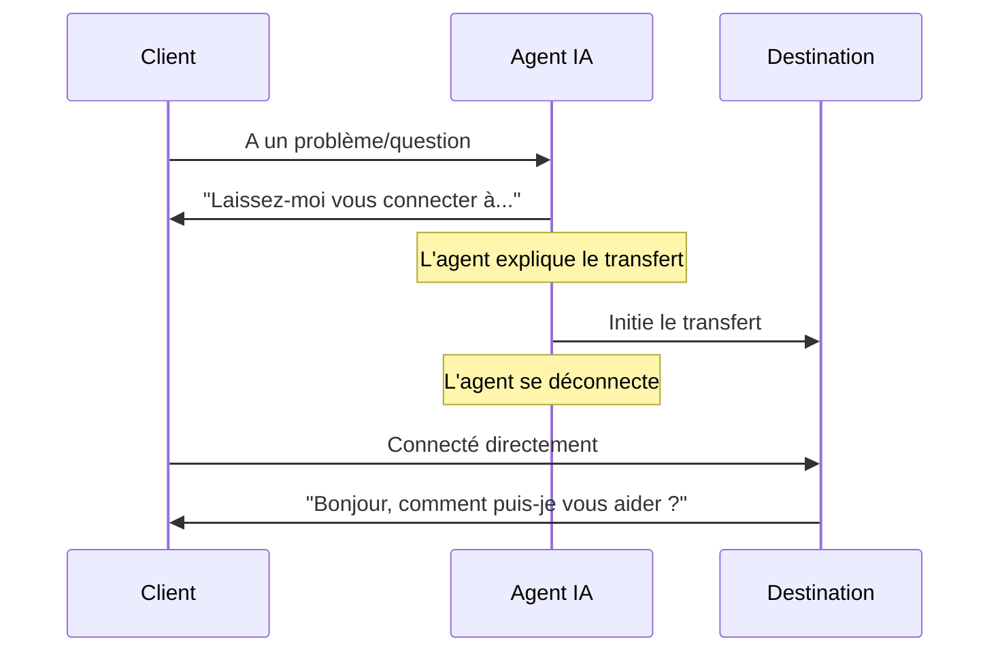

## Présentation

L'action de transfert est l'un des outils de contrôle d'appel les plus puissants, permettant à vos agents IA de router de manière transparente les conversations vers la bonne destination lorsque de l'aide spécialisée est nécessaire. Qu'il s'agisse de transférer vers des spécialistes humains, d'autres agents IA ou des systèmes téléphoniques externes, une configuration de transfert appropriée garantit des transitions fluides qui maintiennent la satisfaction client.

Ce guide complet couvre tout ce que vous devez savoir sur les destinations de transfert, les modes de transfert, les paramètres avancés et les meilleures pratiques pour un routage d'appels fiable.

<Note>
Les transferts se font en temps réel pendant les appels actifs. Le client reste en ligne pendant qu'il est connecté à la nouvelle destination - il n'est pas raccroché et n'a pas besoin de rappeler.
</Note>

---

## Destinations de transfert

itellicoAI prend en charge trois types de destinations de transfert. Choisissez celle qui correspond à votre workflow :

<Frame>
  <div className="block dark:hidden">
    
  </div>
  <div className="hidden dark:block">
    
  </div>
</Frame>

<AccordionGroup>
  <Accordion title="Transfert d'agent" icon="users" defaultOpen>
    Transférez les appels vers d'autres agents IA dans votre compte itellicoAI.

    ### Cas d'usage

    <CardGroup cols={2}>
      <Card title="Agents spécialisés" icon="user-gear">
        Router vers des agents avec des connaissances spécifiques (facturation, technique, ventes)
      </Card>
      <Card title="Routage linguistique" icon="language">
        Transférer vers des agents configurés pour différentes langues
      </Card>
      <Card title="Routage départemental" icon="sitemap">
        Diriger vers des agents conçus pour des départements spécifiques
      </Card>
      <Card title="Routage basé sur les compétences" icon="certificate">
        Connecter à des agents avec des capacités spécialisées
      </Card>
    </CardGroup>

    ### Configuration

    <Steps>
      <Step title="Sélectionner le type de transfert">
        Choisissez **AGENT** comme type de transfert
      </Step>
      <Step title="Choisir l'agent de destination">
        Sélectionnez l'agent cible dans le menu déroulant
      </Step>
      <Step title="Optionnel : Ajouter une musique d'attente">
        Téléchargez un audio à jouer pendant la connexion (optionnel)
      </Step>
      <Step title="Optionnel : Ajouter une sonnerie">
        Ajoutez un son de sonnerie pendant le transfert (optionnel)
      </Step>
    </Steps>

    ### Paramètres audio

    Les transferts d'agent supportent la musique d'attente et les sonneries personnalisables :

    **Musique d'attente :**
    - Jouer de la musique pendant que le client attend la connexion du transfert
    - Durée : 1-30 secondes (par défaut : 6 secondes)
    - Utiliser pour : Expérience professionnelle pendant les délais de connexion
    - Non recommandé pour : Transferts instantanés lorsqu'une connexion immédiate est préférée

    **Durée de sonnerie :**
    - Jouer un son de sonnerie en attendant que l'agent de destination réponde
    - Durée : 1-30 secondes (par défaut : 4 secondes)
    - Activé par défaut
    - Simule l'expérience d'appel normale

    **Paramètres combinés :**
    Vous pouvez activer les deux pour une expérience de transfert complète :
    1. La musique joue (ex : 6 secondes) - Expérience d'attente professionnelle
    2. La sonnerie joue (ex : 4 secondes) - Connexion en cours
    3. L'agent répond - Transfert terminé

    **Délai total :** Durée musique + Durée sonnerie (ex : 10 secondes)

    <Info>
    Pour des transferts instantanés agent-à-agent, désactivez à la fois la musique et la sonnerie pour une connexion immédiate.
    </Info>

    ### Avantages

    - L'historique de conversation est transféré avec l'appel
    - Pas de coûts de téléphonie supplémentaires
    - Connexion instantanée (pas de délai de numérotation)
    - Préservation complète du contexte
    - Musique d'attente et sonnerie personnalisables

    ### Exemple d'instructions

    ```
    Lorsqu'un client signale un problème technique nécessitant un dépannage :
    1. Recueillir des informations de base sur le problème
    2. Expliquer que vous les connectez à un spécialiste technique
    3. Utiliser l'action 'Transférer vers agent technique'
    ```
  </Accordion>

  <Accordion title="Transfert numéro de téléphone" icon="phone">
    Transférez les appels vers des numéros de téléphone externes - mobiles, fixes ou numéros professionnels.

    ### Cas d'usage

    <CardGroup cols={2}>
      <Card title="Spécialistes humains" icon="user-headset">
        Connecter à des agents de support en direct
      </Card>
      <Card title="Équipes d'astreinte" icon="mobile">
        Router vers des téléphones mobiles pour les problèmes urgents
      </Card>
      <Card title="Départements externes" icon="building">
        Transférer vers des équipes en dehors de votre compte
      </Card>
      <Card title="Contacts d'urgence" icon="triangle-exclamation">
        Escalader les situations critiques
      </Card>
    </CardGroup>

    ### Configuration

    <Steps>
      <Step title="Sélectionner le type de transfert">
        Choisissez **PHONE** comme type de transfert
      </Step>
      <Step title="Entrer le numéro de téléphone">
        Entrez la destination au format E.164 : `+1-555-123-4567`

        **Exigences de format :**
        - Doit inclure l'indicatif pays (+1 pour US/Canada)
        - Pas d'espaces, tirets ou parenthèses
        - Exemples : `+14155551234`, `+442071234567`, `+61398765432`
      </Step>
    </Steps>

    ### Coûts et limitations

    <Warning>
    **Important :**
    - Les transferts téléphoniques entraînent des coûts d'appels sortants (les tarifs varient selon la destination)
    - **Fonctionnent uniquement pendant les appels téléphoniques actifs** (pas les appels web ou conversations widget)
    - Vérifiez les numéros de téléphone pour éviter les frais ou les transferts échoués
    </Warning>

    ### Exemple d'instructions

    ```
    Pour les problèmes urgents en dehors des heures de bureau :
    1. Vérifier que le problème est vraiment urgent
    2. Collecter les détails clés (nom client, résumé du problème)
    3. Expliquer que vous connectez au responsable d'astreinte
    4. Utiliser l'action 'Transférer vers responsable d'astreinte'
    ```
  </Accordion>

  <Accordion title="Transfert adresse SIP" icon="network-wired">
    Transférez les appels vers des adresses SIP (URIs de protocole d'initiation de session) pour l'intégration avec des systèmes PBX et des centres de contact.

    ### Cas d'usage

    <CardGroup cols={2}>
      <Card title="Intégration PBX" icon="phone-office">
        Router vers des extensions internes
      </Card>
      <Card title="Centres de contact" icon="users-viewfinder">
        Transférer vers des systèmes de files d'attente ACD
      </Card>
      <Card title="Téléphonie d'entreprise" icon="building-columns">
        Connecter aux systèmes téléphoniques d'entreprise
      </Card>
      <Card title="Plateformes VoIP" icon="cloud">
        Intégrer avec l'infrastructure vocale
      </Card>
    </CardGroup>

    ### Configuration

    <Steps>
      <Step title="Prérequis">
        Avant de configurer les transferts SIP :
        - Trunk SIP configuré dans itellicoAI
        - Endpoint SIP de destination accessible
        - Authentification correcte configurée
        - Routage réseau en place
      </Step>
      <Step title="Sélectionner le type de transfert">
        Choisissez **SIP** comme type de transfert
      </Step>
      <Step title="Entrer l'adresse SIP">
        Entrez l'URI SIP de destination : `sip:1001@yourpbx.example.com`

        **Exigences de format :**
        - Doit être une URI SIP valide
        - Inclure nom d'utilisateur et domaine
        - Exemples : `sip:support@pbx.company.com`, `sip:1234@10.0.1.50`
      </Step>
    </Steps>

    <Tip>
    Les transferts SIP sont idéaux pour les entreprises avec des systèmes téléphoniques existants. Ils fournissent une intégration transparente entre les agents IA et l'infrastructure de téléphonie traditionnelle.
    </Tip>

    <Warning>
    **Les transferts SIP fonctionnent uniquement pendant les appels téléphoniques actifs.** Ils ne peuvent pas être utilisés pendant les appels web ou conversations widget.
    </Warning>

    ### Exemple d'instructions

    ```
    Pour les demandes de support général :
    1. Collecter les informations de l'appelant
    2. Expliquer le temps d'attente estimé
    3. Utiliser l'action 'Transférer vers file support'
    ```
  </Accordion>
</AccordionGroup>

---

## Modes de transfert

### Transfert à froid (par défaut)

L'agent transfère l'appel immédiatement et se déconnecte. Le client se connecte directement à la destination sans que l'agent ne le présente.

#### Comment ça fonctionne



#### Exemple de flux

```
Client : "J'ai une question de facturation"
Agent : "Je serais ravi de vous aider. Laissez-moi vous connecter avec notre
        service de facturation qui pourra accéder aux détails de votre compte."
[Transfert à froid vers facturation → Agent se déconnecte]
Agent facturation : "Bonjour, comment puis-je vous aider ?"
Client : "J'ai une question sur ma facture..."
```

#### Option de transfert silencieux

<Accordion title="Activer le transfert silencieux (optionnel)" icon="phone-slash">
  Vous pouvez activer le mode **Transfert silencieux** où l'agent transfère sans rien dire - l'appel est immédiatement routé vers la destination.

  **Comment ça fonctionne :**
  1. La logique de l'agent déclenche le besoin de transfert
  2. Le transfert s'exécute sans annonce
  3. Le client est routé silencieusement vers la destination

  **Quand l'utiliser :**
  - Routage pur, pas encore de conversation (remplacement IVR)
  - Routage basé sur des menus
  - Détection de langue et routage automatique

  **Configuration :**
  - Cochez la case **Transfert silencieux**
  - Tout message de transfert est ignoré lorsque le mode silencieux est activé

  **Exemple :**
  ```
  Agent : Routeur de langue (agent de routage silencieux)

  Instructions :
  Selon la langue parlée par le client :
  - Si espagnol détecté, utiliser 'Transférer vers agent espagnol' (silencieux)
  - Si français détecté, utiliser 'Transférer vers agent français' (silencieux)
  - Si anglais, continuer la conversation
  ```

  <Warning>
  Les transferts silencieux peuvent sembler brusques pour les clients. Utilisez avec parcimonie et uniquement lorsque approprié pour le cas d'usage.
  </Warning>
</Accordion>

### Transfert chaleureux

<Card title="Prochainement" icon="clock">
  Les **transferts chaleureux** utilisent une approche d'appel à trois : le client entend une musique d'attente pendant que l'IA initie un nouvel appel vers la destination en arrière-plan. Une fois que la destination répond, l'IA fournit le contexte (via message chuchoté, résumé ou présentation à trois) avant de connecter le client. Cela garantit que l'agent receveur est informé et préparé avant de parler avec le client.

  **Comment ça fonctionne :**

  1. Client mis en attente (entend une musique d'attente)
  2. L'IA initie un nouvel appel vers la destination en arrière-plan
  3. La destination répond, l'IA fournit le briefing
  4. Le client est connecté à l'agent de destination briefé

  **Différence clé du transfert à froid :** L'IA maintient les deux jambes d'appel et brièfe la destination avant de connecter le client, plutôt que de se déconnecter immédiatement.

  Cette fonctionnalité est actuellement en développement et sera disponible dans une future version.
</Card>

---

## Support multi-destination

Créez plusieurs actions de transfert pour différentes destinations afin de gérer divers scénarios de routage :

<AccordionGroup>
  <Accordion title="Configuration de routage complète" icon="sitemap">
    Configurez plusieurs destinations de transfert pour un routage complet :

    ```text wrap
    Agent : Routeur service client

    Actions de transfert configurées :
    1. Transférer vers service facturation (+1-555-100-0001)
    2. Transférer vers support technique (+1-555-100-0002)
    3. Transférer vers équipe ventes (+1-555-100-0003)
    4. Transférer vers service retours (+1-555-100-0004)
    5. Transférer vers responsable (sip:manager@pbx.company.com)
    6. Transférer vers agent espagnol (Agent ID: ag_spanish_01)

    Instructions :
    Router les clients vers le département approprié :

    Questions facturation → 'Transférer vers service facturation'
    Problèmes techniques → 'Transférer vers support technique'
    Demandes ventes → 'Transférer vers équipe ventes'
    Demandes retour → 'Transférer vers service retours'
    Escalades → 'Transférer vers responsable'
    Hispanophones → 'Transférer vers agent espagnol'

    Expliquez toujours à qui vous les connectez avant de transférer.
    ```
  </Accordion>

  <Accordion title="Chaînes de secours" icon="arrow-turn-down-right">
    Configurez plusieurs options de transfert avec logique de secours :

    ```text wrap
    Chemin d'escalade principal :
    1. Tenter 'Transférer vers support technique'
    2. Si échec, tenter 'Transférer vers support général'
    3. Si échec, tenter 'Transférer vers responsable'
    4. Si tout échoue, s'excuser et programmer un rappel

    Instructions :
    Si le transfert principal échoue, l'agent devrait essayer le plan B,
    et gérer l'échec complet de manière élégante en collectant les informations de rappel.
    ```
  </Accordion>

  <Accordion title="Routage conditionnel" icon="code-branch">
    Utilisez différents transferts selon les données client ou le contexte de conversation :

    ```jinja
    
    Router les clients entreprise vers 'Transférer vers support entreprise'
    
    Router les clients premium vers 'Transférer vers support premium'
    
    Router les clients standard vers 'Transférer vers support général'
    
    ```
  </Accordion>
</AccordionGroup>

---

## Meilleures pratiques

<AccordionGroup>
  <Accordion title="Toujours expliquer le transfert" icon="comment">
    Ne transférez jamais d'appels sans contexte. Expliquez à qui vous les connectez et pourquoi.

    **Bon :**
    ```
    "Je comprends que vous avez besoin d'aide avec votre facture. Laissez-moi
    vous connecter avec notre service de facturation qui pourra accéder à votre
    compte et effectuer les ajustements nécessaires. Cela ne devrait prendre
    qu'un instant."
    ```

    **Mauvais :**
    ```
    "Ne quittez pas s'il vous plaît." [transfert immédiat]
    ```
  </Accordion>

  <Accordion title="Définir les attentes du client" icon="clock">
    Dites aux clients à quoi s'attendre pendant et après le transfert.

    **Bon :**
    ```
    "Je vais vous connecter avec notre équipe technique. Vous entendrez
    un bref message d'attente, puis ils prendront votre appel dans les
    30 secondes. Ils auront vos informations prêtes."
    ```

    **Mauvais :**
    ```
    "Transfert en cours." [le client ne sait pas ce qui se passe]
    ```
  </Accordion>

  <Accordion title="Recueillir d'abord les informations" icon="clipboard">
    Collectez les détails de base avant de transférer pour que le destinataire ait le contexte et que le client n'ait pas à se répéter.

    ```
    Avant de transférer :
    1. Obtenir le nom du client
    2. Comprendre le problème de base
    3. Collecter le numéro de compte/commande si pertinent
    4. Demander l'urgence
    5. Puis transférer avec le contexte
    ```
  </Accordion>

  <Accordion title="Utiliser des noms descriptifs" icon="tag">
    Nommez chaque action de transfert clairement selon la destination.

    **Bon :**
    - "Transférer vers service facturation"
    - "Escalader vers support technique"
    - "Router vers agent hispanophone"
    - "Connecter au responsable d'astreinte"

    **Mauvais :**
    - "Transfert 1"
    - "Transfert téléphone"
    - "Escalader"
  </Accordion>

  <Accordion title="Gérer les échecs de transfert" icon="triangle-exclamation">
    Ayez toujours un plan pour quand les transferts échouent (occupé, pas de réponse, etc.).

    ```
    Si l'action 'Transférer vers support' échoue :
    1. S'excuser : "Je m'excuse, j'ai des difficultés à me connecter en ce moment"
    2. Offrir un rappel : "Je peux demander à notre équipe de support de vous
       rappeler dans l'heure qui suit"
    3. Collecter le numéro de rappel et le meilleur moment
    4. Confirmer : "Parfait, attendez-vous à un appel de notre part au [numéro]
       dans l'heure"
    5. Utiliser l'action 'Terminer appel poliment'
    ```
  </Accordion>

  <Accordion title="Utiliser le format E.164 pour les numéros de téléphone" icon="phone">
    Formatez toujours correctement les numéros de téléphone pour éviter les échecs de transfert.

    **Format E.164 correct :**
    - Inclure l'indicatif pays : `+1` pour US/Canada
    - Pas d'espaces, tirets ou parenthèses
    - Exemples : `+14155551234`, `+442071234567`

    **Formats incorrects :**
    - ❌ `(415) 555-1234`
    - ❌ `415-555-1234`
    - ❌ `14155551234` (+ manquant)
    - ❌ `+1 415 555 1234` (espaces)
  </Accordion>

  <Accordion title="Considérer les coûts des transferts téléphoniques" icon="dollar-sign">
    Soyez conscient des coûts de téléphonie, en particulier pour les transferts internationaux.

    **Optimisation des coûts :**
    - Utilisez les transferts d'agent quand possible (gratuit)
    - Utilisez les transferts SIP pour le routage interne (généralement gratuit ou peu coûteux)
    - Limitez les transferts téléphoniques aux escalades nécessaires
    - Surveillez la fréquence et les coûts des transferts
    - Configurez des alertes pour les volumes de transfert inhabituels
  </Accordion>

</AccordionGroup>

---

## Tester les actions de transfert

Testez toutes les destinations de transfert avant la mise en production pour garantir un fonctionnement fiable :

**Tests essentiels :**
- Le transfert s'exécute et la destination reçoit l'appel
- La qualité audio est bonne dans les deux directions
- L'agent explique le transfert de manière appropriée dans les instructions
- Les scénarios d'échec sont gérés avec élégance (pas de réponse, signal occupé, destination invalide)
- Tester depuis différentes sources d'appel (téléphone, web)

<Info>
Pour les transferts téléphone/SIP, confirmez le formatage E.164 correct et l'accessibilité de la destination.
</Info>

---

## Dépannage

<AccordionGroup>
  <Accordion title="Le transfert se connecte mais coupe immédiatement" icon="phone-slash">
    **Symptômes :** Le transfert semble se connecter, mais l'appel se termine tout de suite

    **Causes possibles :**
    - Destination non configurée pour accepter les transferts
    - Problème de configuration de l'endpoint SIP
    - Agent non actif (pour les transferts d'agent)
    - Blocage réseau/pare-feu

    **Solutions :**
    - Vérifier que l'agent de destination est actif et publié
    - Tester le numéro de téléphone de destination indépendamment
    - Vérifier la configuration et l'authentification du trunk SIP
    - Examiner les règles de pare-feu pour le trafic SIP
    - Vérifier le "Ne pas déranger" ou le blocage d'appels sur la destination
  </Accordion>

  <Accordion title="Pas d'audio après le transfert" icon="volume-xmark">
    **Symptômes :** Le transfert se connecte mais pas d'audio dans une ou les deux directions

    **Causes possibles :**
    - Ports RTP (média) bloqués
    - Problèmes de traversée NAT
    - Incompatibilité de codec
    - Paramètres audio de l'endpoint SIP

    **Solutions :**
    - Vérifier que les ports RTP sont ouverts (typiquement 10000-20000)
    - Vérifier la configuration NAT sur les endpoints SIP
    - S'assurer que les codecs compatibles sont configurés (G.711, Opus)
    - Tester l'audio avec un appel test simple d'abord
    - Examiner les paramètres audio du trunk SIP
  </Accordion>

  <Accordion title="Les transferts téléphoniques échouent avec une erreur" icon="circle-exclamation">
    **Symptômes :** L'action de transfert renvoie une erreur, appel non connecté

    **Causes possibles :**
    - Format de numéro de téléphone invalide
    - Solde de compte insuffisant
    - Numéro non accessible
    - Restrictions de l'opérateur

    **Solutions :**
    - Vérifier le format E.164 : +14155551234 (pas (415) 555-1234)
    - Vérifier le solde du compte et les crédits de téléphonie
    - Tester avec un numéro de téléphone différent
    - Vérifier que le pays de destination est supporté
    - Vérifier le blocage de l'opérateur ou les filtres anti-spam
  </Accordion>

  <Accordion title="Les transferts d'agent ne préservent pas le contexte" icon="message-slash">
    **Symptômes :** Le contexte/historique n'est pas disponible pour l'agent receveur

    **Causes possibles :**
    - Problème de configuration
    - Agents dans des comptes différents
    - Paramètre de mode de transfert

    **Solutions :**
    - Vérifier que les deux agents sont dans le même compte itellicoAI
    - Vérifier que le transfert est configuré comme transfert d'agent, pas téléphone
    - Examiner les paramètres de transfert d'agent
    - Tester avec un transfert agent-à-agent simple
    - Contacter le support si le problème persiste
  </Accordion>

  <Accordion title="La musique d'attente ne joue pas" icon="music-slash">
    **Symptômes :** Le transfert se fait mais pas de musique d'attente

    **Causes possibles :**
    - Musique d'attente désactivée dans les paramètres
    - Durée définie à 0
    - Transfert d'agent (musique uniquement pour téléphone/SIP)

    **Solutions :**
    - Activer la case "Jouer musique" dans les paramètres de transfert
    - Définir la durée de musique (4-8 secondes recommandées)
    - Vérifier que le type de transfert supporte la musique (pas tous les transferts d'agent utilisent la musique)
    - Tester avec un transfert téléphonique pour confirmer que la musique fonctionne
  </Accordion>

  <Accordion title="La sonnerie ne joue pas" icon="bell-slash">
    **Symptômes :** Pas de son de sonnerie pendant le transfert

    **Causes possibles :**
    - Sonnerie désactivée dans les paramètres
    - Durée de sonnerie définie à 0
    - Le transfert se termine avant que la sonnerie ne commence

    **Solutions :**
    - Activer la case "Doit sonner"
    - Définir la durée de sonnerie (4-6 secondes typique)
    - Ajuster la durée de musique si la sonnerie doit jouer après
    - Vérifier que la destination supporte réellement la sonnerie
  </Accordion>

  <Accordion title="Les transferts SIP échouent à se connecter" icon="network-wired">
    **Symptômes :** Les transferts SIP renvoient des erreurs ou ne se connectent pas

    **Causes possibles :**
    - Format d'URI SIP invalide
    - Trunk SIP non configuré
    - Échec d'authentification
    - Problème de routage réseau

    **Solutions :**
    - Vérifier le format d'URI SIP : sip:user@domain.com
    - Vérifier que le trunk SIP est configuré dans itellicoAI
    - Vérifier que les identifiants SIP sont corrects
    - Tester l'endpoint SIP avec un client SIP
    - Vérifier la résolution DNS pour le domaine SIP
    - Examiner les règles de pare-feu pour le trafic SIP (port 5060/5061)
  </Accordion>

  <Accordion title="L'ID de l'appelant affiche un mauvais numéro" icon="id-card">
    **Symptômes :** L'appel transféré affiche un ID d'appelant incorrect

    **Causes possibles :**
    - Passage d'ID appelant du trunk SIP non configuré
    - Paramètres PBX bloquant l'ID appelant
    - Opérateur bloquant ou modifiant l'ID appelant

    **Solutions :**
    - Vérifier que votre trunk SIP est configuré pour passer correctement l'ID appelant
    - Vérifier les paramètres d'ID appelant de votre PBX
    - Certains opérateurs bloquent le passage d'ID appelant - vérifiez avec votre opérateur
    - Vous devrez peut-être configurer les IDs appelants autorisés sur votre trunk SIP
  </Accordion>
</AccordionGroup>

---

## Exemples concrets

<AccordionGroup>
  <Accordion title="Routage support multi-niveaux" icon="layer-group">
    Router les problèmes de support par niveau de complexité :

    ```text wrap
    Agent : Routeur support client

    Actions de transfert :
    - Transférer vers support N1 (sip:support-l1@queue.company.com)
    - Transférer vers support N2 (sip:support-l2@queue.company.com)
    - Transférer vers ingénierie (+1-555-100-9999)

    Instructions :
    Router les problèmes de support par complexité :

    Questions simples (réinitialisation mot de passe, questions compte) :
    - Répondre directement en utilisant la base de connaissances
    - Ne pas transférer sauf si le client le demande

    Complexité moyenne (questions fonctionnalités, bugs mineurs) :
    - Tenter d'aider en utilisant la base de connaissances
    - Si impossible de résoudre, utiliser 'Transférer vers support N1'

    Haute complexité (pannes système, bugs critiques) :
    - Recueillir des informations détaillées
    - Utiliser 'Transférer vers support N2'

    Urgences critiques (perte de données, incidents de sécurité) :
    - Collecter tous les détails immédiatement
    - Utiliser 'Transférer vers ingénierie' sans délai
    ```
  </Accordion>

  <Accordion title="Qualification ventes avec transfert" icon="chart-line">
    Qualifier les prospects et router vers l'équipe de vente appropriée :

    ```text wrap
    Agent : Agent qualification ventes

    Actions de transfert :
    - Transférer vers ventes internes (+1-555-200-1000)
    - Transférer vers ventes entreprise (+1-555-200-2000)
    - Transférer vers succès client (sip:cs-team@company.com)

    Instructions :
    Pour les demandes de vente entrantes :

    1. Accueillir et comprendre leur intérêt
    2. Poser des questions de qualification :
       - Taille de l'entreprise
       - Fourchette budgétaire
       - Délai
       - Autorité de décision

    Selon les réponses :

    Petite entreprise (<50 employés, <10k€ budget) :
    - Fournir des ressources en libre-service
    - Offrir de planifier une démo via action de réservation
    - Ne pas transférer sauf si demandé

    Marché intermédiaire (50-500 employés, 10k€-100k€ budget) :
    - Utiliser 'Transférer vers ventes internes'
    - Expliquer : "Je vous connecte avec un chargé de compte
      qui pourra discuter de nos packages marché intermédiaire"

    Entreprise (500+ employés, 100k€+ budget) :
    - Utiliser 'Transférer vers ventes entreprise'
    - Expliquer : "Je vous connecte avec notre équipe entreprise
      qui se spécialise dans les grands déploiements"

    Client existant souhaitant une extension :
    - Utiliser 'Transférer vers succès client'
    ```
  </Accordion>

  <Accordion title="Routage hors heures" icon="moon">
    Gérer les appels en dehors des heures de bureau :

    <Tip>
    **Meilleure pratique :** Si vous avez un système PBX, gérez le routage hors heures au niveau du PBX pour une fiabilité et un contrôle supérieurs.
    </Tip>

    ```text wrap
    Agent : Support hors heures

    Actions de transfert :
    - Transférer vers ingénieur d'astreinte (+1-555-emergency)
    - Transférer vers messagerie vocale (sip:vm@pbx.company.com)

    Instructions :
    En dehors des heures normales de bureau (Lun-Ven 9h-17h) :

    1. Accueillir : "Merci d'avoir appelé. Nos bureaux sont actuellement fermés."

    2. Demander l'urgence :
       "S'agit-il d'un problème urgent affectant vos opérations commerciales ?"

    Si urgent/urgence :
    - Recueillir les détails : nom, entreprise, description du problème, impact
    - Expliquer : "Je vous connecte à notre ingénieur d'astreinte qui peut
      vous aider immédiatement"
    - Utiliser 'Transférer vers ingénieur d'astreinte'

    Si pas urgent :
    - Expliquer les heures de bureau
    - Offrir des options :
      a) Laisser un message vocal (Utiliser 'Transférer vers messagerie vocale')
      b) Planifier un rappel pour le prochain jour ouvrable (Utiliser action de réservation)
      c) Visiter la base de connaissances en libre-service
    ```
  </Accordion>
</AccordionGroup>

---

## Configurations avancées

<AccordionGroup>
  <Accordion title="Routage dynamique de destination" icon="globe">
    Utilisez des variables pour déterminer dynamiquement les destinations de transfert :

    ```jinja
    
    Destination de transfert : +1-555-OUEST-001
    
    Destination de transfert : +1-555-EST-001
    
    Destination de transfert : +1-555-MAIN-001
    

    Lors du transfert, utilisez le numéro régional approprié.
    ```
  </Accordion>

  <Accordion title="Routage basé sur l'heure" icon="clock">
    Router les transferts selon l'heure de la journée :

    ```jinja
    

    
    Heures de bureau : Utiliser 'Transférer vers équipe support'
    
    Hors heures : Utiliser 'Transférer vers support d'astreinte'
    
    ```

    <Info>
    La variable `current_datetime` doit être transmise à votre agent via [Contexte dynamique](/fr/build/advanced/dynamic-context). Configurez un endpoint de contexte qui renvoie ces données dans les paramètres opérationnels de votre agent.
    </Info>
  </Accordion>

  <Accordion title="Routage basé sur les compétences" icon="user-gear">
    Router selon l'expertise requise :

    ```text wrap
    Déterminer la compétence requise :
    - Question facturation → 'Transférer vers spécialiste facturation'
    - Problème technique → 'Transférer vers support technique'
    - Question produit → 'Transférer vers expert produit'
    - Gestion de compte → 'Transférer vers gestionnaire de compte'

    Utiliser le type de compte du client pour influencer le routage :
    - Les comptes VIP obtiennent toujours des transferts de file prioritaire
    - Les comptes entreprise routent vers support dédié
    - Les comptes standard routent vers file de support général
    ```
  </Accordion>
</AccordionGroup>

---

## Prochaines étapes

<CardGroup cols={2}>
  <Card title="Actions de contrôle d'appel" icon="phone" href="/fr/build/actions/call-control">
    Découvrez les actions Terminer conversation et Gestion d'inactivité
  </Card>
  <Card title="Aperçu des actions" icon="bolt" href="/fr/build/actions/overview">
    Comprendre tous les types d'actions et quand les utiliser
  </Card>
  <Card title="Actions de réservation" icon="calendar" href="/fr/build/actions/booking-calendar">
    Configurer la planification de rendez-vous avec Cal.com
  </Card>
  <Card title="Actions API personnalisées" icon="code" href="/fr/build/actions/custom-api-actions">
    Connecter aux systèmes et APIs externes
  </Card>
  <Card title="Guide des instructions" icon="pen" href="/fr/build/conversation/instructions">
    Rédiger des instructions efficaces pour des transferts fiables
  </Card>
  <Card title="Tester votre agent" icon="vial" href="/fr/test/web-simulator">
    Guide de test complet pour les agents avec transferts
  </Card>
</CardGroup>
