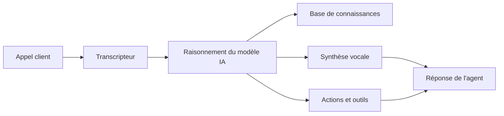

## Qu'est-ce qu'un agent vocal IA ?

Un agent vocal IA est un assistant virtuel intelligent qui peut gérer des conversations vocales avec vos clients par téléphone et sur le web. Contrairement aux systèmes IVR traditionnels ou aux chatbots, les agents itellicoAI comprennent le langage naturel, maintiennent le contexte tout au long des conversations et peuvent effectuer des actions réelles comme réserver des rendez-vous, transférer des appels ou mettre à jour vos systèmes.

## Capacités principales

Vos agents itellicoAI peuvent :

<CardGroup cols={2}>
  <Card title="Comprendre le langage naturel" icon="brain">
    Comprendre l'intention, les questions et les demandes des clients dans une conversation naturelle
  </Card>
  <Card title="Accéder à vos connaissances" icon="book">
    Référencer vos informations commerciales, politiques et documentation pendant les appels
  </Card>
  <Card title="Effectuer des actions" icon="bolt">
    Réserver des rendez-vous, transférer des appels, mettre à jour des systèmes et déclencher des workflows
  </Card>
  <Card title="Parler naturellement" icon="microphone">
    Répondre avec des voix au son naturel dans plusieurs langues
  </Card>
</CardGroup>

## Comment fonctionnent les agents vocaux IA

1. **Le client parle** - Votre client pose une question ou fait une demande
2. **Transcripteur** - L'agent convertit la parole en texte en utilisant une transcription avancée
3. **Raisonnement IA** - Le modèle de langage comprend l'intention et formule une réponse
4. **Récupération des connaissances** - L'agent accède aux connaissances de votre entreprise si nécessaire
5. **Exécution d'action** - L'agent peut déclencher des réservations, transferts ou appels API
6. **Synthèse vocale** - La réponse est convertie en parole au son naturel
7. **L'agent répond** - Le client entend une réponse utile et contextuelle

## Avantages clés

<CardGroup cols={2}>
  <Card title="Disponibilité 24h/24 et 7j/7" icon="clock">
    Ne dort jamais, toujours prêt à aider dans n'importe quel fuseau horaire
  </Card>

  <Card title="Qualité constante" icon="star">
    Chaque interaction suit vos directives et la voix de votre marque
  </Card>

  <Card title="Évolutivité instantanée" icon="chart-line">
    Gérez 1 appel ou 1 000 simultanément sans changement d'infrastructure
  </Card>

  <Card title="Efficacité des coûts" icon="dollar-sign">
    Réduisez les coûts tout en libérant le personnel humain pour les problèmes complexes
  </Card>

  <Card title="Intégration riche" icon="plug">
    Connectez-vous aux CRM, calendriers et outils métier pour un accès aux données en temps réel
  </Card>
</CardGroup>

## Cas d'usage courants

<AccordionGroup>
  <Accordion title="Support client" icon="headset">
    Répondez aux FAQ, résolvez les problèmes et escaladez les cas complexes vers des agents humains
  </Accordion>

  <Accordion title="Réservation de rendez-vous" icon="calendar">
    Planifiez, reprogrammez et envoyez des confirmations et rappels automatisés
  </Accordion>

  <Accordion title="Qualification de prospects" icon="user-plus">
    Engagez les prospects, recueillez des informations et orientez les prospects qualifiés vers les ventes
  </Accordion>

  <Accordion title="Statut et suivi de commande" icon="box">
    Vérifiez le statut de la commande et fournissez des mises à jour de suivi
  </Accordion>

  <Accordion title="Paiement et facturation" icon="credit-card">
    Répondez aux questions de facturation, traitez les paiements et envoyez des rappels
  </Accordion>

  <Accordion title="Collecte de feedback" icon="comment">
    Effectuez des enquêtes et recueillez les commentaires des clients à grande échelle
  </Accordion>
</AccordionGroup>

## Prochaines étapes

Prêt à créer votre premier agent ? Continuez avec :

<CardGroup cols={2}>
  <Card title="Créez votre premier agent" icon="plus" href="/fr/build/getting-started/create-first-agent">
    Guide étape par étape pour créer votre premier agent vocal IA
  </Card>
  <Card title="Types d'agents et cas d'usage" icon="list" href="/fr/build/getting-started/agent-use-cases">
    Comprenez les différents types d'agents et quand utiliser chacun
  </Card>
</CardGroup>
