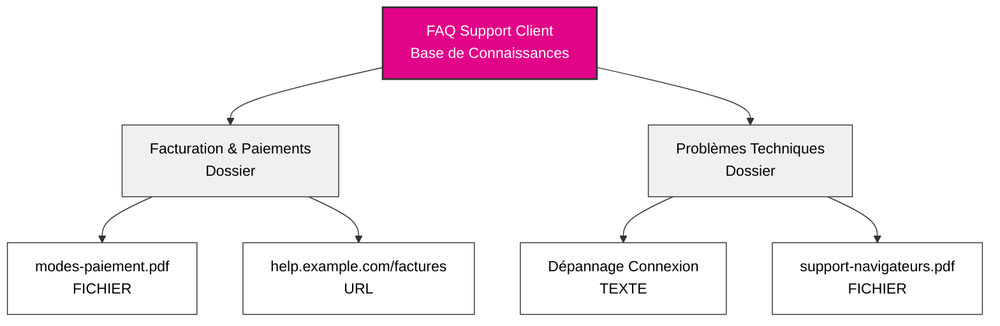
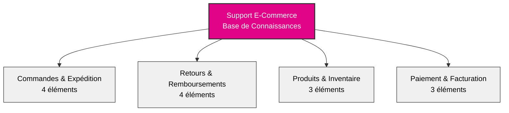

## Vue d'ensemble

Les bases de connaissances transforment ton agent IA d'un assistant générique en un expert métier. En organisant les informations de ton entreprise dans une hiérarchie structurée, ton agent peut instantanément accéder et référencer les politiques, procédures, détails de produits et toute autre information sur laquelle ton entreprise s'appuie.

Pensez aux bases de connaissances comme des armoires à dossiers intelligentes que ton agent peut parcourir en millisecondes pendant les conversations.

## Architecture des Connaissances

### La Hiérarchie à Trois Niveaux

Les connaissances dans itellicoAI suivent une structure simple et intuitive :

**Base de Connaissances → Dossiers → Éléments**

Les éléments peuvent être du **texte**, des **fichiers** (PDF, Word, Markdown, CSV, JSON, YAML, XML, etc.), ou des **URLs** (page web unique uniquement - pas de sites web entiers).

Cette hiérarchie facilite l'organisation de grandes quantités d'informations tout en les gardant accessibles et gérables.

---

## Aperçu du Tableau de Bord

### Interface Principale de Connaissances

Naviguez vers **Knowledge** dans la barre latérale gauche pour accéder à ton tableau de bord de gestion des connaissances avec une vue d'ensemble de toutes tes bases de connaissances :

<CardGroup cols={1}>
  <Card title="FAQ Support Client">
    - 127 éléments
    - Mis à jour Aujourd'hui
  </Card>
  <Card title="Documentation Produit">
    - 89 éléments
    - Mis à jour Hier
  </Card>
  <Card title="Politiques d'Entreprise">
    - 45 éléments
    - Mis à jour il y a 3 jours
  </Card>
</CardGroup>

Chaque carte de base de connaissances affiche :
- Nombre total d'éléments dans tous les dossiers
- Horodatage de la dernière mise à jour
- Actions : Copier l'espace réservé de référence, Modifier, Supprimer

---

## Comprendre Chaque Niveau

### Bases de Connaissances

<Card title="Qu'est-ce qu'une Base de Connaissances ?" icon="database">
  Une base de connaissances est le conteneur de niveau supérieur qui regroupe les informations connexes. Elle représente une catégorie majeure ou un domaine des connaissances de ton entreprise.
</Card>

**Pensez aux bases de connaissances comme différentes armoires à dossiers dans ton bureau :**
- Une armoire pour les supports client
- Une autre pour la documentation produit
- Une autre pour les politiques d'entreprise
- Une autre pour les ressources commerciales

**Exemples de bases de connaissances :**
- **FAQ Support Client** - Toutes les informations de support orientées client
- **Documentation Produit** - Documentation technique, guides utilisateur, descriptions de fonctionnalités
- **Politiques d'Entreprise** - Politiques RH, documents de conformité, procédures internes
- **Ressources Commerciales** - Feuilles de prix, comparaisons concurrentielles, présentations commerciales

### Dossiers

<Card title="Qu'est-ce qu'un Dossier ?" icon="folder">
  Les dossiers sont des unités organisationnelles au sein d'une base de connaissances. Ils regroupent les éléments connexes par sujet, catégorie ou objectif.
</Card>

**Pensez aux dossiers dans ton armoire à dossiers :**
- Ils organisent le contenu similaire ensemble
- Ils rendent l'information plus facile à trouver et à gérer
- Ils te permettent d'attribuer des sujets spécifiques aux agents

**Exemples de dossiers dans une base de connaissances Support Client :**
- **Facturation & Paiements** - Questions de facturation, modes de paiement, remboursements
- **Problèmes Techniques** - Guides de dépannage, messages d'erreur, solutions de contournement
- **Informations Produit** - Fonctionnalités, spécifications, compatibilité
- **Politiques de Retour** - Délais de retour, conditions, étapes du processus

<Tip>
Utilise des noms de dossiers clairs et descriptifs. Ton équipe et ton IA bénéficieront toutes deux d'une organisation intuitive.
</Tip>

### Éléments de Connaissance

<Card title="Qu'est-ce qu'un Élément de Connaissance ?" icon="file">
  Les éléments de connaissance sont les informations réelles - documents, FAQ, politiques, procédures ou tout contenu que tu souhaites que ton agent connaisse.
</Card>

**Les éléments de connaissance peuvent être :**
- **Entrées texte** - Contenu directement écrit
- **Téléchargements de fichiers** - PDF, Word (.doc, .docx), Texte (.txt, .log), Markdown (.md), CSV/TSV, JSON, YAML, XML (jusqu'à 10 Mo)
- **Extractions URL** - Contenu d'une seule page web (pas de sites web entiers)

**Exemples d'éléments de connaissance :**
- "Politique de Remboursement pour Produits Numériques"
- "Comment Réinitialiser le Mot de Passe - Étape par Étape"
- "Spécifications Produit - Modèle X200"
- "Délais d'Expédition par Région"

Chaque élément de connaissance comprend :
- **Titre** - Nom descriptif du contenu
- **Contenu/Source** - L'information réelle (texte, fichier ou URL)
- **Statut de Traitement du Contenu** - État d'extraction (En attente, Traitement, Complété, Échoué)
- **Statut d'Indexation Vectorielle** - État de préparation RAG (En attente, Indexation, Indexé, Échoué)
- **Métadonnées** - Date de création, dernière mise à jour, taille du contenu, nombre de tokens

---

## Quand Utiliser les Bases de Connaissances

<AccordionGroup>
  <Accordion title="Ton agent doit répondre à des questions spécifiques" icon="circle-question">
    Si les clients posent régulièrement des questions sur les politiques, procédures ou détails de produits, Ajoute ces informations à une base de connaissances. Ton agent les référencera avec précision à chaque fois.

    **Exemple :** Le client demande "Quelle est ton politique de retour ?" L'agent récupère la politique exacte de ton base de connaissances et l'explique naturellement.
  </Accordion>

  <Accordion title="Tu as une documentation détaillée" icon="book">
    Si tu as une documentation existante - manuels utilisateur, FAQ, documents de politique - tu peux les télécharger directement dans divers formats (PDF, DOC, DOCX, TXT). Ton agent pourra les rechercher et les référencer dans les conversations.

    **Exemple :** Télécharge ton manuel produit de 50 pages. Lorsque les clients ont des questions techniques, ton agent trouve et explique les sections pertinentes.
  </Accordion>

  <Accordion title="Les informations changent fréquemment" icon="arrows-rotate">
    Les bases de connaissances facilitent la mise à jour des informations sans changer les instructions de base de ton agent. Mets à jour une feuille de prix ou un document de politique, et ton agent a instantanément les nouvelles informations.

    **Exemple :** Tu mets à jour ton document de tarification une fois, et tous les agents utilisant cette base de connaissances référencent immédiatement les nouveaux prix.
  </Accordion>

  <Accordion title="Plusieurs agents ont besoin des mêmes informations" icon="users">
    Crée une base de connaissances et Partage-la entre plusieurs agents. Maintiens les informations en un seul endroit, Utilise-les partout.

    **Exemple :** Ton base de connaissances "Spécifications Produit" peut être utilisée par ton agent commercial, agent support et agent de qualification pré-vente.
  </Accordion>

  <Accordion title="Tu veux séparer les préoccupations" icon="layer-group">
    Garde les instructions conversationnelles de ton agent séparées des informations factuelles. Les instructions définissent la personnalité et le comportement ; les bases de connaissances fournissent les faits et les détails.

    **Exemple :** Tes instructions d'agent disent "soyez amical et professionnel." Ton base de connaissances contient les spécifications produit réelles, les prix et les politiques.
  </Accordion>
</AccordionGroup>

---

## Meilleures Pratiques d'Organisation

### Commence avec des Catégories Claires

<CardGroup cols={2}>
  <Card title="Par Département" icon="building">
    - Connaissances Commerciales
    - Connaissances Support
    - Connaissances Facturation
    - Documentation Technique
  </Card>
  <Card title="Par Sujet" icon="tags">
    - Informations Produit
    - Politiques & Procédures
    - Dépannage
    - FAQ
  </Card>
  <Card title="Par Parcours Client" icon="map">
    - Informations Pré-Vente
    - Guides d'Intégration
    - Utilisation & Fonctionnalités
    - Support & Dépannage
  </Card>
  <Card title="Par Public" icon="user-group">
    - Info Orientée Client
    - Procédures Internes
    - Ressources Partenaires
    - Spécifications Techniques
  </Card>
</CardGroup>

### Conventions de Nommage

Utilise des noms clairs et cohérents qui ont du sens pour toute ton équipe :

**Bons exemples de nommage :**
- Base de Connaissances : "Ressources Support Client"
- Dossier : "Facturation & Paiements"
- Élément : "Politique de Remboursement - Produits Numériques"

**Mauvais exemples de nommage :**
- Base de Connaissances : "KB_001"
- Dossier : "Docs Divers"
- Élément : "Politique_v2_final_MAJ"

<Tip>
Inclus des dates ou numéros de version dans les titres d'éléments si tu maintiens plusieurs versions : "Feuille de Prix - T1 2025"
</Tip>

### Exemple de Base de Connaissances Bien Structurée

Voici un exemple d'une base de connaissances e-commerce bien organisée :

**Contenu des dossiers :**
- **Commandes & Expédition :** Suivi, délais d'expédition, informations internationales, modifications
- **Retours & Remboursements :** Politique, processus d'expédition, délais de traitement, échanges
- **Produits & Inventaire :** Catégories, disponibilité stock, spécifications
- **Paiement & Facturation :** Modes de paiement, factures, plans de paiement

**Ce qui rend cette structure bonne :**
- Noms de dossiers clairs et descriptifs qui regroupent le contenu connexe
- Distribution équilibrée (3-4 éléments par dossier)
- Facile à Navigue et trouver les informations
- Évolue bien lorsque tu Ajoute plus de contenu

### Extraire Uniquement le Contenu Pertinent

<Warning>
**Plus de connaissances ≠ Meilleures performances**

Ajouter trop de connaissances augmente les chances que ton agent récupère des informations non pertinentes aux côtés de ce qui est réellement nécessaire.
</Warning>

**Meilleure pratique pour les documents volumineux :**

Au lieu de télécharger des manuels ou documents de politique entiers, extrayez uniquement les pages/sections dont ton agent a besoin.

<AccordionGroup>
  <Accordion title="❌ À éviter : Télécharger le manuel employé complet de 200 pages" icon="xmark">
    **Problème :**
    - L'agent trouve et mélange des sections non pertinentes avec la bonne réponse
    - Plus difficile pour l'agent de déterminer ce qui est réellement pertinent
    - Gaspille l'espace de conversation sur du contenu non lié

    **Exemple :**
    Le client demande : "Quelle est ton politique de retour ?"

    L'agent pourrait extraire : politiques de congés RH, procédures internes, avantages employés — et avoir du mal à séparer ce dont le client a réellement besoin.
  </Accordion>

  <Accordion title="✅ Mieux : Extraire des sections spécifiques" icon="check">
    **Approche :**
    - "Politique de Retour - Pages 45-48"
    - "Politique d'Expédition - Pages 52-55"
    - "Conditions de Garantie - Pages 89-92"

    **Avantage :**
    - L'agent trouve uniquement le contenu pertinent pour le client
    - Réponses plus claires et plus précises
    - Utilisation plus efficace de l'espace de conversation

    **Exemple :**
    Le client demande : "Quelle est ton politique de retour ?"

    L'agent récupère : Uniquement la section de 4 pages sur la politique de retour — exactement ce qui est nécessaire, rien de plus.
  </Accordion>
</AccordionGroup>

**Comment extraire les sections pertinentes :**
- Exporter des pages spécifiques du PDF en fichiers séparés
- Copier les sections pertinentes dans des éléments TEXTE
- Lier vers des URLs ancrées spécifiques au lieu de sites de documentation entiers

### Maintenance Régulière

<Steps>
  <Step title="Révision trimestrielle">
    Planifie des révisions régulières de tes bases de connaissances pour garantir que les informations restent actuelles.
  </Step>
  <Step title="Supprimer le contenu obsolète">
    Supprime les éléments qui ne sont plus pertinents ou déliez-les des agents. Les informations obsolètes peuvent confondre ton agent et fournir des réponses incorrectes.
  </Step>
  <Step title="Mettre à jour en fonction des retours">
    Si les clients signalent des informations incorrectes, Vérifie ton base de connaissances immédiatement.
  </Step>
</Steps>

---

## Exemples Concrets

<AccordionGroup>
  <Accordion title="Agent Support SaaS" icon="headset">
    **Base de Connaissances :** "Support Produit SaaS"

    **Dossiers :**
    - **Gestion de Compte** (15 éléments)
      - Processus de réinitialisation mot de passe
      - Instructions mise à niveau compte
      - Informations cycle de facturation
      - Tableau comparatif des plans
    - **Documentation Fonctionnalités** (47 éléments)
      - Guides fonctionnalités individuelles
      - Tutoriels d'intégration
      - Documentation API
      - Meilleures pratiques
    - **Dépannage** (23 éléments)
      - Messages d'erreur courants
      - Problèmes de connexion
      - Compatibilité navigateurs
      - Optimisation performances

    **Résultat :** L'agent support peut répondre à 80% des questions techniques sans intervention humaine.
  </Accordion>

  <Accordion title="Agent Rendez-vous Santé" icon="calendar">
    **Base de Connaissances :** "Services Patients"

    **Dossiers :**
    - **Politiques Rendez-vous** (8 éléments)
      - Directives de planification
      - Politique d'annulation
      - Exigences d'assurance
      - Processus nouveaux patients
    - **Informations Bureau** (5 éléments)
      - Emplacements et horaires bureau
      - Instructions parking
      - Informations accessibilité
      - Annuaire contacts
    - **Assurance & Facturation** (12 éléments)
      - Fournisseurs d'assurance acceptés
      - Options de paiement
      - Questions de facturation
      - Aide financière

    **Résultat :** L'agent gère la réservation de rendez-vous et les questions de politique 24/7 avec une précision complète.
  </Accordion>

  <Accordion title="Agent Ventes E-Commerce" icon="shopping-cart">
    **Base de Connaissances :** "Catalogue Produits & Ventes"

    **Dossiers :**
    - **Spécifications Produit** (89 éléments)
      - Descriptions détaillées produits
      - Spécifications techniques
      - Informations compatibilité
      - Guides tailles
    - **Prix & Promotions** (15 éléments)
      - Tarification actuelle
      - Promotions actives
      - Remises volume
      - Ventes saisonnières
    - **Expédition & Livraison** (7 éléments)
      - Options d'expédition
      - Délais de livraison
      - Expédition internationale
      - Informations de suivi

    **Résultat :** L'agent commercial fournit instantanément des informations produit et de tarification précises pendant les conversations clients.
  </Accordion>
</AccordionGroup>

---

## Prochaines Étapes

<CardGroup cols={2}>
  <Card title="Créer des Bases de Connaissances" icon="plus" href="/fr/build/knowledge/create-knowledge-bases">
    Guide étape par étape pour créer et organiser tes connaissances
  </Card>
  <Card title="Types de Contenu" icon="file-lines" href="/fr/build/knowledge/content-types">
    Découvrir les éléments de connaissance texte, fichier et URL
  </Card>
  <Card title="Attribuer aux Agents" icon="link" href="/fr/build/knowledge/assign-knowledge">
    Connecter les bases de connaissances à tes agents
  </Card>
  <Card title="Contexte vs RAG" icon="brain" href="/fr/build/knowledge/context-vs-rag">
    Choisir la bonne méthode d'accès pour ton cas d'usage
  </Card>
</CardGroup>
