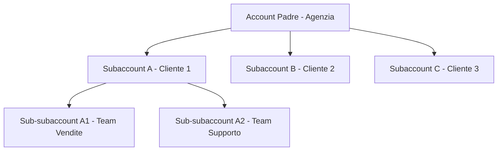

## Panoramica

itellicoAI utilizza un sistema di account gerarchico che ti permette di organizzare i tuoi team, gestire il controllo degli accessi e scalare le tue operazioni di AI vocale. Che tu sia un singolo team o un'azienda con più dipartimenti, il sistema di account fornisce flessibilità e sicurezza.

## Tipi di Account

### Account Principali

Gli account principali (chiamati anche "account radice" o "account padre") sono organizzazioni di primo livello con:

- Fatturazione e abbonamenti indipendenti
- Controllo amministrativo completo
- Capacità di creare subaccount (dipendente dall'abbonamento)
- Chiavi API e integrazioni separate

**Casi d'uso:**
- Singole aziende
- Agenzie che gestiscono più clienti
- Aziende con unità aziendali distinte

### Subaccount

I subaccount sono annidati sotto gli account padre e forniscono:

- Spazio di lavoro isolato per team o clienti
- Agenti, contatti e conversazioni separati
- Membri del team e permessi indipendenti
- Fatturazione condivisa con l'account padre

**Caratteristiche chiave:**
- I subaccount possono avere i propri subaccount (mantieni l'annidamento semplice per una gestione più facile)
- Gli account padre possono accedere ai dati dei figli
- I subaccount **non possono** accedere ai dati padre o fratelli
- Ogni subaccount ha il proprio proprietario e team

**Casi d'uso:**
- Spazi di lavoro clienti agenzia
- Separazione dipartimentale all'interno delle aziende
- Divisioni regionali o per linea di prodotto
- Account clienti rivenditore

## Gerarchia Account

Il sistema segue una gerarchia padre-figlio con controllo di accesso rigoroso:



### Regole di Accesso

- **Accesso verso il basso**: I genitori possono accedere a tutti i subaccount figli
- **Nessun accesso verso l'alto**: I figli non possono accedere ai dati padre
- **Nessun accesso fratelli**: I subaccount non possono accedere l'uno all'altro
- **Cambio contesto**: Gli utenti con più appartenenze possono passare tra gli account

## Casi d'Uso Comuni

<AccordionGroup>
  <Accordion title="Agenzia che Gestisce Più Clienti" icon="building">
    ```mermaid
    graph TD
        A[Agenzia - Account Padre]
        A --> B[Subaccount Cliente A]
        A --> C[Subaccount Cliente B]
        B --> D[Lo staff Cliente A ha accesso completo]
        C --> E[Lo staff Cliente B ha accesso completo]
    ```

    **Vantaggi:**
    - I clienti non possono vedere i dati reciproci
    - Gli amministratori dell'agenzia possono gestire tutti gli account
    - Tracciamento separato della fatturazione per cliente
    - Onboarding e offboarding facili
  </Accordion>

  <Accordion title="Azienda con Team Regionali" icon="globe">
    ```mermaid
    graph TD
        A[Sede Aziendale - Account Padre]
        A --> B[Regione Nord America]
        A --> C[Regione Europa]
        A --> D[Regione APAC]
        B --> E[Team Vendite]
        B --> F[Team Supporto]
        C --> G[Team Vendite]
        C --> H[Team Supporto]
    ```

    **Vantaggi:**
    - Autonomia regionale con supervisione centrale
    - Controllo accessi a livello dipartimentale
    - Fatturazione e reportistica consolidate
    - Strutture di team flessibili
  </Accordion>

  <Accordion title="Rivenditore o Fornitore White-Label" icon="store">
    ```mermaid
    graph TD
        A[Rivenditore - Account Padre]
        A --> B[Subaccount Cliente 1]
        A --> C[Subaccount Cliente 2]
        A --> D[Subaccount Cliente 3]
    ```

    **Vantaggi:**
    - Isolamento e privacy del cliente
    - Fatturazione centralizzata al rivenditore
    - Branding personalizzato per cliente
    - Onboarding clienti scalabile
  </Accordion>
</AccordionGroup>

## Cosa Puoi Fare

<CardGroup cols={2}>
  <Card title="Crea Account" icon="plus" href="/it/accounts/creating-accounts">
    Scopri come creare account principali e subaccount
  </Card>
  <Card title="Gestisci Membri del Team" icon="users" href="/it/accounts/team-management">
    Invita e gestisci i membri del team
  </Card>
  <Card title="Chiavi API" icon="key" href="/it/accounts/api-keys">
    Crea e gestisci l'accesso programmatico
  </Card>
  <Card title="Impostazioni Account" icon="gear" href="/it/accounts/account-settings">
    Personalizza il branding e gestisci i dettagli dell'account
  </Card>
</CardGroup>

## Migliori Pratiche di Sicurezza

<AccordionGroup>
  <Accordion title="Gestisci attentamente l'accesso del team" icon="shield-halved">
    - Invita solo membri del team fidati
    - Esamina regolarmente i membri del team
    - Rimuovi l'accesso quando i membri del team se ne vanno
  </Accordion>

  <Accordion title="Organizza con i subaccount" icon="sitemap">
    - Crea subaccount separati per i clienti
    - Usa i subaccount per isolare i dipartimenti
    - Sfrutta la gerarchia per il controllo degli accessi
  </Accordion>

  <Accordion title="Gestisci attentamente le chiavi API" icon="key">
    - Crea chiavi separate per ambiente
    - Revoca immediatamente le chiavi inutilizzate o compromesse
    - Imposta date di scadenza per l'accesso temporaneo
    - Monitora i timestamp dell'ultimo utilizzo
  </Accordion>

  <Accordion title="Controlla regolarmente i membri del team" icon="clipboard-list">
    - Esamina i membri del team trimestralmente
    - Rimuovi immediatamente i dipendenti in uscita
    - Aggiorna l'accesso quando cambiano le responsabilità
  </Accordion>
</AccordionGroup>

## FAQ

<AccordionGroup>
  <Accordion title="Quanti subaccount posso creare?">
    Il numero di subaccount dipende dal tuo piano di abbonamento. Contatta [support@itellico.ai](mailto:support@itellico.ai) per discutere le tue esigenze.
  </Accordion>

  <Accordion title="Posso trasferire un subaccount a un altro padre?">
    Contatta il supporto per trasferire i subaccount tra padri o convertire i subaccount in account principali.
  </Accordion>

  <Accordion title="Chi viene fatturato per l'utilizzo del subaccount?">
    L'account padre è responsabile di tutta la fatturazione del subaccount. L'utilizzo viene tracciato separatamente per il reporting.
  </Accordion>

  <Accordion title="I subaccount possono avere le proprie chiavi API?">
    Sì! Ogni subaccount può creare chiavi API indipendenti. Le chiavi sono associate al contesto del loro account.
  </Accordion>

  <Accordion title="Cosa succede ai dati quando disattivo un account?">
    Gli account vengono eliminati in modo soft (contrassegnati come inattivi). I dati vengono preservati e possono essere riattivati contattando il supporto.
  </Accordion>

  <Accordion title="Un utente può essere membro di più account?">
    Sì! Gli utenti possono essere invitati a più account e passare tra loro utilizzando il selettore di account.
  </Accordion>

  <Accordion title="Come trasferisco la proprietà di un account?">
    Contatta il supporto per trasferire la proprietà. Questo non può essere fatto tramite l'interfaccia utente per motivi di sicurezza.
  </Accordion>
</AccordionGroup>

## Serve Aiuto?

Contatta [support@itellico.ai](mailto:support@itellico.ai) per assistenza con la gestione dell'account, domande sulla fatturazione o trasferimenti di proprietà.
